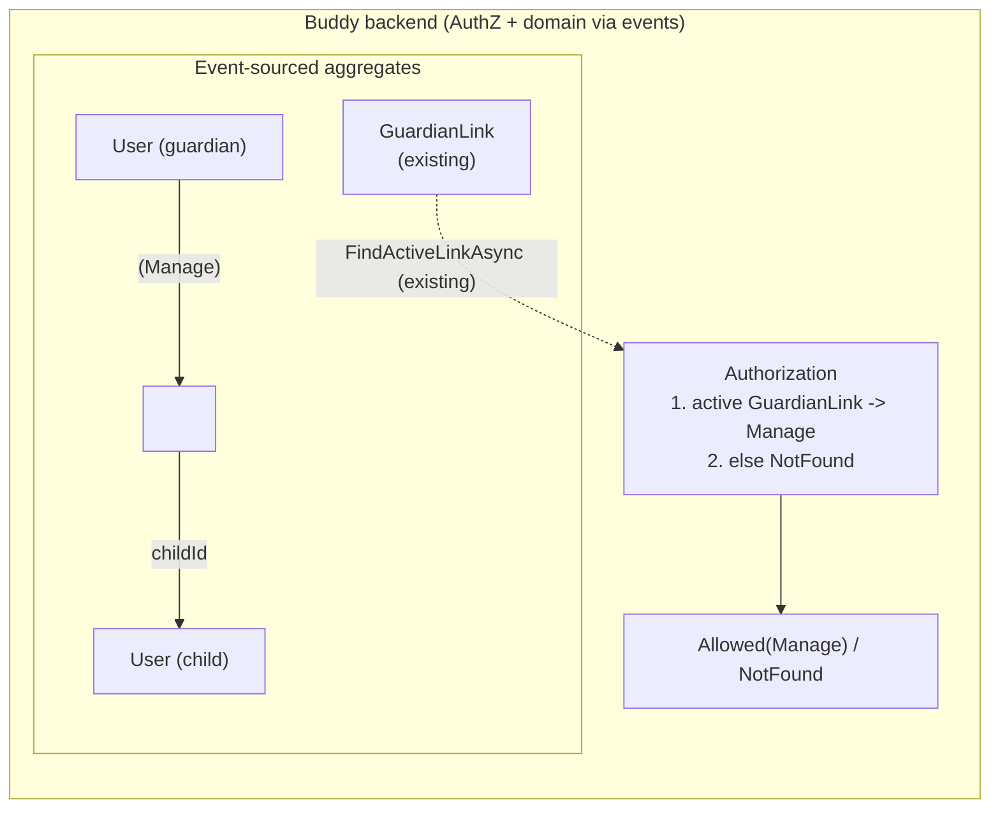

# Analysis doc template (house style)

Derived from the existing docs in `docs/backend/analysis/` and `docs/frontend/analysis/`
(`sleep-diary.md`, `medicine-schedules.md`, `configurable-goal-posts.md`, `mealplan-ical-feed.md`,
`child-calendar-mealplan-integration.md`, ...). There are two shapes. Pick one:

- **Design analysis** (`docs/backend/analysis/<feature>.md`): a new domain concept, aggregate,
  permission model or cross-cutting backend decision. It is organised around questions, each with a
  bold decision.
- **Implementation plan** (`docs/frontend/analysis/<thing>-plan.md` or `<thing>.md`): a scoped
  change, usually frontend-only, that builds on decisions already made elsewhere. It is organised
  around files to touch.

File names are kebab-case and describe the concept (`sleep-diary.md`, `mealplan-ical-feed.md`),
not a ticket number.

## Conventions that apply to both shapes

- **Status line**: the second line of the file, right after the H1, as plain text (not a heading
  or a blockquote). Values in use:
  - `Status: Proposed (not yet implemented)` for a new design.
  - `Status: analysis only — nothing here is implemented yet.` for research or options docs.
  - `Status: Sketch implemented for <scope> (...)` for a partial build.
  - `Status: Implemented` alone, or `Status: Implemented. <one or two sentences naming the types,
    commands, routes and screens that shipped, and which doc it extends>`. Prefer the longer form;
    see `configurable-goal-posts.md`.
  - When an implementation leaves pieces out, say which: `Status: Implemented (badge + service +
    guardian goal-post management; no ...)`.
- **Ground every claim in the code.** Link real files with repo-relative paths from the doc's
  location, e.g. `[IcalToken.cs](../../../src/backend/buddy/Features/Calendars/Types/IcalToken.cs)`,
  and use `file.ts:110` line anchors in implementation plans. Link sibling analysis docs by section
  anchor (`[pickup-schedules.md, Routes](pickup-schedules.md#routes)`).
- **Argue from precedent.** Most decisions are justified by "same shape as X already uses"
  (`ChildProgress`'s `Id.Value == ChildId.Value`, `IcalToken`'s hashed revocable token, the
  `MealAssignedToSlot` full-overwrite rule, the "can't tell private from missing" `NotFound`
  collapse). When the doc breaks a precedent, it says which one and why it doesn't apply here (see
  `sleep-diary.md` Question 2 on deterministic ids vs `mealplans.md`).
- **Show the size of a refactor with code samples.** When a decision changes existing code (an
  aggregate, event, handler, endpoint, component, service or signature) rather than only adding
  new files, include a short before/after pair: the current code, trimmed to the relevant lines and
  linked with a `file:line` anchor, then the proposed shape. Follow it with one line on the blast
  radius (call sites, specs or events affected, e.g. "4 handlers and 2 specs construct this
  record"). The reader should be able to tell a one-line tweak from a rewrite without opening the
  code. Brand-new code doesn't need this; its signature block is enough.
- **Name the rejected alternatives.** Each one gets a "considered and rejected, because ..."
  sentence or a bullet.
- **Domain vocabulary** comes from `docs/backend/glossary.md`: `Manage`/`View` tiers,
  `GuardianLink`, `UserId`, `ChildId`, aggregate/stream/event, index document, vertical slice.
- Use plain ASCII `--` or an em dash consistently within one doc. Don't use emojis except as data
  (icon values).

---

## Shape A: design analysis (backend-first feature)

````markdown
# <Feature Name>

Status: Proposed (not yet implemented)

## Context

<Who wants what and why, in user terms. If the feature mirrors a real-world artifact, such as
the paper sleep form in sleep-diary.md, list its fields.>

<What exists today and what doesn't. Name the closest precedents with links:
"Nothing like this exists in Buddy today. The closest existing precedents are
[medicine-schedules.md](medicine-schedules.md) (...) and [gamified-progress.md](gamified-progress.md)'s
`ChildProgress` (...)".>

This document answers <N> questions: <q1>, <q2>, ... .

## Question 1: extend `<ExistingFeature>`, or a new feature?

**Decision: <one sentence, e.g. a new feature, `Features/<Name>`, with its own aggregate>.**

<Rationale bullets: why existing aggregates don't fit, which prior docs made the same call.>

## Question 2: aggregate shape and identity

**Decision: <stream-per-what, id strategy, index document or not>.**

<Rationale, the precedent followed, and the precedent deliberately not followed.>

```
<AggregateName>(
    <AggregateId> Id,              // comment on identity choice
    UserId ChildId,
    ImmutableDictionary<DateOnly, <Entry>> Entries,
    UserId LastModifiedBy)
```

<Fields that are derived, not stored, e.g. "`weekend` is not stored -- it's `Date.DayOfWeek`".>

## Question 3: <modeling question>

**Decision: ...**

```
<ValueRecord>(
    TimeOnly? Field,      // source-form label or meaning
    ...)
```

## Question 4: who can see and change this

**Decision: <tiers: Manage = active GuardianLink, View = ..., else NotFound>.**

<Compare with the authorization of the closest sibling feature. Mention group sharing if it applies.>

## Question 5: <sharing / integration / anything else>

**Decision: ...**

### Events

```
<Aggregate>Started(<AggregateId>, UserId ChildId, DateTimeOffset OccurredAt)
    // when/how the stream is created, e.g. lazily by the first write
<Thing>Logged(<AggregateId>, DateOnly Date, <Entry>? Before, <Entry> After,
    UserId LoggedBy, DateTimeOffset OccurredAt)
<Thing>Cleared(...)
```

<Overwrite vs patch semantics, idempotency rules.>

### Rehydration

<How `Rehydrate(events)` folds each event, and whether any part is a second small aggregate.>

## Read models

<Index documents needed (and which lookups need none), written inline in the same
`SaveChangesAsync` as the event append. Whether any expansion helper is needed
(`MedicineDoseExpansion`-style) or not.>

```
<Name>Document(Guid Id, Guid ChildId, ...)
```

## Command slices (`Features/<Name>/`, same vertical-slice shape as `<Sibling>`)

| Slice | Tier | Notes |
|---|---|---|
| `<VerbNoun>` | Manage | <what it does>. Emits `<Event>` |
| `List<Things>` | Manage / View | `[from, to]` date range |

## Routes

```
PUT    /<feature>/children/{childId}/<things>/{date}   <Slice>
DELETE /<feature>/children/{childId}/<things>/{date}   <Slice>
GET    /<feature>/children/{childId}/<things>          <Slice>   (from, to as query params)
```

<Or an "## API surface" table instead: | Route | Method | Auth | Purpose |.>

## Frontend

<Where it goes: `src/frontend/buddy/src/app/features/guardian/<feature>/` (overview page plus one
subfolder per capability), `core/<feature>.service.ts`, i18n under
`core/i18n/translations/{en,da}/<feature>.ts`, routes in `guardian.routes.ts` / `child.routes.ts`.
Name the existing screens to copy from, and any new kind of route (for example the first
logged-out page).>

## Testing

<Integration tests mirroring an existing test file (link it) and the feature-specific cases.>

## Failure and edge-case behavior

| Case | Behavior |
|---|---|
| <partial data> | <Allowed / rejected, with the precedent> |
| <re-write same key> | <Full overwrite / conflict> |
| <clear missing> | Idempotent no-op (`Success`, no event) |
| Guardian's `GuardianLink` is revoked | Immediately drops to `NotFound` ... |
| <concurrent writes> | <last write wins, history kept> |

## Decisions made

| Question | Decision |
|---|---|
| <short question> | <short decision, with the reason in a clause> |

## Remaining open questions

- **<Bold lead-in question.>** <Current lean, why it's deferred, and what adding it later would
  look like (additive, or a redesign).>

## Diagram


````

Optional sections that appear in some design docs: `## Domain model` with `### <Type>`
subsections (medicine-schedules.md), `## Authorization` as its own section with a
`### Group sharing (added later, additive)` subsection, `## Dose expansion -- <Helper>`, and
top-level `## Decision: <statement>` headings instead of `## Question N:` (mealplan-ical-feed.md;
use these when there are only two or three decisions). Docs that only record decisions may call
the last section `## Open questions` or `## Open questions not settled here`.

---

## Shape B: implementation plan (scoped follow-up)

````markdown
# <What the user sees> (`/<route>`) — implementation plan

Status: Proposed (not yet implemented). This is a follow-up to
[<previous plan title>](<previous-plan>.md), which built <X>. Read it alongside
[`<Component>`](../../../src/frontend/buddy/src/app/features/<area>/<file>.ts) (`/<route>`).

## Goal

As a <guardian|child>, <outcome in one or two sentences>.

## Scope decision (already made)

<Frontend-only, or which backend change. Cite the doc or flow that already made the call, e.g.
[docs/backend/mealplans/flow.md](../../backend/mealplans/flow.md#calendar-integration).>

## Why <the non-obvious part>

<The one technical wrinkle, explained with file:line links.>

## Backend

No changes required. Confirmed already sufficient:

- `GET /<route>?from&to` (`<Service>.<method>(...)`, [`core/<x>.service.ts:110`](...)) -- <why it's enough>

## Frontend plan

### 1. `<component>.ts`

- <Concrete change: inject X, add `signal<...>`, replace method Y with ...>
  ```ts
  <small snippet when the exact shape matters>
  ```

### 2. `<component>.html`

<Template branch to add, with a snippet.>

### 3. i18n

<New keys in `translations/{en,da}/<area>.ts`, or "No new keys needed. Reuse `<key.path>`".>

### 4. Testing

In `<component>.spec.ts`, add <stubs> and cases for:

- <behavior 1>
- <behavior 2>

## Explicitly out of scope for this phase

- <thing> -- stays on <screen> / its own follow-up.

## Verification

- `ng test` for the updated spec(s).
- Manual: sign in as <role>, <steps>, confirm <observable result>.
````

---

## Where a doc gets registered

When a new doc is added:

- Backend design analysis: add a bullet to "Design analysis and decision records" in
  `docs/backend/README.md` (`- [Title](analysis/<file>.md)`).
- Frontend analysis: add a bullet to "Design analysis" in `docs/frontend/README.md`
  (`- [Title](analysis/<file>.md) — <one-line summary with status, e.g. "implemented ...">`).
- Product feature: add an unchecked item to the right group (Guardian / Child / Platform) under
  "Features" in the root `README.md`:
  `- [ ] <Feature> (proposed, not yet implemented — see [<Title>](docs/backend/analysis/<file>.md))`.

When it ships:

- Update the doc's `Status:` line (longer "Implemented. ..." form).
- Root `README.md`: `- [ ]` becomes `- [x]`, and drop the "(proposed ... see ...)" parenthetical,
  matching the other checked items.
- `docs/frontend/README.md`: add any new routes ("The guardian routes currently include"), services
  ("Shared services") and responsibilities, and update the analysis bullet's summary.
- `docs/backend/README.md`: add the new `<feature>/flow.md` under "Start here" if one was written
  (every shipped backend feature has `docs/backend/<feature>/flow.md`).
- New aggregates: `docs/backend/analysis/aggregate-roots.md`, `domain-model-diagram.md`, and the
  snapshot count in `event-stream-snapshots.md` ("Implemented for all N event-sourced aggregates").
- New Marten schema: add it to `MARTEN_SCHEMAS` in `taskfile.dist.yml`.
