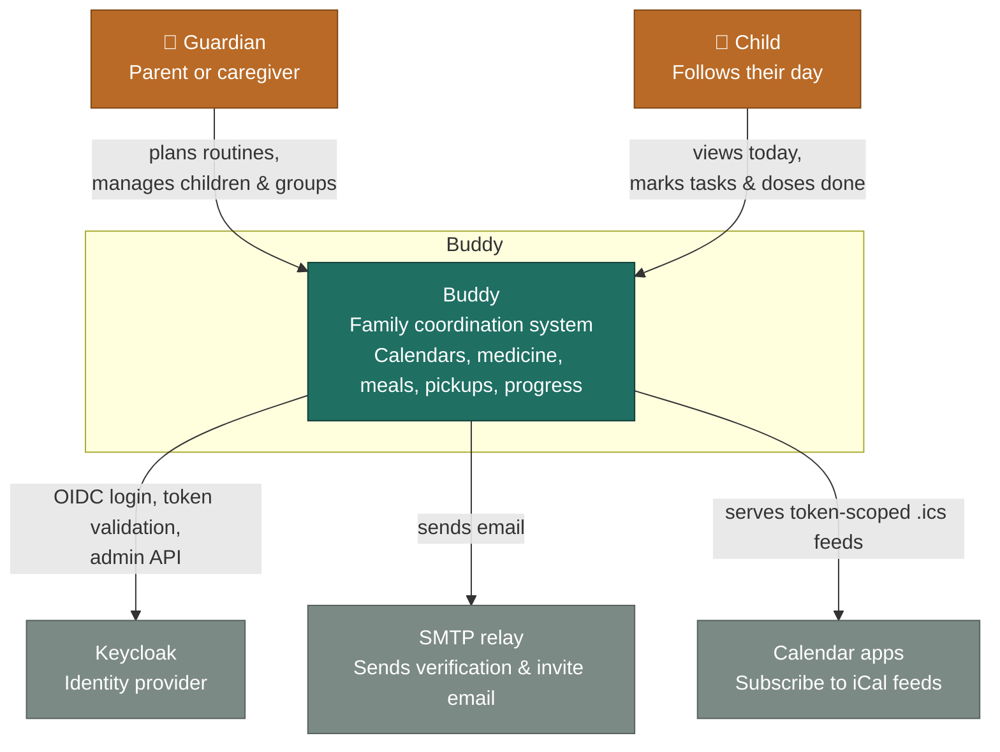
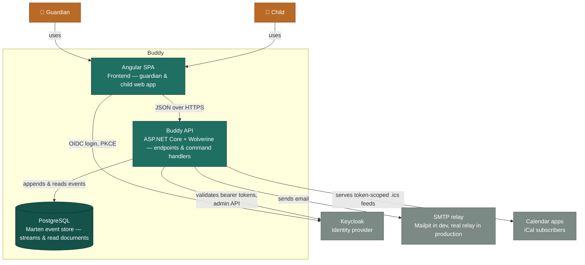

# Architecture

C4 context and container diagrams for Buddy. For the backend's domain model,
see [Backend domain model diagram](backend/analysis/domain-model-diagram.md)
and [Aggregate roots and their relationships](backend/analysis/aggregate-roots.md).

## System context

Two kinds of people use Buddy — guardians and children — and it depends on
three systems it doesn't own: Keycloak for identity, an SMTP relay for
transactional email, and any calendar app a guardian points at one of
Buddy's iCal feeds.

## Containers

Inside the boundary, Buddy is three containers: an Angular SPA guardians and
children use directly, a .NET API that validates and executes every command,
and a PostgreSQL database holding Marten's append-only event streams and the
read-side documents projected from them.

In production, Caddy sits in front of all three domains for TLS termination
and routing (see [`deploy/Caddyfile`](../deploy/Caddyfile)) — omitted above
since it doesn't change what the containers do. The dev container also
provisions RabbitMQ and Redis for future use, but no code path talks to
either yet, so they're left off this diagram too.
