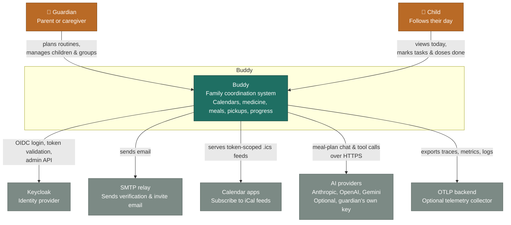
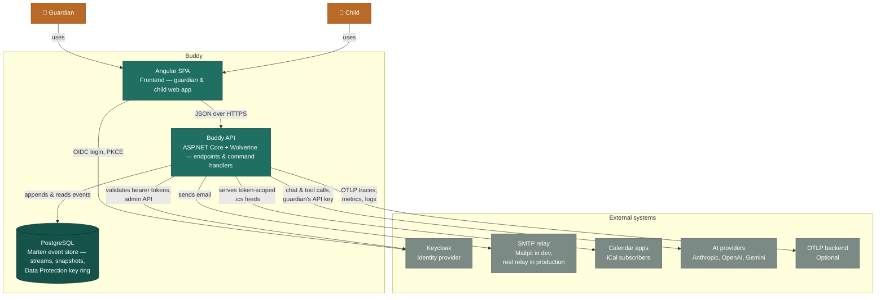

# Architecture

C4 context and container diagrams for Buddy. For the backend's domain model,
see [Backend domain model diagram](backend/analysis/domain-model-diagram.md)
and [Aggregate roots and their relationships](backend/analysis/aggregate-roots.md).

## System context

Two kinds of people use Buddy — guardians and children — and it depends on
systems it doesn't own: Keycloak for identity, an SMTP relay for
transactional email, any calendar app a guardian points at one of Buddy's
iCal feeds, and — only when a guardian opts in to the meal-plan AI assistant
with their own API key — an AI provider (Anthropic, OpenAI or Google Gemini).
An OpenTelemetry backend receives traces, metrics and logs when one is
configured.

```mermaid
flowchart TB
    guardian["👤 Guardian<br/>Parent or caregiver"]:::person
    child["👤 Child<br/>Follows their day"]:::person

    subgraph boundary["Buddy"]
        buddy["Buddy<br/>Family coordination system<br/>Calendars, medicine, meals, pickups, progress"]:::system
    end

    keycloak["Keycloak<br/>Identity provider"]:::external
    smtp["SMTP relay<br/>Sends verification & invite email"]:::external
    icalClients["Calendar apps<br/>Subscribe to iCal feeds"]:::external
    ai["AI providers<br/>Anthropic, OpenAI, Gemini<br/>Optional, guardian's own key"]:::external
    otel["OTLP backend<br/>Optional telemetry collector"]:::external

    guardian -- "plans routines,<br/>manages children & groups" --> buddy
    child -- "views today,<br/>marks tasks & doses done" --> buddy
    buddy -- "OIDC login, token validation,<br/>admin API" --> keycloak
    buddy -- "sends email" --> smtp
    buddy -- "serves token-scoped .ics feeds" --> icalClients
    buddy -- "meal-plan chat & tool calls<br/>over HTTPS" --> ai
    buddy -- "exports traces, metrics, logs" --> otel

    classDef person fill:#B96A26,stroke:#7E4818,color:#ffffff;
    classDef system fill:#1F6F63,stroke:#123F38,color:#ffffff;
    classDef external fill:#7C8A85,stroke:#57635F,color:#ffffff;
```

## Containers

Inside the boundary, Buddy is three containers: an Angular SPA guardians and
children use directly, a .NET API that validates and executes every command,
and a PostgreSQL database holding Marten's append-only event streams and the
read-side documents projected from them.

Besides serving requests, the API runs three background sweeps: user erasure,
AI-session retention, and idempotency-key cleanup. It keeps its ASP.NET Core
Data Protection key ring in Postgres too. That key ring encrypts the
guardians' AI provider API keys at rest, so it has to survive restarts and be
shared by every API instance. The browser never calls an AI provider; every
call goes through the API.

```mermaid
flowchart TB
    guardian["👤 Guardian"]:::person
    child["👤 Child"]:::person

    subgraph boundary["Buddy"]
        spa["Angular SPA<br/>Frontend — guardian & child web app"]:::system
        api["Buddy API<br/>ASP.NET Core + Wolverine — endpoints & command handlers"]:::system
        db[("PostgreSQL<br/>Marten event store — streams, snapshots,<br/>Data Protection key ring")]:::store
    end

    subgraph externals["External systems"]
        keycloak["Keycloak<br/>Identity provider"]:::external
        smtp["SMTP relay<br/>Mailpit in dev,<br/>real relay in production"]:::external
        icalClients["Calendar apps<br/>iCal subscribers"]:::external
        ai["AI providers<br/>Anthropic, OpenAI, Gemini"]:::external
        otel["OTLP backend<br/>Optional"]:::external
    end

    guardian -- "uses" --> spa
    child -- "uses" --> spa
    spa -- "JSON over HTTPS" --> api
    spa -- "OIDC login, PKCE" --> keycloak
    api -- "validates bearer tokens,<br/>admin API" --> keycloak
    api -- "appends & reads events" --> db
    api -- "sends email" --> smtp
    api -- "serves token-scoped<br/>.ics feeds" --> icalClients
    api -- "chat & tool calls,<br/>guardian's API key" --> ai
    api -- "OTLP traces,<br/>metrics, logs" --> otel

    classDef person fill:#B96A26,stroke:#7E4818,color:#ffffff;
    classDef system fill:#1F6F63,stroke:#123F38,color:#ffffff;
    classDef store fill:#14524A,stroke:#0B2E29,color:#ffffff;
    classDef external fill:#7C8A85,stroke:#57635F,color:#ffffff;
```

Keycloak keeps its own data in a separate `keycloak` database on the same
Postgres server (dev container and the docker-compose production stack); it's
drawn as an external system because Buddy only talks to it over OIDC and its
admin API.

Production runs in one of two ways. On the docker-compose stack, Caddy sits in
front of all three domains for TLS termination and routing (see
[`deploy/Caddyfile`](../deploy/Caddyfile)). On Azure Container Apps, the
platform's ingress does that job and Postgres is a managed Flexible Server
(see [`deploy/README-azure.md`](../deploy/README-azure.md)). Neither changes
what the containers do, so both are left off the diagrams. The API sets its
own security headers (`Common/Http/SecurityHeadersMiddleware.cs`), so both
deployments send them. Telemetry is always
collected and only exported when `OTEL_EXPORTER_OTLP_ENDPOINT` is set (see
[observability.md](backend/observability.md)).
