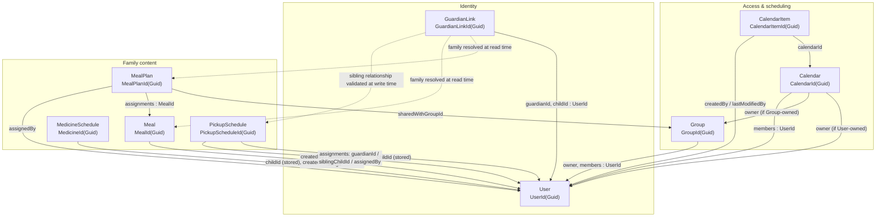

# Aggregate Roots and Their Relationships

This is a map of every event-sourced aggregate root in the backend and how
they reference each other. There is no shared `AggregateRoot` base type or
marker interface — each aggregate is a `sealed record` in a
`Features/<Feature>/Types/` folder with a
`static X? Rehydrate(IEnumerable<XEvent> events)` factory that folds its
event stream into current state. The nine below were found by grepping for
that convention.

An arrow means the aggregate at the tail stores the id of the aggregate at
the head. Dashed arrows are relationships that are *computed* at read time
instead of stored on the aggregate.

## Notes

- **"Child" isn't its own aggregate.** A child is a `User` like any other.
  The only thing marking it as a child is a `GuardianLink` pointing
  `guardianId -> childId`, both plain `UserId`s. There is no `Child` type
  anywhere in the domain.
- **Family sharing is computed, not stored.** `Meal` and `MealPlan`
  deliberately carry no `ChildId` — a meal plan is shared across siblings,
  and "which family" is resolved at read time from the `GuardianLink` graph
  via `MealFamilyResolution` (see [mealplans.md](mealplans.md)).
  `MedicineSchedule` and `PickupSchedule` make the opposite choice and store
  `ChildId` directly, because each belongs to exactly one child and isn't
  family-shared — `PickupSchedule` still reaches across to a sibling via a
  plain `UserId` in an assignment, validated (not resolved) against
  `GuardianLink` at write time (see
  [pickup-schedules.md](pickup-schedules.md)).

## Reference

| Aggregate | File | Id type | Stored references |
|---|---|---|---|
| User | `Features/Users/Types/User.cs` | `UserId(Guid)` | — identity root, referenced by every other aggregate |
| GuardianLink | `Features/Guardians/Types/GuardianLink.cs` | `GuardianLinkId(Guid)` | `guardianId`, `childId` → User |
| Group | `Features/Groups/Types/Group.cs` | `GroupId(Guid)` | `members` (keys) → User |
| Calendar | `Features/Calendars/Types/Calendar.cs` | `CalendarId(Guid)` | `owner` → User or Group; `members` → User |
| CalendarItem | `Features/Calendars/Types/CalendarItem.cs` | `CalendarItemId(Guid)` | `calendarId` → Calendar; `createdBy` / `lastModifiedBy` → User |
| MealPlan | `Features/Mealplans/Types/MealPlan.cs` | `MealPlanId(Guid)` | `assignments` → Meal; `sharedWithGroupId` → Group; `assignedBy` → User |
| Meal | `Features/Mealplans/Types/Meal.cs` | `MealId(Guid)` | `createdBy` / `lastModifiedBy` → User; `ratings` (keys) → User |
| MedicineSchedule | `Features/Medicines/Types/MedicineSchedule.cs` | `MedicineId(Guid)` | `childId`, `createdBy` / `lastModifiedBy` → User |
| PickupSchedule | `Features/Pickups/Types/PickupSchedule.cs` | `PickupScheduleId(Guid)` | `childId` → User; assignments' `guardianId` / `siblingChildId` / `assignedBy` → User |
