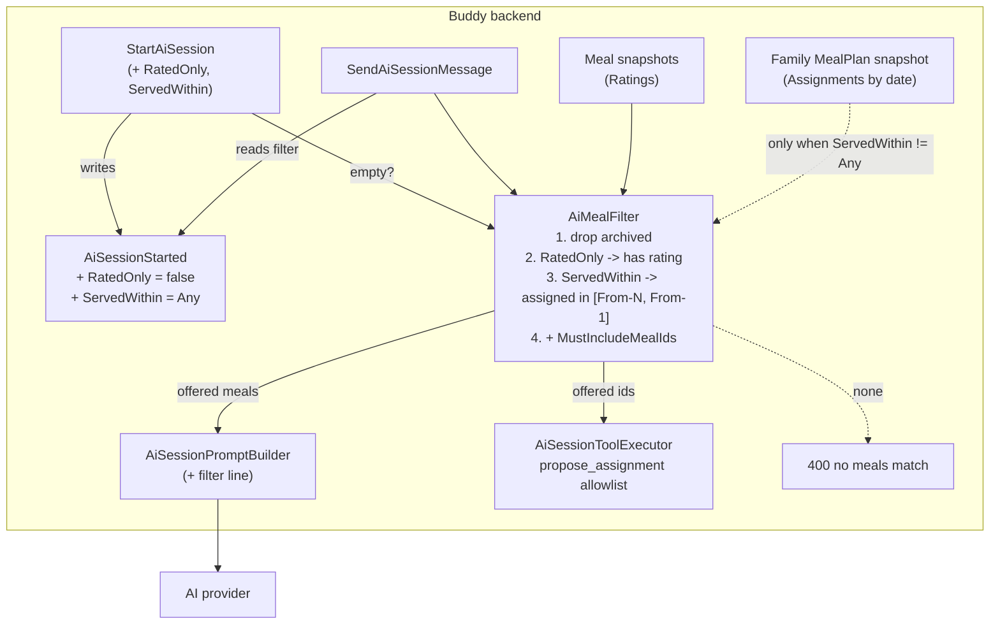

# AI Assistant Meal Filter

Status: Implemented. `AiServedWindow` and `RatedOnly`/`ServedWithin` on `AiSessionStarted`, `StartAiSession` and `AiSessionView`; `AiMealFilter` feeds both the prompt and the `propose_assignment` allowlist in `SendAiSessionMessage`; `400` keyed on `ServedWithin` when nothing matches. The start form on `/guardian/mealplan/ai-assistant` has a "rated only" toggle and an "any time / 30 / 60 / 90 days" segmented control (last choice kept in `localStorage`), and the session panel summarises an active filter.

## Context

The meal-plan AI assistant sends the family's **whole** active meal library to the provider on
every turn. [`SendAiSessionMessage.Handler.cs:94-110`](../../../src/backend/buddy/Features/Mealplans/AiAssistant/SendAiSessionMessage/SendAiSessionMessage.Handler.cs)
loads every family meal, and
[`AiSessionPromptBuilder.cs:34`](../../../src/backend/buddy/Features/Mealplans/AiAssistant/AiSessionPromptBuilder.cs)
drops only the archived ones. A family that has imported years of history
([mealplan-import.md](mealplan-import.md)) ends up with a long list, mostly of meals nobody has
cooked in months. That has three costs:

- the model spreads its picks over meals the family has stopped eating;
- every turn re-sends the whole list, so a long library makes each request bigger and more
  expensive;
- more family data leaves Buddy than the request needs, against the minimization goal in
  [gdpr-data-protection.md](gdpr-data-protection.md#question-6-the-ai-assistant).

The ask: when starting a session, let the guardian limit the meals sent to the assistant to

- meals that have been **rated**, and/or
- meals **served in the last 30, 60 or 90 days**.

What exists today that this builds on:

- Ratings live on the `Meal` aggregate as `ImmutableDictionary<UserId, MealRating> Ratings`
  ([`Meal.cs`](../../../src/backend/buddy/Features/Mealplans/Types/Meal.cs)), one current
  rating per child.
- The family has exactly one `MealPlan`
  ([`MealPlan.cs`](../../../src/backend/buddy/Features/Mealplans/Types/MealPlan.cs)), whose
  snapshot holds every assignment as `ImmutableDictionary<(DateOnly Date, MealSlot Slot), MealPlanAssignment>`.
  `MealFamilyResolution.ResolveFamilyMealPlanIdAsync` finds it from any sibling.
- Session parameters (`From`, `To`, `RequestedSlots`, `MustIncludeMealIds`, `Notes`) are stored once
  on `AiSessionStarted`
  ([`MealplanAiSessionEvents.cs`](../../../src/backend/buddy/Features/Mealplans/AiAssistant/Types/MealplanAiSessionEvents.cs))
  and read back on every turn, because the system prompt is rebuilt per turn.
- The family meal-id set does two jobs: it is the list shown to the model, and it is the allowlist
  that `propose_assignment` checks
  ([`AiSessionToolExecutor.cs:75`](../../../src/backend/buddy/Features/Mealplans/AiAssistant/AiSessionToolExecutor.cs)).

This document answers seven questions: what "served" and "rated" mean, where the filter is stored,
which dates the window covers, how the two filters combine, what happens to must-include meals and
the tool allowlist, what an empty result does, and how the model and the UI learn about the filter.

## Question 1: what do "rated" and "within N days" mean?

**Decision: "within N days" means *served*: the meal has at least one assignment in the family
`MealPlan` inside the window. "Rated" means at least one child has a rating of any star count.**

- **Served, not rated-at.** `MealRating.RatedAt` holds only each child's *latest* rating (full
  history lives only in `MealRated` events). A meal rated five stars four months ago and served
  every week since would drop out of a "rated in the last 60 days" window. Plan assignments
  record what the family actually eats, which is what this filter is for.
  *Rejected:* filtering on `RatedAt`, for the reason above. *Rejected:* "served **or** rated within
  the window", which adds a rule to explain in the UI and no real benefit, since rating a meal
  usually happens on a day it was served.
- **Any star count.** Low ratings stay in the prompt on purpose. The model is already told to
  "favor meals the children have rated highly", and a 1-star rating with a comment
  ("too spicy") is useful for that. *Rejected:* a minimum-stars threshold, which hides exactly
  the signal that tells the model what to avoid. It can be added later as one more filter field.

## Question 2: where is the filter stored?

**Decision: per session, on `AiSessionStarted`, as two fields with defaults that mean "no filter".**

The prompt is rebuilt every turn, so the filter has to persist alongside the session parameters
it applies to. It's the same pattern `MustIncludeMealIds` and `Notes` already follow.

```csharp
// Types/AiServedWindow.cs (new). The numeric value is the day count, so the HTTP API can
// send 0/30/60/90 directly (MealSlot is numeric over HTTP too).
public enum AiServedWindow
{
    Any = 0,
    Last30Days = 30,
    Last60Days = 60,
    Last90Days = 90
}
```

Before ([`MealplanAiSessionEvents.cs:64`](../../../src/backend/buddy/Features/Mealplans/AiAssistant/Types/MealplanAiSessionEvents.cs)):

```csharp
public sealed record AiSessionStarted(
    MealplanAiSessionId Id,
    UserId ChildId,
    DateOnly From,
    DateOnly To,
    IReadOnlyCollection<MealSlot> RequestedSlots,
    IReadOnlyCollection<MealId> MustIncludeMealIds,
    string Notes,
    UserId StartedBy,
    DateTimeOffset OccurredAt);
```

After:

```csharp
public sealed record AiSessionStarted(
    MealplanAiSessionId Id,
    UserId ChildId,
    DateOnly From,
    DateOnly To,
    IReadOnlyCollection<MealSlot> RequestedSlots,
    IReadOnlyCollection<MealId> MustIncludeMealIds,
    string Notes,
    UserId StartedBy,
    DateTimeOffset OccurredAt,
    bool RatedOnly = false,
    AiServedWindow ServedWithin = AiServedWindow.Any);
```

The same two fields are added to `StartAiSession` (command) and `StartAiSessionRequest` (as
`bool RatedOnly = false, AiServedWindow ServedWithin = AiServedWindow.Any`, so existing API
clients keep today's behavior). The validator adds
`RuleFor(x => x.ServedWithin).IsInEnum()`, which also rejects day counts outside 0/30/60/90.

**Backward compatibility.** Same mechanism as
[calendar-all-day-items.md](calendar-all-day-items.md#domain-model-changes): `System.Text.Json`
treats a constructor parameter with a default as optional, so `AiSessionStarted` rows written
before the change deserialize with "no filter", which is exactly what those sessions did. No
upcaster is needed. AI sessions are also deleted after 30 days
([`AiSessionRetention.cs`](../../../src/backend/buddy/Features/Mealplans/AiAssistant/AiSessionRetention.cs)),
so old-shape events disappear on their own. The fields go last, after `OccurredAt`, because only
trailing parameters can have defaults.

Blast radius: 1 production construction (`StartAiSession.Handler.cs:72`) and 2 in tests
(`AcknowledgeAiDataSharingTests.cs:51`, `MealplanAiAssistantEventShapeTests.cs:53`). The last two
compile unchanged thanks to the defaults. The golden file
`EventShapeTests/GoldenFiles/Mealplans/AiSessionStarted.json` is regenerated, and a second golden
file `AiSessionStarted_Filtered.json` pins the non-default shape (enum stored as a string, e.g.
`"ServedWithin": "Last60Days"`).

*Rejected:* a family-wide default on `AiProviderCredential`. That needs a new event, endpoint and
settings UI, for a choice guardians may well change per session ("this week, only favorites").
The start form remembers the last choice on the device instead (see Frontend).
*Rejected:* a nested `AiMealFilter` record on the event. A record-typed parameter can't have a
non-null constant default, so it would need `AiMealFilter? = null`, against
[eliminate-nulls.md](eliminate-nulls.md).

## Question 3: which dates does "the last N days" cover?

**Decision: the N days immediately before the session's `From` date, `[From - N, From - 1]`,
and not "the N days before today".**

- **Stable across turns.** The filter runs again on every message. A today-anchored window would
  shift if a session is continued past midnight. A `From`-anchored window gives the same meal
  list on every turn of a session.
- **No time-zone question.** `From` is already a `DateOnly` the guardian picked, so there's no need
  to work out "today" in the child's zone ([child-timezone-settings.md](child-timezone-settings.md)).
- **Planning ahead still works.** When a guardian plans next week on a Thursday, the window still
  ends right before the planned week starts, and it includes assignments already made for the
  days in between.
- **Dates on or after `From` are excluded.** That's the range being planned, and the draft will
  overwrite it. Counting meals already pencilled into the target week would let a placeholder
  plan decide the filter.

## Question 4: how do the two filters combine?

**Decision: AND. Both off (the default) is today's behavior.**

| `RatedOnly` | `ServedWithin` | Meals sent |
|---|---|---|
| `false` | `Any` | every active meal (unchanged) |
| `true` | `Any` | active meals with at least one rating |
| `false` | `Last60Days` | active meals assigned in `[From-60, From-1]` |
| `true` | `Last60Days` | active meals that are rated **and** were served in the window |

Archived meals are dropped first, as today.

## Question 5: must-include meals and the tool allowlist

**Decision: must-include meals are always kept, even when they fail the filter. The
`propose_assignment` allowlist shrinks to the same filtered set, so it matches the prompt.**

- A guardian who names a meal explicitly should never be told the assistant isn't allowed to use
  it. (The current start form always sends `mustIncludeMealIds: []`
  ([`ai-assistant.ts:103`](../../../src/frontend/buddy/src/app/features/guardian/mealplan/ai-assistant/ai-assistant.ts)),
  but the API supports it, so the rule has to be defined.)
- The model can only know a meal id from the prompt. An allowlist wider than the prompt therefore
  just accepts ids the model shouldn't have, such as one remembered from a tool result or guessed.
  Keeping the two sets identical keeps the existing invariant that "the server only accepts
  what it offered".
  *Rejected:* keeping the full family set as the allowlist. Nothing is gained, and a
  hallucinated-but-valid id would slip through.

### Shared helper

Both handlers need the same filtered set: `StartAiSession` to reject an empty result, and
`SendAiSessionMessage` for the prompt and allowlist. It goes in one static helper next to
`MealFamilyResolution`, which is the same "family-wide lookup as a static helper" shape:

```csharp
// AiAssistant/AiMealFilter.cs (new)
// FilterMatchedNothing: a filter is active and no meal passes it (must-include meals don't count).
public sealed record AiMealSelection(IReadOnlyList<Meal> Meals, bool FilterMatchedNothing);

public static class AiMealFilter
{
    // Pure, unit-testable core: no stores.
    public static AiMealSelection Apply(
        IReadOnlyCollection<Meal> familyMeals,
        MealPlan? familyPlan,
        DateOnly from,
        bool ratedOnly,
        AiServedWindow servedWithin,
        IReadOnlyCollection<MealId> mustInclude);

    // Loads family meal snapshots + the family MealPlan snapshot, then calls Apply.
    public static Task<AiMealSelection> LoadAsync(
        UserId childId, DateOnly from, bool ratedOnly, AiServedWindow servedWithin,
        IReadOnlyCollection<MealId> mustInclude,
        IGuardianLinkEventStore guardians, IMealEventStore meals, IMealPlanEventStore mealPlans,
        CancellationToken cancellationToken);
}
```

The served set is
`familyPlan.Assignments.Where(a => a.Key.Date >= from.AddDays(-n) && a.Key.Date < from).Select(a => a.Value.MealId)`,
read from the snapshot through `FindSnapshotAsync`, so it costs one document load per turn and
no event replay. When `ServedWithin == Any` the plan isn't loaded at all.

Before ([`SendAiSessionMessage.Handler.cs:94-110`](../../../src/backend/buddy/Features/Mealplans/AiAssistant/SendAiSessionMessage/SendAiSessionMessage.Handler.cs)):

```csharp
var familyMealIds = await MealFamilyResolution.ResolveFamilyMealIdsAsync(command.ChildId, guardians, meals, cancellationToken);
List<Meal> familyMeals = [];
foreach (var mealId in familyMealIds) { /* rehydrate each */ }
var started = /* find AiSessionStarted */;
var systemPrompt = AiSessionPromptBuilder.Build(session, familyMeals, started.MustIncludeMealIds, started.Notes);
// ... RunToolLoopAsync(..., familyMealIds, ...)
```

After:

```csharp
var started = /* find AiSessionStarted, moved up */;
var selection = await AiMealFilter.LoadAsync(
    command.ChildId, started.From, started.RatedOnly, started.ServedWithin, started.MustIncludeMealIds,
    guardians, meals, mealPlans, cancellationToken);
if (selection.FilterMatchedNothing) { /* 400 keyed on ServedWithin, see Question 6 */ }
HashSet<MealId> offeredMealIds = [.. selection.Meals.Select(m => m.Id)];
var systemPrompt = AiSessionPromptBuilder.Build(session, selection.Meals, started);
// ... RunToolLoopAsync(..., offeredMealIds, ...)
```

Blast radius: both handlers gain an `IMealPlanEventStore` parameter (resolved by Wolverine, so no
registration change). `AiSessionPromptBuilder.Build` takes the `AiSessionStarted` instead of
`mustIncludeMealIds` + `notes`; its 2 callers are the handler and `AiDataMinimizationTests.cs:42`.
`AiSessionToolExecutor` is unchanged, since it already receives the allowlist as a parameter.

## Question 6: what if the filter matches nothing?

**Decision: `StartAiSession` returns `400` before any session is created or any data is sent.**

Here "nothing" means no meals pass the filter, not counting must-include meals. The check runs after
the access and credential checks, so a guardian without access still gets `404`. The error is a
`ValidationProblem` keyed on `ServedWithin`
(`"No meals match this filter. Choose a longer period or include unrated meals."`), so the
frontend can show a dedicated message instead of the generic `startError`.

The meal set can also become empty mid-session, for example when the only matching assignment in the
window is cleared, or the only matching meal is archived. `SendAiSessionMessage` then returns the
same kind of `400`, also keyed on `ServedWithin` so the frontend can tell it from a provider
rejection ("No meals match this session's filter any more -- start a new session"), and doesn't
call the provider. It is rare, and calling the model with an empty list would only produce
a confused reply that the guardian paid for.

*Rejected:* falling back to the full library. It silently does the opposite of what the guardian
asked for and sends more data than they agreed to share.

## Question 7: how do the model and the UI learn about the filter?

**Decision: the prompt states the filter in one line, and `AiSessionView` echoes both fields.**

- Prompt: after the slot line, when a filter is active, add for example
  `The guardian limited the meal list to meals the children have rated that were served between 2026-08-08 and 2026-10-06.`
  (with ", plus the meal ids they asked to include" when there are any).
  Without that line, the model may conclude the family only has six meals and say so, or ask
  for meals it can't see.
- `AiSessionView` gains `bool RatedOnly` and `AiServedWindow ServedWithin`, filled from the
  `AiSessionStarted` that `AiSessionViewBuilder` already reads. A resumed session (`GET .../current`)
  can then show "Using rated meals served in the last 60 days" above the transcript. The view has
  no other way to know what was chosen.

## Routes

No new routes. Changed request/response shapes:

```
POST /mealplans/children/{childId}/ai/sessions         StartAiSession
     body += ratedOnly: bool (default false), servedWithin: 0|30|60|90 (default 0)
     400 when the filter matches no meals
GET  /mealplans/children/{childId}/ai/sessions/current  GetCurrentAiSession
     response += ratedOnly, servedWithin
POST /mealplans/children/{childId}/ai/sessions/current/messages   SendAiSessionMessage
     400 when the session's filter no longer matches any meals
```

Every endpoint that returns `AiSessionView` (start, current, send, apply, discard) gains the two
response fields. Update `Mealplans.http` with a filtered start request.

## Frontend

- [`core/ai-assistant.service.ts`](../../../src/frontend/buddy/src/app/core/ai-assistant.service.ts):
  `StartAiSessionRequest` gains `ratedOnly: boolean` and `servedWithin: 0 | 30 | 60 | 90`;
  `AiSessionView` gains the same two fields.
- [`ai-assistant.ts`](../../../src/frontend/buddy/src/app/features/guardian/mealplan/ai-assistant/ai-assistant.ts)
  / `.html`: in the start form, below the slot pills, add
  - a "Only meals the children have rated" checkbox (`ratedOnly = signal(false)`);
  - a "Meals served in" pill group (All / 30 / 60 / 90 days), using the same `role="button"`
    pill markup as the slot selector (`servedWithin = signal<AiServedWindow>(0)`).

  The last choice is remembered on the device in `ai-meal-filter-storage.ts`, the same guarded
  `localStorage` approach as
  [`last-template-storage.ts`](../../../src/frontend/buddy/src/app/features/guardian/print/last-template-storage.ts).
  It's a convenience, not configuration (see Question 2).
- When `startSession` fails with `400`, show `mealplan.aiAssistant.start.noMatchingMeals`
  instead of the generic `startError`.
- In the session panel, when a filter is active, show a one-line summary
  (`mealplan.aiAssistant.session.filterSummary*` keys).
- i18n: new keys in `translations/{en,da}/mealplan.ts` under `aiAssistant.start`
  (`ratedOnlyLabel`, `servedWithinLabel`, `servedWithinAll`, `servedWithinDays`,
  `noMatchingMeals`) and `aiAssistant.session` (filter summary). Run the parity check.
- Screenshots: the route `/guardian/mealplan/ai-assistant` is already in
  [`screenshots/pages.ts`](../../../src/frontend/buddy/screenshots/pages.ts). The start form
  changes visibly, so re-run `task docs:screenshots`.

## Testing

- **Unit-style (no Alba), `AiMealFilterTests` next to `AiDataMinimizationTests`:** `AiMealFilter.Apply` covering each
  row of the Question 4 table; window edges (`From - N` is included, `From - N - 1` and `From`
  are excluded); must-include kept despite failing both filters; archived meals still dropped;
  a `null` plan with `ServedWithin != Any` gives an empty served set. A prompt-builder case
  asserts the filter line appears only when a filter is active.
- **Alba, in `StartAiSessionTests`:** `400` for `servedWithin: 45`; `400` "no meals match" when
  the family has meals but none rated with `ratedOnly: true`; `200` with the fields echoed in the
  view; omitting both fields behaves as today.
- **Alba, in `SendAiSessionMessageTests`:** the session-level `400` once the only matching
  assignment is cleared (no provider call is made, so no fake chat client is needed).
- **E2E, in `e2e/mealplan-ai-assistant.spec.ts`:** a filter on a family with no meals shows the
  "no meals match" message; turning it off starts the session.
- **Event shape:** regenerate `AiSessionStarted.json` and add `AiSessionStarted_Filtered.json`.
  `MealplanAiSessionSnapshotTests` is unchanged, because the aggregate doesn't carry the filter.
- **Frontend spec:** the request body carries the chosen filter; the stored choice pre-fills the
  form; `400` shows `noMatchingMeals`; the summary line renders only when a filter is active.

## Failure and edge-case behavior

| Case | Behavior |
|---|---|
| Both filters off / fields omitted | Today's behavior: every active meal |
| `servedWithin` not 0/30/60/90 | `400` from the validator (`IsInEnum`) |
| Filter matches no meals at start | `400` keyed on `ServedWithin`; no session created, nothing sent |
| Filter matches nothing on a later turn | `400` keyed on `ServedWithin`, "start a new session"; provider not called; message not recorded |
| Family has no `MealPlan` yet, `ServedWithin != Any` | Served set is empty, so the start is rejected with `400` (unless must-include meals exist) |
| Must-include meal fails the filter | Still offered and still accepted by `propose_assignment` |
| Model proposes a family meal outside the filtered set | Tool error "not in the family's available meal library", as for an unknown id today |
| Meal served in the window but since archived | Excluded (archived meals are never offered) |
| Assignment exists on or after `From` | Doesn't count toward "served" (Question 3) |
| `AiSessionStarted` written before this change | Deserializes with `RatedOnly = false`, `ServedWithin = Any`, i.e. unfiltered, as it ran |
| Guardian's `GuardianLink` is revoked | Unchanged: `404` before any filtering runs |

## Decisions made

| Question | Decision |
|---|---|
| What "within N days" measures | Served: an assignment in the family `MealPlan`, because `RatedAt` keeps only the latest rating |
| What "rated" means | At least one rating, any star count, so low ratings still steer the model away |
| Where the filter lives | Per session on `AiSessionStarted`, with "no filter" defaults; last choice remembered in `localStorage` |
| Window dates | `[From - N, From - 1]`, stable across turns and free of time-zone questions |
| Combining filters | AND; both off = today |
| Must-include meals | Always offered, regardless of the filter |
| Tool allowlist | Same filtered set as the prompt |
| Empty result | `400` at start (and on a later turn); never fall back to the full library |
| Telling the model / UI | One prompt line; `AiSessionView` echoes `RatedOnly` and `ServedWithin` |
| Back-compat | Constructor defaults, no upcaster; old sessions expire within 30 days anyway |
| GDPR doc | One line in the Question 6 minimization list noting the guardian can narrow the meals sent |

## Remaining open questions

- **Minimum-stars threshold.** Deferred (Question 1). If wanted later, it's an additive
  `int MinStars = 0` field on the same event, request and helper.
- **Show the match count before starting.** The form could show "12 meals match" as the filter
  changes, so the guardian finds out before submitting rather than from a `400`. That needs a small
  read endpoint (`GET .../ai/meal-filter-preview?from&ratedOnly&servedWithin`). Lean: not in v1,
  because the `400` message is clear. It's purely additive later.

## Diagram


