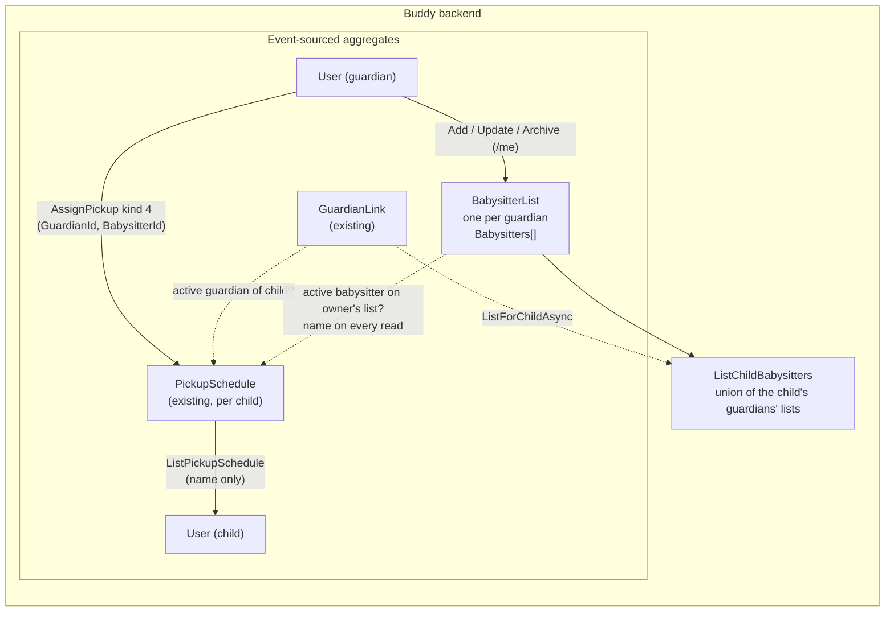

# Babysitters

Status: Implemented. `Features/Babysitters` ships the `BabysitterList` aggregate, the five slices
and routes below, the inline snapshot, golden files and integration tests; `Pickups` gains the
`PickupAssignee.Babysitter` case (wire `kind` 4) with names resolved through `BabysitterNames`.
The frontend ships `BabysittersService`, `/guardian/babysitters`, a "Babysitter" kind in the pickup
planner, and babysitter names on the dashboard, the child home and the printed week plan.

## Context

Guardians want to plan a babysitter or nanny for a pickup or drop-off slot. Today a slot can
go to a guardian, the child alone, a sibling, or a playdate host
([pickup-schedules.md](pickup-schedules.md),
[PickupAssignee.cs](../../../src/backend/buddy/Features/Pickups/Types/PickupAssignee.cs)). None
of those fits a nanny who collects the children three afternoons a week: a playdate host has
to be typed in again every time, and "Playdate: Anna" is the wrong label anyway.

Requirements settled with the user before this document was written:

1. **Saved babysitters.** A guardian keeps a list of babysitters, set up once, and picks one
   from a dropdown in the pickup planner. Typing in a name for each slot was considered and
   rejected.
2. **Per guardian.** Each guardian owns their own list. When planning a child's pickup, any of
   that child's guardians can pick from the babysitters of all the child's active guardians, so
   co-parents see each other's babysitters, and one nanny covers every child a guardian has.

The closest existing precedent is
[work-locations.md](work-locations.md)'s `WorkLocationSchedule`: a per-guardian list of
user-defined entries, a deterministic id equal to the guardian's `UserId`, archive instead of
delete, and a co-guardian View tier. This feature is that aggregate's location list without the
pattern and overrides.

This document answers five questions: where babysitters live, the aggregate's shape and
identity, what a babysitter holds, how a pickup slot refers to one, and who can see and change
the list.

## Question 1: a field on the pickup slot, or a new feature?

**Decision: a new feature, `Features/Babysitters`, with its own `BabysitterList` aggregate.
`Pickups` gets a fifth `PickupAssignee` case that points into it.**

- **A babysitter outlives any one slot.** Requirement 1 is exactly the difference between a
  `Playdate` (inline, typed each time) and a saved entry. Inline data belongs on the assignment;
  a reusable entry needs a home of its own, the same split `WorkLocations` made between a
  location and the day that uses it.
- **Not inside `PickupSchedule`.** That aggregate is per child
  ([pickup-schedules.md, Question 2](pickup-schedules.md#question-2-per-child-or-family-wide-like-mealplan)),
  and requirement 2 makes the list per guardian. Storing it per child would make a nanny for two
  siblings two separate entries.
- **Not inside `WorkLocationSchedule`.** It is per guardian too, but it is a private schedule
  that children never see ([work-locations.md, Question 6](work-locations.md#question-6-who-can-see-and-change-this)),
  while a babysitter's name has to reach the child's own pickup view. Mixing the two would blur
  that rule.
- **Considered and rejected: group-owned lists.** A `Group` is the family unit created at
  onboarding, but pickups authorize per child through `GuardianLink`, not through group
  membership. Group ownership would add a second authorization path to `AssignPickup`, and a
  child in two groups would see two lists.

## Question 2: aggregate shape and identity

**Decision: one `BabysitterList` stream per guardian, whose id equals the guardian's `UserId`,
created lazily by the first write.**

```
BabysitterList(
    BabysitterListId Id,                  // == GuardianId.Value
    UserId GuardianId,
    ImmutableList<Babysitter> Babysitters) // includes archived ones, see Question 3
```

- **Deterministic id, no index document.** Same reasoning as
  `WorkLocationScheduleId.ForGuardian`
  ([WorkLocationScheduleId.cs](../../../src/backend/buddy/Features/WorkLocations/Types/WorkLocationScheduleId.cs)):
  a guardian has exactly one list, so "this guardian's babysitters" is a direct stream or
  snapshot lookup.
- **Lazy creation.** `BabysitterListStarted` is appended together with the first
  `BabysitterAdded`, like `WorkLocationScheduleStarted`. A guardian who never adds a babysitter
  has no stream, and reads return an empty list.
- **Own Marten schema, `babysitters`,** plus an inline snapshot in the shared `snapshots` schema,
  like every aggregate ([event-stream-snapshots.md](event-stream-snapshots.md)).

## Question 3: what a babysitter holds

**Decision: a name and optional free-text contact info. Removing a babysitter archives it.**

```
Babysitter(
    BabysitterId Id,        // Guid v7, assigned by AddBabysitter
    string Name,            // "Anna"; required
    string ContactInfo,     // "+45 12 34 56 78"; "" means none
    bool IsArchived)
```

- **Contact info is free text, like `Playdate.ContactInfo`.** A phone number, an email, or "ask
  Sara" all fit. A structured phone field would need validation and formatting that nothing else
  in Buddy has.
- **Archive, don't delete.** Pickup slots refer to a babysitter by id. Archiving keeps that id
  resolvable, so past and already-planned slots still show the name, while the babysitter
  leaves the picker. This is the `WorkLocationArchived` / `TaskTemplateArchived` precedent
  ([work-locations.md, Question 3](work-locations.md#question-3-customizable-locations)).
  Hard delete (rewrites what a past slot said) and refusing to delete while referenced (makes
  the guardian clear slots by hand first) are rejected for the same reasons as there.
- **No icon or color.** Pickups show an emoji per kind already (👤 🚶 🧒 🎉); babysitters get one
  more (🧑‍🍼). Per-babysitter styling is additive if the print sheet ever wants it.

## Question 4: how a pickup slot refers to a babysitter

**Decision: a new case `PickupAssignee.Babysitter(UserId GuardianId, BabysitterId BabysitterId)`,
wire `kind` 4. The name is resolved on every read, not copied into the event.**

```
PickupAssignee.Babysitter(UserId GuardianId, BabysitterId BabysitterId)
    // GuardianId: whose list the babysitter is on

PickupAssigneeDto, kind 4 = Babysitter:
    { "kind": 4, "guardianId": "...", "babysitterId": "...", "name": "Anna" }
    // name is output only: ignored on PUT, filled from the guardian's list on every response
```

- **The owner travels with the id.** Storing `GuardianId` makes the read a direct snapshot load
  of one list (Question 2) instead of a search across every guardian of the child. It also
  keeps the name resolvable after that guardian's link to the child is revoked, the same way a
  `Guardian` assignment keeps its id.
- **Resolved, not copied.** Renaming a babysitter updates every slot that uses them, which is
  what a guardian fixing a typo expects. Copying the name into `PickupAssigned` would make the
  slot show the old spelling forever. `ListPickupSchedule` and `AssignPickup` both resolve
  names through one `BabysitterNames` lookup that loads each distinct owner's snapshot once per
  request. Archived babysitters keep resolving, and so does a deleted account's list
  (`UserDeleted` leaves the stream in place). Only an id missing from its owner's list would come
  back with `name: ""`; clients then fall back to the generic "Babysitter" label, as they already
  do for a guardian they can't find.
- **The child sees the name, not the contact info.** Children can view their own pickup schedule
  ([pickups flow, Authorization model](../pickups/flow.md#authorization-model)), and "Anna picks
  you up" is the point of the feature. Contact info stays on the guardian-only list routes.
- **Persisted with an explicit `Kind`.** `PickupAssigneeJsonConverter` gets a `Babysitter` case
  writing `GuardianId` and `BabysitterId`. Existing events are untouched; no upcasting.
- **Assignment checks** run in `AssignPickupHandler.ValidateRelationshipAsync`, next to the
  guardian and sibling checks: `GuardianId` must be an active guardian of the child, and
  `BabysitterId` must be an active (not archived) babysitter on that guardian's list. Either
  failure is `400 validation_error`.

## Question 5: who can see and change this

**Decision: Manage = the guardian themself, through `/me` routes. Picking = any active guardian
of the child, who sees the babysitters of all the child's active guardians. Children only ever
see a babysitter's name, through the pickup schedule.**

| Tier | Who | Actions |
|---|---|---|
| **Manage** | The guardian whose list it is (a child account gets `403`) | Add, update, archive; read own list including archived |
| **Pick** | An active guardian of `childId` | Read the active babysitters of every active guardian of that child, with contact info |
| — | Everyone else, including the child | `NotFound` on the child route |

- **Write routes are `/me` routes,** like `WorkLocations`, so the handler never takes a guardian
  id to write to.
- **The per-child read applies the pickup rule.** `GET /babysitters/children/{childId}` is
  allowed exactly when `PickupAuthorization.CheckManage` would allow writing that child's
  pickups: the caller is an active guardian of the child. That is the only place the dropdown is
  used. `BabysitterAuthorization.CheckPick` repeats that one `FindActiveLinkAsync` check rather
  than calling into `Pickups`, which already depends on this feature for names. It uses
  `IGuardianLinkEventStore.ListForChildAsync` to find the guardians and loads each one's
  snapshot.
- **Co-parents see each other's babysitters (requirement 2),** but only through a shared child.
  Two guardians with no child in common never see each other's lists.
- **A revoked link takes effect immediately.** The child route lists current guardians on
  every request, so a former guardian's babysitters drop out of the picker at once. Slots
  already assigned to them keep their name (Question 4).

## Events

```
BabysitterListStarted(BabysitterListId Id, UserId GuardianId, DateTimeOffset OccurredAt)
    // appended lazily with the first BabysitterAdded, never on its own

BabysitterAdded(BabysitterListId Id, BabysitterId BabysitterId,
    string Name, string ContactInfo, DateTimeOffset OccurredAt)

BabysitterDetailsChanged(BabysitterListId Id, BabysitterId BabysitterId,
    BabysitterDetails Before, BabysitterDetails After, DateTimeOffset OccurredAt)
    // BabysitterDetails(string Name, string ContactInfo), like WorkLocationDetailsChanged

BabysitterArchived(BabysitterListId Id, BabysitterId BabysitterId, DateTimeOffset OccurredAt)
```

- No `ModifiedBy`: the only writer is the stream's own guardian.
- All events get golden files in `buddy.IntegrationTests/EventShapeTests`, plus a new
  `PickupAssigned_Babysitter.json` for the new assignee case.

### Rehydration

`BabysitterList.Start` / `Advance` follow `WorkLocationSchedule`'s: `BabysitterListStarted`
seeds an empty list, `BabysitterAdded` appends, `BabysitterDetailsChanged` and
`BabysitterArchived` replace the matching entry. An inline `BabysitterListSnapshotProjection`
writes the snapshot.

## Read models

No index documents: the deterministic id makes every lookup a direct snapshot load.

```
BabysitterSummary(Guid Id, string Name, string ContactInfo, bool IsArchived)
ChildBabysitter(Guid GuardianId, Guid Id, string Name, string ContactInfo)
```

## Command slices (`Features/Babysitters/`, same vertical-slice shape as `WorkLocations`)

| Slice | Tier | Notes |
|---|---|---|
| `AddBabysitter` | Manage | Name, contact info. Starts the stream if needed. Emits `BabysitterAdded` |
| `UpdateBabysitter` | Manage | Name, contact info. No-op when unchanged. An archived or unknown id is `NotFound` |
| `ArchiveBabysitter` | Manage | Emits `BabysitterArchived`. Idempotent on an already-archived babysitter |
| `ListMyBabysitters` | Manage | The caller's whole list, archived ones included and flagged |
| `ListChildBabysitters` | Pick | Active babysitters of every active guardian of `childId`, sorted by name |

### Validation limits

| Field | Rule |
|---|---|
| `Name` | required, trimmed, 1–80 characters; unique among the guardian's active babysitters, case-insensitive |
| `ContactInfo` | optional, trimmed, at most 200 characters |
| Active babysitters | at most 20 per guardian |

## Routes

```
GET    /babysitters/me                        ListMyBabysitters
POST   /babysitters/me                        AddBabysitter
PATCH  /babysitters/me/{babysitterId}         UpdateBabysitter
DELETE /babysitters/me/{babysitterId}         ArchiveBabysitter
GET    /babysitters/children/{childId}        ListChildBabysitters
```

The pickup routes don't change; `kind` 4 is accepted by the existing
`PUT /pickups/children/{childId}/assignments`.

## Frontend

- **Service:** `core/babysitters.service.ts`, following `work-locations.service.ts`.
- **Screen:** `/guardian/babysitters` under `features/guardian/babysitters/`, linked from the
  profile menu next to Work locations and from the pickup planner. A list of babysitters with
  inline add, edit and archive, in the style of `manage-work-locations`.
- **Pickup planner:** `pickup-cell` gets a fifth segment, "Babysitter", with a select of the
  child's babysitters (`ListChildBabysitters`, loaded once per child on the pickup page). With
  none saved, it shows a hint linking to `/guardian/babysitters`.
- **Pickup views:** the guardian `pickup-today` card and the child home show 🧑‍🍼 and the
  resolved name; the printed week plan prints the name (no icon, like the other pickup kinds).
  All fall back to "Babysitter".
- **Re-saving an archived babysitter's slot** keeps Save disabled in the cell, with a hint that
  the babysitter was removed, matching the backend's `400`.
- **i18n:** `core/i18n/translations/{en,da}/babysitters.ts` ("Babysitters" / "Babysittere"),
  plus new pickup, dashboard, child home and print keys.
- **Screenshots:** the new page in `screenshots/pages.ts`, and a seeded babysitter with one
  assigned slot in `demo-family.ts`.

## Testing

Alba integration tests mirror the `WorkLocations` folder, plus in `Pickups`:

- assigning a babysitter from the caller's own list and from a co-guardian's list succeeds, and
  the response carries the name;
- an archived babysitter, an unknown id, and a guardian who isn't the child's guardian are each
  `400`;
- renaming a babysitter changes the name in `ListPickupSchedule`; archiving keeps it;
- the child sees the name in their own schedule;
- `ListChildBabysitters`: union of both guardians' lists, archived excluded; the child and a
  stranger get `NotFound`; a revoked guardian's babysitters drop out.

Plus `EventShapeTests` golden files and a `SnapshotTests` entry.

## Failure and edge-case behavior

| Case | Behavior |
|---|---|
| Guardian has never added a babysitter | No stream; `GET /babysitters/me` returns `[]` |
| Babysitter archived while assigned to slots | Slots keep the id and still show the name |
| Re-saving a slot whose babysitter is archived | `400`; the guardian picks someone else |
| Babysitter renamed | Every slot shows the new name on the next read |
| Owner's link to the child revoked | Their babysitters leave the child's picker; assigned slots keep the name |
| Owner deletes their account | The list stays in place, so slots keep the name; the owner's link is gone, so their babysitters leave the picker |
| Two babysitters with the same name | Rejected among active ones; an archived name can be reused |
| Archive an already-archived babysitter | Idempotent `204`, no event |
| Update with unchanged content | `200`, no event |
| Child account calls a `/me` route | `403` |

## Decisions made

| Question | Decision |
|---|---|
| New feature or inline | New feature `Features/Babysitters`; a saved entry outlives one slot |
| Owner | Each guardian, per requirement 2; not group or child |
| Identity | One stream per guardian, id equal to the guardian's `UserId`, created lazily |
| Fields | Name and free-text contact info; archived, never deleted |
| Pickup reference | `PickupAssignee.Babysitter(GuardianId, BabysitterId)`, wire `kind` 4 |
| Name on the slot | Resolved on every read, so renames propagate; `""` when unresolvable |
| Who picks | Any active guardian of the child, from all the child's active guardians' lists |
| Child visibility | The name only, through the pickup schedule |

## Remaining open questions

- **Babysitters outside pickups.** A babysitter could also be a calendar participant or an
  emergency contact. The lean is to wait; the list is reusable as is.
- **Restoring archived babysitters.** No unarchive in v1; the guardian adds them again. A
  `RestoreBabysitter` slice is additive.
- **Babysitter as a login user.** Giving a nanny their own read-only account is a much larger
  change (a new role in Keycloak and every authorization helper). Not planned.

## Diagram


