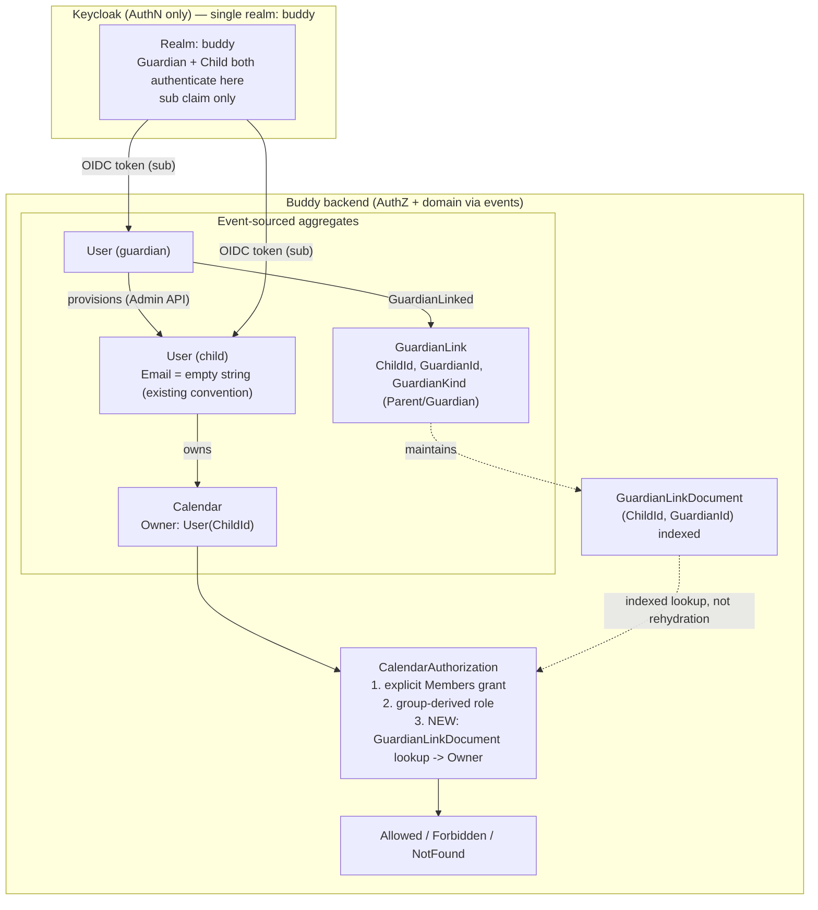

# Child Accounts and Guardian/Parent Roles

Status: Proposed (not yet implemented)

## Context

Buddy is aimed at parents/guardians managing schedules and routines together
with a child who has ADHD. Today the domain has only one kind of principal —
`User` — and one collaboration primitive — `Group`, with `GroupRole`
(`Owner | Admin | Member`) used purely as a calendar-permission-policy input
(see [group-owned-calendars-and-permissions.md](group-owned-calendars-and-permissions.md)).
There is no concept of:

- a **child's own account**, distinct from an adult's,
- a **guardian/parent relationship** between two `User`s,
- or a way to record **which kind** of relationship it is (parent, legal
  guardian, etc.) for consent/record-keeping purposes.

This document answers three concrete questions:

1. Should a child get an account in the same Keycloak realm as everyone else
   (with different roles), or a separate realm?
2. If it's the same realm, how does a guardian actually add/provision a
   child's account?
3. What does it take to represent "this user is a parent/guardian" — is that
   a property of `User`, or something else?

## Question 1: same realm, or a second realm?

**Decision: same realm (`buddy`), no second realm.**

This follows directly from the decision already made for Groups (see
[group-owned-calendars-and-permissions.md](group-owned-calendars-and-permissions.md#decision-keycloak-scope-stays-limited-to-authentication)):
Keycloak's job is to authenticate a subject and hand the backend a `sub`
claim; it is deliberately **not** used to store relationships, roles, or
policy, because those need to be transactionally consistent with the rest of
the domain and Keycloak has no native way to express "user X is the parent
of user Y". A guardian/child relationship is exactly that kind of
relationship-scoped fact, so it belongs in an event-sourced aggregate next to
`Group` and `Calendar`, not in Keycloak, regardless of which realm the child
authenticates against.

Given that, a second realm buys nothing and costs real complexity:

| Concern | Same realm | Second realm (e.g. `buddy-children`) |
|---|---|---|
| Guardian↔child relationship storage | App-side aggregate (needed either way) | Still needed — realms can't express cross-realm relationships |
| Backend trust config | One `Authority`/`Audience` pair (already in [KeycloakOptions.cs](../../../src/backend/buddy/Features/Users/KeycloakOptions.cs)) | Two issuers to validate, two audiences, doubled `AddAuthentication` complexity in [UsersFeature.cs](../../../src/backend/buddy/Features/Users/UsersFeature.cs) |
| Test infrastructure | One [TestRealm.json](../../../src/backend/buddy.IntegrationTests/Fixtures/TestRealm.json) | A second realm export to build and maintain, second container import step in [BuddyApiFixture.cs](../../../src/backend/buddy.IntegrationTests/Fixtures/BuddyApiFixture.cs) |
| Cross-account admin actions (guardian creating a child account, or later "log in as your child") | One Admin REST endpoint/realm to call | Must pick the right realm per call, credentials/service account duplicated |
| Benefit gained | — | None found — no requirement here needs realm-level isolation |

The only thing a realm boundary is good for is isolating **unrelated**
tenants (e.g. a completely separate customer). Guardians and their children
are, by definition, related — they need to look each other up and share
data — so putting them in the same realm and modeling the relationship at
the application layer (same pattern as `Group`) is both simpler and the only
option that can actually express "parent of".

A **separate Keycloak client** (not realm) for a child-facing experience is
still worth keeping in mind later — e.g. a `buddy-child` public client with a
shorter token lifetime, simplified consent screens, or a PIN-based grant type
— but that's an authentication UX concern, entirely independent of this
decision, and doesn't change anything below.

## Question 2: how does a guardian add a child?

Because Keycloak holds no relationship data, "adding a child" is really two
separate steps that happen to often occur together: (a) getting the child a
Keycloak identity, and (b) recording the guardian/child link in the app.
Step (b) is covered in the domain model section below; step (a) has two
viable shapes:

### Option A (recommended default): guardian provisions via Keycloak Admin API

The backend gets a confidential client with a service-account role
(`realm-admin` or the narrower `manage-users` client role) and calls the
Keycloak Admin REST API (`POST /admin/realms/buddy/users`) from a new
endpoint such as `POST /users/me/children`. This is the same shape as the
existing lazy-materialization flow — the backend already turns a Keycloak
identity into a local `User` on first request
([GetCurrentUser.Command.cs](../../../src/backend/buddy/Features/Users/GetCurrentUser/GetCurrentUser.Command.cs)) —
except here the backend is the one calling Keycloak first, instead of
reacting to a token that already exists:

1. Guardian calls `POST /users/me/children` with the child's display name
   (and optionally a username; no email required — see below).
2. Backend calls the Keycloak Admin API to create the user in the `buddy`
   realm, sets a temporary credential (or configures a required action such
   as `UPDATE_PASSWORD` on first login, or a passwordless/OTP flow — an
   authentication-UX decision, not covered here), and gets back Keycloak's
   generated `sub`.
3. Backend creates the local `User` aggregate (bypassing lazy
   materialization, since we already have every claim we need) and appends a
   `GuardianLinked` event linking the new child `User` to the calling
   guardian. **These are two separate writes, not one transaction** — see
   "Cross-aggregate write ordering" below for why, and how to handle a
   partial failure between them.
4. The guardian is given the child's temporary credential/login code out of
   band (shown once in the UI, or emailed to the *guardian's* address, never
   the child's, since a young child may not have one).

### A new privileged credential this requires

Step 2 needs the backend to hold a credential that can create users in the
`buddy` realm, and **nothing like that exists today.** The production
Keycloak client
([TestRealm.json](../../../src/backend/buddy.IntegrationTests/Fixtures/TestRealm.json))
is `publicClient: true` with `serviceAccountsEnabled: false`, and
[KeycloakOptions.cs](../../../src/backend/buddy/Features/Users/KeycloakOptions.cs)
only carries `Authority` / `Audience` / `RequireHttpsMetadata` /
`ValidIssuer` — no `ClientId`, `ClientSecret`, or admin-base-URL. The only
place this codebase calls the Keycloak Admin API today is
[BuddyApiFixture.cs](../../../src/backend/buddy.IntegrationTests/Fixtures/BuddyApiFixture.cs),
and it does so as *test* infrastructure — authenticating as the built-in
`master` realm's `admin-cli` client with hardcoded `admin`/`admin`
credentials — a pattern that has no production equivalent to reuse.

Shipping Option A therefore requires, as net-new work rather than a
byproduct of adding an aggregate:

- A new confidential client (or a service account added to the existing
  public `buddy-api` client), scoped to `manage-users` rather than the
  realm-wide `realm-admin` unless a concrete need for the latter shows up.
- Production secret storage and a rotation plan for that client's secret —
  no existing pattern in the codebase to follow.
- A security review of blast radius: this credential can create, modify,
  and delete *any* user in the realm, not just a calling guardian's own
  children, so `POST /users/me/children`'s own authorization logic is the
  only thing standing between "guardian adds their own child" and
  "guardian-scoped credential used to touch an arbitrary account."

### Cross-aggregate write ordering (not a single transaction)

`Users`, `Groups`, and `Calendars` each get their own `AddMartenStore<T>`
call with a separate schema and separate session
([UsersFeature.cs](../../../src/backend/buddy/Features/Users/UsersFeature.cs),
[GroupsFeature.cs](../../../src/backend/buddy/Features/Groups/GroupsFeature.cs),
[CalendarsFeature.cs](../../../src/backend/buddy/Features/Calendars/CalendarsFeature.cs)).
A `GuardianLink` aggregate would need its own store the same way, so step 3
above is **two independent `SaveChangesAsync` calls against two different
stores**, not one transaction — unlike the `Group`-deletion cascade in
[group-owned-calendars-and-permissions.md](group-owned-calendars-and-permissions.md#aggregate-loading-and-performance--operational-contract),
which stays atomic only because both events land in the *same* store's
session.

Two ways to close that gap, and the recommended one:

- **Put `GuardianLink` in the Users schema/store**, appended via
  `IUsersStore` right alongside `UserCreated` in the same session/
  `SaveChangesAsync`. This keeps "child created + linked to guardian" atomic
  the same way the `Group` cascade is atomic — the two events are streams
  within one store, not one store per aggregate. This is the recommended
  option, since a guardian relationship is a fact about a `User`'s identity
  as much as it's a fact about calendars/groups.
- **Or**, if `GuardianLink` genuinely needs its own store (e.g. it later
  grows independent read models), treat child creation as a two-step
  saga: create the `User` first, then append `GuardianLinked`; if the
  second write fails, retry it (the child `User` existing without a
  `GuardianLink` yet is a recoverable, visible state — the child simply has
  no guardian until the retry succeeds — rather than a silently inconsistent
  one). This needs an explicit retry/reconciliation step that doesn't exist
  in the codebase today for any cross-store write.

This keeps the existing invariant that **Keycloak is the only source of new
`sub` values** and the backend never invents identities, while letting the
guardian be the one who triggers account creation, which matches how a
parent actually onboards a child who is too young to self-register.

### Option B: child self-registers, guardian links after the fact

The child (or a guardian on their behalf) goes through Keycloak's normal
registration flow independently, then the guardian links the resulting
account via an invite mechanism. This mirrors how `Group` membership is
granted today (`PUT /groups/{id}/members/{userId}/role`), which already
requires the actor to know the target's `UserId` — i.e. the codebase has no
"look up a user by name/email" endpoint at all today, by design, to avoid an
account-enumeration surface. For guardians this means Option B needs an
**invite code / short-lived pairing token** flow (guardian generates a code,
child or their device enters it once logged in) rather than a direct
`userId` lookup, adding a new mechanism the codebase doesn't have yet.

**Recommendation:** ship Option A first (it reuses more of the existing
pattern and fits the target persona — a parent onboarding a young child), and
treat Option B as a later addition for older children/teens who prefer to
manage their own credentials while still being linked by an invite code.
Both options terminate in the same place: a `GuardianLinked` event.

### The "no email" case is already partly handled — by an empty-string sentinel

[User.cs](../../../src/backend/buddy/Features/Users/Types/User.cs) types
`Email` as non-null, but
[GetOrCreateUserHandler](../../../src/backend/buddy/Features/Users/GetCurrentUser/GetCurrentUser.Handler.cs)
already does `Email.Verified(command.Email ?? "")` / `Email.Unverified(command.Email ?? "")`
when the OIDC claim is missing — a `User` can already exist today with
`Email.Value == ""`, and the same handler already guards the verification
flow with `!string.IsNullOrWhiteSpace(email.Value)` before generating a
verification token. So the "no email" case a child account needs isn't a
new gap — it's an existing convention (empty string, not null) that child
provisioning should simply reuse: Option A's Admin API call passes no email
claim, `GetOrCreateUserHandler`'s existing `?? ""` fallback produces
`Email.Value == ""` the same way it already does for any adult whose OIDC
token happens to omit an email, and the existing blank-email guard already
skips sending a verification email.

This changes the earlier recommendation: **no `Email` schema change is
needed.** Making `Email` an optional/nullable field on top of the existing
empty-string sentinel would introduce two representations of "no email"
(`null` vs. `""`) that every consumer (`IsVerified` checks, verification
request guard, email-change handler) would need to reconcile — worse than
keeping the one convention already in place. The only remaining question is
whether `Email.Value == ""` should keep meaning "missing," which is already
true for any `User` today regardless of child accounts, so this document
introduces no new requirement on `User`/`Email` at all.

## Question 3: how to represent "parent" vs. "guardian"

**It is not a property of `User`.** Every role concept already in the
codebase (`GroupRole`, `CalendarRole`) is scoped to a *relationship between
two entities*, never a global attribute stamped on the `User` aggregate
itself — a person can be `GroupRole.Owner` of one group and `Member` of
another, and the same should hold here: a person could be the legal
`Guardian` of one child and the biological `Parent` of another (e.g. a
step-parent household), so "parent or guardian" cannot be a single fixed
field on `User`.

### New aggregate: `GuardianLink`

Following the same event-sourced shape as `Group` and `Calendar`:

```
GuardianLink(
    GuardianLinkId Id,
    UserId ChildId,
    UserId GuardianId,
    GuardianKind Kind,
    bool IsRevoked = false)
```

- `GuardianKind`: `Parent | Guardian` — a descriptive/legal-record label
  only. Unlike `GroupRole`/`CalendarRole`, it does **not** itself gate
  different permission levels — a `Parent` and a `Guardian` have the same
  default authority over the child's account (see below). Its purpose is
  record-keeping (e.g. "who to contact for a consent form"), and it can be
  changed without any permission implication, unlike `GroupRole.Owner` which
  is permanent.
- Multiple `GuardianLink`s can point at the same `ChildId` (two parents, a
  parent plus another legal guardian), and one `GuardianId` can be linked to
  many children — a many-to-many edge, same shape as `Group.Members`.

Events: `GuardianLinked(GuardianLinkId, ChildId, GuardianId, GuardianKind, DateTimeOffset OccurredAt)`,
`GuardianKindChanged(GuardianLinkId, GuardianKind Before, GuardianKind After, DateTimeOffset OccurredAt)`,
`GuardianRevoked(GuardianLinkId, DateTimeOffset OccurredAt)`.

### How this feeds calendar/group permissions

`CalendarAuthorization` ([CalendarAuthorization.cs](../../../src/backend/buddy/Features/Calendars/CalendarAuthorization.cs))
already resolves a role in two steps — explicit `Calendar.Members` grant,
then group-derived role via `CalendarPermissionPolicy`. This adds a third,
lowest-precedence step:

1. Explicit `Calendar.Members` entry — wins, unconditionally (unchanged).
2. Group-derived role via `CalendarPermissionPolicy` (unchanged).
3. **New:** if the calendar's owner (`CalendarOwner.User`) is a child with
   an active `GuardianLink` to the caller, resolve `CalendarRole.Owner` by
   default. This is intentionally **not configurable per child** the way
   `CalendarPermissionPolicy` is for groups — a guardian's authority over a
   dependent's account is a safety/parental-control property, not something
   the child (or anyone else) should be able to downgrade by editing a
   policy.
4. Otherwise: no access (unchanged).

#### This step needs a new read model — it is not "walked exactly like `Group`"

The existing group step works cheaply because `Calendar.Owner` *already
contains* the exact `GroupId` to fetch —
[CalendarAuthorization.cs](../../../src/backend/buddy/Features/Calendars/CalendarAuthorization.cs)
does `Group.Rehydrate(await groups.ReadAsync(groupId, ...))` directly, no
search involved. Step 3 has no equivalent ID to key off: `Calendar.Owner` for
a user-owned calendar is just the child's `UserId` — there is no
`GuardianLinkId` anywhere in scope, and no way to know in advance whether
that owning `UserId` even *is* a child account. Answering "does `userId`
have an active `GuardianLink` to this `UserId`" is a lookup keyed by a
*pair* of foreign IDs (`ChildId`, `GuardianId`), the same class of problem
`GroupMembershipDocument` was introduced to solve for list queries in
[group-owned-calendars-and-permissions.md](group-owned-calendars-and-permissions.md#list-queries-are-the-one-place-a-new-read-model-is-required) —
not something the event-sourced `GuardianLink` aggregate can answer without
knowing its own ID first.

This needs a maintained-inline-projection document, the same pattern used
elsewhere: `GuardianLinkDocument(ChildId, GuardianId, GuardianKind, IsRevoked)`,
written alongside `GuardianLinked`/`GuardianRevoked` the same way
`CalendarMembershipDocument` is written alongside `Calendar` events. Step 3
then becomes an indexed lookup by `(ChildId = calendar.Owner.Value, GuardianId = userId)`,
not an aggregate rehydration — cheaper than the group case, not more
expensive, but it is a genuinely new document this document must introduce,
not a reuse of an existing mechanism.

This also changes the sibling doc's "zero cost for user-owned calendars"
claim: today, a user-owned calendar with no matching `Calendar.Members`
entry short-circuits to "no access" with no further lookups. Once step 3
exists, **every** user-owned calendar with no explicit grant now needs one
indexed `GuardianLinkDocument` lookup before falling through to "no
access" — a small, O(1)-indexed cost, but a real one that the group-owned
path doesn't have to pay (it only looks anything up when `Calendar.Owner`
is actually a `Group`).

List queries (`ListCalendars`/`ListForUserAsync`) have the same gap as the
group case for the same reason: a guardian has no explicit
`CalendarMembershipDocument` row on a child's calendar, so listing "calendars
I can access" needs to also join the caller's `GuardianLinkDocument` rows
against each linked child's owned calendars — the same three-step read shape
introduced for groups, with `GuardianLinkDocument` playing the role
`GroupMembershipDocument` plays there.

### Why not extend `GroupRole` instead

`GroupRole.Owner | Admin | Member` is a generic collaboration-permission
enum reused by any `Group`, not specific to families. Adding `Parent` /
`Guardian` / `Child` values to it would conflate two different axes: *how
much control does this member have over the group* (existing purpose) vs.
*what is this person's real-world relationship to that specific member*
(new need). Keeping `GuardianKind` on its own `GuardianLink` aggregate keeps
`GroupRole` unchanged and lets a "family" still just be an ordinary `Group`
if guardians want one (e.g. to share a household calendar), fully
independent of whether a `GuardianLink` also exists between two of its
members.

## Failure and edge-case behavior

| Case | Behavior |
|---|---|
| Child has no `GuardianLink` at all | Behaves exactly like today's user-owned calendar — only the child (and any explicit `Calendar.Members` grants) has access. |
| `GuardianLink` revoked (`GuardianRevoked`) | Effective on the next check — `GuardianRevoked` updates `GuardianLinkDocument` in the same write, no stale row to serve. |
| Two `GuardianLink`s to the same child (two parents) | Both guardians resolve to `CalendarRole.Owner` independently; no conflict, since it's a set membership check, not a single-slot field. |
| Child also has explicit `Calendar.Members` grants (e.g. from a group) | Explicit grants still take precedence over the guardian default, same precedence rule as group-derived roles — a child's calendar could deliberately grant a guardian only `Contributor` by an explicit entry if that's ever desired. |
| Guardian tries to link a child who is already an adult / already linked elsewhere | Out of scope for this document — needs a policy decision (age verification isn't modeled anywhere today) and is called out as an open question below. |
| Child account has no email (Option A) | Reuses the existing `Email.Value == ""` convention already produced by `GetOrCreateUserHandler`'s `?? ""` fallback; the existing blank-email guard already skips `EmailVerificationRequested`. No new "child" flag. |
| Child `User` created but the follow-up `GuardianLinked` write fails (two separate stores) | Child `User` exists with no guardian yet — a visible, recoverable state, not silent data loss. Caller/retry logic must re-append `GuardianLinked` until it succeeds (see "Cross-aggregate write ordering"). |

## Decisions made

| Question | Decision |
|---|---|
| Same Keycloak realm or a second one for children | Same realm — relationship data belongs in the app, not Keycloak, so a second realm adds cost with no benefit |
| How a guardian adds a child (v1) | Guardian-initiated provisioning via the Keycloak Admin API, mirroring today's lazy-materialization pattern but backend-initiated |
| Is "parent"/"guardian" a field on `User` | No — a scoped relationship (`GuardianLink`), same pattern as `GroupRole`/`CalendarRole` |
| Does `GuardianKind` (`Parent`/`Guardian`) change permission level | No — record-keeping label only; both kinds grant the same default authority |
| Guardian default calendar access on a child's calendar | `CalendarRole.Owner`, resolved via an indexed `GuardianLinkDocument(ChildId, GuardianId)` lookup, not configurable per child (safety property, unlike `CalendarPermissionPolicy`) |
| Should `GroupRole` gain `Parent`/`Child` values | No — conflates permission level with real-world relationship; kept as a separate aggregate |
| `Email` on `User` | No schema change — reuse the existing `?? ""` empty-string convention already produced by `GetOrCreateUserHandler` |
| Where does `GuardianLink` live, for atomicity with child-user creation | In the Users schema/store, appended alongside `UserCreated` in the same session — not a separate store, so the two writes commit together |
| How is a caller's `GuardianLink` to a calendar's owning user found | New `GuardianLinkDocument(ChildId, GuardianId, GuardianKind, IsRevoked)` read model — `Calendar.Owner` only carries a `UserId`, unlike the group case where `GroupId` is already in hand |
| What credential does the backend use to create a child in Keycloak (Option A) | A new confidential client / service account scoped to `manage-users` — does not exist today; requires new secret storage and a security review of blast radius before implementation |

## Remaining open questions

- Age verification / self-service "graduation" from a guarded child account
  to a full independent adult account is not modeled anywhere yet and needs
  a separate decision.
- Consent/compliance requirements for handling children's data (e.g.
  COPPA/GDPR-K style verifiable-parental-consent rules) are a legal question
  outside this document's scope, but the provisioning flow in Option A
  (guardian-initiated, guardian holds the credential) is deliberately shaped
  to keep the guardian in control of consent from account creation onward.
- Whether Option B (child self-registration + invite code) is needed at all
  for v1, or can be deferred until there's a concrete need for
  teen/independent-login children.
- The new Keycloak service-account credential Option A needs (client scope,
  secret storage/rotation, blast radius if compromised) has not had a
  security review — this should happen before implementation starts, not
  after.

## Diagram


