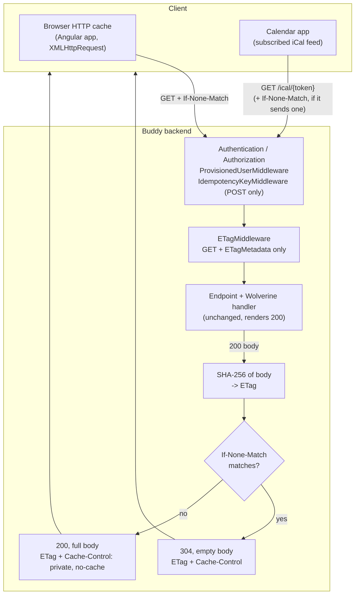

# Conditional GET with ETags

Status: Proposed (not yet implemented)

## Context

Every Buddy GET endpoint renders its full response on every request, and nothing tells a client
whether that response changed since the last time it asked. Two kinds of clients ask the same
question over and over:

- **Calendar apps polling the iCal feeds**
  ([`GetIcalFeed`](../../../src/backend/buddy/Features/Calendars/GetIcalFeed/GetIcalFeed.Endpoint.cs),
  [`GetMealPlanIcalFeed`](../../../src/backend/buddy/Features/Mealplans/GetMealPlanIcalFeed/GetMealPlanIcalFeed.Endpoint.cs)).
  Both feeds now ask clients to refresh hourly (`REFRESH-INTERVAL` / `X-PUBLISHED-TTL` in
  [`IcalSubscription.cs`](../../../src/backend/buddy/Common/Ical/IcalSubscription.cs)), and every
  poll downloads the whole calendar even when nothing changed. The calendar feed covers 90 days
  back and 365 days forward, so it is the largest response the API serves.
- **The Angular app** re-fetching the same lists (meals, plan, doses, calendar occurrences) as the
  guardian moves between pages.

HTTP already has the mechanism: the server sends an `ETag` validator with a `200`, the client sends
it back in `If-None-Match`, and when it still matches, the server answers with an empty
`304 Not Modified`. [http-status-codes.md](../http-status-codes.md#304-not-modified) lists `304`
as "not currently used".

What this does **not** do: make any calendar app poll more often. Outlook on the web and the new
Outlook fetch subscribed feeds from Microsoft's servers on Microsoft's schedule, and Google Calendar
on Google's. Neither is influenced by headers or feed properties. An ETag only makes each poll
cheaper, for clients that send `If-None-Match` at all. A client that doesn't keeps getting a
normal `200`, so nothing breaks.

This document answers four questions: how the ETag is computed, which endpoints get one, which
cache headers go with it, and what the iCal feeds need to change for it to work.

## Decision: the ETag is a hash of the response body, computed in one middleware

Two ways to compute a validator:

1. **From the data's version.** Before rendering, the handler derives a version string from the
   Marten stream versions it is about to read (plus anything else the output depends on), and
   returns `304` without rendering when the client already has that version. This saves the
   database reads and the rendering, not just the bytes on the wire.
2. **From the rendered bytes.** The endpoint renders as it does today; a middleware hashes the body
   and compares the hash with `If-None-Match`. This saves only the transfer.

**Decision: option 2, as generic middleware (`Common/Http/ETagMiddleware.cs`).** It is the
same shape as
[`IdempotencyKeyMiddleware`](../../../src/backend/buddy/Common/Idempotency/IdempotencyKeyMiddleware.cs):
cross-cutting HTTP behavior that buffers the response body, implemented once instead of in every
handler.

The deciding argument is correctness. A body hash can't produce a false `304`: if a single byte of
the output differs, the tag differs. A version-based tag is only correct if the handler lists
*every* input of its output, and several endpoints have inputs that are not streams:

- both iCal feeds render a rolling window around *today*
  ([`GetMealPlanIcalFeedHandler`](../../../src/backend/buddy/Features/Mealplans/GetMealPlanIcalFeed/GetMealPlanIcalFeed.Handler.cs)
  uses 14 days back and 60 forward), so their output changes at midnight with no new event;
- "today" endpoints (doses, group status, pickups) depend on the clock in the same way;
- many reads combine several aggregates (`GetGroup` joins the group with every member's user
  stream; the meal plan feed joins the plan with each meal's stream).

A version-based tag that forgets one input serves stale data with no error. Option 1 is
considered and deferred, not rejected: it can be added later for a specific hot endpoint, on top
of this middleware (see [Sample: a version-based ETag](#sample-a-version-based-etag-deferred)).

Rejected: **ASP.NET Core output caching** (`AddOutputCache`). It stores responses on the server and
needs explicit tag invalidation on every write, so every command handler would need to know which
cached reads it affects. By default it also skips authenticated requests, which is nearly all of
Buddy's GETs.

Rejected: **`Last-Modified` / `If-Modified-Since`.** It needs a reliable last-changed timestamp
for each response. Responses that join several streams or depend on the clock don't have one, and
second-level granularity can miss two writes within the same second.

### What the middleware does

- It acts only on **GET** requests to endpoints carrying `ETagMetadata` (next decision), and only on
  a **`200`** response. A `404`, `400` or any other status passes through untouched and untagged.
- It buffers the body, hashes it with SHA-256 (built into .NET, no new package), and sets a
  **strong** `ETag` (`"<base64url hash>"`). The bytes are exactly what goes on the wire, so a
  strong tag is correct (see [Remaining open questions](#remaining-open-questions) on compression).
- It reads `If-None-Match` as a list: any entry that matches, either weakly or as `*`, turns the
  response into a `304` with no body. RFC 9110 requires weak comparison for `If-None-Match`.
- It runs after authentication and authorization, and after `ProvisionedUserMiddleware` and
  `UseIdempotencyKeys()` in [`Program.cs`](../../../src/backend/buddy/Program.cs). An unauthorized
  request therefore never reaches it, and a `304` is only ever computed from a body that the caller
  was allowed to see.

## Decision: opt in per route group, enforced by a meta test

**Decision: each domain opts in on its route group (`.WithETag()` in `Map<Domain>Feature`), and a
meta test fails for any GET endpoint without a decision.** The marker is an endpoint-metadata class,
the same mechanism as
[`AllowUnprovisionedUserMetadata`](../../../src/backend/buddy/Features/Users/ProvisionedUserMiddleware.cs).

With 13 feature groups, opting every group in is 13 one-line changes. That covers all 47 GET
endpoints today, including both iCal feeds, which live in the `calendars` and `mealplans` groups.
`/health` and `/version` are mapped outside any feature group and stay out of scope.

The meta test follows the shape of `Meta/EndpointCoverageTests.cs`: it enumerates every GET route
and fails for one that has neither the marker nor an entry in an explicit exclusion list. A new
endpoint therefore can't silently lose its ETag, or silently gain one.

Rejected: **apply it to every GET globally, with no marker.** It needs less code, but a future
streaming GET (server-sent events for the AI assistant, a large export) would be buffered in full
by a middleware it never asked for, and its streaming would break with no error. With an opt-in,
someone has to decide for each new kind of endpoint.

Rejected: **opt in per endpoint.** That would be 47 annotations, and the meta test would be the
only thing keeping them in sync. The group is already where each domain sets its cross-cutting
behavior (`.WithTags`, `.RequireAuthorization()`, `.WithGroupName`).

## Decision: `Cache-Control: private, no-cache` on every tagged response

**Decision: the middleware sets `Cache-Control: private, no-cache` on every response it tags,
unless the endpoint already set a `Cache-Control` value.** The iCal endpoints already send exactly
this value through
[`IcalSubscription.CacheControl`](../../../src/backend/buddy/Common/Ical/IcalSubscription.cs).

- `no-cache` means "store it, but check with the server before every reuse". The browser therefore
  always sends `If-None-Match` and never shows a response the server hasn't just confirmed. **Data
  is never stale**, which is the property the Angular app relies on today when it re-reads after a
  write.
- `private` keeps shared caches (a proxy, a CDN placed in front of the API later) from storing
  responses that are per-user and, for the feeds, reachable through a secret token in the URL.

**The frontend needs no change.** Angular's `HttpClient` uses `XMLHttpRequest`
([`app.config.ts`](../../../src/frontend/buddy/src/app/app.config.ts) has no `withFetch()`), which
goes through the browser's HTTP cache. The browser adds `If-None-Match` itself, and when the answer
is a `304`, it hands Angular the cached body as a `200`. Specs using `HttpTestingController` don't
touch the browser cache, so they are unaffected.

Rejected: **`max-age=N`** (letting the browser reuse a response for N seconds without asking).
That would show a guardian a list that doesn't include what they just saved, and there is no
cache-busting today to prevent it.

### Different users in one browser

The same URL (`/users/me`, `/mealplans/children/{id}/plan`) returns different bodies for different
callers. With `no-cache`, a cached entry from user A is always revalidated, with user B's token.
The server renders B's response and compares *that* hash. A `304` therefore only happens when B's
body is byte-identical to the stored one, in which case reusing it is correct. `Vary: Authorization`
is not needed for correctness, and it would also defeat the cache across token refreshes, since
every access token is different.

## Decision: the iCal feeds stamp `DTSTAMP` per day, not per request

Both writers set every event's `DTSTAMP` to `DateTime.UtcNow`
([`IcalFeedWriter.cs`](../../../src/backend/buddy/Features/Calendars/IcalFeedWriter.cs),
[`MealPlanIcalFeedWriter.cs`](../../../src/backend/buddy/Features/Mealplans/MealPlanIcalFeedWriter.cs)).
Two renders of an unchanged feed are therefore never byte-identical, and a body hash would never
match. **This is the one change that ETags on the feeds can't work without.**

**Decision: `DTSTAMP` is the start of the current UTC day.** It is the same for every render within
a day. Both feeds' windows roll at midnight anyway, so their content already changes daily, and
nothing is lost.

RFC 5545 defines `DTSTAMP`, for a feed without a `METHOD`, as the time the information was last
revised. Neither `CalendarItemOccurrence` nor `MealPlanEntry` carries a last-modified time, so no
accurate value exists today. A per-day stamp is no less accurate than a per-request one.

Rejected: **exclude `DTSTAMP` lines from the hash.** That would make the middleware understand one
content type, and the bytes sent would no longer be the bytes hashed, which makes a strong ETag
incorrect.

## Sample code

### The middleware and the marker

```csharp
// src/backend/buddy/Common/Http/ETagMiddleware.cs
using System.Buffers.Text;
using System.Security.Cryptography;

using Microsoft.Net.Http.Headers;

namespace buddy.Common.Http;

// Conditional GET for endpoints marked .WithETag(): hashes the rendered 200 body into a strong ETag
// and answers a matching If-None-Match with an empty 304. Generic HTTP middleware rather than
// per-handler code, same reasoning as IdempotencyKeyMiddleware -- a body hash can't go stale the way
// a hand-maintained version can (see docs/backend/analysis/conditional-get-etags.md).
public sealed class ETagMiddleware(RequestDelegate next)
{
    public const string DefaultCacheControl = "private, no-cache";

    public async Task InvokeAsync(HttpContext context)
    {
        if (!HttpMethods.IsGet(context.Request.Method)
            || context.GetEndpoint()?.Metadata.GetMetadata<ETagMetadata>() is null)
        {
            await next(context);
            return;
        }

        var originalBody = context.Response.Body;
        await using var buffer = new MemoryStream();
        context.Response.Body = buffer;

        try
        {
            await next(context);
        }
        finally
        {
            context.Response.Body = originalBody;
        }

        if (context.Response.StatusCode == StatusCodes.Status200OK)
        {
            var hash = SHA256.HashData(buffer.GetBuffer().AsSpan(0, (int)buffer.Length));
            var etag = new EntityTagHeaderValue($"\"{Base64Url.EncodeToString(hash)}\"");

            context.Response.GetTypedHeaders().ETag = etag;

            if (!context.Response.Headers.ContainsKey(HeaderNames.CacheControl))
            {
                context.Response.Headers.CacheControl = DefaultCacheControl;
            }

            if (Matches(context.Request.GetTypedHeaders().IfNoneMatch, etag))
            {
                // RFC 9110: a 304 carries the validator and caching headers but no body.
                context.Response.StatusCode = StatusCodes.Status304NotModified;
                context.Response.ContentLength = null;
                context.Response.Headers.ContentType = default;
                return;
            }
        }

        buffer.Position = 0;
        await buffer.CopyToAsync(originalBody, context.RequestAborted);
    }

    // If-None-Match uses weak comparison (RFC 9110 13.1.2), so W/"x" matches "x".
    private static bool Matches(IList<EntityTagHeaderValue> ifNoneMatch, EntityTagHeaderValue etag) =>
        ifNoneMatch.Any(candidate =>
            candidate.Equals(EntityTagHeaderValue.Any) || candidate.Compare(etag, useStrongComparison: false));
}

public sealed class ETagMetadata;

public static class ETagMiddlewareExtensions
{
    public static IApplicationBuilder UseETags(this IApplicationBuilder app) =>
        app.UseMiddleware<ETagMiddleware>();

    public static TBuilder WithETag<TBuilder>(this TBuilder builder)
        where TBuilder : IEndpointConventionBuilder =>
        builder.WithMetadata(new ETagMetadata());
}
```

Registered in [`Program.cs`](../../../src/backend/buddy/Program.cs) after the existing pipeline:

```csharp
app.UseRequestBindingFailures();
app.UseIdempotencyKeys();
app.UseETags();
```

### Opting a domain in (the usual change)

Every GET endpoint in the domain is covered, and no endpoint file changes:

```csharp
// src/backend/buddy/Features/Mealplans/MealplansFeature.cs
var mealplans = endpoints.MapGroup("/mealplans")
    .WithTags("Mealplans")
    .RequireAuthorization()
    .WithGroupName(OpenApiDocumentName)
    .WithETag();
```

The middleware ignores the marker on PUT, POST and DELETE endpoints in the same group, so a
group-wide marker is safe.

### Opting a single endpoint in

For a GET mapped outside a feature group, or to opt in one endpoint ahead of the rest of its
domain, the same marker goes on the endpoint itself. The handler and the result mapping don't
change. Using
[`GetGroup.Endpoint.cs`](../../../src/backend/buddy/Features/Groups/GetGroup/GetGroup.Endpoint.cs)
as the example:

```csharp
groups.MapGet("/{groupId:guid}", async Task<Results<Ok<GroupResponse>, NotFound>> (
    ClaimsPrincipal principal,
    Guid groupId,
    IMessageBus bus,
    CancellationToken cancellationToken) =>
{
    // ... unchanged ...
})
.WithName("GetGroup")
.WithETag();
```

The `Results<...>` union does **not** gain a `304` case. The endpoint still returns `200` and the
middleware turns it into a `304`, so the endpoint's OpenAPI description stays "`200` with a body".
The `304` is documented once, in [http-status-codes.md](../http-status-codes.md#304-not-modified).

### The iCal feeds: a stable `DTSTAMP`

```csharp
// IcalFeedWriter.Write and MealPlanIcalFeedWriter.Write
// Start of the UTC day, not UtcNow: an unchanged feed must render byte-identically within a day
// or its ETag never matches. The windows roll daily anyway (see conditional-get-etags.md).
var stamp = new CalDateTime(DateTime.UtcNow.Date, "UTC");
```

The endpoints themselves don't change. They already set `Cache-Control` through
`IcalSubscription.CacheControl`, so the middleware keeps that value.

### Sample: a version-based ETag (deferred)

If profiling ever shows that rendering a hot endpoint is the cost and not the transfer, that
endpoint can skip the work before rendering. This is a sketch of the shape, not part of this
proposal. It needs a `StreamVersion` the event store interfaces don't expose today, and every input
of the response has to be part of the version:

```csharp
mealplans.MapGet("/{mealPlanId:guid}/ical/{token}", async Task<Results<ContentHttpResult, NotFound, StatusCodeHttpResult>> (
    Guid mealPlanId,
    string token,
    IMessageBus bus,
    HttpContext httpContext,
    CancellationToken cancellationToken) =>
{
    // The handler reads the plan and meal stream versions first and returns NotModified before
    // expanding entries or serializing when the caller's tag still matches.
    var ifNoneMatch = httpContext.Request.GetTypedHeaders().IfNoneMatch;
    var query = new GetMealPlanIcalFeed(new MealPlanId(mealPlanId), token, ifNoneMatch);
    var result = await bus.InvokeAsync<MealPlanIcalFeedOutcome>(query, cancellationToken);

    httpContext.Response.Headers.CacheControl = IcalSubscription.CacheControl;

    return result switch
    {
        // Version = plan stream version + each meal's stream version + today's date (the window).
        MealPlanIcalFeedOutcome.Rendered(var ics, var version) =>
            WithETag(httpContext, version, TypedResults.Text(ics, IcalSubscription.ContentType)),
        MealPlanIcalFeedOutcome.NotModified(var version) =>
            WithETag(httpContext, version, TypedResults.StatusCode(StatusCodes.Status304NotModified)),
        MealPlanIcalFeedOutcome.NotFound => TypedResults.NotFound(),
    };
})
.AllowAnonymous()
.WithName("GetMealPlanIcalFeed");
```

An endpoint built this way would sit on the meta test's exclusion list, because it handles
conditional requests itself.

## Testing

- **`Common/Http/ETagMiddlewareTests.cs`** (Alba, against a real endpoint such as `GetGroup`):
  - a `200` carries an `ETag` and `Cache-Control: private, no-cache`;
  - sending that tag back in `If-None-Match` gives a `304` with an empty body and the same `ETag`;
  - a weak (`W/"..."`) form of the tag, a list containing it, and `*` all give a `304`;
  - a stale tag gives a `200` with the full body;
  - a `404` (an unrelated user's group) has no `ETag`;
  - a POST to the same group has no `ETag`.
- **Change detection:** fetch a meal plan, change a meal, then send the old tag. The response is a
  `200` with the new content. This is the test that proves a write can't be hidden behind a `304`.
- **Feeds** (extend
  [`GetIcalFeedTests`](../../../src/backend/buddy.IntegrationTests/Features/Calendars/GetIcalFeed/GetIcalFeedTests.cs)
  and
  [`GetMealPlanIcalFeedTests`](../../../src/backend/buddy.IntegrationTests/Features/Mealplans/GetMealPlanIcalFeed/GetMealPlanIcalFeedTests.cs)):
  two fetches in a row return the same `ETag`, and the second fetch with `If-None-Match` gets a
  `304`. This fails if `DTSTAMP` goes back to `UtcNow`. The endpoint keeps its own
  `Cache-Control` value.
- **`Meta/ETagCoverageTests.cs`:** every mapped GET endpoint has `ETagMetadata` or is on the
  exclusion list, and the list has no stale names, mirroring `EndpointCoverageTests`.

## Failure and edge-case behavior

| Case | Behavior |
|---|---|
| Client never sends `If-None-Match` (some calendar apps) | Normal `200` every time, as today |
| Data changed since the client's tag | Different hash, `200` with the new body |
| Output depends on the clock (rolling window, "today") | Covered: the hash is of the actual output |
| Response is `404` / `400` / `409` | Passed through, no `ETag`, never `304` |
| Endpoint throws | Body stream restored, exception propagates to the existing error middleware unchanged |
| Same URL, different user, one browser | Revalidated with the new user's token; `304` only if the bodies are identical |
| Dictionary order differs between API instances/restarts (string hash randomization) | Different bytes, a spurious `200`: never a wrong `304` |
| Very large response | Buffered in memory in full, as `IdempotencyKeyMiddleware` already does for POSTs. The largest today is the year-wide calendar feed |
| Caddy in front of the API ([`deploy/Caddyfile`](../../../deploy/Caddyfile)) | Plain `reverse_proxy`, no `encode`, so the headers pass through unchanged |

## Decisions made

| Question | Decision |
|---|---|
| How is the ETag computed? | SHA-256 of the rendered `200` body in one middleware, because it can't go stale |
| Version-based ETags? | Deferred; possible later per hot endpoint, on the meta test's exclusion list |
| Which endpoints? | Every GET in the 13 feature groups, opted in per route group; a meta test forces a decision for new GETs |
| Strong or weak? | Strong: the hashed bytes are the bytes sent |
| Cache headers | `private, no-cache` unless the endpoint sets its own, so data is never stale and never in a shared cache |
| Frontend changes | None; the browser cache handles `If-None-Match` for `XMLHttpRequest` |
| iCal feeds | `DTSTAMP` = start of the UTC day, so unchanged feeds hash identically |

## Remaining open questions

- **`If-Match` on PUT/PATCH/DELETE (optimistic concurrency over HTTP).**
  [http-status-codes.md](../http-status-codes.md#412-precondition-failed) already reserves `412` for
  it. It would need a version-based ETag (a body hash of a GET can't be checked cheaply on a write),
  so it builds on the deferred option above. Lean: out of scope. Server-side conflicts are already
  caught by `StreamVersionScopeMiddleware` (`409 concurrency_conflict`). `If-Match` would only add
  detection of lost updates between two browser tabs.
- **Response compression.** If `UseResponseCompression()` or a Caddy `encode` is ever added, it
  must sit *outside* this middleware so the hash is of the uncompressed body, and the ETag should
  become weak (`W/"..."`), since the bytes on the wire then differ by encoding. Lean: no
  compression today, so no change now, but a comment in `ETagMiddleware` should say this.
- **`HEAD` requests.** Minimal-API `MapGet` doesn't answer `HEAD`, so there is nothing to tag.
  Lean: leave it.
- **Does any calendar app send `If-None-Match` for subscribed feeds?** Not verified. If none do, the
  feed half of this proposal saves nothing (the Angular half still applies). Lean: build it anyway,
  since it costs one line per feed group, and check the API logs for `304`s on `/ical/` routes after
  it ships.

## Diagram


