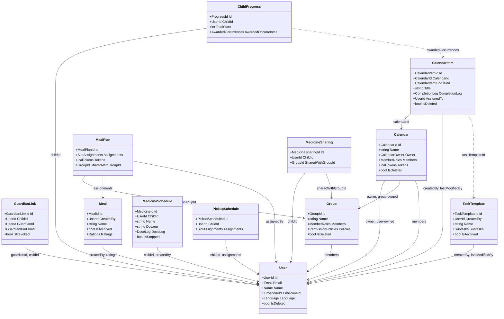

# Backend domain model diagram

A UML-style class diagram of every event-sourced aggregate root in the
backend. This is a companion to
[Aggregate roots and their relationships](aggregate-roots.md), which is the
source of truth for the exact stored references and the reasoning behind
each modeling choice — read that first if you're changing the model. This
doc just renders the same aggregates as classes with their key fields.

There's no shared `AggregateRoot` base type. Each aggregate is a sealed
record in a `Features/<Feature>/Types/` folder with a static `Rehydrate`
factory that folds its event stream into current state. Fields below are
simplified from the real immutable collection types for readability — for
example `MemberRoles` stands in for
`ImmutableDictionary<UserId, GroupRole>`.

Solid arrows are a stored reference (the tail aggregate holds the head
aggregate's id). Dashed arrows are relationships resolved at read time
instead of stored.

A few modeling choices worth knowing before touching this: a child isn't its
own type — it's a `User` pointed at by a `GuardianLink`. Family sharing is
computed, not stored — `Meal` and `MealPlan` carry no child id at all; which
family a meal plan belongs to is resolved at read time from the
`GuardianLink` graph. `MedicineSchedule` and `PickupSchedule` make the
opposite call and store `ChildId` directly, since each belongs to exactly
one child.
