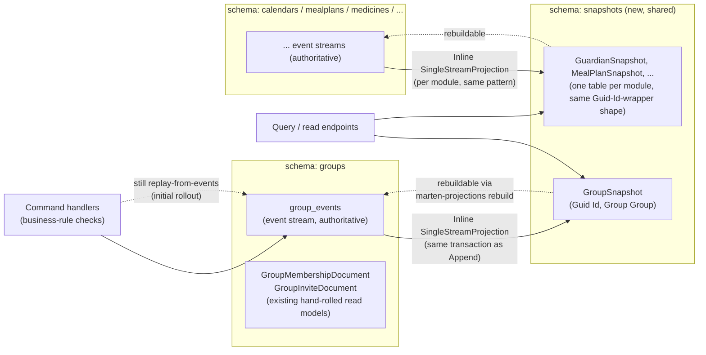

# Event-Stream Snapshots

Status: Implemented for all 14 event-sourced aggregates across all 9 modules. Questions 1-5
below are resolved with what was actually built, including several real Marten/serialization
constraints hit along the way that the original plan only flagged as possibilities — plus two
more found during the full rollout (a `ValueTuple`-keyed dictionary/set gotcha, and a
discriminated-union JSON-shape collision in `Calendars`), documented in a new Question 6 below.
Full test suite: 438/438 passing. See [TODO.md](../../../TODO.md) for the per-aggregate
handler-cutover checklist and follow-ups not done here (backfill tooling, a few aggregates with
no single-get handler to cut over).

## Context

Every module (`Guardians`, `Calendars`, `Groups`, `Mealplans`, `Medicines`,
`Pickups`, `Progress`, `TaskLibrary`, `Users`) owns its own Marten store and
its own Postgres schema (`options.DatabaseSchemaName = "groups"`, etc. — see
e.g. [`Features/Groups/GroupsFeature.cs`](../../../src/backend/buddy/Features/Groups/GroupsFeature.cs)).
Aggregates are plain immutable records with a static fold,
e.g. `Group.Rehydrate(IEnumerable<GroupEvent> events)`
([`Features/Groups/Types/Group.cs`](../../../src/backend/buddy/Features/Groups/Types/Group.cs)),
and every command handler re-reads and re-folds the *entire* stream from
event 1 on every request — there is no caching or snapshotting anywhere
today. The only existing read-model precedent is a set of hand-rolled Marten
"documents" (`GroupMembershipDocument`, `GuardianLinkDocument`,
`MedicineIndexDocument`, ...) that individual event stores update by hand,
inline, in the same session as the event append
(see `MartenGroupEventStore.AppendAsync`).

The ask: add a snapshot of current aggregate state per stream, for quicker
lookups, without weakening events as the single source of truth — snapshots
must always be derivable from (and rebuildable from) the event stream, never
an independent fact. Snapshots should live in a schema separate from the
event-sourcing schemas.

## Question 1: hand-roll parallel snapshot documents, or use Marten's built-in snapshot projections?

**Decision: use Marten's built-in snapshot-projection feature**
(`SingleStreamProjection<TDoc, TId>`, registered via `options.Projections.Register(...)`
— see Question 5 for why `Register` and not the `Projections.Snapshot<T>()`
convenience method the original plan assumed), not a hand-rolled write
alongside each `AppendAsync`, even though the existing `*Document` pattern
shows the codebase is comfortable hand-rolling read models.

Reasoning:

- Marten projections are *definitionally* derived state — they're rebuilt
  from the event stream by the same daemon/tooling regardless of how they
  got out of date, which is a stronger and more literal guarantee of "events
  stay authoritative" than a hand-written upsert call that a future author
  could forget to add when a new event type is introduced.
- Marten's event stream already holds the raw unwrapped event records
  (`GroupCreated`, `GroupMemberRoleGranted`, ...) rather than the `GroupEvent`
  union wrapper — `MartenGroupEventStore.CreateAsync`/`AppendAsync` pass
  `e.Value` (the unwrapped payload) to `session.Events.StartStream`/`Append`.
  That means Marten's reflection-based `Apply`/`Create` dispatch on a
  projection class works directly against the existing event types with no
  new event shapes.
- Less code to maintain across 9 modules than 9 more copies of the
  hand-rolled upsert-per-event-type pattern, and it comes with rebuild
  tooling for free (see Question 5).

## Question 2: what schema do snapshot documents live in?

**Decision: a single shared `snapshots` schema, used by all 9 modules**,
each contributing one table (one per aggregate type) — not a
`<module>_snapshots` schema per module.

Reasoning: the event-sourcing schemas are already split per module because
each module's *event* data is genuinely separate and a candidate for future
microservice extraction. Snapshots are a cross-cutting concern layered on
top for read performance, not a domain boundary — one schema keeps "where do
I look for current-state lookups" a single, simple answer, and keeps
permissioning/backup policy for snapshot tables (rebuildable, disposable) in
one place, distinct from the authoritative event tables. Each module's
`StoreOptions` gets two extra lines (see Question 5 for why the projection
is registered explicitly rather than via `Snapshot<Group>()`, and why the
document type is `GroupSnapshot`, not `Group` itself):

```csharp
options.Projections.Register(new GroupSnapshotProjection(), ProjectionLifecycle.Inline);
options.Schema.For<GroupSnapshot>().DatabaseSchemaName("snapshots");
```

Multiple modules' `StoreOptions` pointing at the same physical `snapshots`
schema is safe as long as each module's snapshot document type is distinct
(it is — `GroupSnapshot`, `GuardianSnapshot`, `MealPlanSnapshot`, ... don't
collide). Confirmed in Postgres after the `Groups` pilot: `groups` and
`snapshots` are separate schemas, and `snapshots.mt_doc_groupsnapshot` holds
one row per group, upserted in the same transaction as every event append.

## Question 3: projection lifecycle — Inline or Async?

**Decision (default to start): `Inline`.** The snapshot upsert happens in
the *same* Marten session/transaction as `session.Events.Append(...)`,
matching the existing synchronous document-write pattern in
`MartenGroupEventStore.AppendAsync` exactly — no eventual-consistency window,
no need to stand up Marten's async-daemon hosted service.

`Async` (background daemon, eventual consistency, no write-path latency) is
a reasonable follow-up for any module where inline snapshot writes turn out
to add meaningful latency to hot command paths — worth revisiting per
module once there's real traffic data, not deciding upfront for all 9.

## Question 4: refactor needed before this works — extracting a step function

Every aggregate's `Rehydrate` is a `foreach` + `switch` that folds a full
event list (e.g. `Group.cs:19-50`). Marten's projection needs a single-event
step, so each aggregate needs its fold body split out. Done for `Group` as
[`Group.Fold`](../../../src/backend/buddy/Features/Groups/Types/Group.cs):

```csharp
public static Group? Fold(Group? group, GroupEvent @event) => @event switch
{
    GroupCreated created => new Group(...),
    GroupMemberRoleGranted granted => group! with { Members = ... },
    ...
};

public static Group? Rehydrate(IEnumerable<GroupEvent> events) =>
    events.Aggregate((Group?)null, Fold);
```

One naming gotcha found while implementing this: the step function must
**not** be named `Apply` or `Create` on the aggregate/document type itself.
JasperFx's projection source generator scans any type used as a projection
document (`Group` is, via `GroupSnapshotProjection`) for methods named
`Apply`/`Create` as a *self-aggregation* convention, and misinterprets a
same-named static helper with the wrong signature — the resulting generated
`Evolver` fails to compile (`cannot convert from 'object' to 'Group?'`).
`Fold` avoids the collision; the projection class's own `Apply`/`Create`
overloads (a different type, `GroupSnapshotProjection`) are the ones the
generator is meant to find.

## Question 5: strongly-typed IDs as Marten document identity

Resolved, and it took two real fixes beyond what was expected:

**5a. `Projections.Snapshot<T>()` doesn't work for a strongly-typed id.**
The convenience method tries to auto-derive the document's identity type via
reflection, and throws `ArgumentNullException` out of `Type.MakeGenericType`
for any id shape it doesn't recognize. Fix: register the projection
instance explicitly instead —
`options.Projections.Register(new GroupSnapshotProjection(), ProjectionLifecycle.Inline)` —
which needs no auto-derivation since the concrete `SingleStreamProjection<TDoc, TId>`
subclass already pins both type parameters at compile time.

**5b. Marten's document identity (a different code path from the event-stream
identity unwrapping used for aggregate fetches) only recognizes a plain
`Guid`/`string`/`int`/`long`, or a wrapper **struct** (`readonly record struct
PaymentId(Guid Value)`), as a document's `Id`.** `GroupId` in this codebase
is a `sealed record` — a *class*, not a struct — and `Group.Id : GroupId`
made Marten's `DocumentMapping.CompileAndValidate()` fail with `Could not
determine an 'id/Id' field or property for requested document type
buddy.Features.Groups.Group`. Confirmed in isolation: the identical shape
with `readonly record struct` instead of `sealed record` works out of the
box; the class-based version doesn't, with or without an explicit
`.Identity(...)` mapping (a projected/nested member expression like `x =>
x.Id.Value` is rejected: "not valid as an id column in Marten").

Converting every strongly-typed id in the codebase from a class to a struct
was out of scope for this pilot (it's a cross-cutting change touching
nullability semantics everywhere those ids are used, not a snapshot
concern). Instead, `Group` itself is **not** the Marten document. A thin
wrapper carries the plain `Guid` Marten needs alongside the real value —
[`GroupSnapshot`](../../../src/backend/buddy/Features/Groups/Types/GroupSnapshotProjection.cs):

```csharp
public sealed record GroupSnapshot(Guid Id, Group Group);

public sealed class GroupSnapshotProjection : SingleStreamProjection<GroupSnapshot, Guid>
{
    public GroupSnapshot Create(GroupCreated created) =>
        new(created.GroupId.Value, Group.Fold(null, GroupEvent.FromPayload(created))!);

    public GroupSnapshot Apply(GroupSnapshot current, GroupMemberRoleGranted granted) =>
        current with { Group = Group.Fold(current.Group, GroupEvent.FromPayload(granted))! };
    // ... one Apply overload per event type that changes Group's own fields
}
```

`FindSnapshotAsync` unwraps it: `(await session.LoadAsync<GroupSnapshot>(groupId.Value, ct))?.Group`.
`GroupId` itself is untouched everywhere else in the codebase — this
wrapper exists purely at the snapshot-storage boundary, one per module.

**5c. A second, unrelated serialization gap surfaced by actually persisting
`Group` for the first time.** `Group.Members` is an
`ImmutableDictionary<UserId, GroupRole>` — a strongly-typed id used as a
*dictionary key*. Nothing before this had ever JSON-serialized `Group` (its
state only ever existed as an in-memory `Rehydrate` result), so this path
was never exercised. `StronglyTypedIdJsonConverterFactory`
(`src/backend/buddy/Serialization/StronglyTypedIdJsonConverterFactory.cs`)
only implemented `Read`/`Write`, not `ReadAsPropertyName`/`WriteAsPropertyName`,
so `System.Text.Json` refused the dictionary with `NotSupportedException:
... is not a supported dictionary key`. Fixed by adding both overrides to
the shared converter — a real gap in a shared utility, not something
specific to snapshots, so it benefits every future JSON path that keys a
dictionary by a strongly-typed id, not just this one.

## Question 6: two more serialization gotchas found during the full rollout

Rolling out to the other 8 modules surfaced two more real constraints, neither anticipated by
the pilot (`Group` didn't happen to have either shape):

**6a. `ValueTuple`-keyed dictionaries and sets.** Several aggregates use a composite
`(DateOnly, ...)`-style tuple as a dictionary key or hash-set element —
`CalendarItem.CompletionLog`, `MedicineSchedule.DoseLog`, `MealPlan.Assignments`,
`MealplanAiSession.Draft`, `PickupSchedule.Assignments`, `ChildProgress.AwardedOccurrences`.
Plain `System.Text.Json` either throws `NotSupportedException` (as a dictionary key) or —
worse — silently serializes the tuple as an empty JSON object `{}` (as a plain value/set
element, since a `ValueTuple`'s `ItemN` are public fields, not properties, and `System.Text.Json`
only serializes properties by default). The second failure mode is a real, silent data-loss trap:
no exception, just an empty object where real data should be. Fixed with a new
[`ValueTupleJsonConverterFactory`](../../../src/backend/buddy/Serialization/ValueTupleJsonConverterFactory.cs)
(same shape as `StronglyTypedIdJsonConverterFactory`: writes/reads the tuple as a JSON array,
and encodes that same array as the property-name string for dictionary-key use), registered
per-module alongside `StronglyTypedIdJsonConverterFactory` wherever an aggregate needs it, plus
one line in `Program.cs`'s `ConfigureHttpJsonOptions` for any HTTP response that returns such an
aggregate directly. Verified with an explicit round-trip assertion (not just incidental
equivalence-check coverage) in `ChildProgressSnapshotTests.cs`, since `AwardedOccurrences` is
exactly the "3-tuple hash-set element" shape most likely to silently lose data.

**6b. A discriminated union whose cases share a JSON shape.** `Calendar.Owner` is `CalendarOwner`,
a closed `union` with two cases, `User(UserId Value)` and `Group(GroupId Value)`. Both `UserId`
and `GroupId` flatten to a bare `Guid` via `StronglyTypedIdJsonConverterFactory`, so both cases
serialize to the *identical* JSON shape `{"Value": "<guid>"}` — the union's own type-classifier
deserialization can't tell them apart ("JSON value type 'Object' is ambiguous for union type").
This was latent and undetected before snapshots: `Calendar` was never JSON-round-tripped
anywhere (it's not part of any event payload, and no API response DTO exposes `Owner`), so it
only surfaced once `CalendarSnapshot` made `Calendar` itself a Marten-stored, serialized
document. Fixing it took two changes:
- `StronglyTypedIdJsonConverterFactory` was accidentally also matching the union's nested case
  types (`CalendarOwner.User`/`.Group`, which have the same "single ctor param named `Value`"
  shape as a genuine id wrapper), stripping their object shape entirely. Fixed by excluding
  nested types (`type.DeclaringType is not null → not a match`) — every genuine strongly-typed
  id in this codebase is a top-level type, so this doesn't affect any of them.
- Even with that fixed, the union's *default* shape-based classifier still can't disambiguate
  two cases that happen to serialize identically. `Features/Pickups/Types/PickupAssigneeKind.cs`
  had already hit this exact class of problem and deliberately avoided a union over it. Since
  reshaping `CalendarOwner` itself would be a much larger, riskier change (touching
  `CalendarAuthorization` and every handler that pattern-matches it), the fix instead is a small,
  narrowly-scoped
  [`CalendarOwnerJsonConverter`](../../../src/backend/buddy/Features/Calendars/Types/CalendarOwnerJsonConverter.cs)
  (an explicit `{"Kind":"User"|"Group","Id":"<guid>"}` shape), registered only on the `Calendars`
  module's `StoreOptions` — it doesn't touch `CalendarOwner`'s C# shape or any other module.
  Worth checking for if any *other* module's union ever needs to be JSON-serialized directly in
  the future (none currently do outside their own event payloads, which don't hit this because
  individual event records don't share this kind of case-ambiguity).

## Rollout: pilot on one module first, then the rest in parallel

**Decision: `Groups` is the pilot module.** Moderate event count (10 event
types), and it already has a working parallel-document pattern
(`GroupMembershipDocument`) to compare the new snapshot against for
correctness during development. Prove out the full recipe — refactor,
projection class, schema routing, backfill, read-path cutover, tests — on
`Groups` alone first.

That done, the remaining 8 modules (`Calendars`, `Guardians`+`Users`,
`Mealplans`+`AiAssistant`, `Medicines`, `Pickups`, `Progress`, `TaskLibrary`)
were implemented in parallel, one task per module (two modules paired up
where they share a single Marten store: `Guardians`+`Users`, and
`Mealplans`+`AiAssistant`), each following the same recipe independently.
See Question 6 above for the two additional gotchas that surfaced only once
every module's actual field shapes were exercised, not just `Group`'s.

## Backfilling existing streams

Streams that predate this feature have no snapshot row yet. Before any read
path is switched to depend on snapshots for a module, run Marten's
projection rebuild for that module's snapshot projection — either the
`Marten.CommandLine` `dotnet run -- marten-projections rebuild` tool, or an
explicit one-off call to `IProjectionDaemon.RebuildProjection<T>` — so every
existing stream gets a snapshot before it's relied on.

## Cutting over reads before writes

Done for the pilot: `IGroupEventStore.FindSnapshotAsync` does
`session.LoadAsync<GroupSnapshot>(groupId.Value, ct)` and unwraps `.Group`;
`GetGroupHandler` (`Features/Groups/GetGroup/GetGroup.Handler.cs`) now calls
it instead of `ReadAsync` + `Rehydrate`. Verified against a real Postgres
(both manually via `curl` and via the full `buddy.IntegrationTests` suite,
424/424 passing beforehand, 425/425 after adding the snapshot-consistency
test below) that the response is unchanged.

Every other `Groups` command handler (`CreateGroup`, `SetGroupMemberRole`,
`DeleteGroup`, ...) is untouched and still replays from events — `Rehydrate`
still exists and is still what they call, `Fold` is just the shared step it
now delegates to. Switching a write-path handler's read to the snapshot is a
separate decision to make per handler, not something this pilot did
everywhere at once.

## Testing

Added `buddy.IntegrationTests/SnapshotTests/GroupSnapshotTests.cs` (a new
top-level `SnapshotTests/` folder, parallel to the existing `EventShapeTests/`,
since this is a cross-cutting concern rather than a single use case): runs a
sequence of commands (create, grant a role, revoke it) against a real
Postgres via the existing Testcontainers fixture, then asserts
`FindSnapshotAsync(id)` is `Assert.Equivalent(..., strict: true)` to
`Group.Rehydrate(await ReadAsync(id))` — plain `Assert.Equal` doesn't work
here because `ImmutableDictionary<TKey,TValue>` has no structural `Equals`
override, so two `Group` values with identical `Members` content aren't
`==`-equal; `Assert.Equivalent` does a deep, member-wise comparison instead.

Not yet done, left for the full rollout: a rebuild test (delete/reset the
snapshot table, rebuild, assert it matches again — no rebuild tooling is
wired up yet, see "Backfilling existing streams" above) and a golden-file
shape test for the snapshot document analogous to `EventShapeTests/`.

## Diagram


