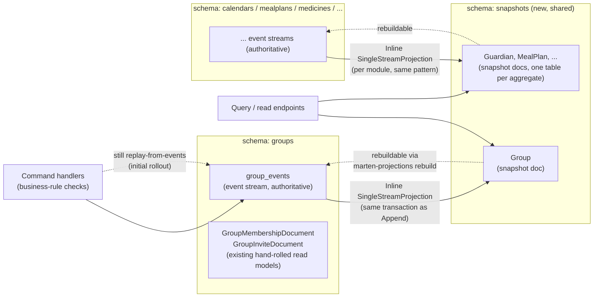

# Event-Stream Snapshots

Status: Proposed (not yet implemented)

## Context

Every module (`Guardians`, `Calendars`, `Groups`, `Mealplans`, `Medicines`,
`Pickups`, `Progress`, `TaskLibrary`, `Users`) owns its own Marten store and
its own Postgres schema (`options.DatabaseSchemaName = "groups"`, etc. — see
e.g. [`Features/Groups/GroupsFeature.cs`](../../../src/backend/buddy/Features/Groups/GroupsFeature.cs)).
Aggregates are plain immutable records with a static fold,
e.g. `Group.Rehydrate(IEnumerable<GroupEvent> events)`
([`Features/Groups/Types/Group.cs`](../../../src/backend/buddy/Features/Groups/Types/Group.cs)),
and every command handler re-reads and re-folds the *entire* stream from
event 1 on every request — there is no caching or snapshotting anywhere
today. The only existing read-model precedent is a set of hand-rolled Marten
"documents" (`GroupMembershipDocument`, `GuardianLinkDocument`,
`MedicineIndexDocument`, ...) that individual event stores update by hand,
inline, in the same session as the event append
(see `MartenGroupEventStore.AppendAsync`).

The ask: add a snapshot of current aggregate state per stream, for quicker
lookups, without weakening events as the single source of truth — snapshots
must always be derivable from (and rebuildable from) the event stream, never
an independent fact. Snapshots should live in a schema separate from the
event-sourcing schemas.

## Question 1: hand-roll parallel snapshot documents, or use Marten's built-in snapshot projections?

**Decision: use Marten's built-in snapshot-projection feature**
(`SingleStreamProjection<TDoc, TId>` + `options.Projections.Snapshot<T>(...)`),
not a hand-rolled write alongside each `AppendAsync`, even though the
existing `*Document` pattern shows the codebase is comfortable hand-rolling
read models.

Reasoning:

- Marten projections are *definitionally* derived state — they're rebuilt
  from the event stream by the same daemon/tooling regardless of how they
  got out of date, which is a stronger and more literal guarantee of "events
  stay authoritative" than a hand-written upsert call that a future author
  could forget to add when a new event type is introduced.
- Marten's event stream already holds the raw unwrapped event records
  (`GroupCreated`, `GroupMemberRoleGranted`, ...) rather than the `GroupEvent`
  union wrapper — `MartenGroupEventStore.CreateAsync`/`AppendAsync` pass
  `e.Value` (the unwrapped payload) to `session.Events.StartStream`/`Append`.
  That means Marten's reflection-based `Apply`/`Create` dispatch on a
  projection class works directly against the existing event types with no
  new event shapes.
- Less code to maintain across 9 modules than 9 more copies of the
  hand-rolled upsert-per-event-type pattern, and it comes with rebuild
  tooling for free (see Question 5).

## Question 2: what schema do snapshot documents live in?

**Decision: a single shared `snapshots` schema, used by all 9 modules**,
each contributing one table (one per aggregate type) — not a
`<module>_snapshots` schema per module.

Reasoning: the event-sourcing schemas are already split per module because
each module's *event* data is genuinely separate and a candidate for future
microservice extraction. Snapshots are a cross-cutting concern layered on
top for read performance, not a domain boundary — one schema keeps "where do
I look for current-state lookups" a single, simple answer, and keeps
permissioning/backup policy for snapshot tables (rebuildable, disposable) in
one place, distinct from the authoritative event tables. Each module's
`StoreOptions` gets one extra line:

```csharp
options.Projections.Snapshot<Group>(SnapshotLifecycle.Inline);
options.Schema.For<Group>().DatabaseSchemaName("snapshots");
```

Multiple modules' `StoreOptions` pointing at the same physical `snapshots`
schema is safe as long as each module's snapshot document type is distinct
(it is — `Group`, `Guardian`, `MealPlan`, ... don't collide).

## Question 3: projection lifecycle — Inline or Async?

**Decision (default to start): `Inline`.** The snapshot upsert happens in
the *same* Marten session/transaction as `session.Events.Append(...)`,
matching the existing synchronous document-write pattern in
`MartenGroupEventStore.AppendAsync` exactly — no eventual-consistency window,
no need to stand up Marten's async-daemon hosted service.

`Async` (background daemon, eventual consistency, no write-path latency) is
a reasonable follow-up for any module where inline snapshot writes turn out
to add meaningful latency to hot command paths — worth revisiting per
module once there's real traffic data, not deciding upfront for all 9.

## Question 4: refactor needed before this works — extracting a step function

Every aggregate's `Rehydrate` is a `foreach` + `switch` that folds a full
event list (e.g. `Group.cs:19-50`). Marten's projection needs a single-event
step, so each aggregate needs its fold body split out:

```csharp
public static Group? Apply(Group? current, GroupEvent @event) => @event switch
{
    GroupCreated created => new Group(...),
    GroupMemberRoleGranted granted => current! with { Members = ... },
    ...
};

public static Group? Rehydrate(IEnumerable<GroupEvent> events) =>
    events.Aggregate((Group?)null, Apply);
```

This is a pure refactor (no behavior change) done once per aggregate, and
the resulting `Apply` is what each module's new
`XSnapshotProjection : SingleStreamProjection<X, Guid>` calls from its
`Create`/`Apply` overloads.

## Question 5: strongly-typed IDs as Marten document identity

Aggregates use wrapper ID types (`GroupId`, not `Guid`) as their `Id`
property. Marten's document identity needs to resolve that to a storable
key. To confirm at implementation time: whether the existing
`StronglyTypedIdJsonConverterFactory` (used today only for JSON
serialization, see `GroupsFeature.cs:52-54`) is sufficient, or whether an
explicit Marten identity/value mapping is needed per ID type. Not expected
to be hard, but it's a real per-aggregate detail, not boilerplate — flagging
rather than assuming.

## Rollout: pilot on one module first

**Decision: `Groups` is the pilot module.** Moderate event count (10 event
types), and it already has a working parallel-document pattern
(`GroupMembershipDocument`) to compare the new snapshot against for
correctness during development. Prove out the full recipe — refactor,
projection class, schema routing, backfill, read-path cutover, tests — on
`Groups` alone, then repeat identically across the remaining 8 modules
(`Calendars`, `Guardians`, `Mealplans`, `Medicines`, `Pickups`, `Progress`,
`TaskLibrary`, `Users`).

## Backfilling existing streams

Streams that predate this feature have no snapshot row yet. Before any read
path is switched to depend on snapshots for a module, run Marten's
projection rebuild for that module's snapshot projection — either the
`Marten.CommandLine` `dotnet run -- marten-projections rebuild` tool, or an
explicit one-off call to `IProjectionDaemon.RebuildProjection<T>` — so every
existing stream gets a snapshot before it's relied on.

## Cutting over reads before writes

Add a `FindSnapshotAsync`/`GetAsync` method on each `I<Module>EventStore`
doing `session.LoadAsync<Group>(id)`, and point read/query endpoints at it
in place of `ReadAsync` + `Rehydrate` — this is the actual "quicker lookup"
win.

Command handlers that evaluate business rules before appending new events
should stay on the existing replay-from-events path initially, even though
`Inline` lifecycle makes the snapshot transactionally consistent and
therefore *safe* to trust for that too. Switching write-path reads to the
snapshot is a separate decision to make per handler once the read-path
cutover has proven the snapshot correct in production, not something to
flip everywhere at once alongside the initial rollout.

## Testing

Following the existing `buddy.IntegrationTests` convention (real Postgres
via Testcontainers, tests colocated under `Features/<Module>/`):

- Per module: an integration test asserting
  `session.LoadAsync<Group>(id) == Group.Rehydrate(events)` after a sequence
  of commands against a fresh stream.
- A rebuild test: delete/reset the snapshot table, run the rebuild, assert
  the snapshot matches the replayed aggregate again.
- Consider a golden-file shape test for each snapshot document, analogous to
  the existing `EventShapeTests/`, so a schema drift in the snapshot shape
  is caught the same way event-shape drift is caught today.

## Diagram


