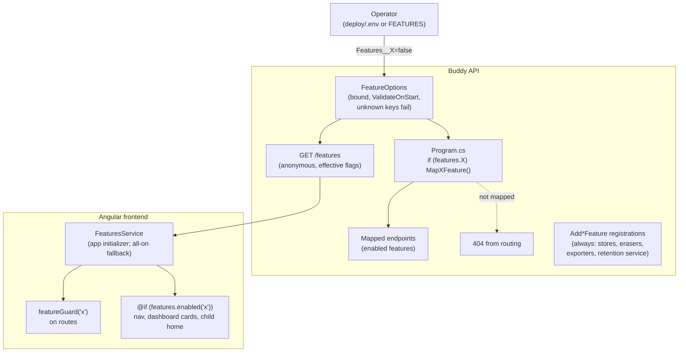

# Feature Flags

Status: Implemented. `FeatureOptions` (`Features:*`, unknown keys fail startup) and `FeatureFlagsFeature` in `Common/FeatureFlags/`: `Program.cs` skips the `Map*Feature` call of a disabled feature (and `MapMealplansFeature` / `MapCalendarsFeature` their sub-flagged endpoints), and the anonymous `GET /features` (`GetFeatures`, response `InstallationFeatures`) reports the effective flags. Frontend: `FeaturesService` (loaded with `fetch` after the runtime config), `featureGuard` on every flagged route, and hidden links, cards, sections, onboarding steps, help topics and print row kinds. Deploy: `Features__*` in `deploy/.env`, `FEATURES` for Azure. `FeatureFlagsTests`, `feature-routes.spec.ts`.

## Context

Every Buddy installation ships every feature. A family that doesn't give medicine has a
Medicine page, a "doses today" card on the dashboard and a doses section in the child's day view,
all of them empty. A family that doesn't want their meal library sent to an LLM can't remove the AI
assistant. They can only leave it unconfigured, and the "AI assistant" link stays on the meal plan
page. The [TODO](../../../TODO.md) item asks for flags so each installation can turn features on or
off, for example the AI meal assistant, medicines or printing.

Buddy is hosted per family. Each family runs its own instance, and a technical family member
deploys and operates it ([gdpr-data-protection.md](gdpr-data-protection.md) makes the same
assumption when it leaves access history to the operator's logs). That person decides what the
installation offers, and the place they already make that kind of decision is deployment
configuration: `deploy/.env` for Docker Compose and the `API_ENV_VARS` array in
[`deploy/azure/deploy.sh`](../../../deploy/azure/deploy.sh).

Nothing like this exists today. The closest precedents:

- **Options validated at startup.** Every options class binds through
  [`ValidatedOptions.AddValidatedOptions`](../../../src/backend/buddy/Common/Configuration/ValidatedOptions.cs),
  and [`RateLimitingOptions`](../../../src/backend/buddy/Common/RateLimiting/RateLimitingOptions.cs)
  adds a cross-field `.Validate(o => o.IsValid())` on top.
- **An anonymous endpoint that reports facts about the installation.**
  [`VersionEndpoint`](../../../src/backend/buddy/Common/Versioning/VersionEndpoint.cs) (`GET /version`)
  serves the build version to deploy checks and to the profile menu.
- **Per-installation frontend settings.** `repositoryUrl` in
  [`runtime-config.service.ts`](../../../src/frontend/buddy/src/app/core/runtime-config.service.ts) is
  optional and blank means the default. The Dockerfile bakes it into `runtime-config.json` at
  image build time.

This document answers six questions: where flags live, which features get one, what "off" means for
data and wiring, how the backend enforces a flag, how the frontend learns and applies flags, and how
features that depend on each other behave.

## Question 1: where do flags live?

**Decision: server configuration, a `Features` section bound to `FeatureOptions` and validated at
startup. There is no admin screen.**

```csharp
// Common/FeatureFlags/FeatureOptions.cs
public sealed class FeatureOptions
{
    public const string SectionName = "Features";

    public bool Mealplans { get; init; } = true;
    public bool MealplanAiAssistant { get; init; } = true;
    public bool MealplanImport { get; init; } = true;
    public bool Medicines { get; init; } = true;
    public bool SleepDiary { get; init; } = true;
    public bool Pickups { get; init; } = true;
    public bool Babysitters { get; init; } = true;
    public bool WorkLocations { get; init; } = true;
    public bool Printing { get; init; } = true;
    public bool Progress { get; init; } = true;
    public bool TaskLibrary { get; init; } = true;
    public bool Help { get; init; } = true;
}
```

The operator turns a feature off with an environment variable such as `Features__Medicines=false`.

- **Every flag defaults to `true`.** An existing installation that upgrades without touching its
  configuration keeps every feature. That matches how `RateLimitingOptions` and
  `AiAssistantModelOptions` rely on class defaults and are absent from `appsettings.json`.
- **A misspelt key fails startup.** The binder normally ignores unknown keys, so
  `Features__Medecines=false` would silently leave medicines on. `FeatureOptions` binds with
  `BinderOptions.ErrorOnUnknownConfiguration = true`. Like every other options class, it validates on
  start (`ValidateOnStart`), so the container fails to start with the bad key named in the log.
  That's the same "fail at startup, not at first use" rule `ValidatedOptions` was written for.
- **Docker Compose needs no compose change.** The API service already loads `env_file: .env`
  ([`docker-compose.prod.yml`](../../../deploy/docker-compose.prod.yml)), so a `Features__*` line in
  `deploy/.env` reaches the API. `deploy/.env.example` gets a commented block that lists every flag.
- **Azure** gets an optional `FEATURES` variable in `deploy/azure/.env.example`, with comma-separated
  `Name=false` pairs. `deploy.sh` expands them into `Features__<Name>=false` entries in
  `API_ENV_VARS`, the same way it already adds the `Mail__*` entries only when mail is configured.

Rejected:

- **An admin setting in the app** (an event-sourced `InstallationSettings` aggregate toggled on
  `/guardian/admin`). A multi-family installation would need a new "installation admin" role that
  Buddy doesn't have, since every guardian is equal. It would also add a new aggregate, schema and
  screen for a decision the operator makes once. The operator-over-app-screens principle settled the
  same trade-off for access history.
- **Config plus an admin override.** This means building both, for no case that a family with an
  operator actually has.
- **Per-group or per-user flags.** "This family doesn't use medicine" is already expressed by not
  creating medicine schedules. Flags remove features from the installation. They don't personalise
  it.

## Question 2: which features get a flag?

**Decision: one flag per optional domain, plus two sub-flags inside meal plans. Users, guardians,
groups, calendars, privacy and onboarding are core and can't be turned off.**

| Flag | Backend scope | Frontend scope |
|---|---|---|
| `Mealplans` | `/mealplans` group, including the meal plan iCal feed | `/guardian/mealplan*`, `/child/mealplan`, dashboard `mealplan-today`, child home meals, onboarding meal step |
| `MealplanAiAssistant` | The 11 AI endpoints in [`MapMealplansFeature`](../../../src/backend/buddy/Features/Mealplans/MealplansFeature.cs) (`MapListProviders` … `MapDiscardAiSession`) | `/guardian/mealplan/ai-assistant`, its link on the meal plan page, the AI provider section on `/guardian/admin` |
| `MealplanImport` | The 8 `*MealPlanImport*` endpoints | `/guardian/mealplan/import` and its link |
| `Medicines` | `/medicines` group | `/guardian/medicine`, `doses-today` card, child home doses |
| `SleepDiary` | `/sleep-diary` group, including the anonymous shared view | `/guardian/sleep-diary`, `/shared/sleep-diary/:token` |
| `HouseRules` | `/house-rules` group | `/guardian/house-rules` and its print pages, `/child/rules`, the child home "rules to read" card (frontend not built yet; see [house-rules.md](house-rules.md#feature-flag)) |
| `Pickups` | `/pickups` group | `/guardian/pickup`, `pickup-today` card, child home pickups |
| `Babysitters` | `/babysitters` group | `/guardian/babysitters`, babysitter links and assignee options in pickups |
| `WorkLocations` | `/work-locations` group | `/guardian/work-locations` |
| `Printing` | `/print-templates` group | `/guardian/print*`, `/guardian/print/sheet/:templateId`, the print link on the dashboard |
| `Progress` | `/progress` group | `/guardian/progress`, child progress views |
| `TaskLibrary` | `/task-templates` group, plus `ScheduleTaskFromTemplate`, which lives in the `/calendars` group | `/guardian/task-library`, "schedule from library" in the calendar |
| `Help` | none (frontend only) | the `?` help panel in the guardian shell, `/guardian/help` |

- **Sub-flags only where the TODO names a reason.** The AI assistant sends family data to a
  third-party LLM, which is the sharpest reason a family has to switch something off
  ([gdpr-data-protection.md](gdpr-data-protection.md)). Import is a one-off migration tool that a
  family may want gone once it's done. Other capabilities inside a feature, such as group sharing and
  iCal tokens, stay with their parent flag.
- **Calendars stay core.** Tasks, events, the child agenda, task completion and progress all hang
  off calendar items. A Buddy without a calendar has no day view.
- **`Help` is in the same section even though it is frontend-only.** The operator then has a single
  place for "what does this installation show", and `GET /features` (Question 5) carries it to the
  frontend.

## Question 3: what does "off" mean for data and wiring?

**Decision: off hides the feature and keeps its data. Every `Add<X>Feature` registration stays.
Only the HTTP surface and the UI go away. Turning the flag back on brings back everything as it
was.**

- **Registrations stay because other code depends on them.** Pickups reads
  `IBabysitterListEventStore`, and `PrintTemplateReferenceChecks` reads the babysitter and
  work-location stores (`Program.cs` documents both orderings). `AddPrivacyFeature` runs every
  feature's `IPersonalDataEraser` and `IPersonalDataExporter` (28 registrations). If a store were
  unregistered, startup would fail or erasure would quietly skip a feature.
- **GDPR still covers disabled features.** A data export includes medicine schedules written before
  medicines was turned off, and erasure removes them. Turning a feature off doesn't turn off the
  family's rights over data it already holds.
- **Background services keep running.** `AiSessionRetentionService` enforces the 30-day AI
  conversation retention, and it has to keep deleting old sessions after the AI assistant is turned
  off. No other hosted service belongs to a flaggable feature.
- **Marten schemas and snapshot projections are unchanged.** A disabled feature's schema stays
  migrated, so turning it back on needs no migration step.

Rejected: **skipping `Add<X>Feature` as well.** It would break the dependency orderings above, and
it would let personal data survive an erasure request. It would save nothing beyond a few unused
singletons.

## Question 4: how does the backend enforce a flag?

**Decision: a disabled feature's endpoints aren't mapped. `Program.cs` skips a whole
`Map<X>Feature` call, and `MapMealplansFeature` and `MapCalendarsFeature` take `FeatureOptions` to
skip their sub-flagged endpoints. Requests to them fall through to ASP.NET Core's routing `404`.**

Before ([`Program.cs:171-183`](../../../src/backend/buddy/Program.cs)):

```csharp
app.MapUsersFeature();
app.MapGuardiansFeature();
app.MapGroupsFeature();
app.MapTaskLibraryFeature();
app.MapCalendarsFeature();
app.MapMedicinesFeature();
app.MapMealplansFeature();
// ...
app.MapSleepDiariesFeature();
```

After:

```csharp
var features = app.Services.GetRequiredService<IOptions<FeatureOptions>>().Value;

app.MapUsersFeature();
app.MapGuardiansFeature();
app.MapGroupsFeature();
app.MapFeatures(features);   // GET /features, see Question 5
if (features.TaskLibrary) app.MapTaskLibraryFeature();
app.MapCalendarsFeature(features);   // skips MapScheduleTaskFromTemplate when TaskLibrary is off
if (features.Medicines) app.MapMedicinesFeature();
if (features.Mealplans) app.MapMealplansFeature(features);   // skips the AI / import blocks
// ...
if (features.SleepDiary) app.MapSleepDiariesFeature();
```

In `MapMealplansFeature`, the two blocks that already have their own comment headers get a guard:

```csharp
if (features.MealplanImport)
{
    mealplans.MapPreviewMealPlanImport();
    // ... 7 more
}

if (features.MealplanAiAssistant)
{
    mealplans.MapListProviders();
    // ... 10 more
}
```

Blast radius: `Program.cs` (12 lines), two `Map*Feature` signatures (`MapMealplansFeature`,
`MapCalendarsFeature`), and the integration-test fixture, which keeps all flags on by default. No
handler, command or endpoint file changes.

- **`404`, not `403` or a new `feature_disabled` code.** From the caller's point of view the
  endpoint doesn't exist on this installation, and that is literally what happened. It matches the
  "can't tell private from missing" `NotFound` collapse used throughout the API. No caller needs to
  tell the difference: the frontend never calls a disabled endpoint because it reads
  `GET /features` first. An old browser tab that does call one gets the same 404 handling it already
  has.
- **The options are read after `Build()`, from DI.** Integration tests override configuration with
  `ConfigurationOverride` in
  [`BuddyApiFixture`](../../../src/backend/buddy.IntegrationTests/Fixtures/BuddyApiFixture.cs), and
  `ValidatedOptions` is documented to validate that overridden value. Reading
  `builder.Configuration` before `Build()` would miss the override.
- **The committed OpenAPI contract stays complete.** `task docs:openapi` runs with the default
  configuration (all on), so `buddy.json` and `buddy-api.ts` keep every endpoint. On an installation
  with a feature off, its OpenAPI document simply lists fewer operations.
- **`ScheduleTaskFromTemplate` answers `405`, not `404`.** Its `POST
  /calendars/{calendarId}/items/from-template` path also matches the template of
  `DELETE /calendars/{calendarId}/items/{itemId:guid}`, and routing rejects the method before it
  checks the guid constraint. Nothing runs either way, and no caller tells the two apart.
- **Disabled iCal feeds return 404.** A calendar app subscribed to the meal plan feed reports the
  subscription as broken. That is the honest answer. When the flag comes back on, the same token
  works again, because tokens are data (Question 3).

Rejected:

- **Map everything, then reject in a filter or middleware** (a `.RequireFeature(Feature.X)` endpoint
  metadata checked by middleware, in the style of
  [`ProvisionedUserMiddleware`](../../../src/backend/buddy/Features/Users/ProvisionedUserMiddleware.cs)).
  It would need a new metadata type, a middleware, its position in the pipeline (before or after
  rate limiting and auth), an OpenAPI transformer entry and a coverage meta test. All of that buys a
  custom status code that no caller needs. Skipping the map does the same thing with an `if`.
- **Checking the flag in Wolverine handlers.** Handlers would have to return a new `Result` case,
  and every handler in a feature would need the check.

## Question 5: how does the frontend learn and apply flags?

**Decision: an anonymous `GET /features` endpoint returns the effective flags. A `FeaturesService`
loads it in an app initializer after the runtime config. A functional `featureGuard` protects routes,
and templates hide links, cards and sections with `@if (features.enabled('medicines'))`.**

```
GET /features   (anonymous, like /version)
200 { "mealplans": true, "mealplanAiAssistant": false, "mealplanImport": true,
      "medicines": false, "sleepDiary": true, ... , "help": true }
```

- **From the API, not baked into `runtime-config.json`.** Flags then live in one place. With a
  build arg, the operator would have to set every flag twice (API environment and frontend build
  args) and rebuild the frontend image to change one. If the two disagreed, the UI would show pages
  whose endpoints answer 404.
- **Anonymous** because the anonymous shared sleep diary page (`/shared/sleep-diary/:token`) needs
  `sleepDiary` before anyone is logged in. The flags say which features an installation offers.
  They aren't secret, and the same facts can be learned by calling the routes. The endpoint stays
  inside the global anonymous rate-limit partition, as `/version` does.
- **Effective values.** The endpoint returns `MealplanAiAssistant && Mealplans` (see Question 6),
  so the frontend never has to apply the dependency rules itself.
- **Loading.** `provideAppInitializer` already awaits `RuntimeConfigService.load()`
  ([`app.config.ts`](../../../src/frontend/buddy/src/app/app.config.ts)). `FeaturesService.load()`
  chains after it, because it needs `apiBaseUrl`. It uses `fetch`, as `RuntimeConfigService` does,
  not `HttpClient`: in an app initializer the auth interceptor's token refresh and `/login` redirect
  would run before the router, for an endpoint that needs no token. If the call fails (API down), or
  gets no answer within 3 seconds (`FEATURES_LOAD_TIMEOUT_MS`), the service falls back to **all on**
  and logs a warning. The backend still enforces the flags, so the worst case is
  a page that shows its usual load error. Blocking the whole app on this call would turn a
  transient API hiccup into a blank screen.
- **`FeaturesService`** exposes `enabled(name): boolean` over a signal of the flags, and
  `offers(item)` for registry entries tagged with an optional `feature` (help topics and sections).
  `FeatureName` is `keyof InstallationFeatures`, the endpoint's DTO generated into `buddy-api.ts` by
  `task docs:openapi`, so a renamed flag fails `tsc`.
- **`featureGuard(name)`** is a `CanActivateFn` factory next to
  [`onboarding.guard.ts`](../../../src/frontend/buddy/src/app/core/onboarding.guard.ts). When the
  feature is off it redirects to `/`, where `roleRedirectGuard` picks the role's home. Every flagged route in
  `guardian.routes.ts`, `child.routes.ts` and `app.routes.ts` gets
  `canActivate: [featureGuard('...')]`.
- **Surfaces to hide.** These are the links and widgets that point into flagged features:
  - the profile menu links (`profile-menu.html`)
  - the dashboard cards and print link (`dashboard.html`)
  - the AI and import links on the meal plan page (`mealplan.html`)
  - the AI provider section on admin
  - the babysitter links and assignee options in pickups (`pickup.html`, `pickup-cell.html`)
  - the child home sections and links (`child/home/home.html`)
  - the onboarding task and meal steps and their summary rows (`offeredSteps` in
    `onboarding.service.ts`; the guide finishes without them)
  - the help `?` button (`Help=false`), and the help topics, sections and related links of disabled
    features (`feature` on the entries in `core/help/help-topics.ts`). A section's text never names
    a feature that can be off unless the section carries that feature's tag: the dashboard's
    meals, pickups, stars and print sections, the pickup babysitter and print sections, and the
    groups topic's meal plan permissions and sharing sections are separate tagged sections. While
    any feature is off, `/guardian/help` says that some parts of Buddy are turned off
    (`FeaturesService.someOff`)
  - the "Meal plan permissions" button in group settings (`manage-groups.html`)
  - "From template" in the calendar's new-task form
  - the progress badges on the child home and the children overview

  Each one gets an `@if` or a filter. A component that loads data for a disabled feature (the child
  home's meals, doses and pickups, the child calendar's meals, onboarding's templates and meal plan,
  the pickup grid's babysitters) skips the request instead of turning its 404 into a load error. A
  disabled feature's page component is never loaded.

Rejected: **putting flags on `GET /users/me`.** It needs authentication, so the shared sleep diary
page couldn't use it. It is also per user, while flags are per installation.

## Question 6: features that depend on each other

**Decision: sub-flags follow their parent, and cross-feature data degrades to "not shown".
Dependencies never fail startup and never force another flag on.**

| Combination | Behavior |
|---|---|
| `Mealplans=false`, `MealplanAiAssistant` / `MealplanImport` left `true` | Effective `false`. The AI and import endpoints live inside the `/mealplans` group, which isn't mapped. `GET /features` reports both as `false`. Startup logs one information line naming the overridden sub-flags. |
| `Babysitters=false`, `Pickups=true` | Pickups works. The assignee picker offers guardians, siblings and self-escort only. Existing pickups assigned to a babysitter still show the babysitter's name, because `ListPickupSchedule` reads `IBabysitterListEventStore` directly, and those registrations stay (Question 3). |
| `Printing=true` with `Mealplans`, `Pickups` or `WorkLocations` off | The template editor doesn't offer `Meal`, `Pickup` or `WorkLocation` rows ([`PrintRowKind`](../../../src/backend/buddy/Features/PrintTemplates/Types/PrintRowKind.cs)). Existing templates keep such rows, and the sheet renders them empty. `week-plan-loader.ts` skips the service call for a disabled feature instead of failing on its 404. The backend still accepts those row kinds, so a template saved earlier stays valid. |
| `TaskLibrary=false` | Tasks already scheduled onto calendars stay ordinary calendar tasks and can still be completed. Only the library page and "schedule from library" go away. |
| `Progress=false` | Task completion still records completions (`SetTaskCompletion` keeps calling into Progress), so progress is up to date if the flag returns. Only the progress pages and endpoints are hidden. |
| `Medicines=false` / `Pickups=false` / `Mealplans=false` and the child day view | The child home omits the matching section. The dashboard omits the matching card. |

Rejected: **failing startup on an inconsistent combination** (as `RateLimitingOptions.IsValid`
does). Every flag defaults to `true`, so turning off `Mealplans` would also force the operator to
turn off its two sub-flags explicitly. The intent of `Mealplans=false` is clear without that.

## Read models

None. Flags are configuration, not events. No aggregate, stream, index document or Marten schema is
added.

## Routes

```
GET /features   GetFeatures   anonymous, global anonymous rate-limit partition
```

The endpoint is mapped by `Common/FeatureFlags/FeatureFlagsFeature.cs`, next to `FeatureOptions`, in
the same shape as `Common/Versioning/VersionEndpoint.cs`. Its response DTO, `InstallationFeatures`,
is a record with one `bool` per flag. It goes in the v1 OpenAPI document with `/health` and
`/version`. Like `/version`, it is on the `RateLimitingCoverageTests` list of anonymous endpoints
that only use the global limit and on the `ETagCoverageTests` exclusion list.

## Frontend

- `core/features.service.ts` + spec (stubbed `fetch`: loads flags, falls back to all-on on error,
  `enabled()`, `offers()`).
- `core/feature.guard.ts` + spec.
- `app.config.ts`: chain `FeaturesService.load()` after the runtime config.
- `@if` guards on the surfaces listed in Question 5, with a spec case in each component's spec.
  `src/testing/features-fixture.ts` has `provideFeatures(...)` and `disableFeatures(...)` for them.
- `feature-routes.spec.ts`: every flagged route lets the navigation through when its feature is on
  and redirects it when the feature is off.
- `week-plan-loader.ts`: a disabled row kind gets an empty source instead of a request.
- No new i18n keys: everything removed is existing text. The print editor's row-kind picker filters
  its existing options.
- `help-coverage.spec.ts` and `screenshot-coverage.spec.ts` are unchanged: routes are still
  declared, only guarded. Screenshots run with every feature on.

## Testing

- **`FeatureFlagsTests`** on a separate host with flags off, the same way `RateLimitingTests` uses a
  low-limit host:
  - a route of every flagged group returns `404`, including the anonymous meal plan iCal feed and
    shared sleep diary
  - `ScheduleTaskFromTemplate` is unmapped with `TaskLibrary=false` (`405`, see Question 4), while
    the rest of `/calendars` works
  - the AI and import endpoints return `404` with only their sub-flag off, while `/mealplans`
    works
  - `GET /features` reflects the overrides and the parent rule
  - the data export still includes a disabled feature's data
  - all `true` by default on the shared fixture, anonymous access, camel-case names
  - startup: an unknown `Features:Medecines` key or a non-boolean value fails host start
- **`FeatureOptionsTests`**, without a host: defaults with no `Features` section, and which
  sub-flags a disabled parent overrides
- **Frontend:** the specs listed above. One e2e spec isn't practical, because the e2e suite runs
  against the shared dev API with every feature on. Coverage of the hiding comes from unit specs.

## Failure and edge-case behavior

| Case | Behavior |
|---|---|
| No `Features` section at all | Every feature on, same as today |
| Misspelt key (`Features__Medecines`) | Host fails at startup and names the key |
| Non-boolean value (`Features__Medicines=no`) | Host fails at startup (binder conversion error) |
| Feature turned off with data in it | Data kept, hidden. Still in GDPR export and erasure. Back as it was when turned on again. |
| Feature turned off while a guardian has its page open | Next API call answers `404`. The page shows its normal load error. A reload sends them home through `featureGuard`. |
| Bookmark or deep link to a disabled page | `featureGuard` redirects to `/`, and `roleRedirectGuard` on to the role's home |
| `GET /features` fails at app start | Frontend treats every feature as on and logs a warning. The backend still enforces. |
| Calendar app polling a disabled meal plan iCal feed | `404`. The same token works again once the feature is back. |
| AI assistant off with an active AI session | Session endpoints `404`. `AiSessionRetentionService` still deletes the session after 30 days. |
| Sub-flag on while its parent is off | Effective `false`, logged once at startup |

## Decisions made

| Question | Decision |
|---|---|
| Where flags live | `Features` configuration section, set by the operator via env vars, validated on start, no admin screen, because each family has an operator and Buddy has no installation-admin role |
| Default | Every flag `true`, so upgrades change nothing |
| Which features | Mealplans (+ AI assistant, import), medicines, sleep diary, house rules, pickups, babysitters, work locations, printing, progress, task library, help. Calendars, users, guardians, groups and privacy are core. |
| What off means | Hide the HTTP surface and UI. Keep registrations, data, GDPR coverage and background services. |
| Backend enforcement | Don't map the disabled endpoints. Routing answers `404`. |
| Frontend source | Anonymous `GET /features`, so the flags have a single source and one image serves every installation |
| Frontend enforcement | `featureGuard` on routes, `@if` on links, cards and sections |
| Dependencies | Sub-flags follow their parent. Cross-feature data degrades to not shown. No startup failure. |
| Azure | One optional `FEATURES` list of `Name=true\|false` pairs in `deploy/azure/.env`, shape-checked by `deploy.sh`, rather than 12 separate keys. Docker Compose reads `Features__*` lines from `deploy/.env` through `env_file`. |

## Remaining open questions

- **Should disabled features also be removed from the per-feature OpenAPI documents served at
  runtime?** They are already gone, because unmapped endpoints aren't described. The lean is to
  leave it at that. The committed contract is generated with everything on.
- **Child-side flags beyond hiding.** A child on an installation with `Mealplans=false` loses the
  `/child/mealplan` page and meal sections. The lean is that this is enough, and a separate
  "available to children" flag per feature isn't needed until a family asks.

## Diagram


