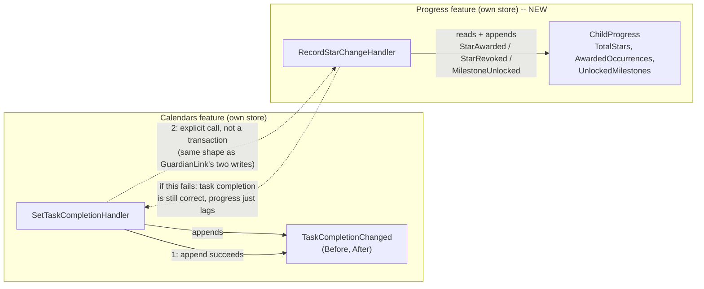

# Gamified Progress for Children's Tasks

Status: Proposed

## Context

Buddy already tracks task completion (`CalendarItem.CompletionLog`, toggled via
`SetTaskCompletion`) and dose completion (`MedicineSchedule.DoseLog`, toggled
via `SetDoseStatus`) per child, but neither carries any notion of reward,
streak, or progress feedback — a completed task and an ignored one look
identical to the child except for a checkmark. Grepping the backend,
frontend, and docs for `streak|reward|points|badge|gamif` returns nothing:
this is genuinely new ground, not an extension of an existing mechanic.

The target audience — children with ADHD, per the app's stated purpose —
narrows the design space more than a generic "add gamification" brief would:

- **Streaks that reset to zero on a single miss are punishing, not
  motivating**, for exactly the population most likely to miss a day. Progress
  should accumulate and never go backwards from an honest completion, except
  to correct a misclick (see "Revoking a star" below).
- **Sibling leaderboards create household conflict** rather than motivation.
  A `Group` can contain multiple children; progress must stay scoped per
  child with no cross-child comparison surface.
- **Feedback should be immediate**, at the moment of `toggleTask()`, not
  delayed to a weekly summary — this is a frontend concern (Phase 2 below)
  but it constrains the backend to make "did something just change" cheap
  and synchronous, not batched.

This document answers three questions: where does progress state live
relative to the existing event-sourced features, how does it learn about
completions without inventing infrastructure the codebase doesn't have, and
what should *not* be modeled yet.

## Question 1: does progress live inside `CalendarItem`/`MedicineSchedule`, or as its own feature?

**Decision: its own feature, `Features/Progress/`, with a `ChildProgress`
aggregate keyed by the child, not the task.**

`CalendarItem` and `MedicineSchedule` are aggregates about a *scheduled
thing*; progress is a fact about a *child*, aggregated across every task and
(later, if ever) dose they complete, across every calendar and group they
belong to. Folding a point counter into `CalendarItem` would mean reading
and rehydrating every task a child has ever had just to answer "how many
stars does this child have," and would duplicate that logic again inside
`MedicineSchedule` for doses. A dedicated aggregate answers "how many stars
does child X have" as a single-stream read, the same way `MedicineSchedule`
already answers "what's this child's dose log" without walking `Calendar`.

## Question 2: how does Progress learn that a task was completed?

This is the question with no existing precedent to lean on. Every feature
today (`Calendars`, `Medicines`, `Users`, `Groups`, `Guardians`) is its own
Marten store with its own schema and its own session
(`AddMartenStore<T>` per feature); nothing in this codebase uses Marten's
async daemon, a subscription, or any other reactive cross-store projection.
The closest precedent is the `GuardianLink` decision
([child-accounts-and-guardian-roles.md](child-accounts-and-guardian-roles.md#cross-aggregate-write-ordering-not-a-single-transaction)):
"child created + linked to guardian" is **two separate `SaveChangesAsync`
calls against two different stores, not one transaction**, with the second
write's failure being a visible, recoverable state rather than a silent
inconsistency.

Progress needs exactly that shape, just triggered from two call sites
instead of one:

**Decision: `SetTaskCompletionHandler` (and, if/when doses are in scope,
`SetDoseStatusHandler`) call into Progress's command explicitly, after their
own event has already been appended — not before, and not in the same
session.** Concretely, after `SetTaskCompletionHandler` appends
`TaskCompletionChanged`, it calls a new internal command (sketched below) with
the item's `AssignedTo` child, the occurrence date, and the new completion
state. If that second call fails, the task completion itself has already
succeeded and is not rolled back — the child's checkmark is correct, and
their star count is simply stale until the next successful completion
retries the same idempotent transition (see "Idempotency" below), the same
"recoverable, visible gap" reasoning the `GuardianLink` doc already accepted
for a failed second write.

The alternative — an async projection subscribed to the Calendars and
Medicines event stores — was considered and rejected for v1: it would be the
first use of Marten's async daemon anywhere in this codebase, adding a new
category of infrastructure (subscription registration, catch-up/rebuild
behavior, eventual-consistency lag on the child's own dashboard) to solve a
problem an explicit call already solves synchronously and simply. It's worth
revisiting only if a future consumer other than "this one child's own
progress" needs to react to the same completions (e.g. a guardian-facing
weekly digest), which isn't a stated requirement yet.

## Question 3: what does the aggregate actually track for v1?

**Decision: a single, non-resetting star count, the specific occurrences
already awarded (to make awarding idempotent and revocable), and which
milestone thresholds have been unlocked.** No levels, no in-app currency, no
redemption catalog, no dose points yet — those are later phases, not this
sketch.

```
ChildProgress(
    ProgressId Id,               // ProgressId.Value == ChildId.Value -- see below
    UserId ChildId,
    int TotalStars,
    ImmutableHashSet<(CalendarItemId ItemId, DateOnly OccurrenceDate)> AwardedOccurrences,
    ImmutableHashSet<int> UnlockedMilestones)
```

Events: `ProgressStarted`, `StarAwarded`, `StarRevoked`, `MilestoneUnlocked`
— see the code sketch for exact shapes.

### Why `ProgressId.Value == ChildId.Value`, with no index document

`MedicineIndexDocument` exists because a `MedicineId → ChildId` lookup has no
cheaper answer: many medicines can belong to one child, so "find this
child's medicines" needs an indexed read model
([MedicineIndexDocument.cs](../../../src/backend/buddy/Features/Medicines/Types/MedicineIndexDocument.cs)).
`ChildProgress` doesn't have that problem — it's exactly one stream per
child, a genuine 1:1 relationship — so reusing the child's own `UserId` as
the stream ID answers "find this child's progress" with zero lookups, the
same simplification the `GuardianLink` doc's "why not extend `GroupRole`"
reasoning applies elsewhere: don't build a lookup mechanism a 1:1
relationship doesn't need.

### Idempotency and revoking a star

`SetTaskCompletionHandler` already guards `before == command.IsCompleted`
and appends nothing on a no-op toggle — so `TaskCompletionChanged` only ever
fires on a real `false→true` or `true→false` transition, and already carries
both `Before` and `After`. Progress mirrors that exactly rather than
inventing a separate "undo" event: `AwardedOccurrences` is a sparse set (the
same pattern `CompletionLog`/`DoseLog` already use for sparse per-occurrence
state) — a `false→true` transition awards a star only if that occurrence
isn't already in the set; a `true→false` transition (the child un-checking a
task, whether by misclick or genuine backtrack) revokes it by removing the
occurrence and decrementing `TotalStars`. This is *not* framed as a penalty
in the data model — it's the same correction semantics as any other toggle
in this codebase (e.g. `DoseStatusChanged`'s `After: Pending` "undo," per
its own comment) — but it does mean a child could watch a star count go
down if they toggle a task off after earning a milestone from it. Whether
that's acceptable UX or needs a grace window (e.g. only revoke same-day) is
a product decision, not modeled yet — see open questions.

### Milestones

A fixed threshold list (`[5, 10, 25, 50, 100]` stars) is checked by the
handler at write time — not recomputed by `Rehydrate` — the same way
`SetTaskCompletionHandler` computes a `Before`/`After` transition before
persisting rather than leaving the aggregate to infer it. `MilestoneUnlocked`
is a deliberately tiny mechanic for this sketch (badge count only, no reward
catalog yet) so Phase 2 frontend work has something concrete to render
before reward redemption (Phase 3) is designed.

## Decisions made

| Question | Decision |
|---|---|
| Where does progress state live | New `Features/Progress/` feature, own Marten store/schema, `ChildProgress` aggregate keyed by child |
| How does Progress learn about a completion | Explicit synchronous call from `SetTaskCompletionHandler` after its own append succeeds — not an async projection/subscription, which doesn't exist anywhere in this codebase today |
| What happens if that second call fails | Task completion still succeeds; progress is stale until the next successful, idempotent call — a visible, recoverable gap, same reasoning as the `GuardianLink` doc's two-write case |
| Stream ID for `ChildProgress` | `ProgressId.Value == ChildId.Value` — no index document needed, since it's a genuine 1:1 relationship unlike `MedicineId → ChildId` |
| Does un-completing a task claw back a star | Yes, mirroring `TaskCompletionChanged`'s existing `Before`/`After` toggle semantics — flagged as a UX question, not settled |
| Are dose completions gamified in v1 | No — excluded pending the open question below, to avoid conflating a health record with a reward economy |
| Are sibling comparisons/leaderboards in scope | No — progress is strictly per-child, never surfaced across children in a `Group` |
| Redemption / reward catalog | Not modeled in this sketch — Phase 3 |

## Remaining open questions

- Should doses ever be gamified, and if so, does that risk incentivizing a
  child to mark "taken" for the reward rather than because they took it? This
  needs a product/clinical-judgment answer before `SetDoseStatusHandler`
  gets the same explicit-call treatment as tasks.
- Should un-completing a task always revoke its star, or only within some
  grace window (e.g. same day), to avoid a child watching a milestone
  disappear from an honest backtrack?
- Real-world reward redemption (Phase 3) is explicitly out of scope here —
  is that guardian-configured, or purely in-app/cosmetic?
- No reminder/notification infrastructure exists anywhere in this codebase
  (`notification|reminder|push` — zero hits). If "celebrate a completion" or
  "remind before a streak-equivalent lapses" ever needs a push notification,
  that's a prerequisite this document doesn't cover.
- A per-child on/off toggle for gamification (some children, especially
  older ones, may find it patronizing) isn't modeled yet — likely a small
  `Guardian`-set flag, deferred until Phase 3's guardian controls.

## Diagram


