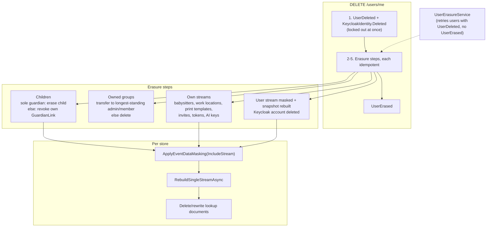

# GDPR: erasure, export and data minimization

Status: Proposed (not yet implemented)

## Context

Buddy stores data about children with ADHD and the adults around them: names and email
addresses, medicine schedules and every dose given or missed, nightly sleep entries with free-text
remarks, rewards, calendars, and the contact details of babysitters and playdate hosts. Under the
GDPR, medicines and sleep entries are special-category health data (Art. 9), the data subjects
include children (Art. 8), and every user has the right to get a copy of their data (Art. 15/20)
and to have it erased (Art. 17).

What exists today (all checked in the code):

- **Deleting an account erases nothing.** `DELETE /users/me`
  ([DeleteCurrentUser.Handler.cs](../../../src/backend/buddy/Features/Users/DeleteCurrentUser/DeleteCurrentUser.Handler.cs))
  appends `UserDeleted`, which only sets `User.IsDeleted`. `UserCreated` (Keycloak subject, email,
  username, name) stays in the `users` stream and in the `UserSnapshot`. The front end tells the
  user that deletion "permanently deletes your account" ([admin.ts](../../../src/frontend/buddy/src/app/core/i18n/translations/en/admin.ts)).
- **A deleted user keeps working.**
  [UserIdClaimsTransformation.cs](../../../src/backend/buddy/Features/Users/UserIdClaimsTransformation.cs)
  stamps the `UserId` claim without checking `IsDeleted`. The Keycloak account isn't touched
  ([IKeycloakAdminClient.cs](../../../src/backend/buddy/Features/Guardians/IKeycloakAdminClient.cs)
  can only create users), so the person can sign in again. Only `GET /users/me` and a handful of
  write handlers refuse them.
- **Nothing cascades.** Guardian links, group ownership, calendar roles, invites, share links, AI
  keys and AI sessions all outlive the account. A group whose owner deleted their account can never
  be deleted, because only the owner may do that
  ([DeleteGroup.Handler.cs](../../../src/backend/buddy/Features/Groups/DeleteGroup/DeleteGroup.Handler.cs)).
  A child whose last guardian left keeps all its data with nobody able to reach it.
- **There is no export.** `GET /users/me/events` lists the caller's own user stream only.
- **The AI assistant sends more than it needs**
  ([AiSessionPromptBuilder.cs](../../../src/backend/buddy/Features/Mealplans/AiAssistant/AiSessionPromptBuilder.cs),
  [AiSessionToolExecutor.cs](../../../src/backend/buddy/Features/Mealplans/AiAssistant/AiSessionToolExecutor.cs)):
  - the whole meal library, with every rating comment the children wrote, keyed by child `UserId`;
  - for `get_calendar_conflicts`, the titles of items in *every* calendar the guardian can see,
    including calendars other families share through a group.

  Sessions are kept forever, and the UI never says that any of this leaves Buddy.
- **Two smaller leaks.**
  - The secret iCal and share-link tokens are part of the URL path
    (`/calendars/{id}/ical/{token}`, `/sleep-diary/shared/{token}`), so they end up in traces as
    `url.path` ([ObservabilityFeature.cs](../../../src/backend/buddy/Common/Observability/ObservabilityFeature.cs)).
  - `IdempotencyRecord` keeps full POST response bodies for 24 hours
    ([IdempotencyKeyMiddleware.cs](../../../src/backend/buddy/Common/Idempotency/IdempotencyKeyMiddleware.cs)),
    including the child's temporary password returned by `CreateChild`.

An event store is append-only by design, which is exactly what erasure has to work around.
Marten 9 ships a feature for this, "protected information" masking: per-event-type masking rules
plus `store.Advanced.ApplyEventDataMasking(...)`, which rewrites the stored events of chosen streams
in place.

This document answers eight questions: how erasure works in the event store, what deleting a
guardian account does, what deleting a child does, how groups survive their owner, what an export
contains, what the AI assistant may send and keep, how reads of health data are audited, and what
to fix right away.

## Question 1: how is data erased from an event store?

**Decision: two tools, chosen per stream.**

- **Delete** a stream that belongs entirely to the erased person, along with its snapshot and
  index documents, using `store.Advanced.Clean.DeleteSingleEventStreamAsync`. That covers a
  child's sleep diary and share tokens, medicine schedules and sharing, progress and pickups; a
  guardian's babysitter list, work locations and print templates; and the family-level streams
  of a family with no child left.
- **Mask** with Marten's protected-information masking, using rules for the personal fields of
  each event type, where a stream must remain:
  - the user stream itself, which keeps `IsDeleted` for every lookup that resolves a `UserId`;
  - streams shared with other people: calendar items, groups, invites, and family meals with
    their ratings.

  After masking, rebuild the stream's snapshot and delete or rewrite its lookup documents.

```csharp
// <Domain>Feature.cs, inside the store configuration -- one rule per event type with personal data
options.Events.AddMaskingRuleForProtectedInformation<UserCreated>(e => e with
{
    Email = Email.Unverified(Erased.Text),
    UserName = Erased.Text,
    Name = Name.New(Erased.Text, Erased.Text),
});

// The erasure step for one stream
await store.Advanced.ApplyEventDataMasking(x => x.IncludeStream(userId.Value), cancellationToken);
await store.Advanced.RebuildSingleStreamAsync<UserSnapshot>(userId.Value, cancellationToken);
```

- **Event shapes and stream versions stay intact.** A masked event keeps its type, version and
  ids, so rehydration, the inline snapshots, optimistic concurrency and the golden-file event
  shape tests keep working. Only the personal values become `Erased.Text` (`"[erased]"`), an empty
  list, or `null` where the field allows it.
- **Masking doesn't run projections.** `ApplyAsync` overwrites the events
  (`IEventStoreOperations.OverwriteEvent`) and nothing else, so every erasure step ends with
  `RebuildSingleStreamAsync<TSnapshot>` for the masked streams. Lookup documents that copy personal
  values (`GuardianInviteDocument.InvitedEmail`, `GroupMembershipDocument.GroupName`, ...) are
  deleted or rewritten in the same step.
- **Ids are pseudonyms, not erased.** Other streams reference a person only by `UserId`. Once the
  user's own stream is masked and the Keycloak account is gone, a `UserId` no longer leads to a
  person, so `CreatedBy`, `AssignedBy` and the like stay. Free text a person wrote in a *shared*
  family space (a calendar item title, a meal plan note) stays too: it is the family's plan, not the
  author's personal record. That free text is erased with the child or group it belongs to, not with
  its author.

Masking alone was the first plan. It would leave the substance of a person's own streams: an
erased child's bedtimes and dose statuses, still tied by id to the guardians who logged them.
Masking every field of every event type would fix that, but it would take some 40 rules where
deleting the stream takes one call.

Considered and rejected:

- **Crypto-shredding** (encrypt each person's fields with a per-person key, delete the key).
  Every event type would need encrypted fields and a key lookup on every read and replay, and
  shared streams would mix keys from several people. Masking achieves the same with no read-path
  cost.
- **Deleting every stream, shared ones included.** A calendar holds items from several people,
  and a group outlives any one member.
- **A soft delete with a filter.** That is today's `UserDeleted`, and it erases nothing.

## Question 2: what does deleting a guardian's account do?

**Decision: deleting an account locks the person out at once, then runs an idempotent erasure that
cascades as described below. A background sweeper finishes any erasure that failed halfway.**

1. **Lock out (synchronous, in the request).**
   - Append `UserDeleted`.
   - Mark the `KeycloakIdentity` document `Deleted` in the same session, so
     `UserIdClaimsTransformation` stops stamping the `UserId` claim. Every endpoint then answers
     `403 user_not_provisioned`, and `GetOrCreateUser` refuses to provision the subject again.
2. **Children.** For each child linked to the user:
   - If the user is the child's only active guardian, the child is erased too (Question 3). This
     was the user's decision; the deletion dialog lists those children by name first.
   - If the child has other active guardians, the user's own `GuardianLink` is revoked
     (`GuardianRevoked`) and the child stays.
3. **Groups.**
   - A group the user owns passes to a new owner (Question 4).
   - In other groups, the user's role is revoked (`GroupMemberRoleRevoked`), and so are their
     calendar roles (`MemberRoleRevoked`).
4. **Things that are only theirs.**
   - Invites they sent that are still pending are revoked.
   - Share links and iCal tokens they issued are revoked.
   - AI keys they added are removed (`ProviderApiKeyRemoved`).
   - Their print templates are deleted.
   - Their babysitter list and work-location schedule are masked and rebuilt. Both streams are
     keyed by the guardian's `UserId`, so this also erases the babysitters' names and contact
     details.
5. **The person.**
   - Mask the user stream (`UserCreated`, `NameUpdated`, `EmailUpdated`, ...) and rebuild
     `UserSnapshot`.
   - Delete the Keycloak account through the admin API (`DELETE /admin/realms/buddy/users/{id}`,
     covered by the service account's existing `manage-users` role).
   - Delete the `KeycloakIdentity` document.
   - Append `UserErased`, which marks the end of the erasure.

Each step is idempotent: revoking a revoked link is a no-op, and masking a masked stream changes
nothing. So the request runs the steps in order, and if any of them throws, the
`UserErasureService` (a `BackgroundService` like
[IdempotencyCleanupService.cs](../../../src/backend/buddy/Common/Idempotency/IdempotencyCleanupService.cs))
picks up every user with `UserDeleted` but no `UserErased` and runs them again. No single database
transaction spans the nine Marten stores and Keycloak, so the process has to be resumable.

The erasure runs in the request, not only in the background, so a user who deletes their account
sees it gone at once. The sweeper is the safety net.

Considered and rejected:

- **A grace period** ("you can undo this within 30 days"). It needs a cancel flow and a scheduled
  erasure, and the UI already promises an immediate, irreversible delete. It can be added later as
  a delay before step 2.
- **Disabling the Keycloak account instead of deleting it.** Keycloak would keep the email and
  name.

## Question 3: deleting a child

**Decision: a new slice, `DeleteChild` (`DELETE /users/me/children/{childId}`), allowed only when
the caller is the child's only active guardian. Otherwise it answers
`409 child_has_other_guardians`. The same erasure also runs when a guardian's account deletion
leaves a child with no guardian (Question 2).**

This follows the user's decision "sole guardian only". With co-guardians, each of them has to give
up their link first (`RevokeGuardianLink`), so no parent can erase what another relies on.
`GuardianKind` doesn't gate it, the same as everywhere else
([GuardianKind.cs](../../../src/backend/buddy/Features/Guardians/Types/GuardianKind.cs)).

What is erased:

| Data | How |
|---|---|
| The child's user stream and `UserSnapshot`; the Keycloak account | mask + rebuild; admin API delete |
| Medicine schedules and dose logs, and their group sharing | mask every stream found through `MedicineIndexDocument`/`MedicineSharingIndexDocument`; rebuild |
| Sleep diary (`SleepDiaryId.ForChild`) and share tokens | mask + rebuild; revoke the share tokens |
| Progress (`ProgressId.ForChild`): stars, milestones, goal-post labels | mask + rebuild |
| Pickup schedule (playdate host names, addresses and contacts, notes) | mask + rebuild |
| Meal ratings by the child (`MealRated.Comment`) | mask the comment; the stars stay, keyed by a now-anonymous id |
| Calendar items assigned to the child | `ItemDeleted`, then mask the title and completion log |
| Task templates anchored to the child (subtask titles) | mask + rebuild |
| Guardian links to the child; pending guardian invites for the child (which hold `ChildGivenName`) | revoke; mask the invites |

Family-level data that is *anchored* to a child is resolved through all of the guardian's
children ([MealFamilyResolution.cs](../../../src/backend/buddy/Features/Mealplans/MealFamilyResolution.cs)).
That covers meals, the meal plan, AI credentials and AI sessions. It is erased with the child only
when the child has no sibling left under the same guardians; otherwise it stays for the siblings.
See the open question below.

## Question 4: a group whose owner leaves

**Decision: ownership passes to the longest-standing admin, else the longest-standing member, as a
new event `GroupOwnershipTransferred(GroupId, UserId From, UserId To, OccurredAt)`. The group is
deleted (`GroupDeleted`, plus `CalendarDeleted` for its calendars, as `DeleteGroup` does today) only
when nobody else is left.**

"Longest-standing" means the earliest `GroupMemberRoleGranted` that is still in effect. The fold
already sees those events in order, so `Group` gains a `JoinedAt` per member and needs no extra
lookup. The new owner gets the existing owner rights. Other families keep their shared calendars and
everything they entered there. This was the user's decision; deleting the group, or blocking the
deletion until ownership is handed over, were the rejected options.

```csharp
// Group.cs today: Members maps a user to a role only
ImmutableDictionary<UserId, GroupRole> Members
// proposed: the role plus when it was first granted, to pick the successor
ImmutableDictionary<UserId, GroupMember> Members   // GroupMember(GroupRole Role, DateTimeOffset JoinedAt)
```

Blast radius: `Group` and `GroupSnapshot` (rebuilt from events, so no data migration is needed),
the six handlers that read `group.Members[...]` as a role, and `GroupMemberDetail`.

## Question 5: what does an export contain?

**Decision: `GET /users/me/export` returns one JSON document with everything about the caller and
about every child they are an active guardian of. Each feature contributes a section through an
`IPersonalDataExporter`. The endpoint has its own rate-limit policy (one export per user every 10
minutes).**

```csharp
public interface IPersonalDataExporter
{
    string Section { get; }   // "account", "children", "medicines", "sleepDiary", ...
    Task<object?> ExportAsync(UserId caller, IReadOnlyCollection<UserId> children, CancellationToken cancellationToken);
}
```

- **Guardians export their children's data too**, because they exercise the child's rights under
  parental responsibility. A child account can export only its own `account` section.
- **The export holds data, not events**: the current state from the snapshots, plus the history
  that matters to a person (the dose log, the sleep entries). Raw events would expose internal ids
  and masked placeholders.
- It is served with `Content-Disposition: attachment; filename="buddy-export-<date>.json"`. The
  frontend adds a "Download my data" button next to "Delete account".
- Registering exporters like Wolverine handlers (one per feature, found by DI) means a new feature
  that stores personal data has a clear place to add its section. A meta test like
  `EventGoldenFileCoverageTests` fails when a feature's events have masking rules but the feature
  has no exporter.

## Question 6: the AI assistant

**Decision: send less, keep it 30 days, and say so before the first use.**

1. **Minimization.**
   - Children appear as "child 1", "child 2" in the prompt, not by `UserId`.
   - Rating comments are still sent, because they are what makes suggestions useful ("too
     spicy").
   - `get_calendar_conflicts` returns titles only for items assigned to the session's child or to
     nobody, from calendars of the child's own family. Everything else becomes `"busy"` with its
     time.
2. **Retention.** This was the user's decision. A daily job masks `AiSessionStarted.Notes`,
   `AiUserMessageSent.Text`, `AiAssistantMessageRecorded.Text` and both JSON fields of
   `AiToolInvocationRecorded` 30 days after a session is applied or discarded, or 30 days after the
   last activity of a session that was never closed. The meal plan it produced stays.
   `AiSessionIndexDocument` gains `ClosedAt`/`LastActivityAt` for the job's query.
3. **Disclosure.**
   - Before a family's first session, the assistant shows what is sent (meal names, ratings and
     comments, the notes, the chat, calendar times) and to whom (the provider of the family's own
     key).
   - The guardian's acknowledgement is recorded as `AiDataSharingAcknowledged(AiCredentialId,
     UserId, OccurredAt)`, and `StartAiSession` refuses with `409 ai_data_sharing_not_acknowledged`
     until it exists.
   - The provider settings page gets the same text.

The family brings its own key, so the provider is the family's own processor. Buddy's backend is
still the party that assembles the data and sends it, so minimization and disclosure are Buddy's
responsibility.

## Question 7: auditing access to health data

**Decision: structured audit logs for every read of a child's medicines or sleep diary, in the same
form as the existing audit logs ([observability.md](../observability.md)).** New events:

- `ListMedicineSchedules`, `ListTodaysDoses` and their group variants (new `MedicinesLog`, EventIds
  9001+);
- `ListSleepDiaryEntries` (`SleepDiariesLog` 5004).

Each logs the reader's `UserId`, the `ChildId` and the access path (guardian link, group share).
`GetSharedSleepDiary` already logs every view (5003).

A persisted access log that guardians can see in the app ("who viewed my child's data") was
considered and deferred. It is a feature in its own right, with its own retention question. The
logs answer the accountability question (Art. 5(2)) now, provided they are kept somewhere: see the
OTLP item in the TODO.

## Question 8: what to fix right away

**Decision: four fixes that need no new feature, shipped first.**

- **Lock deleted users out** (Question 2, step 1).
- **Delete the Keycloak account** when a user is deleted. This needs `DeleteUserAsync` on
  `IKeycloakAdminClient`.
- **Redact tokens from traces.** The ASP.NET Core instrumentation's `EnrichWithHttpRequest` replaces
  `url.path` with the route template whenever the route has a `{token}` parameter.
- **Encrypt stored idempotency responses** with Data Protection, the same as AI keys. A body that
  can't be decrypted (keys lost on a restart, see the Data Protection item in the TODO) is treated
  as expired.

## Backups

Deployments keep `pg_dump` backups ([deploy/README.md](../../../deploy/README.md), step 7), and a
restore brings erased people back. Two measures:

- **The erasure ledger.** Every erasure adds the erased `UserId` (a pseudonym, nothing else) to an
  `ErasureLedgerEntry` document in its own schema, `erasure`. A ledger inside the database would be
  rolled back by a restore too, so the restore procedure exports it first, restores the backup,
  then re-imports it:
  1. `COPY erasure.mt_doc_erasureledgerentry TO` a file.
  2. Restore the backup.
  3. Re-import the ledger file.
  4. Start the API.

  On start, `UserErasureService` re-erases everyone on the ledger whose data is back. The deploy
  READMEs get the steps.
- **Rotation.** Backups older than 30 days are deleted. The privacy notice states it.

## Events

```
UserErased(UserId UserId, DateTimeOffset OccurredAt)
    // the end of an erasure; UserDeleted remains the start
GroupOwnershipTransferred(GroupId GroupId, UserId From, UserId To, DateTimeOffset OccurredAt)
AiDataSharingAcknowledged(AiCredentialId Id, UserId AcknowledgedBy, DateTimeOffset OccurredAt)
```

Each gets a golden file in `EventShapeTests`. Masking adds no event types: it rewrites existing
events.

## Command slices

| Slice | Tier | Notes |
|---|---|---|
| `DeleteCurrentUser` (changed) | self | Lock out, then run `UserErasure`. Still `204` |
| `DeleteChild` | Manage, sole guardian | `DELETE /users/me/children/{childId}`; `409 child_has_other_guardians` |
| `ExportPersonalData` | self | `GET /users/me/export`; rate-limit policy `personal-data-export` |
| `AcknowledgeAiDataSharing` | Manage | `POST /mealplans/children/{childId}/ai-credentials/acknowledgement` |

Background services: `UserErasureService` (finishes interrupted erasures) and
`AiSessionRetentionService` (masks closed sessions after 30 days).

## Frontend

- **Admin, "Danger zone":**
  - The delete dialog lists the children who will be erased with the account, and the groups that
    pass to someone else (the export section can compute both).
  - A "Download my data" button.
- **Each child's settings:** a "Delete child account" action that is enabled only for the sole
  guardian, with a hint explaining why when it isn't.
- **AI assistant:** the data-sharing notice and an acknowledgement step before the first session.
- All of this as en and da strings (the `i18n` skill), plus the screenshots.

## Testing

- **Erasure.** For every feature, an integration test writes data for a user, erases them, and
  then asserts two things:
  - none of the user's personal values (the same approach as
    [AuditLogTests.cs](../../../src/backend/buddy.IntegrationTests/Common/Observability/AuditLogTests.cs))
    appears in that feature's events (`mt_events.data`), its snapshots, or its documents, read
    straight from Postgres;
  - the shared data of others is unchanged.
- **Coverage.** A meta test fails when a registered event type has a `string` field and no masking
  rule, unless it is on an explicit allow-list (non-personal strings such as `TimeZoneId`).
- **Snapshots.** The existing `SnapshotTests` (snapshot == full replay) are extended to masked
  streams.
- **Lock-out and cascades:** the deleted user gets `403` everywhere; ownership transfer; the
  orphaned child is erased; a co-guarded child is not; `DeleteChild` returns `409` with
  co-guardians.
- **Export:** every section is present, and a child account sees only its own data.
- **AI:** the prompt contains no child `UserId`; other families' calendar titles appear as "busy";
  retention masks a session after 30 days (with a fake `TimeProvider`).

## Failure and edge-case behavior

| Case | Behavior |
|---|---|
| Erasure fails halfway (Postgres or Keycloak down) | The user is already locked out; `UserErasureService` retries until `UserErased` |
| `DELETE /users/me` repeated | `204`; each step is idempotent |
| The deleted user's still-valid access token | `403 user_not_provisioned` from the next request on |
| Sign-in again before Keycloak deletion completes | `GetOrCreateUser` sees `KeycloakIdentity.Deleted` and answers `404`; no new user is provisioned |
| A child with two guardians; one deletes their account | That guardian's link is revoked; the child and its data stay |
| `DeleteChild` with co-guardians | `409 child_has_other_guardians`; nothing changes |
| A group owner deletes their account; nobody else is in the group | The group and its calendars are deleted and erased |
| A database backup restored after an erasure | The restored data contains the erased user again; the restore procedure re-imports the erasure ledger and the sweeper re-erases everyone on it (see "Backups") |
| An export while an erasure is running | The export reads whatever is masked so far; the caller is locked out anyway |

## Decisions made

| Question | Decision |
|---|---|
| Erasure technique | Delete streams that belong only to the erased person; mask the user stream and shared streams (Marten protected-information masking plus a snapshot rebuild); no crypto-shredding |
| A child left without a guardian by an account deletion | Erased with the guardian (user's decision) |
| Who may delete a child | Only its sole active guardian (user's decision) |
| A group whose owner leaves | Passes to the longest-standing admin, else member; deleted only when empty (user's decision) |
| AI session retention | Masked 30 days after closing (user's decision) |
| Erasure execution | In the request, idempotent, with a background sweeper for failures |
| Export | One JSON document; guardians include their children |
| Health-data access audit | Structured audit logs now; an in-app access log later |
| Family data anchored to an erased child (meals, meal plan, AI keys and sessions, task templates) | Erased with the child only when no sibling under the same guardians remains (user's decision) |
| AI calendar titles | Only items assigned to the session's child or to nobody, in the child's family calendars; the rest are sent as "busy" (user's decision) |
| Backups | An erasure ledger plus 30-day backup rotation (user's decision); see below |

## Remaining open questions

- **Free text in shared spaces that names a person.** Lean: out of scope. A guardian who wrote
  "pick up Emil" in a group calendar's item title made that text part of the family's shared plan.
  The other members can edit or delete it, and the author's identity is erased.
- **Legal work outside the code.** These are decisions for the controller, not code:
  - a privacy notice;
  - a record of processing activities;
  - a DPIA (likely required for children's health data);
  - data processing agreements with the hosting provider (Oracle or Azure);
  - what the AI disclosure has to say.

## Implementation order

1. Question 8 (no new feature).
2. Erasure infrastructure: masking rules per feature, `Erased`, the coverage meta test, and the
   erasure step per store.
3. `DeleteCurrentUser` cascade with `UserErasureService`, plus `GroupOwnershipTransferred`.
4. `DeleteChild`.
5. Export.
6. AI minimization, retention and disclosure.
7. Health-data audit logs.

Each step can ship on its own.

## Diagram


