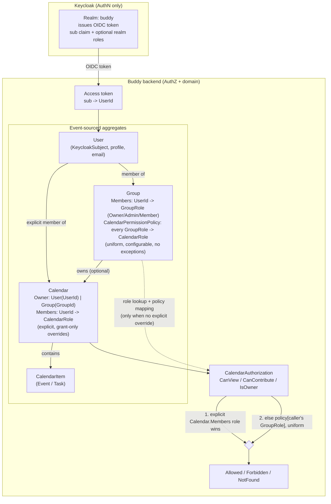

# Groups and Group-Owned Calendar Permissions

Status: Proposed (not yet implemented)

## Context

Calendars are currently owned by exactly one user (the creator), with additional
users granted `CalendarRole.Owner | Contributor | Viewer` directly on the
calendar via `MemberRoleGranted` (see [Calendar.cs](../../../src/backend/buddy/Features/Calendars/Types/Calendar.cs)
and [glossary.md](../glossary.md)). We want users to be able to join **groups**,
have groups **own calendars** (in addition to users), and have a group
member's calendar permissions be derived from their role within the group.

Authentication stays with Keycloak (`sub` claim -> `UserId`, unchanged). This
document only covers authorization, which stays entirely inside the
application's own event-sourced aggregates, consistent with how `Calendar`
already works.

## Decision: Keycloak scope stays limited to authentication

Keycloak issues the token and identifies the subject. It is not used to store
group membership, group roles, or calendar permissions:

- Keycloak roles/groups are realm- or client-scoped, not resource-scoped —
  there's no native way to express "role of user X within group Y".
- Group membership and roles change at business-transaction speed and need to
  be transactionally consistent with the rest of the domain (calendar
  creation, item edits) — an external IdP call can't give us that.
- The existing pattern (`Calendar.CanView` / `CanContribute` / `IsOwner`)
  already resolves permissions purely from the app's own aggregate state with
  no external calls. `Group` should follow the same pattern.

Optional realm roles may still be used for coarse, rare, app-wide capabilities
(e.g. `system-admin`), never for group- or calendar-level roles.

## Domain model

### `Group` (new aggregate, same shape as `Calendar`)

```
Group(
    GroupId Id,
    string Name,
    ImmutableDictionary<UserId, GroupRole> Members,
    ImmutableDictionary<GroupRole, CalendarRole> CalendarPermissionPolicy,
    bool IsDeleted = false)
```

- `GroupRole`: `Owner | Admin | Member`
  - **Owner**: creator of the group. Assigned only by `GroupCreated`, never
    granted or revoked through role events — mirrors the existing rule that
    `CalendarRole.Owner` never transfers through `MemberRoleGranted`.
  - **Admin**: can invite/remove members, change `Member`/`Admin` roles, and
    edit the group's `CalendarPermissionPolicy`. Cannot delete the group or
    change the Owner.
  - **Member**: regular participant, no group-management rights.
- `CalendarPermissionPolicy`: maps **every** `GroupRole` — including
  `Owner` — to the `CalendarRole` that role gets on calendars owned by this
  group. **Configurable per group**, not a fixed system-wide table — the
  group's Owner/Admin edits it, e.g. so one group gives `Member -> Viewer`
  and another gives `Member -> Contributor`. See "Permission semantics"
  below for why `Owner` is included with no exception.

Events: `GroupCreated`, `GroupMemberRoleGranted` (role always `Admin` or
`Member`), `GroupMemberRoleRevoked`, `GroupCalendarPolicyUpdated`,
`GroupDeleted` — same event-sourced shape as the `Calendar` feature.

### `Calendar` — owner becomes a union

```
CalendarOwner = User(UserId) | Group(GroupId)
```

`CalendarOwner` is the **owning principal** — a fixed fact about the
calendar, set once at creation, never transferred (same invariant as today).
It is a distinct concept from the *effective permission* a given user has on
the calendar (see next section) — a group-owned calendar has no single "the
owner user" in `Calendar.Members`; ownership is anchored to the group as a
whole, and per-user rights are derived.

There is **no separate "shared with a group" concept**: owning a calendar and
being "shared with" it are the same mechanism (`CalendarOwner.Group(groupId)`
either way). Group membership is just one *source* of a role on a calendar;
`Calendar.Members` explicit grants remain a fully independent, per-calendar
override mechanism that works the same regardless of who owns the calendar.
`Calendar.Members` keeps its current behavior unchanged: explicit, per-user,
grant-only role assignments. No explicit "deny" — sticking with grant-only.

## Permission semantics

### Owner semantics for a group-owned calendar

Two distinct concepts, kept strictly separate:

- **Calendar owner (principal)** — `Calendar.Owner: User(UserId) | Group(GroupId)`.
  A fixed fact set at creation, never transferred. For a group-owned
  calendar the principal is the group as a whole, not any one member.
- **Effective owner (permission)** — `IsOwner(userId)` is true when a
  user's *resolved* `CalendarRole` is `Owner`. Per-user, computed, unrelated
  to who created the group.

**Rule: `CalendarPermissionPolicy` is the only source of a group member's
effective calendar rights, for every `GroupRole` — `Owner`, `Admin`,
`Member` alike, with no exception.** No `GroupRole` is ever implicitly
elevated to a `CalendarRole` outside the policy.

Default policy on `GroupCreated` (see "Decisions made"):
`Owner -> Owner, Admin -> Contributor, Member -> Viewer`. This is
configuration, not a hardcoded rule — a group may change any entry,
including its own Owner's.

Management rights and calendar rights are two independent axes:

| Axis | Governs | Gate |
|---|---|---|
| `GroupRole` | Manage members/roles, edit `CalendarPermissionPolicy`, delete the group | `GroupRole` directly — `Owner`/`Admin` for the first two, `Owner` only for delete |
| Resolved `CalendarRole` | View/contribute/owner-gated actions on the group's calendars | `CalendarAuthorization`, via the policy above |

Consequence: a `GroupRole.Admin` who manages membership does not thereby
gain calendar rights beyond what the policy grants. A `GroupRole.Owner`
whose policy entry is downgraded keeps full group-management rights
regardless (including editing the policy back) — a reduction in calendar
access never reduces group control.

### Effective permission resolution

`CanView` / `CanContribute` / `IsOwner` for a given `(calendar, userId)`:

1. If `userId` has an explicit entry in `Calendar.Members`, use that role.
   Explicit per-calendar grants always win.
2. Otherwise, if `Calendar.Owner` is `Group(groupId)`: look up the caller's
   `GroupRole` in that group and resolve it through
   `CalendarPermissionPolicy[role]` — uniformly for `Owner`, `Admin`, and
   `Member`, no exceptions. Not a member of the group -> no match, fall
   through.
3. Otherwise: no access (`CalendarAccess.NotFound`, same "can't distinguish
   private from missing" behavior as today).

| Situation | Result |
|---|---|
| User has an explicit `Calendar.Members` role | That role, unconditionally — regardless of relative privilege |
| Calendar owned by Group; user has a `GroupRole` in that group | `CalendarPermissionPolicy[role]` (uniform for Owner/Admin/Member) |
| Calendar owned by Group; user has no group role | No access |
| Calendar owned by User | Unchanged — today's behavior |

### Who can do what on a group-owned calendar

Every existing handler already goes through one of three checks in
[CalendarAuthorization.cs](../../../src/backend/buddy/Features/Calendars/CalendarAuthorization.cs);
none of them need to change shape, only what feeds their resolution:

| Action | Handler | Check | Gate |
|---|---|---|---|
| View calendar / list items / occurrences | `GetCalendar`, `ListItems`, `ListOccurrences` | `CheckView` | Any resolved role |
| Create/update/delete/reschedule items | `CreateItem`, `UpdateItemDetails`, `UpdateItemRecurrence`, `DeleteItem`, `RescheduleItem` | `CheckContribute` | `Owner` or `Contributor` |
| Delete calendar | `DeleteCalendar` | `CheckOwner` | `Owner` |
| Add/remove explicit calendar members | `SetMemberRole`, `RemoveMember` | `CheckOwner` | `Owner` |
| Manage iCal tokens | `CreateIcalToken`, `ListIcalTokens`, `RevokeIcalToken` | `CheckOwner` | `Owner` |
| Manage group membership / roles | *(new, group-scoped)* | — | `GroupRole.Owner` or `Admin` |
| Edit `CalendarPermissionPolicy` | *(new, group-scoped)* | — | `GroupRole.Owner` or `Admin` |
| Delete the group | *(new, group-scoped)* | — | `GroupRole.Owner` only |

So "who can delete a group-owned calendar" is whoever resolves to
`CalendarRole.Owner` — not automatically the Group Owner; whoever the
policy currently maps to `Owner` (the Group Owner, by default, only because
the default policy says so).

## Failure and edge-case behavior

| Case | Behavior |
|---|---|
| Group deleted | Cascade-delete (mechanics under "Aggregate loading and performance" below): `GroupDeleted` and a `CalendarDeleted` for every calendar the group owns commit in one transaction. No window where a live calendar points at a dead group. |
| Calendar's `GroupId` unresolvable (should not occur given the cascade — defense in depth only) | No group role found for anyone → falls through to no access, same collapsing behavior as a deleted/missing calendar today. |
| User has no `GroupRole` in the owning group | No access via group. An explicit `Calendar.Members` entry, if present, still applies independently. |
| User's `GroupRole` revoked (`GroupMemberRoleRevoked`) | Effective on the very next check — `Group` is rehydrated live, no cache to invalidate, no stale grant window. |
| Group's `CalendarPermissionPolicy` changed after a request already checked access | No retroactive effect on a decision already made. Each check loads `Group` once and reads the policy as committed at that instant — never a mix of two policy versions within one decision. Read-committed consistency, same model `Calendar.Members` changes already have today. |
| User has both an explicit `Calendar.Members` role and a group-derived role | Explicit wins, unconditionally — even when it's lower privilege than the group-derived role would give. No "highest wins" merge. |
| `GroupRole` missing an entry in `CalendarPermissionPolicy` (should not happen given the seeded default) | Fails closed: treated as no calendar role from the group. Never fails open to a guessed/default role. |

## Aggregate loading and performance — operational contract

This section answers each operational question directly, as a contract, not
just a design leaning:

**Is loading `Group` acceptable on every read action?** No, and it isn't
required to be: `Group` is loaded (by rehydrating its event stream, same
mechanism as `Calendar` today) **only when both** (a) the caller has no
explicit `Calendar.Members` entry, and (b) `Calendar.Owner` is a `Group`.
For user-owned calendars — the common case for personal calendars — this
adds zero cost over today, since that branch is never taken.

**Is there a cache or projection for the single-calendar check path?** No,
and none is introduced. It mirrors the existing pattern exactly — `Calendar`
is already rehydrated per request from its own stream via
`MartenCalendarEventStore.ReadAsync`, with no snapshotting or caching layer
today. `Group` follows the same rule: live rehydration, one event-stream
fetch, bounded in size by the number of membership/policy-change events for
that group (the same order of magnitude as a `Calendar` stream). This is
"acceptable as a first design" specifically because it doesn't introduce a
new performance tier that the codebase doesn't already rely on elsewhere —
if profiling later shows it's hot, a snapshot/projection can be added as a
pure optimization without changing the semantics above.

**Is a separate authorization read model needed for fast checks?** No, for
single-calendar authorization. **Yes, but for a different reason** — for
list queries (`ListCalendars`), because the existing
`CalendarMembershipDocument` only captures explicit membership and was never
going to reflect group-derived access no matter how fast group lookups are.
That read model (`GroupMembershipDocument` + `GroupOwnedCalendarDocument`,
below) is required for correctness of the list view, not as a performance
optimization for the per-check path.

**What if the group aggregate is missing or deleted?** Resolution step 2
simply finds no group role for anyone and falls through to "no access" —
same collapsing behavior `Calendar` already applies to deleted/missing
calendars, no new failure mode. In normal operation this should not be
reachable, because of the cascade below; it exists purely as defense in
depth.

**Group deletion cascades.** Deleting a `Group` also marks every calendar it
owns as deleted, rather than leaving them orphaned. An orphaned group-owned
calendar would be data nobody has a permission path to manage or delete —
its `CalendarPermissionPolicy` source is gone, so it's not just inaccessible,
it's data the system has no legitimate business continuing to hold. Cascading
avoids that.

Mechanics: `GroupDeleted` is handled by looking up the group's owned
calendars via `GroupOwnedCalendarDocument` (the read model already needed
for list queries — see above), then appending `CalendarDeleted` to each of
those calendar streams. Marten supports appending to multiple streams within
one session before a single `SaveChangesAsync`, so the group's own
`GroupDeleted` event and every cascaded `CalendarDeleted` event commit as one
Postgres transaction — no risk of a partial cascade (group deleted, some
calendars left behind) even under failure. The existing `CalendarDeleted`
handling in `MartenCalendarEventStore.AppendAsync` (which already clears out
a deleted calendar's `CalendarMembershipDocument` rows) needs no change; the
new `GroupOwnedCalendarDocument` row for each cascaded calendar is deleted
the same way.

**List queries are the one place a new read model is required.** Today,
`ListCalendars` (`ListForUserAsync`) answers "which calendars can this user
see" via a single indexed query against `CalendarMembershipDocument`
(`CalendarId, UserId, Role, CalendarName`), a document written transactionally
alongside the event append in
[MartenCalendarEventStore.cs](../../../src/backend/buddy/Features/Calendars/MartenCalendarEventStore.cs) —
it only ever captures explicit membership (including the owner, written
directly in `CreateAsync`). Group-owned calendars are invisible to this
document by construction: nothing about group membership feeds it. To
extend the calendar list to include group-derived access, two more documents
are needed, following the exact same maintained-inline-projection pattern:

- `GroupMembershipDocument(GroupId, UserId, GroupRole)` — maintained by the
  Group event store the same way `CalendarMembershipDocument` is today.
- `GroupOwnedCalendarDocument(CalendarId, GroupId, CalendarName)` — one row
  per group-owned calendar, written once at creation (ownership is fixed, so
  this never needs updating afterward, only deletion alongside
  `CalendarDeleted`/`GroupDeleted`).

`ListForUserAsync` becomes a three-step read instead of one query: explicit
`CalendarMembershipDocument` rows, plus (user's groups from
`GroupMembershipDocument`) joined against `GroupOwnedCalendarDocument`, with
explicit rows taking precedence when a calendar appears in both sets — the
same precedence rule as single-calendar resolution. This is a real added
cost over today's model and should be scoped as its own implementation task,
not bundled silently into "add a Group aggregate."

## Migration contract for `CalendarCreated`

Existing events are user-only: `CalendarCreated(CalendarId, UserId OwnerId, string Name, TimeZoneId TimeZoneId, DateTimeOffset OccurredAt)`
([CalendarEvents.cs](../../../src/backend/buddy/Features/Calendars/Types/CalendarEvents.cs)),
consumed in exactly two places: [Calendar.cs Rehydrate](../../../src/backend/buddy/Features/Calendars/Types/Calendar.cs)
(seeds `Members` with `{OwnerId: Owner}`) and
[MartenCalendarEventStore.CreateAsync](../../../src/backend/buddy/Features/Calendars/MartenCalendarEventStore.cs)
(writes the owner's `CalendarMembershipDocument` from `created.OwnerId.Value`).

**Contract: `CalendarCreated` is never modified — old streams are read
exactly as they are today, with no upcasting and no reinterpretation.**
Group ownership is carried by a second, new event instead:

```
CalendarCreatedForGroup(CalendarId, GroupId OwnerId, string Name, TimeZoneId TimeZoneId, DateTimeOffset OccurredAt)
```

Rejected alternative: widening `CalendarCreated` with a nullable `GroupId`
alongside `UserId`. That forces a rule for what `GroupId: null` means on
every historical row. A second event type needs no such rule — old events
are unambiguously user-owned by virtue of which event type they are.

| Concern | Answer |
|---|---|
| Old streams | Read byte-for-byte as stored, unchanged, forever |
| Read-time conversion | None — two direct `Calendar.Rehydrate` cases, no upcast function: `CalendarCreated` → `Owner = User(OwnerId)`, `Members = {OwnerId: Owner}` (unchanged). `CalendarCreatedForGroup` → `Owner = Group(OwnerId)`, `Members = {}` (rights come from policy resolution, not a `Members` row) |
| Write path | `MartenCalendarEventStore.CreateAsync` branches on the first event's type: `CalendarCreated` keeps writing `CalendarMembershipDocument`; `CalendarCreatedForGroup` writes `GroupOwnedCalendarDocument` instead |
| Other handlers | Untouched — `SetMemberRole`, `RemoveMember`, `DeleteCalendar`, all item handlers operate on the rehydrated `Calendar`/`CalendarAuthorization`, never the raw creation event |
| `CreateCalendar` | Gains a group-owned variant (or optional group-id param) emitting `CalendarCreatedForGroup`, gated on the caller having `GroupRole.Owner` or `Admin` in the target group |
| Backfill / replay | None. Nothing is rewritten or reprocessed; the new event type only appears on newly created group calendars going forward. No downtime, no migration window |

## Decisions made

| Question | Decision |
|---|---|
| GroupRole -> CalendarRole mapping | Configurable per group, not a fixed system-wide table |
| Explicit deny on `Calendar.Members` | No — grant-only, as today |
| Group role granularity | `Owner / Admin / Member` |
| Personal-owned vs. group-owned calendars | Same mechanism — `CalendarOwner` is just `User` or `Group` |
| Does any `GroupRole` automatically get calendar rights outside the policy | No — uniform rule, `CalendarPermissionPolicy` is the only source, including for `Owner` |
| Precedence: explicit `Calendar.Members` vs. group-derived role | Explicit always wins, unconditionally, regardless of relative privilege |
| Migration approach for `CalendarCreated` | Additive new event type (`CalendarCreatedForGroup`), no upcasting, no backfill |
| Group deletion vs. its owned calendars | Cascade-delete — orphaning would leave data with no permission path to manage/delete it |
| Default `CalendarPermissionPolicy` on `GroupCreated` | `Owner -> Owner, Admin -> Contributor, Member -> Viewer` (editable afterward, no exceptions to the mechanism) |

## Remaining open questions

- Whether `CreateCalendar` should accept an existing group at creation time
  only, or also support converting an existing user-owned calendar into a
  group-owned one later (today's model treats ownership as permanently
  fixed at creation, so the default assumption is: no conversion, only
  chosen at creation).

## Diagram


