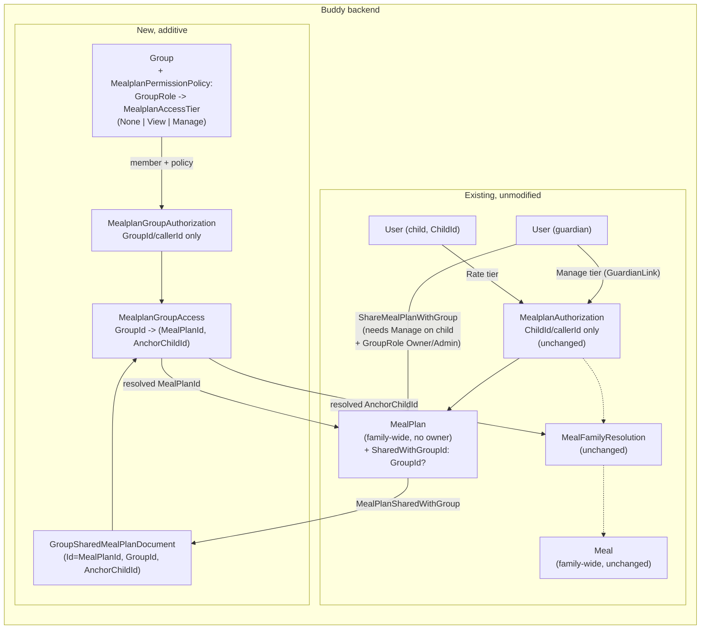

# Sharing a Family's Meal Plan with a Group

Status: Implemented

## Context

[group-owned-calendars-and-permissions.md](group-owned-calendars-and-permissions.md)
gave `Calendar` a second kind of owner (`CalendarOwner.Group`) so a calendar
can belong to a group instead of a single user, with per-`GroupRole` access
resolved through `Group.CalendarPermissionPolicy`. We want the equivalent
capability for meal plans: a family's guardian should be able to let a
group (e.g. co-parents in a separate household, grandparents, a babysitter
pool) see and help manage the family's `MealPlan` and `Meal` library.

`MealPlan`/`Meal` are architecturally very different from `Calendar`, and
that difference shapes this design more than it first appears
([mealplans.md](mealplans.md)):

- `Calendar` has its own `CalendarId` in every route and a genuine "owning
  principal" (`CalendarOwner = User | Group`). `MealPlan`/`Meal` have
  **no owner at all** — they are family-wide singletons, resolved
  transitively at read time from the `GuardianLink` graph
  (`MealFamilyResolution`), and every route is keyed by `ChildId`, never by
  `MealPlanId`/`MealId` directly.
- `MealplanAuthorization` never loads the `MealPlan`/`Meal` aggregate to
  authorize — it resolves a tier from `(ChildId, callerId)` alone. There is
  no `Members` dictionary to extend the way `Calendar.Members` was already
  there for group resolution to slot into.
- There is no realistic scenario here analogous to "a group's own calendar
  with no individual owner" — a meal plan is inherently anchored to a
  specific child/family. A "group's own meal library, unconnected to any
  child" is not a shape this domain needs.

That last point is why this design is **additive, not a mirror of
`CalendarOwner`**: rather than giving `MealPlan`/`Meal` their own owner
union, a family's existing `MealPlan` gains an optional pointer to a group
it has chosen to share itself with, and `Meal` needs no change at all — a
shared plan's meals are already reachable through the plan's own anchor
child via the existing `MealFamilyResolution` machinery.

## Decisions locked in before this design

- A group-shared plan's anchor child (and their guardians) keep working
  **exactly as today** via `MealplanAuthorization`/`GuardianLink` — sharing
  with a group never narrows or replaces that path, only adds a new,
  independent one.
- `Meal` gets **no** group-sharing mechanism of its own. Only `MealPlan`
  records that it is shared; a group-keyed request reaches the same family's
  meals by resolving to the plan's anchor child and reusing
  `MealFamilyResolution` unchanged.
- A design doc is written first, and this doc supersedes the "no members, no
  groups" framing in [mealplans.md's Authorization section](mealplans.md#authorization)
  and its "poor fit for `Calendar`'s three-tier `CalendarRole`" remark: that
  remains true for the family/child axis, but a second, additive axis now
  exists for groups.

## Domain model

### `MealPlan` — additive field, not an owner union

```
MealPlan(
    MealPlanId Id,
    ImmutableDictionary<(DateOnly Date, MealSlot Slot), MealPlanAssignment> Assignments,
    GroupId? SharedWithGroupId = null)
```

Unlike `Calendar.Owner`, this is not a union — `MealPlan` is always
fundamentally family-owned; `SharedWithGroupId` is an optional *additional*
grant, not a replacement kind of ownership. At most one group at a time
(sharing with a second group overwrites the first — see "Remaining open
questions").

### `MealPlan` events — additive, `MealPlanCreated` unchanged

```
MealPlanSharedWithGroup(MealPlanId Id, GroupId GroupId, UserId AnchorChildId, UserId SharedBy, DateTimeOffset OccurredAt)
MealPlanUnsharedFromGroup(MealPlanId Id, GroupId GroupId, UserId UnsharedBy, DateTimeOffset OccurredAt)
```

`AnchorChildId` is carried on `MealPlanSharedWithGroup` (not resolved later)
because it is exactly the `ChildId` the sharing guardian was already
authorized against — no extra lookup needed, and it is what lets a
group-keyed request resolve back into the existing `MealFamilyResolution`
machinery unchanged (see "Group-keyed access" below). `MealPlanCreated` is
never modified, matching `CalendarCreated`'s migration contract.

### `Group` — a second, independent policy map

```
Group(
    GroupId Id,
    string Name,
    ImmutableDictionary<UserId, GroupRole> Members,
    ImmutableDictionary<GroupRole, CalendarRole> CalendarPermissionPolicy,
    ImmutableDictionary<GroupRole, MealplanAccessTier> MealplanPermissionPolicy,
    bool IsDeleted = false)
```

`MealplanPermissionPolicy` reuses the existing `MealplanAccessTier` enum
(`None | Rate | Manage | View`) rather than inventing a new one. Three
values are meaningful for a group policy: **`Manage`** (full read/write on
the shared plan and its family's meal library, same as a guardian),
**`View`** (read-only: see the shared plan and meal library, but cannot
create/edit/archive meals or assign/clear plan slots), or **`None`** (no
access at all). `Rate` is reserved for the child themself
(`MealplanAuthorization.CheckRate`) and is never a valid group-policy value
— see validation below.

`GroupCreated` is an already-shipped event and cannot gain a required field
retroactively (same contract `GroupCalendarPolicyUpdated` already
established for `CalendarPermissionPolicy`). So:

- `Group.Rehydrate` seeds `MealplanPermissionPolicy = ImmutableDictionary.Empty`
  on `GroupCreated` — a pre-existing group has no meal-plan policy until one
  is explicitly set, which fails closed (no group-derived meal-plan access
  at all) rather than guessing a default.
- `CreateGroupHandler` appends a **second** event,
  `GroupMealplanPolicyUpdated`, in the same `CreateAsync` call right after
  `GroupCreated`, so every *newly created* group gets an explicit default
  policy from day one, transactionally.

```
GroupMealplanPolicyUpdated(GroupId, ImmutableDictionary<GroupRole, MealplanAccessTier> Policy, UserId UpdatedBy, DateTimeOffset OccurredAt)
```

Full replace, not a patch — same rule as `GroupCalendarPolicyUpdated`: every
`GroupRole` must have an entry for resolution to have something to look up.

**Default policy on `GroupCreated`:** `Owner -> Manage, Admin -> Manage,
Member -> None`. This is intentionally more conservative than Calendar's
default (`Member -> Viewer`, i.e. always *some* access) because meal-plan
data can include a child's personal ratings/notes — defaulting new members
to `None` means an Owner/Admin has to deliberately opt regular members in,
rather than every random group member seeing a family's meal plan the
moment they join. Fully editable afterward, like Calendar's policy.

## Group-keyed access — a separate, additive resolution path

`MealplanAuthorization` (the existing `(ChildId, callerId)` resolver) is
**not modified**. A group member never goes through it. Instead:

### `MealplanGroupAuthorization` (new)

```
CheckView(GroupId, UserId callerId, IGroupEventStore groups, ct) -> MealplanAccess
CheckManage(GroupId, UserId callerId, IGroupEventStore groups, ct) -> MealplanAccess
```

Both load `Group` and resolve the caller's tier the same way: the caller
must have a `GroupRole` in `Group.Members`, and that role must have an
entry in `MealplanPermissionPolicy` (`TryGetValue`, never
`GetValueOrDefault` — a missing entry fails closed, same rule
`CalendarAuthorization.ResolveRole` already applies; a resolved `Rate` is
also treated as `None`, defensively, even though validation should never
let it into the policy in the first place).

- `CheckView` returns `Allowed` for either `View` or `Manage`, `NotFound`
  for `None`/no relationship. There is no `Forbidden` outcome for viewing —
  a caller either has some access or none; there's no partial/lesser view
  state to distinguish.
- `CheckManage` returns `Allowed` only for `Manage`, `Forbidden` for `View`
  (a real, reachable outcome now: the caller can see the plan exists, just
  can't write to it), and `NotFound` for `None`/no relationship.

### `MealplanGroupAccess` (new) — resolving *which* plan

```
ResolveViewAsync(GroupId, UserId? callerId, IGroupEventStore groups, IMealPlanEventStore mealPlans, ct)
ResolveManageAsync(GroupId, UserId? callerId, IGroupEventStore groups, IMealPlanEventStore mealPlans, ct)
    -> Result<(MealPlanId, UserId AnchorChildId)>
```

Both follow the same three steps, differing only in which
`MealplanGroupAuthorization` check they call:

1. `CheckView`/`CheckManage` — deny if not allowed.
2. Look up `GroupSharedMealPlanDocument` by `GroupId` (new read model, below)
   — `NotFound` if nothing is currently shared with this group.
3. Return the resolved `MealPlanId` and `AnchorChildId`.

Every new group-keyed handler (below) calls one of these once, then
proceeds with the **exact same core logic** the child-keyed handler already
uses, parametrized by `AnchorChildId` instead of the URL's `ChildId` — each
existing handler's post-authorization body is extracted into an internal
static method so both entry points share it verbatim. Read-only handlers
(`ListMealPlanForGroup`, `ListMealsForGroup`) call `ResolveViewAsync`;
every write handler calls `ResolveManageAsync`. This means:

- Zero behavior change and zero added cost for the existing
  `/mealplans/children/{childId}/...` routes — they still call
  `MealplanAuthorization` exactly as before.
- A group member with `Manage`-tier access is, from that point on,
  indistinguishable from a guardian for the purposes of reading/writing the
  shared family's plan and meal library — including meals created via the
  group route, which are indexed under `AnchorChildId` like any other meal
  and are visible to the family and the group alike from then on.
- A group member with `View`-tier access can read everything a `Manage`
  member can, but every write route returns `403 Forbidden` for them, not
  `404` — they know the plan exists, they just can't change it.

## New read model

```
GroupSharedMealPlanDocument(Guid Id, Guid GroupId, Guid AnchorChildId)
```

`Id` is the `MealPlanId` (Marten identity convention, as `MealPlanIndexDocument`
already documents). One row per shared plan; `Id` being the plan's own ID
means re-sharing with a different group is a plain upsert (`session.Store`
overwrites the row), and unsharing deletes it. Written/deleted by
`MartenMealPlanEventStore.AppendAsync` on `MealPlanSharedWithGroup` /
`MealPlanUnsharedFromGroup`, the same maintained-inline-projection pattern
`GroupOwnedCalendarDocument` already uses.

`IMealPlanEventStore` gains `FindGroupSharedAsync(GroupId, ct)` to query it.

## Command slices

| Slice | Where | Gate | Notes |
|---|---|---|---|
| `ShareMealPlanWithGroup` | `Features/Mealplans` | Caller must have `Manage` tier on `ChildId` (existing `MealplanAuthorization.CheckManage`) **and** `GroupRole.Owner`/`Admin` on the target group (`GroupAuthorization.CheckManage`) | Sharing is a two-sided decision — the family's guardian and the group's management both consent, mirroring `CreateCalendar`'s group-owned path. Creates the plan lazily if the family has none yet (same lazy-creation contract `AssignMealToSlot` already has). Emits `MealPlanSharedWithGroup` |
| `UnshareMealPlanFromGroup` | `Features/Mealplans` | Only `Manage` tier on `ChildId` -- deliberately *not* also gated on group management, so a guardian can always cut off a share regardless of their standing in the group | Idempotent no-op if the plan isn't currently shared with that exact group (same idempotent-clear precedent as `ClearMealSlot`) |
| `GetSharedGroup` | `Features/Mealplans` | `Manage` tier on `ChildId` | The only read path for "is this family's plan currently shared, and with which group" -- needed by the frontend to render current sharing status; returns `null` if there's no plan yet or it isn't shared |
| `UpdateMealplanPermissionPolicy` | `Features/Groups` | `GroupAuthorization.CheckManage` | Mirrors `UpdateCalendarPermissionPolicy` exactly: full-map replace, validated to include all three `GroupRole`s, and additionally rejects `MealplanAccessTier.Rate` as an invalid policy value (`None`/`View`/`Manage` are the three meaningful values here) |
| `ListMealPlanForGroup` | `Features/Mealplans` | `MealplanGroupAccess.ResolveViewAsync` (`View` or `Manage`) | Delegates straight into `MealPlanExpansion.ExpandAsync(anchorChildId, ...)`, unchanged — a group member's "own rating" is simply absent (they're not a child), which degrades correctly with no special-casing |
| `ListMealsForGroup` | `Features/Mealplans` | `ResolveViewAsync` | Shares `ListMealsHandler`'s extracted core logic |
| `CreateMealForGroup` | `Features/Mealplans` | `MealplanGroupAccess.ResolveManageAsync` (`Manage` only) | New meals are indexed under `AnchorChildId`, same as any guardian-created meal |
| `UpdateMealDetailsForGroup` | `Features/Mealplans` | `ResolveManageAsync` | |
| `ArchiveMealForGroup` | `Features/Mealplans` | `ResolveManageAsync` | |
| `AssignMealToSlotForGroup` | `Features/Mealplans` | `ResolveManageAsync` | |
| `ClearMealSlotForGroup` | `Features/Mealplans` | `ResolveManageAsync` | |

`RateMeal` gets **no** group-keyed sibling — rating stays exclusively the
child's own action, per the existing, unmodified `CheckRate` tier. A group
member is never a child of the family they're sharing with (in the general
case), so there is nothing for this route to authorize even if it existed.

## Routes

```
PUT    /mealplans/children/{childId}/plan/groups/{groupId}      ShareMealPlanWithGroup
DELETE /mealplans/children/{childId}/plan/groups/{groupId}      UnshareMealPlanFromGroup

GET    /mealplans/groups/{groupId}/plan                         ListMealPlanForGroup
PUT    /mealplans/groups/{groupId}/plan                         AssignMealToSlotForGroup
DELETE /mealplans/groups/{groupId}/plan                         ClearMealSlotForGroup
GET    /mealplans/groups/{groupId}/meals                        ListMealsForGroup
POST   /mealplans/groups/{groupId}/meals                        CreateMealForGroup
PATCH  /mealplans/groups/{groupId}/meals/{mealId}/details        UpdateMealDetailsForGroup
DELETE /mealplans/groups/{groupId}/meals/{mealId}                ArchiveMealForGroup

GET    /mealplans/children/{childId}/plan/groups                GetSharedGroup

PUT    /groups/{groupId}/mealplan-permission-policy              UpdateMealplanPermissionPolicy
```

Mirrors the existing `/mealplans/children/{childId}/...` shapes one-to-one,
substituting `groupId` for `childId` — deliberately not reusing the same
route with a discriminated path segment, so the two authorization paths stay
textually separate at the routing layer, not just in handler code.

## Failure and edge-case behavior

| Case | Behavior |
|---|---|
| Group member's `GroupRole` changes, or `MealplanPermissionPolicy` is edited | Effective on the very next request — `Group` is rehydrated live, no cache, same as Calendar's group resolution |
| Plan is shared with a group, then the family unshares it | `GroupSharedMealPlanDocument` deleted; group-keyed routes immediately return `NotFound` for every group member, guardian/child access on the child-keyed routes is completely unaffected throughout |
| Plan is shared with group A, then shared again with group B (no unshare first) | `SharedWithGroupId` and `GroupSharedMealPlanDocument` both simply point at B afterward (single-row upsert) — group A loses access, per "at most one group at a time" |
| A guardian is also a member of the sharing group | Two independent, valid paths to the same data (child-keyed via `GuardianLink`, group-keyed via the policy) — no merge needed, no conflict; they'd typically just use the child-keyed route they already use today |
| Group is deleted while it has a shared plan | `GroupSharedMealPlanDocument` becomes unreachable via `MealplanGroupAuthorization` (deleted group fails closed) but is not proactively cleaned up in v1 — see open questions; harmless, since nothing can resolve access to it any more |
| `MealplanPermissionPolicy` missing an entry for the caller's role | Fails closed exactly like `CalendarPermissionPolicy` — never guesses a default |
| A pre-existing group (created before this feature shipped) | `MealplanPermissionPolicy` is empty until an Owner/Admin explicitly sets one via `UpdateMealplanPermissionPolicy` — zero group-derived meal-plan access until then, by construction |

## Decisions made

| Question | Decision |
|---|---|
| `MealPlan`/`Meal` gain an owner union like `Calendar`'s | No — `MealPlan` gains one optional additive field (`SharedWithGroupId`); `Meal` is unchanged, reached transitively via the plan's `AnchorChildId` |
| Does group-derived access replace or narrow the family/guardian path | Neither — fully additive, two independent resolution paths, existing `MealplanAuthorization` untouched |
| `MealplanPermissionPolicy` value type | Reuses `MealplanAccessTier`; `None`/`View`/`Manage` are valid group-policy values, `Rate` is rejected by validation |
| Read-only group access | `View` tier: full read access (plan + meal library) via `ResolveViewAsync`, `403 Forbidden` (not `404`) on every write route |
| Default policy on `GroupCreated` | `Owner -> Manage, Admin -> Manage, Member -> None` — more conservative than Calendar's default given meal-plan data sensitivity |
| How many groups can one plan be shared with at once | One — a single nullable field/row, not a set. Re-sharing overwrites |
| Route shape for group access | Parallel `/mealplans/groups/{groupId}/...` routes, mirroring the child-keyed ones, sharing extracted handler logic rather than a unified/parameterized route |
| Does `RateMeal` get a group-keyed sibling | No — rating is exclusively the child's own tier, unaffected by this feature |

## Remaining open questions

- **Multi-group sharing.** A plan can only be shared with one group at a
  time today. If a family wants to share with two independent groups
  simultaneously (e.g. both sets of grandparents), this needs to become a
  set (`ImmutableDictionary<GroupId, ...>` or similar) rather than a single
  nullable field — deferred until there's a concrete need, consistent with
  this codebase's avoid-speculative-generalization stance.
- **Group deletion cascade.** Unlike `Calendar` (which cascade-deletes
  calendars a deleted group owns, since a group-owned calendar has no other
  legitimate owner), a shared `MealPlan` always still belongs to its family
  regardless of the group's fate — so no cascade delete is appropriate here.
  Whether `GroupDeleted` should proactively clean up a now-orphaned
  `GroupSharedMealPlanDocument` (a small hygiene improvement, not a
  correctness requirement, since a deleted group already fails closed) is
  left as a follow-up.
- **Should the anchor child (or their guardians) be notified when a
  guardian shares their meal plan with a group?** Out of scope for v1,
  same as this codebase's general stance on notifications elsewhere.

## Diagram


