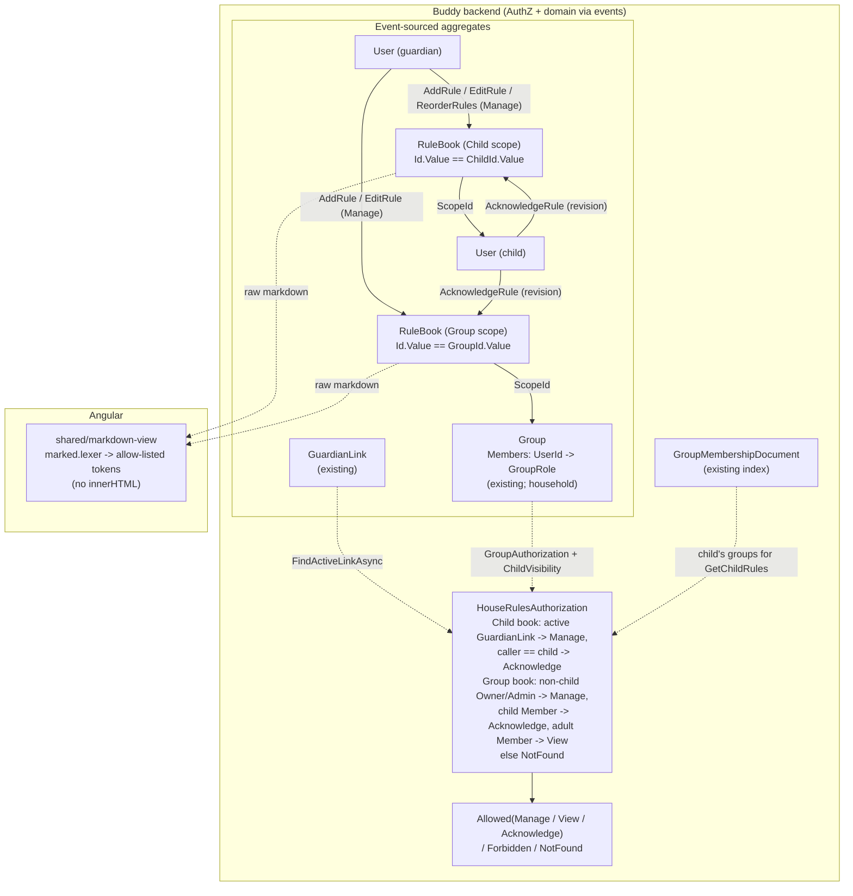

# House Rules

Status: Proposed (not yet implemented)

## Context

Families of children with ADHD often write down their agreements: when screens go off, what
happens after school before homework, how many reminders come before a consequence, what a
sleepover needs. Writing them down helps because the rules stop depending on who is asked and on
their mood that day. Children with ADHD in particular do better when expectations are explicit,
visible, short and the same every time. Some families keep a laminated sheet on the fridge.
Others keep a shared note that nobody can find.

Guardians want two kinds of rules:

- **Household rules** that apply to every child living in one home ("No phones at the dinner
  table", "Shoes off at the door"). When parents are separated, a child can live in two homes,
  and each home has its own rules.
- **Personal rules** for one child ("Emil: 45 minutes of gaming on school days, after
  homework"), because siblings differ in age, needs and agreements.

Rules are written in **markdown**. A guardian can then write a bulleted list of steps, a table
of screen-time allowances per weekday, or a bold "**never**" without the app needing a field
for each. Example:

```markdown
### Screen time

| Day       | Time    | When                |
|-----------|---------|---------------------|
| Mon--Thu  | 45 min  | after homework      |
| Fri--Sun  | 90 min  | after lunch         |

- Tablet goes on the charger in the kitchen at **19:30**.
- One reminder, then a 5-minute warning, then it's off.
```

Nothing like this exists in Buddy today. Some existing pieces come close:

- **Notes.** The free-text fields on `SleepDiary` (`SleepHygieneNotes`, 4000 characters, see
  [sleep-diary.md](sleep-diary.md)) are guardian-only notes about a child, not something the
  child reads.
- **Rendering.** The in-app help ([in-app-help.md](../../frontend/analysis/in-app-help.md)) is
  the only long-form text the app renders. It deliberately has "No markdown and no
  `innerHTML`, so there's nothing to sanitize". No markdown renderer, DOMPurify or
  `bypassSecurityTrust*` exists anywhere in the frontend.
- **Households.** There is no household aggregate. Family-wide data (`MealPlan`, the meal
  library) is resolved from the `GuardianLink` graph by
  [MealFamilyResolution.cs](../../../src/backend/buddy/Features/Mealplans/MealFamilyResolution.cs).
  A `Group` ([Group.cs](../../../src/backend/buddy/Features/Groups/Types/Group.cs)) can already
  contain children as `Member`s (`AddChildToGroup`), and the onboarding "setup group" is in
  practice the family's household.
- **Acknowledgement.** Nothing records that a user has read something. The only related
  concept is a guardian's one-off `AiDataSharingAcknowledged`
  ([AiProviderCredential.cs](../../../src/backend/buddy/Features/Mealplans/AiAssistant/Types/AiProviderCredential.cs)).

Settled with the product owner before this design:

- **A household is a `Group`.** Household rules belong to a group. A child in two homes sees
  both rule sets, each labelled with the group's name.
- **Children read and acknowledge.** A child sees their rules in the child area and taps
  "I've read this" after each new version, so guardians can see what has been agreed.
- **The rules can be printed** (for the fridge). Babysitters and other outside readers get
  nothing in v1 beyond the printout.

This document answers seven questions:

1. A new feature, or an extension of an existing one?
2. How is a rule book scoped and identified?
3. How is one rule modelled?
4. How is markdown stored and rendered safely?
5. Who can see and change rules?
6. How does acknowledgement work?
7. How do printing and the child view fit in?

## Question 1: extend an existing feature, or a new feature?

**Decision: a new feature, `Features/HouseRules`, with one new aggregate, `RuleBook`.**

- **Groups.** Rules aren't group administration. Putting rules on `Group` would add
  frequently edited, long-text content to an aggregate that is currently read on every
  calendar, meal plan and medicine authorization check (`CalendarAuthorization`,
  `MealplanGroupAuthorization`). It would also leave per-child rules with nowhere to live.
- **Sleep diary hygiene notes.** These are the closest "free text about a child", but they
  are guardian-only and have no versioning. This is the same reason every per-child feature
  so far got its own folder
  ([sleep-diary.md, Question 1](sleep-diary.md#question-1-extend-calendarsmedicines-or-a-new-feature)).
- **Feature flag.** The feature gets its own flag, `Features:HouseRules`, wired like the
  existing flags ([FeatureOptions.cs](../../../src/backend/buddy/Common/FeatureFlags/FeatureOptions.cs),
  [feature-flags.md](feature-flags.md)). A family that doesn't want it can turn it off.

## Question 2: rule book scope and identity

**Decision: one `RuleBook` stream per scope. The scope is either a child or a group, recorded
as a flat kind discriminator, and `RuleBookId.Value` equals the scope's id (`ChildId.Value` or
`GroupId.Value`). There is no index document.**

```
RuleBook(
    RuleBookId Id,                  // Id.Value == ScopeId (ChildId.Value or GroupId.Value)
    RuleBookScopeKind ScopeKind,    // Child | Group
    Guid ScopeId,
    ImmutableList<Rule> Rules,      // ordered as the guardian arranged them
    ImmutableDictionary<(RuleId Rule, UserId Child), int> Acknowledgements,  // see Question 6
    UserId LastModifiedBy)

enum RuleBookScopeKind { Child, Group }
```

**Why one book per scope and not one stream per rule.** A child or a group has exactly one rule
book. That is the 1:1 shape `ChildProgress` and `SleepDiary` already use
([gamified-progress.md](gamified-progress.md#why-progressidvalue--childidvalue-with-no-index-document),
[sleep-diary.md, Question 2](sleep-diary.md#question-2-aggregate-shape-and-identity)).
Reusing the scope's id as the stream id makes "find this child's or this group's rules" a
direct load.

A stream per rule was considered and rejected:

- Ordering would span many streams.
- "List this group's rules" would need an index document.
- A book holds at most a few dozen short rules, the same size class as a `TaskTemplate`'s
  ordered `Subtasks` list
  ([TaskTemplate.cs](../../../src/backend/buddy/Features/TaskLibrary/Types/TaskTemplate.cs)).
  That is where the `Rules`-as-entities shape and the `RulesReordered` fold come from.

**Why the scope is a flat discriminator, not a union.** `RuleBookScope = Child(UserId) |
Group(GroupId)` would be the natural C# shape. However,
[pickup-schedules.md, Question 3](pickup-schedules.md#question-3-modeling-who-a-flat-kind-discriminator-not-a-union)
found that a closed union inside a persisted event fails to round-trip through
`System.Text.Json` on Marten replay. `RuleBookStarted` carries the scope, so it follows the
same `Kind` + id fix.

**Why not use `MealFamilyResolution` for household rules.** "Siblings through a shared
guardian" can't tell two homes apart. A child whose parents live apart has one family under
that rule but two households. `MealFamilyResolution` also stops at one hop deliberately, to
avoid merging blended families. Household rules are exactly the case where that ambiguity
matters, and `Group` already models "the people in this home, with roles". This makes it the
first feature whose family-wide data is *owned* by a group instead of being *shared with*
one (compare [group-owned-mealplans.md](group-owned-mealplans.md), where the plan stays
family-owned).

**Deterministic ids across two kinds of scope.** `UserId` values come from Keycloak and
`GroupId` values are UUIDv7. A collision between them is practically impossible. The stored
`ScopeKind` makes any mismatch detectable: a load by a child id that finds a `Group`-kind book
is treated as `NotFound`.

**The stream is created lazily.** The first `AddRule` for a scope appends `RuleBookStarted`
and `RuleAdded` together, the same way `SleepDiaryStarted` is written by the first logged
night. A scope with no book reads as an empty list, not as `NotFound`, provided the caller has
access to the scope.

## Question 3: modelling one rule

**Decision: a rule is a short title plus a markdown body. It has a revision counter, and a
separate revision number that records when acknowledgement was last required.**

```
Rule(
    RuleId Id,                       // UUIDv7, like SubtaskId
    string Title,                    // 1--100 chars, plain text, shown as the heading
    string Body,                     // markdown, 0--4000 chars; "" means title-only
    int Revision,                    // 1 on add, +1 on every content edit
    int AcknowledgementRevision,     // last Revision that asked children to re-acknowledge
    UserId LastEditedBy,
    DateTimeOffset LastEditedAt)
```

- **A list of short rules, not one long document per book.** Short rules are easier to read,
  and each rule can show its own "new / changed" marker and its own acknowledgement. A
  child is asked to re-read "Screen time", not the whole rule book, after one change. One
  big markdown document was rejected because a single typo fix would make every child
  re-acknowledge everything.
- **The title is plain text; only the body is markdown.** A plain title can go in the child
  home badge, the print table of contents and acknowledgement lists without rendering
  anything.
- **The limits follow existing precedent.** 4000 characters matches
  `UpdateSleepHygieneNotes.Validator.MaxNotesLength`. A book holds at most 50 rules.
  Following [eliminate-nulls.md](eliminate-nulls.md), `Body` is a non-null string where `""`
  means "no body".
- **Not every edit needs re-acknowledgement.** `EditRule` takes `RequireReacknowledgement`
  (default `true` in the UI, with a "This is a small fix (spelling, wording)" checkbox that
  turns it off). Every content edit bumps `Revision`. Only the edits that require it move
  `AcknowledgementRevision` up to the new `Revision`. A guardian can fix a typo without
  resetting what the children have acknowledged.
- **History comes from `Before`/`After` events.** `RuleEdited` carries `Before`/`After`, like
  `SleepHygieneNotesUpdated` and `ItemDetailsUpdated`, so earlier wording is never lost. v1
  has no history screen (see open questions).

## Question 4: markdown, stored raw and rendered safely

**Decision: the backend stores and validates raw markdown text and never renders it. The
frontend parses it with `marked`'s lexer into a token tree and renders an allow-listed set of
token types with Angular templates. Nothing goes through `innerHTML`, so there is still
nothing to sanitize.**

This is the first user-authored rich text in the app. It is also read by children, on devices
that guardians install as home-screen apps
([ipad-installation.md](../../frontend/analysis/ipad-installation.md)). The safety property
[in-app-help.md](../../frontend/analysis/in-app-help.md) chose, "no `innerHTML`", is worth
keeping, so the renderer is designed around it.

### Supported markdown

| Supported (rendered) | Not supported (shown as plain text) |
|---|---|
| Headings `###`--`######` (`#`/`##` drop to `###` so they don't compete with the rule title) | Raw HTML (`<b>`, `<script>`, ``) |
| Paragraphs, line breaks | Images ``: no tracking pixels, and the CSP has `img-src 'self' data:` |
| **bold**, *italic*, ~~strikethrough~~, `inline code` | Footnotes, math, embeds |
| Bulleted and numbered lists, nested | Reference-style link definitions (still parsed, rendered as links) |
| GFM task lists `- [ ]` / `- [x]`, rendered read-only | |
| GFM tables, with column alignment | |
| Block quotes, horizontal rules | |
| Links, `http:`, `https:` and `mailto:` only, opened with `rel="noopener noreferrer"` and `target="_blank"` | |

A token type outside the allow list is rendered as its source text. This includes raw `html`
tokens and links with any other scheme, such as `javascript:`. Rendering them as text is
better than dropping them silently, because a guardian sees exactly what they typed.

### Frontend pieces

- **`shared/markdown-view/`** is a standalone component that takes `markdown: string`. In a
  `computed()` it runs `marked.lexer(markdown, { gfm: true })` and renders the tokens through
  a recursive `@switch (token.type)` template. Tables become `<table>` styled like the
  existing data tables, with horizontal scroll on narrow screens
  ([responsive-layout.md](../../frontend/analysis/responsive-layout.md)). It is the one
  place markdown appears, so every screen and the print page share it.
- **`marked` is added to `package.json`, pinned, and only its lexer is used.** It has no
  runtime dependencies and lexing doesn't execute anything. Its HTML renderer is never
  called.
- **`shared/markdown-editor/`** is a `<textarea>` with an Edit/Preview `segmented-control`
  (the existing shared control). It has a small toolbar that inserts syntax: bold, bulleted
  list, numbered list, checkbox list, table skeleton, link. A character counter shows the
  4000 limit. It is not a WYSIWYG editor. Toolbar labels go through i18n. The markdown itself
  is the guardian's own text and is never translated.

Alternatives considered and rejected:

- **`marked` or `markdown-it` to HTML, then DOMPurify, then `[innerHTML]`.** This is the
  common approach. It would be the app's first `innerHTML` and first `bypassSecurityTrust*`.
  The safety of every child-facing screen would then depend on keeping a sanitizer
  configured correctly. The app CSP is still `Report-Only`
  ([Caddyfile](../../../src/frontend/buddy/Caddyfile), open item in `TODO.md`), so the CSP
  provides no backstop either.
- **`ngx-markdown`.** It wraps the same HTML-then-sanitize path, adds an Angular-version
  dependency (the app is on Angular 22 preview builds), and pulls in highlighting and
  KaTeX features nobody asked for.
- **Rendering in the backend with Markdig and returning HTML.** The sanitizing and
  `innerHTML` problem stays. It also adds a second representation to keep in step, and the
  editor preview would need a round trip.
- **A structured editor (rule items, table rows as fields).** Each new layout would need a
  new form. Markdown was the explicit ask, and a list or table covers every example
  guardians gave.

The backend validates only lengths and a non-blank title. It never parses markdown. Markdown is just text to the API, the data
export and the event store.

## Question 5: who can see and change rules

**Decision: two scopes and three tiers, `Manage`, `View` and `Acknowledge`. Anyone else gets
`NotFound`.**

```
enum HouseRulesAccessTier { None, View, Acknowledge, Manage }
enum HouseRulesAccess { Allowed, NotFound, Forbidden }
```

| Scope | Tier | Who | Actions |
|---|---|---|---|
| Child book | **Manage** | An active guardian of the child (`FindActiveLinkAsync`) | Add, edit, remove and reorder rules; see who acknowledged what |
| Child book | **Acknowledge** | The child (`callerId == ChildId`) | Read; acknowledge a rule |
| Group book | **Manage** | A group `Owner`/`Admin` (`GroupAuthorization.CheckManage`) who is not a child | Same as above |
| Group book | **Acknowledge** | A child who is a group `Member` | Read; acknowledge a rule |
| Group book | **View** | A non-child group `Member` (for example a grandparent or a co-parent without admin rights) | Read, including acknowledgement status |

**Same structure as the existing authorization classes.** `HouseRulesAuthorization` mirrors
[MedicineAuthorization.cs](../../../src/backend/buddy/Features/Medicines/MedicineAuthorization.cs):

- A private `ResolveTier` per scope.
- Public `CheckManage`, `CheckView` and `CheckAcknowledge` methods.
- A `ToDeniedResult<T>()` extension.

As everywhere else, a caller with no relationship to the scope gets `NotFound`, so they can't
tell a private rule book from a missing one. A caller who can see the book but tries to write
gets `Forbidden`: a child calling `EditRule`, or a `View` member calling `AddRule`.

**Children never manage group rules, even if a group policy would allow it.** The check
follows `PrintTemplateAuthorization.IsGuardianMemberAsync`
([PrintTemplateAuthorization.cs](../../../src/backend/buddy/Features/PrintTemplates/PrintTemplateAuthorization.cs)),
which uses `ChildVisibility.IsChildAsync` to keep children out of group-owned templates. Today
a child can only ever be a group `Member`, so this is defence in depth. It stops a future role
change from letting a child rewrite their own rules.

**No group permission policy in v1.** `Group` already has three policy maps:
`CalendarPermissionPolicy`, `MealplanPermissionPolicy` and `MedicinePermissionPolicy`. A
fourth, `HouseRulesPermissionPolicy`, would let one group give `Member`s `Manage`. It isn't
worth it yet:

- It would mean a new `GroupHouseRulesPolicyUpdated` event.
- It would need the "seed empty on `GroupCreated`, append an explicit default in `CreateGroup`"
  migration dance from [group-owned-mealplans.md](group-owned-mealplans.md).
- It would need a fourth policy editor on the group page.

The fixed mapping (Owner/Admin manage, adult members view, child members acknowledge) is the
mapping that policy would default to anyway. Adding the policy later is additive (see open
questions).

**Guardians of a child in a group they don't administer.** Suppose a co-parent is a plain
`Member` of the other home's group. They can read that home's rules, which is the point of
having two households. They can't edit them; only that home's admins can. A child's
*personal* rule book is different: any active guardian of the child manages it, whichever
home they live in. Separated parents therefore share one personal rule book for the child.
That matches how `SleepDiary` and `MedicineSchedule` already treat every active guardian the
same.

## Question 6: acknowledgement

**Decision: a child acknowledges one rule at one revision. The acknowledgement is recorded as
an event on the rule book's own stream. A rule is "agreed" by a child when their acknowledged
revision is at least the rule's `AcknowledgementRevision`.**

```
Acknowledgements: ImmutableDictionary<(RuleId Rule, UserId Child), int AcknowledgedRevision>

isUpToDate(rule, child) = Acknowledgements.TryGetValue((rule.Id, child), out var r)
                          && r >= rule.AcknowledgementRevision
```

- **Per rule, not per book.** This follows from Question 3. A changed screen-time rule asks
  for one new tap, not a new tap for everything.
- **On the rule book stream, not a separate per-child stream.** The guardian overview ("who
  has agreed to what") then needs one load. In a group book the dictionary is keyed by child,
  so siblings acknowledge independently. A separate `RuleAcknowledgement` aggregate per child
  was rejected: the overview would need N extra stream reads, and nothing about an
  acknowledgement outlives its rule.
- **The request carries the revision the child saw:**
  `PUT .../rules/{ruleId}/acknowledgement { "revision": 3 }`. If a guardian edited the rule
  while the child was reading, the stale acknowledgement gets a `409`
  `house_rule_revision_changed`. The client reloads, and the child sees the new text before
  they can agree to it. Silently recording an acknowledgement of text the child never saw
  would defeat the purpose.
- **Repeating an acknowledgement for the same or an older revision succeeds without appending
  an event.** This matches the idempotent `PUT` convention
  ([http-status-codes.md](../http-status-codes.md)).
- **Only the child can acknowledge.** A guardian can't acknowledge on a child's behalf in v1
  (see open questions). The guardian view shows status only: "Emil ✓, Ida — not yet (changed
  2 days ago)".
- **Acknowledgement is not consent in any legal or GDPR sense.** It's a family tool, and the
  UI wording ("I've read this") says so.

## Question 7: the child view and printing

**Decision: one child-keyed read endpoint returns everything a child should see. That is their
personal rules plus the rules of every group they are a `Member` of, each section labelled
with its group name. The child area and the print page both use it.**

```
GET /house-rules/children/{childId}
  -> ChildRulesView(
       ChildRuleSection Personal,
       IReadOnlyList<ChildRuleSection> Households,     // one per group, ordered by group name
       int PendingAcknowledgements)

ChildRuleSection(RuleBookScopeKind ScopeKind, Guid ScopeId, string Label,
                 IReadOnlyList<RuleView> Rules)
RuleView(RuleId Id, string Title, string Body, int Revision, bool IsUpToDate,
         DateTimeOffset LastEditedAt)
```

- **How the child's groups are found.** Group membership is resolved through the existing
  `GroupMembershipDocument` index by `UserId`. Each group's book is then loaded directly by id
  (`RuleBookId.Value == GroupId.Value`). No new index is needed.
- **Who can call it.** The child can (Acknowledge tier), and so can an active guardian of the
  child (Manage tier on the personal book). A guardian sees every household section the child
  is in, including a household where the guardian isn't a group member. This is deliberate:
  a parent should know what their child has been asked to agree to in the other home. In that
  case the guardian only reads those rules; editing still requires Manage on that group.
  This is the one place a guardian sees group content through a child. See open questions.
- **Child home.** A card reads "2 rules to read" when `PendingAcknowledgements > 0`. It
  links to a new `/child/rules` route, behind `featureGuard('houseRules')`. The route shows
  sections as headings, each rule as a card with the `markdown-view`, a "New" or "Changed"
  chip when it isn't up to date, and an "I've read this" button.
- **Printing.** `/guardian/house-rules/print/children/:childId` and
  `/guardian/house-rules/print/groups/:groupId` sit outside the shell, like
  `/guardian/print/sheet/:templateId`. They use a portrait A4 layout and `print:` variants
  ([shared-sleep-diary.html](../../../src/frontend/buddy/src/app/features/shared-sleep-diary/shared-sleep-diary.html)
  is the precedent). The child print shows "Emil's rules": personal rules first, then each
  household. The group print shows one household's rules for the fridge. The week-plan print
  templates were rejected as the vehicle: their rows are per-day cells
  ([week-plan-print-templates.md](week-plan-print-templates.md)), and a rule isn't per day.

### Events

```
RuleBookStarted(RuleBookId Id, RuleBookScopeKind ScopeKind, Guid ScopeId,
    UserId StartedBy, DateTimeOffset OccurredAt)
    // appended with the first RuleAdded for a scope, never on its own
RuleAdded(RuleBookId Id, RuleId RuleId, string Title, string Body,
    UserId AddedBy, DateTimeOffset OccurredAt)
    // appended at the end of the list; Revision = AcknowledgementRevision = 1
RuleEdited(RuleBookId Id, RuleId RuleId, RuleContent Before, RuleContent After,
    int Revision, bool RequiresReacknowledgement, UserId EditedBy, DateTimeOffset OccurredAt)
RuleRemoved(RuleBookId Id, RuleId RuleId, RuleContent Before,
    UserId RemovedBy, DateTimeOffset OccurredAt)
RulesReordered(RuleBookId Id, ImmutableList<RuleId> Before, ImmutableList<RuleId> After,
    UserId ModifiedBy, DateTimeOffset OccurredAt)
RuleAcknowledged(RuleBookId Id, RuleId RuleId, UserId ChildId, int Revision,
    DateTimeOffset OccurredAt)

RuleContent(string Title, string Body)
```

- **Edits.** `EditRule` with content identical to the stored rule appends nothing, the same
  rule `LogSleepEntry` follows.
- **Removal.** `RuleRemoved` also drops that rule's acknowledgements in the fold. A removed
  rule is gone, not archived, because the event history already keeps its text.
- **Reordering.** `RulesReordered` must be a permutation of the current ids. The handler
  checks this and the fold throws on a violation, exactly as `ReorderSubtasksHandler` and
  `TaskTemplate.Reorder` do.

### Rehydration

`RuleBook.Start` handles `RuleBookStarted`. `RuleBook.Advance` folds the other five events
with the `Start`/`Advance` split that `Group` and `TaskTemplate` use. The split lets
`RuleBookSnapshotProjection` drive the same code as an inline snapshot in the `snapshots`
schema ([event-stream-snapshots.md](event-stream-snapshots.md)). The events go in a new Marten
schema, `houserules`.

## Read models

None beyond the inline snapshot. Every lookup is either by a known id (the child id or group
id is the stream id) or through an index that already exists (`GroupMembershipDocument` for
"which groups is this child in"). The guardian overview page lists the guardian's children
(`ListMyChildren`) and groups (`ListGroups`) and loads each book's snapshot.

## Command slices (`Features/HouseRules/`, same vertical-slice shape as `TaskLibrary`)

Each scoped slice is reachable through two routes, `children/{childId}` and
`groups/{groupId}`, which build the same command with a `RuleBookScope` value. This is the
dual-route shape mealplans already use (`/mealplans/children/...` and `/mealplans/groups/...`).

| Slice | Tier | Notes |
|---|---|---|
| `AddRule` | Manage | Appends `RuleBookStarted` too on first use. Max 50 rules. `postIdempotent` from the client |
| `EditRule` | Manage | `{ title, body, requireReacknowledgement }`. Identical content → no event |
| `RemoveRule` | Manage | Idempotent: an unknown `ruleId` returns `Success` with no event |
| `ReorderRules` | Manage | Body is the full ordered id list. A list that isn't a permutation → `400` |
| `ListRules` | View | One book with per-child acknowledgement status. `View` and `Manage` see the status; a child gets a `View`-shaped result with only their own status |
| `AcknowledgeRule` | Acknowledge | `{ revision }`. A stale revision → `409 house_rule_revision_changed` |
| `GetChildRules` | Acknowledge (self) / Manage (guardian) | The combined child view from Question 7 |

## Routes

```
POST   /house-rules/children/{childId}/rules                         AddRule
POST   /house-rules/groups/{groupId}/rules                           AddRule
PUT    /house-rules/{children/{childId}|groups/{groupId}}/rules/{ruleId}                   EditRule
DELETE /house-rules/{children/{childId}|groups/{groupId}}/rules/{ruleId}                   RemoveRule
PUT    /house-rules/{children/{childId}|groups/{groupId}}/rules/order                      ReorderRules
GET    /house-rules/{children/{childId}|groups/{groupId}}/rules                            ListRules
PUT    /house-rules/{children/{childId}|groups/{groupId}}/rules/{ruleId}/acknowledgement   AcknowledgeRule
GET    /house-rules/children/{childId}                                GetChildRules
```

Every route is rate-limited by the default per-user policy ([rate-limiting.md](rate-limiting.md)).
`GetChildRules` and `ListRules` take part in conditional GET like the other snapshot-backed
reads ([conditional-get-etags.md](conditional-get-etags.md)). The child home polls them
cheaply.

## Privacy (GDPR)

Rules are written *about* children, so they are personal data. `HouseRulesPersonalData`
registers an `IPersonalDataEraser` and an `IPersonalDataExporter`
([IPersonalDataEraser.cs](../../../src/backend/buddy/Common/Erasure/IPersonalDataEraser.cs)).
The meta tests in `PersonalDataEraserCoverageTests` require both.

- **Child erased.** The child's personal book stream is deleted, as
  `SleepDiariesPersonalData` deletes the diary. Their acknowledgements in group books are
  masked: the `RuleAcknowledged` events are erased with the `StreamErasure` helpers. Group
  books are not deleted, because they belong to the household.
- **Guardian erased.** Rules they wrote stay, since they belong to the child or the
  household, as group-owned print templates do
  ([PrintTemplatesPersonalData.cs](../../../src/backend/buddy/Features/PrintTemplates/PrintTemplatesPersonalData.cs)).
  The guardian's `UserId` on `AddedBy`/`EditedBy` is masked.
- **Group deleted.** The book becomes unreachable (`NotFound`, because group access fails
  first). Erasing its stream is left to group erasure ordering, the same way group calendars
  are handled.
- **Export.** For a child: their personal book and their acknowledgements. For a guardian:
  the rules they authored or edited.

## Frontend

- **Service.** `core/house-rules.service.ts`, with types generated from OpenAPI
  (`task docs:openapi`).
- **Guardian page `/guardian/house-rules`.** A `segmented-control` (or a select on narrow
  screens) picks the scope: each household group the guardian can see, then each child. The
  page shows the ordered rules with the `markdown-view`, an acknowledgement chip row per
  child, and add/edit/remove/reorder for `Manage`. The rule editor is a dialog with
  `markdown-editor`, using `repeatable-row`'s move-up/move-down pattern for ordering. Under
  `features/guardian/house-rules/`. Includes a nav link, a help topic
  ([in-app-help.md](../../frontend/analysis/in-app-help.md) gives every guardian page one),
  and print buttons.
- **Child route `/child/rules`** plus the "rules to read" card on child home
  ([home.html](../../../src/frontend/buddy/src/app/features/child/home/home.html)). Under
  `features/child/rules/`.
- **Print pages** as described in Question 7.
- **i18n.** `core/i18n/translations/{en,da}/house-rules.ts` holds UI chrome and editor
  toolbar labels (Danish name: "Husregler"). Rule content is never translated.
- **Onboarding.** No new step in v1 (see open questions).
- **Screenshots.** `screenshots/pages.ts` gets the guardian page, the child page and both
  print pages. `demo-family.ts` seeds a household book ("Screen time" with the table above,
  "Dinner", "Bedtime") and one personal rule for `demo.emil`, with `demo.ida` up to date and
  Emil not, so the "Changed" chip shows.

## Testing

Integration tests mirror TaskLibrary's
[ReorderSubtasks](../../../src/backend/buddy.IntegrationTests/Features/TaskLibrary/ReorderSubtasks)
tests and `SleepDiary`'s authorization tests. Feature-specific cases:

- every slice × both scopes × each tier (guardian, group admin, adult member, child member,
  stranger → `NotFound`);
- `AcknowledgeRule` with a stale revision gets `409`; the same revision again appends no
  event;
- a minor edit (`requireReacknowledgement: false`) keeps children up to date, and a normal
  edit doesn't;
- `GetChildRules` for a child in two groups returns two labelled household sections;
- removing a child from a group drops that section from `GetChildRules` immediately;
- golden-file `EventShapeTests` for the six events, plus a `SnapshotTests` entry.

Frontend:

- `markdown-view` specs per token type, plus these cases:
  - `<script>`, `` and `[x](javascript:alert(1))` render as literal text;
  - a table renders `<th>`/`<td>` with the right alignment;
  - no element in the output has an `innerHTML` binding (assert on the template);
- e2e: a guardian adds a household rule with a table, the child logs in, sees "1 rule to
  read", acknowledges it, and the guardian sees the tick.

## Failure and edge-case behavior

| Case | Behavior |
|---|---|
| Guardian opens a scope with no rules yet | `ListRules` returns an empty list, not `NotFound`. No stream until the first `AddRule` |
| Title-only rule (empty body) | Allowed. Body `""` |
| Body contains raw HTML or a `javascript:` link | Stored as typed. Rendered as plain text by the allow list |
| 51st rule | `400` validation error (`house_rules_limit_reached`) |
| `EditRule` with unchanged content | `Success`, no event, revision unchanged |
| `RemoveRule` for an already removed rule | `Success`, no event (idempotent) |
| `ReorderRules` with missing or extra ids | `400` |
| Guardian edits while a child is reading, child taps "I've read this" | `409 house_rule_revision_changed`. Client reloads and shows the new text |
| Child acknowledges a rule in a group they've been removed from | `NotFound` |
| Child calls `AddRule`/`EditRule` on their own book | `Forbidden` (they can see it, but can't write) |
| Adult group `Member` calls `AddRule` | `Forbidden` |
| Guardian's `GuardianLink` is revoked | The personal book drops to `NotFound` immediately. Group books still follow group membership |
| Group deleted | Its book is `NotFound` for everyone, and its section disappears from `GetChildRules` |
| Concurrent edits by two guardians | Last write wins. Both are kept in the event history (`Before`/`After`) |
| `Features:HouseRules = false` | Routes not mapped. Data and GDPR coverage stay, as for every flag |

## Estimate

| | |
|---|---|
| Complexity | High -- a new aggregate and Marten schema with six events, seven slices on dual child/group routes, a three-tier authorization over two scopes, GDPR erasure and export, the app's first markdown renderer and editor, and four new pages (guardian, child, two print pages) |
| Single developer | 12-18 days |
| AI agent | 6-10 hours, plus 3-5 hours of human review (the markdown allow list and the authorization matrix deserve a careful read) and settling the open questions |

## Decisions made

| Question | Decision |
|---|---|
| New feature or extend? | New `Features/HouseRules` with a `RuleBook` aggregate and its own feature flag |
| What is a household? | A `Group`. A child in two homes sees two labelled sections |
| Stream shape | One book per scope, `Id.Value == ChildId/GroupId`, flat `ScopeKind` discriminator, no index |
| Rule shape | Plain title plus markdown body (4000), ordered list, max 50 per book |
| Markdown rendering | `marked` lexer to token tree, Angular templates over an allow list; no `innerHTML`, no sanitizer |
| Markdown on the backend | Stored and validated as plain text, never parsed |
| Who manages | Child book: any active guardian. Group book: non-child Owner/Admin |
| Who reads | The child, plus adult group members (read-only) |
| Acknowledgement | Per rule and per revision, child only, `409` on a stale revision; minor edits can skip re-acknowledgement |
| Printing | Dedicated portrait print pages, not a week-plan row kind |
| Babysitters | Not in v1. They get the printout |

## Remaining open questions

- **Should a guardian be able to acknowledge on a child's behalf?** Young children who can't
  read yet go through the rules with a parent. Lean: not in v1. If it's needed, add
  `RuleAcknowledged.RecordedBy` and let `Manage` call `AcknowledgeRule` with an explicit
  `childId`. That change is additive.
- **Should guardians see household rules of a group they aren't in?** Through
  `GetChildRules`, a guardian sees every household their child belongs to. Lean: yes,
  because a parent should know what their child agreed to in the other home. If a family
  objects, restrict the household sections to groups the caller is also a member of. That
  change is a filter, not a redesign.
- **Is a group permission policy for rules needed?** Lean: wait until a family asks for
  "everyone in the group may edit". Adding it means a `HouseRulesPermissionPolicy` on `Group`
  with the migration pattern from
  [group-owned-mealplans.md](group-owned-mealplans.md).
- **Do rules need a history screen?** `RuleEdited` keeps `Before`/`After`, so a later "see
  earlier versions" view can be built from the events without changing data.
- **Should rules have structure beyond markdown,** such as a consequence, or a link to a
  goal post ([configurable-goal-posts.md](configurable-goal-posts.md)) so keeping a rule earns
  progress? Lean: no. Keep rules free-form until real usage shows a repeated pattern.
- **Should some rules apply only for a time** ("Summer holiday rules")? Lean: no for v1. A
  guardian can remove and re-add rules. An `ActiveFrom`/`ActiveTo` pair on `Rule` would be
  additive.
- **Should onboarding include a "write your first house rule" step?** Lean: no. Onboarding is
  already long ([guardian-onboarding.md](../../frontend/analysis/guardian-onboarding.md)). A
  dashboard hint after onboarding is cheaper.
- **Should the app CSP be enforced first?** It isn't required, because no `innerHTML` is
  introduced. It is still worth doing before or with this feature, as defence in depth for
  the first user-authored rich text.

## Diagram


