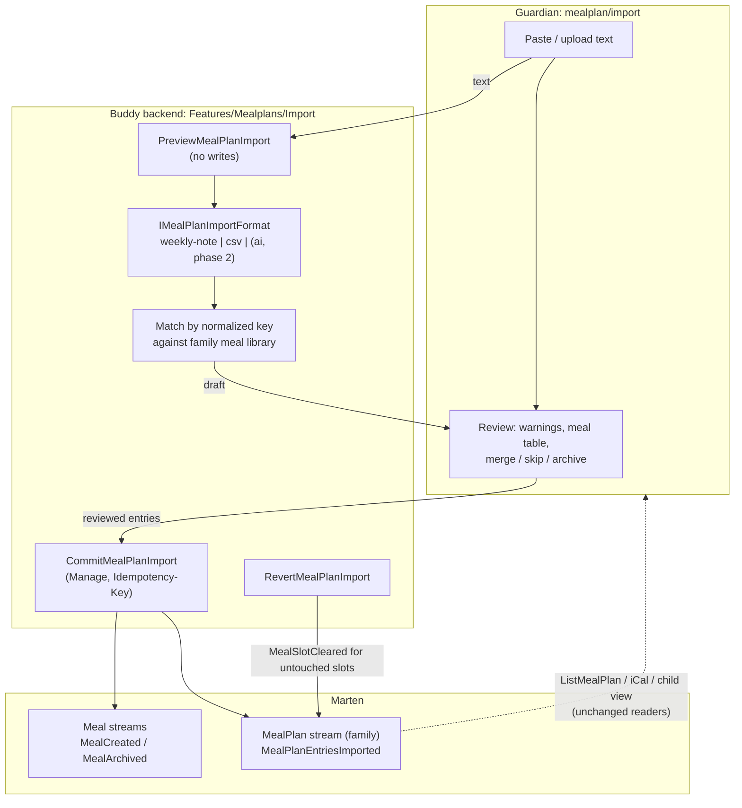

# Importing historical meal plans

Status: Implemented. `Features/Mealplans/Import/` ships the `weekly-note` and `csv` parsers behind `IMealPlanImportFormat`, the `PreviewMealPlanImport`, `CommitMealPlanImport`, `ListMealPlanImports` and `RevertMealPlanImport` slices (each with a `ForGroup` sibling), and the `MealPlanEntriesImported` and `MealPlanImportReverted` events. The guardian page is `/guardian/mealplan/import` (`MealplanImport`). It works on the family scope of the guardian's first child, the same as the AI assistant page; the group routes are API-only for now.

## Context

Families come to Buddy with years of meal plans already written down somewhere else: a phone
note, a spreadsheet, a whiteboard photo transcribed once a week, another app's export. Without
that history the meal library starts empty, the guardian week view has nothing to browse
backwards into ([mealplan-history-and-ratings.md](../../frontend/analysis/mealplan-history-and-ratings.md)),
and the AI assistant has no record of what the family actually eats.

The first real source is a phone note that covers January 2024 to the current week. It holds
roughly 130 weeks and 750 filled days:

```
Madplan 2026
U2
Sø: Fiskefrikadeller m salat og havreris
Ma: Kyllingeburger 🍔
...
Lø:

U3
...
Madplan 2025
U1
...
```

What a parser has to handle, measured on that note with a throwaway prototype:

| Observation | Example | Count |
|---|---|---|
| Year sections in **reverse** order, weeks ascending inside each | `Madplan 2026`, then `2025`, then `2024` | 3 sections |
| Weeks are `U<ISO week>` and run **Sunday to Saturday** | `U2` then `Sø:` ... `Lø:` | ~130 weeks |
| Day prefixes are abbreviated, sometimes in full, sometimes lower-case | `Sø:`, `Søndag:`, `on:` | 897 day lines |
| Empty days | `Lø:` | 142 |
| Typos in week headers | `U66` between `U5` and `U7`, `U42:` | 2 |
| A week with no header | first week of 2024 (it comes just before `U3`) | 1 |
| A week whose lines have no day prefix (order only) | 2025 `U42` | 6 lines |
| Not a meal: away, guests, holidays | `- Sommerhus`, `Ingen hjemme`, `Bedstefar`, `i Silkeborg`, `Juleaften` | ~36 |
| Leftovers | `rester`, `Lasagne rester` | ~16 |
| Alternatives | `Sushi / McD 🍱 🍟` | ~16 |
| Notes mixed into the meal text | `(Mor ikke hjemme)`, `+ GS`, emojis | many |
| Weeks missing altogether | no `U9` in 2026, no `U27`-`U32` in 2025 | normal |

After stripping emojis and parentheses, lower-casing, and treating `m`/`m.`/`med` as the same word,
the 683 meal lines still produce **446 distinct names**. Many of them are the same dish spelled
differently (`hotdog`/`hotdogs`, `indbagt laks m. salat`/`indbagt laks m. salatbar`). Matching
names to meals can therefore never be fully automatic. The guardian has to be able to review it
quickly.

The user expects other formats later, so the design has to support adding formats.

What exists today:

- Assigning a slot needs an existing `MealId`. Free text isn't accepted
  ([`AssignMealToSlot.Handler.cs:46-63`](../../../src/backend/buddy/Features/Mealplans/AssignMealToSlot/AssignMealToSlot.Handler.cs)).
- **There is no batch write.** Importing 750 entries through the existing API would take ~450
  `CreateMeal` calls plus 750 `AssignMealToSlot` calls. That is 1,200 requests, and they would run
  into the global rate limiter ([rate-limiting.md](rate-limiting.md)).
- `Meal` names have no uniqueness rule, so nothing would stop an import from creating
  "Lasagne" a second time ([`Meal.cs`](../../../src/backend/buddy/Features/Mealplans/Types/Meal.cs)).
- Nothing in the backend forbids past dates. The guardian UI makes past weeks read-only
  ([`assign-mealplan.ts`](../../../src/frontend/buddy/src/app/features/guardian/mealplan/assign-mealplan/assign-mealplan.ts)),
  so today a guardian can't enter history by hand either.
- The AI assistant already turns a conversation into a reviewed **draft** of assignments, which the
  guardian then applies
  ([`ApplyAiSessionDraft.Handler.cs`](../../../src/backend/buddy/Features/Mealplans/AiAssistant/ApplyAiSessionDraft/ApplyAiSessionDraft.Handler.cs)).
  The draft-then-apply pattern is the closest precedent. Its `IAiChatClient` is the obvious basis
  for parsing formats nobody has written a parser for yet.

This document answers seven questions: where parsing happens and how formats plug in, how the
import is staged, how text becomes meals, what to do with lines that aren't meals, how the plan is
written, who may import, and how this note's date rules work.

## Question 1: where parsing happens, and how formats plug in

**Decision: deterministic parsers in the backend, one class per format behind an
`IMealPlanImportFormat` interface, chosen explicitly or by auto-detection. An AI-assisted format
for anything else comes later and implements the same interface.**

```csharp
public interface IMealPlanImportFormat
{
    MealPlanImportFormatId Id { get; }          // "weekly-note", "csv", later "ai"
    // 0..1 confidence that `text` is in this format; the highest score wins auto-detection.
    double Detect(string text);
    // Validation when the text can't be read at all, e.g. a week before any year line.
    Result<ParsedImport> Parse(string text, MealPlanImportOptions options);
}

public sealed record ParsedImport(
    IReadOnlyList<ParsedImportLine> Lines,       // one per filled day
    IReadOnlyList<ImportWarning> Warnings,       // line number + code + message
    int EmptyDays);                              // day lines with nothing after the prefix

public sealed record ParsedImportLine(
    int LineNumber, DateOnly Date, MealSlot Slot, string RawText,
    ImportLineKind Kind,                         // Meal | Alternatives | Leftovers | Away
    string MealName,                             // cleaned display name
    string Notes,                                // text moved out of the name: "(Mor ikke hjemme)", "+ GS"
    string Key);                                 // normalized matching key (Question 3)
```

The formats are plain classes in a static `MealPlanImportFormats.All` list, not DI services: they
are pure functions with no dependencies, the same as `MealPlanExpansion`.

Formats in v1:

- **`weekly-note`**: this note's shape. Year headers (`Madplan 2026`, also a bare `2026`), week
  headers (`U2`, `Uge 2`, `W2`, with or without a trailing `:`), and day lines (Danish and English
  day names, abbreviated or full, any case). One set of rules, so a second family's note with
  `Uge 12` / `Mandag:` works too.
- **`csv`**: `date;meal[;slot][;notes]` (`,` or `;` separator, ISO dates or `dd-mm-yyyy`). This is
  the way out for every other system: anything that exports to a spreadsheet can produce it.

Rationale:

- Parsing is pure string-to-records work. It belongs in a static, unit-testable class, the same as
  [`MealPlanExpansion`](../../../src/backend/buddy/Features/Mealplans/MealPlanExpansion.cs) and
  `MealPlanIcalFeedWriter`. Golden-file tests over sample notes lock the behavior in.
- The parser needs the family's meal library to suggest matches (Question 3). That library is on
  the server already.
- A later AI format reuses the BYOK `IAiChatClient` and the family's stored provider key, and those
  only exist server-side.

Rejected:

- **Parsing in the browser.** It would work for `weekly-note`, but a later AI format would then
  live on a different tier from the rest, and the matching logic would be duplicated.
- **AI-only parsing.** 750 entries is a big prompt, and the result isn't deterministic, so you
  can't re-run it and get the same draft. It needs a configured provider key, and it sends three
  years of a family's life to a third party when a 150-line parser would do. The AI is the right
  tool for the format nobody wrote a parser for, not the default.

## Question 2: one step or preview-then-commit?

**Decision: two stateless calls. `PreviewMealPlanImport` parses and matches, writes nothing, and
returns a draft. The guardian reviews and edits the draft in the browser. `CommitMealPlanImport`
receives the edited draft and writes it in one go.**

This is the AI assistant's draft-then-apply flow without the persisted session.

- The preview is a pure function of (text, format, options, current meal library), so it can be
  repeated as often as needed and never needs storing.
- The commit body is the reviewed draft, not the raw text. That way the server writes exactly what
  the guardian saw and approved, even after manual fixes.
- ~750 rows is ~100 KB of JSON, which is fine for one request. The commit is capped at 2,000
  entries; a larger history goes in several commits (one per year, say).

Rejected: **a persisted `MealPlanImport` aggregate holding the draft between steps** (the
`MealplanAiSession` shape). It would let a guardian close the tab halfway through the review and
come back. It also adds a stream, a snapshot, discard semantics and expiry for a task done once or
twice per family. If reviews turn out to take longer than one sitting, the frontend can keep the
unsent draft in `localStorage` first.

## Question 3: how text becomes meals

**Decision: match by a normalized name key. Show the review grouped by distinct name, not by day.
Matching by key is automatic, fuzzy matches are only suggested, and the guardian decides everything
else.**

The normalized key: lower-case, emojis and parentheses removed, `m`/`m.`/`med` folded to `m.`,
whitespace collapsed, trailing punctuation trimmed.

For each distinct key, the preview proposes one **resolution**:

| Resolution | When proposed | What commit does |
|---|---|---|
| `Existing(mealId)` | the key equals the key of an existing meal (an active one wins over an archived one) | assigns that meal |
| `New(name)` | no match | creates the meal once, then assigns it |
| `MergeInto(otherKey)` | never proposed; the guardian picks it | uses the other group's resolution |
| `Skip` | `Away` / `Empty` lines (Question 4) | writes nothing for those days |

Fuzzy matching (token-set similarity above a threshold, and singular/plural) only fills a
**"Did you mean …?"** suggestion. `hotdogs` → `hotdog` is suggested, never applied, because
`rugbrød` and `rugbrød m. fisk` are different dinners to this family.

Grouping turns 751 rows into ~446 decisions. Sorted by number of occurrences, the top 50 names
cover most of the days. The long tail of one-off dishes can be accepted as "create new" in bulk.

The display name of a new meal is the cleaned text with the original capitalization, without
emojis and without the parts moved to notes. Icon and color come from a fixed default (the same
default `CreateMeal`'s form preselects), and the guardian can edit them later in Manage meals.

**Meals that appear once.** Creating 300+ meals that each appeared once would bury the meal picker.
**Lean: meals created by an import that occur fewer than 2 times and not in the last 90 days are
archived at the end of the commit.** An archived meal can't be newly assigned, but its plan
entries and ratings stay readable
([`MealEvents.cs`](../../../src/backend/buddy/Features/Mealplans/Types/MealEvents.cs), `MealArchived`).
The commit assigns the meal first and archives it afterwards, so the existing "cannot assign an
archived meal" rule is never hit. The preview shows the rule as a checkbox ("Archive meals used
only once"), checked by default.

## Question 4: lines that aren't meals

**Decision: every parsed line gets a `Kind`. Only `Meal` and `Alternatives` lines are proposed for
import by default. The guardian can change a group's resolution.** A day with nothing after its
prefix (or only emojis and parentheses) produces no line at all and is counted in `EmptyDays`.

| Kind | Detected by | Default |
|---|---|---|
| `Away` | starts with `-`; or contains `ingen hjemme`, `sommerhus`, `bedstefar`, `juleaften` and similar; or starts with `ikke hjemme` / `spise(r) hos`; or is `i <Place>` | skipped, listed in the review |
| `Leftovers` | key starts with `rester`, or is `<meal> rester` | skipped. "Map all leftovers to one meal 'Rester'" is offered as one click |
| `Alternatives` | ` / ` between two names | the **first** name becomes the meal; the full text goes into `Notes` |
| `Meal` | everything else | imported |

Text in parentheses (`(Mor ikke hjemme)`, `(Viggos filmaften)`) and a trailing `+ GS` are moved
from the name into `MealPlanAssignment.Notes`, which already exists and holds up to 2,000 chars
([`MealPlanAssignment.cs`](../../../src/backend/buddy/Features/Mealplans/Types/MealPlanAssignment.cs)).
So `Spaghetti m. ostepølser + GS 🍝` matches the meal `Spaghetti m. ostepølser`, and its note says
`+ GS`.

Running the prototype over the real note turned up three more shorthands, now handled in
[`ImportLineClassifier`](../../../src/backend/buddy/Features/Mealplans/Import/ImportLineClassifier.cs):

- `m/` and `u/` are Danish shorthand for "med"/"uden". They become `m.`/`u.` before
  alternatives are split, so `Bagels m/ laks` stays one dish.
- After an arrow (`Tomatsuppe -> Pizza`) the plan changed: the dish after the last arrow is the meal,
  and the whole text goes into notes.
- Text after a spaced dash (`Nachos - Sally ikke hjemme`) is a note. That is also why `ikke hjemme`
  only marks an away day at the start of the text.

The `Away` markers are a heuristic tuned to one family's writing. They're two string lists at the
top of `ImportLineClassifier`. A misclassified group costs one click in the review, so they aren't a
user setting yet; moving them into `MealPlanImportOptions` is additive if another family's notes
need different words.

## Question 5: how the plan is written

**Decision: one new `MealPlan` event, `MealPlanEntriesImported`, carrying all the assignments of
one commit, appended in a single transaction together with the `MealCreated` (and, where needed,
`MealArchived`) events of the new meals.** Meals and plans live in the same Marten store, so
`IMealPlanEventStore.ImportAsync` writes every new meal stream, its `MealIndexDocument`, and the plan
events (starting the plan stream with `MealPlanCreated` when the family has none) in one
`SaveChangesAsync`. A meal archived by the single-use rule is created as `[MealCreated, MealArchived]`
in its own stream; it never goes through the "cannot assign an archived meal" check.

```
MealPlanEntriesImported(
    MealPlanId Id,
    MealPlanImportId ImportId,              // UUIDv7, returned to the client
    MealPlanImportFormatId Format,          // "weekly-note", "csv"
    ImmutableArray<ImportedMealPlanEntry> Entries,  // (DateOnly Date, MealSlot Slot, MealPlanAssignment Assignment)
    ImmutableArray<MealId> CreatedMealIds,          // what a revert may archive
    UserId ImportedBy,
    DateTimeOffset OccurredAt)

MealPlanImportReverted(MealPlanId Id, MealPlanImportId ImportId, UserId RevertedBy, DateTimeOffset OccurredAt)
    // appended after the revert's MealSlotCleared events; makes a second revert a no-op
```

**Imports are not aggregate state.** `ListMealPlanImports` and `RevertMealPlanImport` fold them
straight from the plan's events (`MealPlanImportHistory`). The alternative was adding an `Imports`
field to `MealPlan`, which would change the shape of every stored `MealPlanSnapshot` for something
only these two rarely-used slices read.

`MealPlan.Advance` folds it as the same `SetItem` per entry that `MealAssignedToSlot` already does:

```csharp
// MealPlan.cs:68 today
MealAssignedToSlot assigned => plan with
{
    Assignments = plan.Assignments.SetItem((assigned.Date, assigned.Slot), assigned.Assignment)
},
// added
MealPlanEntriesImported imported => plan with
{
    Assignments = plan.Assignments.SetItems(imported.Entries.Select(e =>
        KeyValuePair.Create((e.Date, e.Slot), e.Assignment)))
},
```

The change is additive and touches 6 places (both new events):

- a new case in the `MealPlanEvent` union and in `FromPayload`/`EventType`
  ([`MealPlanEvents.cs`](../../../src/backend/buddy/Features/Mealplans/Types/MealPlanEvents.cs));
- the new `Advance` cases (`MealPlanImportReverted` is an explicit `=> plan`);
- one `Apply` in [`MealPlanSnapshotProjection`](../../../src/backend/buddy/Features/Mealplans/Types/MealPlanSnapshotProjection.cs);
- registration in `MealplansFeature.cs:30`;
- two new golden files under `EventShapeTests/GoldenFiles/Mealplans/`;
- `IMealPlanEventStore.ImportAsync` for the single-transaction write.

No existing event changes shape. `ListMealPlan`, the iCal feed, the child view and ratings all read
the folded `Assignments`, so they show imported days without changes.

Why one event and not 750 `MealAssignedToSlot`:

- **Provenance.** The stream says "these 683 days came from an import on 2026-10-06 by Sara". The
  alternative is 683 events that look like someone spent an evening clicking.
  `MealAssignedToSlot.OccurredAt` is always "now", so the history couldn't be backdated honestly
  anyway.
- **Undo.** `RevertMealPlanImport(importId)` can append a `MealSlotCleared` for each entry whose
  slot **still** holds the imported assignment. Slots someone has changed since the import are
  left alone. Without the import id there is nothing to find "the import" by.
- **Atomicity.** One append either lands or doesn't, with no half-imported 2025.

**Conflict rule: an import never overwrites.** Before writing, the commit handler rehydrates the
plan. Any `(date, slot)` that already holds an assignment is dropped from `Entries` and reported
back as `skipped: occupied`. The preview reports the same conflicts up front. This makes a re-run
of the same import a no-op, and keeps imported history from overwriting the plan a guardian made by
hand.

The commit endpoint also takes an `Idempotency-Key`, like every other create-style POST
(`IdempotencyKeyMiddleware`, `postIdempotent` on the frontend). A double-clicked "Import" can't
create every new meal twice.

Rejected: **a separate "history" aggregate.** It would mean every reader merges two sources, and
imported days would behave differently from typed ones (no ratings, not in the iCal feed). History
is just plan entries with older dates.

## Question 6: who may import

**Decision: `Manage` tier, exactly like `AssignMealToSlot`.** That means a guardian with an active
`GuardianLink` on the family route, or `Manage` through the group policy on the group route
([`MealplanAuthorization.cs`](../../../src/backend/buddy/Features/Mealplans/MealplanAuthorization.cs),
[`MealplanGroupAuthorization.cs`](../../../src/backend/buddy/Features/Mealplans/MealplanGroupAuthorization.cs)).
Anything else gets `NotFound`, the same collapse as every other mealplan route.

The group variant resolves `AnchorChildId` and calls the same `ImportForChildAsync` core, the same
pattern as `CreateMealForGroup`/`AssignMealToSlotForGroup`. Children never see the import screen.
They only see the resulting history in their week view.

## Question 7: dates in a week-numbered note

**Decision: `U<n>` is the ISO week `n` of the section's year. The note's weeks run Sunday to
Saturday, so `Sø` is the Sunday *before* ISO week `n`'s Monday, and `Ma`-`Lø` are that ISO
week's Monday to Saturday. Every import is a Dinner.** Week start and slot are options with these
defaults, so a Monday-first note, or a lunch-box list, needs no new parser.

```
date(year, n, day) = ISO-Monday(year, n) + offset(day)      // Sø = -1, Ma = 0, ..., Lø = +5
U2 2026, Sø  ->  2026-01-04          U1 2025, Sø  ->  2024-12-29   (crosses the year, correctly)
```

Recovery rules, each reported as a warning with its line number, never silently:

| Problem | Rule | Warning |
|---|---|---|
| Week number > 53, or not greater than the previous week in its section (`U66` after `U5`) | previous week + 1 | `week_number_corrected` |
| Day lines before any week header (first week of 2024) | the next header's week − 1 | `week_number_inferred` |
| Day line without a day prefix (2025 `U42`) | the next day after the previous line, starting with the week's first day | `day_inferred_from_position` |
| Two lines for the same day in one week | the last one wins | `duplicate_day` |
| A year header missing above the first week | the import is rejected: `400`, "Add a year line such as 'Madplan 2026'" | -- |
| Dates in the future | allowed; the note's current week is a normal part of the plan | -- |

The review lists every warning next to the parsed result, so the guardian can check that U42's six
dishes ended up on the right days. They can fix the text and preview again, or move a row in the
review.

## Command slices (`Features/Mealplans/Import/`, same shape as `AiAssistant/`)

| Slice | Tier | Notes |
|---|---|---|
| `PreviewMealPlanImport` (+`ForGroup`) | Manage | Body: `{ text, format?: "auto" \| "weekly-note" \| "csv", weekStart?, slot? }`. Text up to 256 KB. Parses, matches against `MealFamilyResolution`'s library, flags occupied slots. Writes nothing. Returns `{ format, lines[], groups[], warnings[], conflicts[] }` |
| `CommitMealPlanImport` (+`ForGroup`) | Manage | Body: `{ format, entries: [{ date, slot, mealId? \| newMealName?, notes }], archiveSingleUse }`, at most 2,000 entries. Entries whose `newMealName` normalizes to the same key share one new meal, so a merge in the review is just "send the same name". Creates the new meals, appends one `MealPlanEntriesImported` (creating the `MealPlan` stream when it's missing, as `AssignForChildAsync` does), archives the single-use meals. Returns `{ importId, imported, createdMeals, archivedMeals, skipped[] }` |
| `RevertMealPlanImport` (+`ForGroup`) | Manage | Clears the slots that still hold the import's assignment, and archives the meals that import created and that nothing else uses. Idempotent |
| `ListMealPlanImports` | Manage | Folded from the stream: `importId`, format, date range, entry count, who imported it and when. Feeds the "Undo import" list |

## Routes

```
POST   /mealplans/children/{childId}/imports/preview            PreviewMealPlanImport
POST   /mealplans/children/{childId}/imports                    CommitMealPlanImport   (Idempotency-Key)
GET    /mealplans/children/{childId}/imports                    ListMealPlanImports
DELETE /mealplans/children/{childId}/imports/{importId}         RevertMealPlanImport
POST   /mealplans/groups/{groupId}/imports/preview              PreviewMealPlanImportForGroup
POST   /mealplans/groups/{groupId}/imports                      CommitMealPlanImportForGroup
GET    /mealplans/groups/{groupId}/imports                      ListMealPlanImportsForGroup
DELETE /mealplans/groups/{groupId}/imports/{importId}           RevertMealPlanImportForGroup
```

Preview runs a parser over at most 256 KB, which is cheap, so the global limiter is enough. The
AI format in phase 2 goes under the existing `ai-assistant` policy.

## Frontend

A new guardian page, `mealplan/import` (`features/guardian/mealplan/import/`), linked from the
meal-plan page next to "AI assistant". Like the AI assistant, it works on the family scope of the
guardian's first child; a group-scope picker can come later, since the API already has the group
routes. It follows the
[`ai-assistant`](../../../src/frontend/buddy/src/app/features/guardian/mealplan/ai-assistant/)
screen's draft-and-apply layout:

1. **Paste or upload.** A textarea, plus a `.txt`/`.csv` file picker (read in the browser with
   `File.text()`), a format select defaulting to "Detect automatically", and the week-start and
   slot options under "Advanced".
2. **Review.**
   - A summary line: "751 days from 14 Jan 2024 to 9 Oct 2026 · 412 new meals · 37 matched · 36
     away days skipped · 3 already planned".
   - The warnings, with line numbers.
   - The **meal table**, one row per distinct name, sorted by occurrences. Each row has its
     resolution (match / new / merge into… / skip), the "Did you mean" suggestion, and an expandable
     list of the dates. (Built without the expandable date list; the row shows the first and last date.)
   - The **archive single-use meals** checkbox.
3. **Done.** Counts, plus links to the oldest imported week and to "Undo this import".

Other pieces:

- Service: `previewImport`, `commitImport` (`postIdempotent`), `listImports` and `revertImport` on
  [`core/mealplans.service.ts`](../../../src/frontend/buddy/src/app/core/mealplans.service.ts),
  using the existing `MealplanScope` for the family/group switch.
- Strings: `core/i18n/translations/{en,da}/mealplan.ts` under `mealplan.import.*`.
- The new route needs an entry in `screenshots/pages.ts`, plus a seeded import in `demo-family.ts`
  so the screenshot shows the review step with data.

## Testing

- **Parser unit tests** (pure, no Docker) over committed fixtures. The fixtures are trimmed, made-up
  copies of the note's shape that cover every row of the Question 7 table and every `Kind`. The
  family's real note is not committed.
- **Alba integration tests**, mirroring
  [`AssignMealToSlot`'s tests](../../../src/backend/buddy.IntegrationTests/Features/Mealplans/):
  - preview writes nothing;
  - commit creates meals and assignments, and `ListMealPlan` returns them for a 2024 week;
  - occupied slots are skipped;
  - re-committing is a no-op;
  - revert clears only untouched slots;
  - `NotFound` for a non-guardian or a revoked `GuardianLink`;
  - the group `Manage` tier works, and the group `View` tier gets `NotFound`;
  - a 2,001-entry commit gets `400`.
- A golden file for `MealPlanEntriesImported` in `EventShapeTests`, and a `SnapshotTests` case for
  the new `Apply`.
- **Playwright**: paste a 3-week note, merge one suggested duplicate, import, open the oldest week
  and see the dishes.

## Failure and edge-case behavior

| Case | Behavior |
|---|---|
| Format can't be detected | `400 validation_error` with "Choose the format explicitly"; the UI shows it under the preview button |
| Nothing importable after parsing | Preview succeeds with zero entries; commit is disabled |
| A slot already holds a meal | Skipped, never overwritten; listed as `occupied` in preview and in the commit result |
| The same import committed twice | The second time, every slot is occupied, so nothing is written. With the same `Idempotency-Key`, the first response is replayed |
| `mealId` is archived by commit time | Allowed: imports may point at archived meals, which is how one-off dishes stay out of the picker |
| `mealId` is not in the family's library | `400` for the whole commit; nothing is written |
| A meal name over 200 chars | The parser truncates it at a word boundary and puts the full text in `Notes`; a commit with a longer `newMealName` gets `400` |
| A guardian edits an imported slot, then reverts the import | That slot keeps the guardian's edit; only untouched slots are cleared |
| Two guardians import into a family with no `MealPlan` stream yet | Same race as the first `AssignMealToSlot` (`MealPlanEvents.cs:43-53`); accepted for v1 |
| The `GuardianLink` is revoked mid-review | Commit returns `NotFound` |

## Decisions made

| Question | Decision |
|---|---|
| Where parsing runs | Backend, deterministic `IMealPlanImportFormat` per format; AI-assisted parsing comes later as one more format |
| v1 formats | `weekly-note` (this note, plus `Uge`/`W`/English variants) and `csv` (the way in from any other system) |
| Staging | Stateless preview, then a commit of the reviewed draft; no import aggregate |
| Meal matching | Exact normalized key automatic; fuzzy matches suggested only; review grouped per distinct name |
| Non-meal lines | Classified (`Away`, `Leftovers`, `Alternatives`, `Empty`); away and empty days skipped; side notes moved to `Notes` |
| Write model | One `MealPlanEntriesImported` event per commit on the family's existing stream; never overwrites occupied slots |
| Undo | `RevertMealPlanImport` clears the slots that still hold the import's assignment |
| Authorization | `Manage`, family and group routes, the same as `AssignMealToSlot` |
| Dates | `U<n>` = ISO week; `Sø` is the day before that week's Monday (confirmed by the note's author); slot Dinner; both configurable |
| One-off meals | Archived by default when used fewer than 2 times and not in the last 90 days; a toggle turns it off |
| Leftovers | Skipped by default; one click imports them all as one meal "Rester" |
| v1 scope | `weekly-note` + `csv`, preview/commit/list/undo, family and group routes; no AI format |

## Remaining open questions

- **AI-assisted format (phase 2).** Lean: an `ai` format that sends the text in chunks of about 60
  lines to the family's configured provider, with one tool, `propose_import_line(line_number, date,
  slot, meal_name, kind, notes)`. Its output feeds the same review. It is additive (one more
  `IMealPlanImportFormat`) and only worth building once a format arrives that `csv` can't
  reasonably cover.
- **Ratings in old notes.** Some systems store stars or "kids liked it". `MealRated` can only be
  appended by the child (`MealEvents.cs:51-56`), so importing ratings would break that rule. Lean:
  out of scope; put them in `Notes`.

## Diagram


