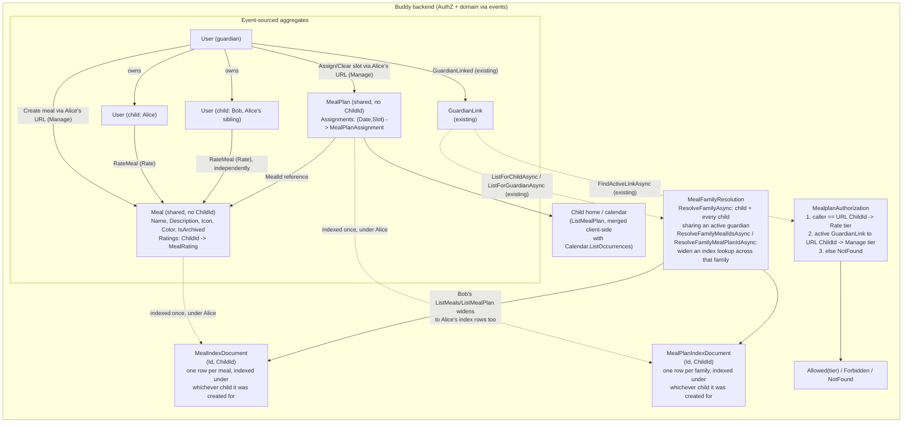

# Meal Plans

Status: Implemented

## Context

A guardian wants to plan what a child eats — mostly dinner, but sometimes
breakfast/lunch/snacks too — and have that plan show up somewhere the child
can see it, the same way a [medicine schedule](medicine-schedules.md) shows up
on the child's home screen. Two things guardians asked for on top of "write
down what's for dinner":

1. **Reusable meals.** The same dish (e.g. "Tacos") gets planned repeatedly.
   A guardian shouldn't have to retype name/description/icon every time —
   they pick "Tacos" from a list once it exists.
2. **Child feedback.** After (or independent of) being served, the child can
   rate a meal, so guardians planning next week can see "this one didn't land"
   without relying on memory.

Neither concept exists today. `Calendar`/`CalendarItem`
([glossary.md](../glossary.md)) has no notion of a reusable "thing being
scheduled" — every `CalendarItem` is scheduled directly, once. There is also
nothing resembling a rating/feedback concept anywhere in the codebase (a
targeted grep across `buddy` for rating/feedback/score returns nothing).

## Question 1: extend `Calendars`, or a new feature?

**Decision: a new feature, `Features/Mealplans`, with its own aggregates.**
Not a new `CalendarItemKind`.

Reasoning — the same shape of argument
[medicine-schedules.md](medicine-schedules.md#question-1-extend-calendars-or-a-new-feature)
already made for doses:

- A meal plan slot needs a reference to a separate, reusable entity (`Meal`)
  and a rating that lives on that entity, not on the occurrence. `CalendarItem`
  has no concept of "points at another reusable aggregate" today, and adding
  one purely for meal plans would mean carrying a meaningless field on every
  `Event`/`Task`.
- Rating is a domain concept `Calendars` has no reason to know about. Bolting
  it onto `CalendarItem` would leak a meal-specific concept into a generic
  primitive used by unrelated event/task scheduling.
- A meal plan's permission model is the same narrow two-principal shape as
  `MedicineSchedule` (see "Authorization" below) — no members, no groups —
  which is a poor fit for `Calendar`'s three-tier `CalendarRole` (see
  [group-owned-calendars-and-permissions.md](group-owned-calendars-and-permissions.md)).
- This keeps `Calendars` completely untouched, exactly as `Medicines` did.

## Question 2: one aggregate, or two?

**Decision: two aggregates — `Meal` (the reusable library entry) and
`MealPlan` (one stream per child, holding that child's dated slot
assignments).** Not one combined aggregate, and not one stream per planned
day/slot.

Reasoning:

- `Meal` and "a specific day's dinner" have different lifetimes and different
  authors of change: a `Meal`'s name/description gets edited rarely and
  independently of any specific date; a plan assignment changes weekly. Event
  sourcing an edit to "Tacos" (say, a typo fix) should not touch every
  `MealPlan` slot that ever referenced it — it shouldn't touch `MealPlan` at
  all, since `MealPlan` only stores a `MealId` reference.
- Rating belongs on `Meal`, not on a slot assignment, because you asked for
  "ratings on the reusable meal" (an opinion of the dish itself, updated over
  time as the child's taste is confirmed/changes) rather than "did you like
  Tuesday's dinner specifically."
- A `MealPlan` per child (rather than one stream per planned day, or one per
  planned slot) mirrors `MedicineSchedule.DoseLog`: a single sparse
  dictionary keyed by `(Date, Slot)`, holding only slots that have actually
  been assigned. This avoids one Marten stream per calendar day/slot — a
  meal plan for a year is one stream, not hundreds — and there is no
  recurrence engine needed at all (unlike doses, nothing here auto-generates
  future entries; a guardian assigns each date/slot explicitly), which makes
  `MealPlan` simpler than `MedicineSchedule`, not more complex.

## Question 3: sharing a `Meal`/`MealPlan` across siblings

The first version of this design scoped `Meal` and `MealPlan` to a single
`ChildId`, deferring sibling sharing as an open question. That turned out to
be wrong for the actual ask: a guardian should never have to recreate "Tacos"
or re-assign Tuesday's dinner once per child — one family, one meal library,
one plan.

**Decision: `Meal` and `MealPlan` carry no `ChildId` at all. Sibling sharing
is resolved entirely at read time, from the existing `GuardianLink` graph,
by a new `MealFamilyResolution` helper** — not by introducing a
`Family`/`Household` aggregate.

Reasoning:

- There is still no `Family` aggregate anywhere in this codebase, and adding
  one purely to group children would be exactly the kind of speculative
  structural change the rest of this codebase avoids. The data needed to
  answer "who are this child's siblings" already exists: `GuardianLink`
  connects guardians and children, and two children are siblings if they
  share at least one active guardian.
  `IGuardianLinkEventStore.ListForChildAsync`/`ListForGuardianAsync`
  ([IGuardianLinkEventStore.cs](../../../src/backend/buddy/Features/Guardians/IGuardianLinkEventStore.cs))
  already provide exactly those two lookups, built for `ListMyChildren`.
- Each `Meal`/`MealPlan` is still created and indexed under whichever single
  `ChildId` the guardian happened to be acting through
  (`MealIndexDocument`/`MealPlanIndexDocument`, unchanged) — sharing doesn't
  require writing extra index rows at creation time. `ResolveFamilyMealIdsAsync`
  widens a `ListMeals`/membership lookup to every sibling's index rows, and
  `ResolveFamilyMealPlanIdAsync` returns whichever sibling already has a
  `MealPlanId`, if any. This means whichever sibling a guardian happens to
  create the family's first meal for is an implementation detail, not
  something the guardian has to get right.
- Recomputing the family on every call (never persisted) matches the
  "recomputed, not persisted" contract `MealPlanExpansion` and
  `MedicineDoseExpansion` already have for occurrences — no new caching or
  invalidation problem introduced.
- A consequence, not a separate design choice: since a `Meal` is now shared,
  a single `Rating` field can't hold "the child's opinion" any more — see the
  `Meal` shape below.

`MealFamilyResolution.ResolveFamilyAsync` walks one level: child C's
guardians, and every other child of each of those guardians. It does not
transitively expand further (e.g. it won't pull in a guardian's *other*
co-parent's unrelated children two hops away) — deliberately, to avoid a
blended-family edge case silently merging unrelated households' meal plans.

## Domain model

### `Meal` (new aggregate, shared by every child in its family)

```
Meal(
    MealId Id,
    UserId CreatedBy,
    string Name,
    string? Description,
    Icon Icon,
    Color Color,
    bool IsArchived,
    ImmutableDictionary<UserId, MealRating> Ratings,
    UserId LastModifiedBy)
```

- No `ChildId`: a `Meal` isn't owned by one child, so there's no single
  field to hold — see "Question 3" above.
- `Icon`/`Color` reuse the existing `Calendars` value types
  ([Icon.cs](../../../src/backend/buddy/Features/Calendars/Types/Icon.cs),
  [Color.cs](../../../src/backend/buddy/Features/Calendars/Types/Color.cs)),
  same reasoning as `Medicines` reusing them — visual consistency, no reason
  to fork a second representation.
- `IsArchived` is a soft-delete flag (mirrors `MedicineSchedule.IsStopped`):
  an archived `Meal` can no longer be newly assigned to a plan slot, but
  existing `MealPlan` assignments referencing it, and every child's
  `Ratings` entry, remain fully readable.

### `MealRating`

```
MealRating(int Stars, string? Comment, DateTimeOffset RatedAt)
```

`Stars` is a 1–5 rating. `Meal.Ratings` holds at most one `MealRating` per
*child*, keyed by that child's `UserId` — each sibling has their own opinion
of a shared dish, so Alice loving Tacos and Bob hating them are both
first-class, simultaneously. Each entry is still the child's *current*
opinion, not a history of every time they were asked; full history exists in
the event stream (`MealRated` events per child).

### `Meal` events

Following the existing `Before`/`After` convention for edits
([CalendarItemEvents.cs](../../../src/backend/buddy/Features/Calendars/Types/CalendarItemEvents.cs),
[medicine-schedules.md](medicine-schedules.md#events)):

```
MealCreated(MealId, UserId ChildId, UserId CreatedBy, string Name, string? Description,
    Icon, Color, DateTimeOffset OccurredAt)
    // ChildId records which child the creating guardian was acting through -- needed to
    // seed the meal's first MealIndexDocument row, but not projected onto Meal itself.

MealDetailsUpdated(MealId, MealDetails Before, MealDetails After, UserId ModifiedBy, DateTimeOffset OccurredAt)
    // MealDetails = (string Name, string? Description, Icon, Color)

MealArchived(MealId, UserId ModifiedBy, DateTimeOffset OccurredAt)
    // soft "delete" -- same shape as MedicineScheduleStopped / ItemDeleted

MealRated(MealId, UserId ChildId, MealRating? Before, MealRating After, DateTimeOffset OccurredAt)
    // ChildId is both the rating's subject and its actor -- only that child can ever
    // rate for themself (see Authorization), so there's no separate "RatedBy" to carry.
```

`MealRated` is the only event a child (rather than a guardian) ever appends —
see "Authorization" below. There is no separate "unrate" event; a child
re-rating simply appends another `MealRated` with a new `After`, same as
`DoseStatusChanged` doubling as both mark and undo.

### `MealPlan` (new aggregate, one singleton stream per family)

```
MealPlan(
    MealPlanId Id,
    ImmutableDictionary<(DateOnly Date, MealSlot Slot), MealPlanAssignment> Assignments)

MealPlanAssignment(MealId MealId, UserId AssignedBy, string? Notes)

enum MealSlot { Breakfast, Lunch, Dinner, Snack }
```

No `ChildId` on the aggregate, for the same reason as `Meal` — see
"Question 3."

`Assignments` only ever holds slots a guardian actually filled — an
unassigned `(Date, Slot)` simply has no key, exactly like `DoseLog` only
recording deviations from `Pending`. This is what makes "usually just
dinner, sometimes more" fall out for free: there is no concept of a required
slot anywhere in the model.

### `MealPlan` events

```
MealPlanCreated(MealPlanId, UserId ChildId, DateTimeOffset OccurredAt)
    // ChildId records which child the creating guardian was acting through -- needed to
    // seed the plan's first MealPlanIndexDocument row, but not projected onto MealPlan.

MealAssignedToSlot(MealPlanId, DateOnly Date, MealSlot Slot, MealId MealId, UserId AssignedBy,
    string? Notes, MealPlanAssignment? Before, DateTimeOffset OccurredAt)

MealSlotCleared(MealPlanId, DateOnly Date, MealSlot Slot, MealPlanAssignment Before,
    UserId ModifiedBy, DateTimeOffset OccurredAt)
```

`MealPlanCreated` is appended lazily by the first `AssignMealToSlot` call for
a family with no `MealPlan` stream yet (`CreateAsync` if none exists, else
`AppendAsync`), rather than being provisioned as part of `CreateChild`. This
keeps `Mealplans` decoupled from `Guardians` the same way `Medicines` never
hooks into child creation either — a family with no meal plan yet is simply
no stream, not a special state to handle.

### Rehydration

Both aggregates fold their stream the same way `MedicineSchedule.Rehydrate`
does: the `*Created` event seeds the record, each subsequent event applies a
`with` update. `MealAssignedToSlot`/`MealSlotCleared` upsert/remove
`Assignments[(Date, Slot)]`, keeping the dictionary sparse. `MealRated`
upserts `Ratings[ChildId]` with `After`, leaving every other child's entry
untouched.

## Read models

Marten streams are addressed by their own aggregate ID, so two lookups need
maintained index documents, same pattern as `MedicineIndexDocument`
([MedicineIndexDocument.cs](../../../src/backend/buddy/Features/Medicines/Types/MedicineIndexDocument.cs)):

```
MealIndexDocument(Guid Id, Guid ChildId)
    // "which Meal streams belong to child X" -- for the meal picker / library list.
    // Carries no "archived" flag, for the same reason MedicineIndexDocument carries
    // no "stopped" flag: an archived Meal still belongs in ListMeals (a guardian's
    // library, including retired dishes), so nothing is ever removed from this index.

MealPlanIndexDocument(Guid Id, Guid ChildId)
    // "what is child X's MealPlan stream ID" -- one row per child, written once
    // on MealPlanCreated. The identity property must be literally named Id --
    // Marten's document identity convention requires it (a lesson learned the
    // implementation's first test run, which failed with "No closed-shape id
    // strategy is registered" until the field was renamed from MealPlanId).
```

An alternative considered and rejected for `MealPlanIndexDocument`: deriving
`MealPlanId` deterministically from `ChildId` (since the relationship is
always 1:1) to skip the lookup entirely. Rejected because every other ID in
this codebase is a random `Guid.CreateVersion7()`
([MedicineId.cs](../../../src/backend/buddy/Features/Medicines/Types/MedicineId.cs)-style),
and a one-off deterministic-ID special case would be a surprising
inconsistency for a lookup that costs nothing extra to just index normally.

Both documents are written in the same `SaveChangesAsync` as their triggering
event append — the existing maintained-inline-projection pattern, never a
separate write or async projection. They are still written under a single
`ChildId` each, exactly as before `MealFamilyResolution` existed — sibling
sharing is entirely a read-time concern (see "Question 3"), so no extra index
rows are written per sibling at creation time.

## Family resolution

`MealFamilyResolution` (new, `Features/Mealplans/MealFamilyResolution.cs`) is
the one place that walks the `GuardianLink` graph to answer "who's in this
child's family," and every read/write path that needs to look beyond a
single `ChildId`'s own index rows goes through it rather than querying
`GuardianLinkDocument` directly:

- `ResolveFamilyAsync(childId)` — child + every child sharing at least one
  active guardian with them.
- `ResolveFamilyMealIdsAsync(childId)` — unions `MealIndexDocument` lookups
  across the whole family; backs `ListMeals` and every "does this `MealId`
  belong to this family" membership check (`UpdateMealDetails`,
  `ArchiveMeal`, `RateMeal`, `AssignMealToSlot`).
- `ResolveFamilyMealPlanIdAsync(childId)` — returns whichever family member
  already has a `MealPlanId`, if any; backs `ListMealPlan`,
  `AssignMealToSlot`'s "join or create" branch, and `ClearMealSlot`.

Nothing here is cached — each call re-walks `ListForChildAsync`/
`ListForGuardianAsync` fresh, so a newly added sibling (or a revoked
`GuardianLink`) is reflected immediately on the next request, with no
backfill or invalidation step needed anywhere.

## Authorization

Same narrower two-tier shape as `MedicineSchedule`
([medicine-schedules.md](medicine-schedules.md#authorization)) — no members,
no group ownership, exactly two principals — reusing the existing
`GuardianLink` machinery (`guardians.FindActiveLinkAsync(childId, callerId,
...)`, [CalendarAuthorization.cs](../../../src/backend/buddy/Features/Calendars/CalendarAuthorization.cs)-style)
with no new authorization document needed. Both `Meal` and `MealPlan` share
one resolver, since access is always checked against the specific `ChildId`
in the URL — sharing a `Meal`/`MealPlan` across siblings (see "Question 3")
changes which *data* a request can see, not who's allowed to call the
endpoint for a given child.

| Tier | Who | Actions |
|---|---|---|
| **Manage** | An active guardian of `ChildId` only | Create/edit/archive a `Meal`; assign/clear a `MealPlan` slot; view meals, plan, and ratings |
| **Rate** | The child (`ChildId` itself) only | View meals, plan, and ratings; rate a `Meal` |

Unlike `MedicineSchedule`'s Mark tier, the child does **not** get to assign
or clear plan slots — you were explicit that only guardians write the plan.
Rating is deliberately the child's alone, not something a guardian can do on
their behalf: a guardian entering a rating would defeat the point of asking
the child. A Manage-tier action attempted by the child (e.g. assigning a
slot) collapses to `Forbidden`, matching how `MedicineAccess.Forbidden` is
used for "can see, can't do this"; a Rate-tier action attempted by anyone
else collapses to `Forbidden` too — guardians can *read* ratings, not write
them.

```
enum MealplanAccess { Allowed, NotFound, Forbidden }
```

Resolution:

1. `callerId == ChildId` → `Rate` tier (read + `RateMeal` only).
2. Else, `guardians.FindActiveLinkAsync(ChildId, callerId, ...)` returns a
   link → `Manage` tier (read + write meals/plan, read-only on `Rating`).
3. Else → `NotFound`.

## Command slices (`Features/Mealplans/`, same vertical-slice shape as `Medicines`)

| Slice | Tier | Notes |
|---|---|---|
| `CreateMeal` | Manage | `Name`, `Description?`, `Icon`, `Color` — indexed under the URL's `ChildId`, visible to their whole family on the next read |
| `UpdateMealDetails` | Manage | Name/Description/Icon/Color — emits `MealDetailsUpdated`; `MealId` must resolve within the URL child's family (`ResolveFamilyMealIdsAsync`) |
| `ArchiveMeal` | Manage | Soft-delete — emits `MealArchived`; same family-membership check |
| `ListMeals` | Manage or Rate | The whole family's meal library via `ResolveFamilyMealIdsAsync`, each with every sibling's `Ratings` entry |
| `RateMeal` | Rate | `Stars` (1–5), `Comment?` — emits `MealRated` keyed by the calling child; same family-membership check |
| `AssignMealToSlot` | Manage | `Date`, `Slot`, `MealId` (must not be archived, must resolve within the family), `Notes?` — emits `MealAssignedToSlot` on the family's one shared `MealPlan` |
| `ClearMealSlot` | Manage | `Date`, `Slot` — emits `MealSlotCleared` on the family's shared `MealPlan` |
| `ListMealPlan` | Manage or Rate | `[from, to]` date range → the family's shared assignments joined with meal name/icon/color and the *viewing* child's own rating — the child-facing read surface, analogous to `ListTodaysDoses` |

## Failure and edge-case behavior

| Case | Behavior |
|---|---|
| Assigning an archived `Meal` to a slot | `Validation` — archived meals are read-only history, not choosable going forward |
| Clearing a slot that has no assignment | Idempotent no-op (`Success`, no event appended) — a guardian double-tapping "clear" shouldn't produce an error |
| Assigning a slot that already has a meal | Always overwrites (`Before`/`After` on `MealAssignedToSlot`) — no confirmation step server-side; "are you sure you want to replace Tacos?" is a client UX concern |
| Guardian's `GuardianLink` revoked | Immediately drops to `NotFound` for that guardian, same as `Calendar`/`Medicines` today; the child's own Rate-tier access is unaffected |
| Two guardians assign the same slot at nearly the same time | Both events append to the `MealPlan` stream in order; the last one wins for current state, neither write is lost from history — same benefit event sourcing already gives elsewhere |
| Child rates an archived `Meal` | Allowed — an opinion of the dish doesn't depend on whether it's still in active rotation |
| `Meal` referenced by a plan assignment is later archived | Existing assignments still resolve and display fine; only new assignments are blocked |
| Child has no guardian at all | Cannot happen for `Meal`/`MealPlan` creation (Manage tier requires a `GuardianLink`), so both always have at least one guardian by construction |
| A child's guardian creates a meal/plan entry, then a sibling is added later | The new sibling sees the shared library/plan immediately on their next request — `MealFamilyResolution` recomputes the family fresh every call, no backfill step needed |
| Two children share a guardian but not the *same* meal (e.g. only one has ever eaten it) | Still shared — sharing is family-wide once a `Meal` exists, not opt-in per sibling; each child's own `Ratings` entry (or lack of one) reflects whether they've actually tried it |
| A child whose only guardian is unrelated to another family | Never sees that family's meals/plan — `ResolveFamilyAsync` only widens through *shared* active guardians, confirmed by `MealFamilySharingTests` |

## Decisions made

| Question | Decision |
|---|---|
| Extend `CalendarItem`, or new feature | New feature, `Features/Mealplans` — mirrors the `Medicines` precedent for the same reasons |
| One aggregate or two | Two — `Meal` (reusable, rated) and `MealPlan` (per-child dated slot assignments) — different edit lifetimes and authors |
| Meal/plan scope | Family-wide, not per-child — no `Family` aggregate exists, so sharing is resolved at read time from the `GuardianLink` graph via `MealFamilyResolution`, one level (shared active guardians), not transitively |
| Slot model | `MealSlot { Breakfast, Lunch, Dinner, Snack }`, sparse dictionary on `MealPlan` — no slot is required, which is what makes "usually just dinner" work with no special-casing |
| Recurrence | None — every assignment is explicit; no auto-repeating template in v1 (see open questions) |
| Who can write meals/plan | Guardian (Manage tier) only, never the child |
| Who can rate | Child (Rate tier) only, never a guardian — including on the child's behalf |
| Where the rating lives | On `Meal` itself, one entry per child (current opinion), not per plan occurrence — full history still exists via `MealRated` events |
| `MealPlan` provisioning | Lazy: first `AssignMealToSlot` creates the stream if it doesn't exist yet; not hooked into `CreateChild` |
| New read models needed | `MealIndexDocument` (list a child's meals) and `MealPlanIndexDocument` (resolve a child's `MealPlanId`) — same maintained-inline-projection pattern used everywhere else |
| Does a meal plan show up in `Calendar`/`ListOccurrences` | No — a fully separate read surface (`ListMealPlan`), not merged into `CalendarItemOccurrence`, matching the `Medicines` precedent |

## Remaining open questions

- **Blended families / half-siblings.** `MealFamilyResolution` widens through
  any *shared* active guardian, one level deep. Two children who each share
  exactly one guardian with a third child, but not with each other, are not
  currently merged into one family (deliberately — see "Question 3") — but a
  guardian who co-parents children from two different partners will see
  those two households' meals/plans merged into one, since both count as
  "this guardian's children." No concrete need for finer-grained household
  boundaries has come up yet; revisit if it does.
- **Recurring templates.** "Tacos every Tuesday" currently means manually
  assigning Tacos to every Tuesday. An auto-repeating assignment (mirroring
  `RecurrenceRule` or `MedicineSchedule.Times`) is a natural v2 if guardians
  find manual weekly re-entry tedious — deliberately out of scope for v1 to
  avoid speculative generalization before it's asked for.
- **Time zone for "today's" plan.** Same open item as
  [medicine-schedules.md](medicine-schedules.md#remaining-open-questions) —
  `User` has no `TimeZoneId`, so dates are the child's own local wall-clock,
  resolved client-side. Should be resolved the same way both features land
  on it, whichever comes first.
- **Should a rating require a comment, or support finer granularity than 1–5
  stars?** Left minimal for v1 (`Stars` + optional free-text `Comment`) —
  additive if a richer shape is needed later.
- **Cross-linking with `Calendar`.** Same stance as `Medicines`: fully
  independent for v1, frontend calls both `ListOccurrences` and
  `ListMealPlan` and interleaves by date. Worth confirming before frontend
  work starts, since it affects whether `ListMealPlan` needs to return data
  shaped compatibly with `CalendarItemOccurrence`.

## Diagram


