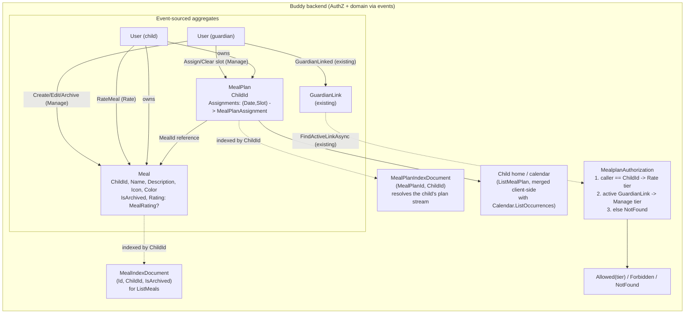

# Meal Plans

Status: Proposed (not yet implemented)

## Context

A guardian wants to plan what a child eats — mostly dinner, but sometimes
breakfast/lunch/snacks too — and have that plan show up somewhere the child
can see it, the same way a [medicine schedule](medicine-schedules.md) shows up
on the child's home screen. Two things guardians asked for on top of "write
down what's for dinner":

1. **Reusable meals.** The same dish (e.g. "Tacos") gets planned repeatedly.
   A guardian shouldn't have to retype name/description/icon every time —
   they pick "Tacos" from a list once it exists.
2. **Child feedback.** After (or independent of) being served, the child can
   rate a meal, so guardians planning next week can see "this one didn't land"
   without relying on memory.

Neither concept exists today. `Calendar`/`CalendarItem`
([glossary.md](../glossary.md)) has no notion of a reusable "thing being
scheduled" — every `CalendarItem` is scheduled directly, once. There is also
nothing resembling a rating/feedback concept anywhere in the codebase (a
targeted grep across `buddy` for rating/feedback/score returns nothing).

## Question 1: extend `Calendars`, or a new feature?

**Decision: a new feature, `Features/Mealplans`, with its own aggregates.**
Not a new `CalendarItemKind`.

Reasoning — the same shape of argument
[medicine-schedules.md](medicine-schedules.md#question-1-extend-calendars-or-a-new-feature)
already made for doses:

- A meal plan slot needs a reference to a separate, reusable entity (`Meal`)
  and a rating that lives on that entity, not on the occurrence. `CalendarItem`
  has no concept of "points at another reusable aggregate" today, and adding
  one purely for meal plans would mean carrying a meaningless field on every
  `Event`/`Task`.
- Rating is a domain concept `Calendars` has no reason to know about. Bolting
  it onto `CalendarItem` would leak a meal-specific concept into a generic
  primitive used by unrelated event/task scheduling.
- A meal plan's permission model is the same narrow two-principal shape as
  `MedicineSchedule` (see "Authorization" below) — no members, no groups —
  which is a poor fit for `Calendar`'s three-tier `CalendarRole` (see
  [group-owned-calendars-and-permissions.md](group-owned-calendars-and-permissions.md)).
- This keeps `Calendars` completely untouched, exactly as `Medicines` did.

## Question 2: one aggregate, or two?

**Decision: two aggregates — `Meal` (the reusable library entry) and
`MealPlan` (one stream per child, holding that child's dated slot
assignments).** Not one combined aggregate, and not one stream per planned
day/slot.

Reasoning:

- `Meal` and "a specific day's dinner" have different lifetimes and different
  authors of change: a `Meal`'s name/description gets edited rarely and
  independently of any specific date; a plan assignment changes weekly. Event
  sourcing an edit to "Tacos" (say, a typo fix) should not touch every
  `MealPlan` slot that ever referenced it — it shouldn't touch `MealPlan` at
  all, since `MealPlan` only stores a `MealId` reference.
- Rating belongs on `Meal`, not on a slot assignment, because you asked for
  "ratings on the reusable meal" (an opinion of the dish itself, updated over
  time as the child's taste is confirmed/changes) rather than "did you like
  Tuesday's dinner specifically."
- A `MealPlan` per child (rather than one stream per planned day, or one per
  planned slot) mirrors `MedicineSchedule.DoseLog`: a single sparse
  dictionary keyed by `(Date, Slot)`, holding only slots that have actually
  been assigned. This avoids one Marten stream per calendar day/slot — a
  meal plan for a year is one stream, not hundreds — and there is no
  recurrence engine needed at all (unlike doses, nothing here auto-generates
  future entries; a guardian assigns each date/slot explicitly), which makes
  `MealPlan` simpler than `MedicineSchedule`, not more complex.

## Domain model

### `Meal` (new aggregate, one per child, reusable across that child's plan)

```
Meal(
    MealId Id,
    UserId ChildId,
    UserId CreatedBy,
    string Name,
    string? Description,
    Icon Icon,
    Color Color,
    bool IsArchived,
    MealRating? Rating,
    UserId LastModifiedBy)
```

- `Icon`/`Color` reuse the existing `Calendars` value types
  ([Icon.cs](../../../src/backend/buddy/Features/Calendars/Types/Icon.cs),
  [Color.cs](../../../src/backend/buddy/Features/Calendars/Types/Color.cs)),
  same reasoning as `Medicines` reusing them — visual consistency, no reason
  to fork a second representation.
- `Meal` is scoped to a single `ChildId`, not shared across siblings. A
  two-kid household with the same taco recipe creates two `Meal`s. This is a
  deliberate v1 simplification — see "Remaining open questions."
- `IsArchived` is a soft-delete flag (mirrors `MedicineSchedule.IsStopped`):
  an archived `Meal` can no longer be newly assigned to a plan slot, but
  existing `MealPlan` assignments referencing it, and its `Rating`, remain
  fully readable.

### `MealRating`

```
MealRating(int Stars, string? Comment, DateTimeOffset RatedAt)
```

`Stars` is a 1–5 rating. Only one `MealRating` is held per `Meal` — it is the
child's current opinion, not a history of every time they were asked. Full
history still exists in the event stream (`MealRated` events), so "did their
opinion change over time" is answerable later without designing for it now.

### `Meal` events

Following the existing `Before`/`After` convention for edits
([CalendarItemEvents.cs](../../../src/backend/buddy/Features/Calendars/Types/CalendarItemEvents.cs),
[medicine-schedules.md](medicine-schedules.md#events)):

```
MealCreated(MealId, UserId ChildId, UserId CreatedBy, string Name, string? Description,
    Icon, Color, DateTimeOffset OccurredAt)

MealDetailsUpdated(MealId, MealDetails Before, MealDetails After, UserId ModifiedBy, DateTimeOffset OccurredAt)
    // MealDetails = (string Name, string? Description, Icon, Color)

MealArchived(MealId, UserId ModifiedBy, DateTimeOffset OccurredAt)
    // soft "delete" -- same shape as MedicineScheduleStopped / ItemDeleted

MealRated(MealId, MealRating? Before, MealRating After, UserId RatedBy, DateTimeOffset OccurredAt)
```

`MealRated` is the only event a child (rather than a guardian) ever appends —
see "Authorization" below. There is no separate "unrate" event; a child
re-rating simply appends another `MealRated` with a new `After`, same as
`DoseStatusChanged` doubling as both mark and undo.

### `MealPlan` (new aggregate, one singleton stream per child)

```
MealPlan(
    MealPlanId Id,
    UserId ChildId,
    ImmutableDictionary<(DateOnly Date, MealSlot Slot), MealPlanAssignment> Assignments)

MealPlanAssignment(MealId MealId, UserId AssignedBy, string? Notes)

enum MealSlot { Breakfast, Lunch, Dinner, Snack }
```

`Assignments` only ever holds slots a guardian actually filled — an
unassigned `(Date, Slot)` simply has no key, exactly like `DoseLog` only
recording deviations from `Pending`. This is what makes "usually just
dinner, sometimes more" fall out for free: there is no concept of a required
slot anywhere in the model.

### `MealPlan` events

```
MealPlanCreated(MealPlanId, UserId ChildId, DateTimeOffset OccurredAt)

MealAssignedToSlot(MealPlanId, DateOnly Date, MealSlot Slot, MealId MealId, UserId AssignedBy,
    string? Notes, MealPlanAssignment? Before, DateTimeOffset OccurredAt)

MealSlotCleared(MealPlanId, DateOnly Date, MealSlot Slot, MealPlanAssignment Before,
    UserId ModifiedBy, DateTimeOffset OccurredAt)
```

`MealPlanCreated` is appended lazily by the first `AssignMealToSlot` call for
a child who has no `MealPlan` stream yet (`CreateAsync` if none exists, else
`AppendAsync`), rather than being provisioned as part of `CreateChild`. This
keeps `Mealplans` decoupled from `Guardians` the same way `Medicines` never
hooks into child creation either — a child with no meal plan yet is simply a
child with no stream, not a special state to handle.

### Rehydration

Both aggregates fold their stream the same way `MedicineSchedule.Rehydrate`
does: the `*Created` event seeds the record, each subsequent event applies a
`with` update. `MealAssignedToSlot`/`MealSlotCleared` upsert/remove
`Assignments[(Date, Slot)]`, keeping the dictionary sparse. `MealRated`
replaces `Meal.Rating` with `After`.

## Read models

Marten streams are addressed by their own aggregate ID, so two lookups need
maintained index documents, same pattern as `MedicineIndexDocument`
([MedicineIndexDocument.cs](../../../src/backend/buddy/Features/Medicines/Types/MedicineIndexDocument.cs)):

```
MealIndexDocument(Guid Id, Guid ChildId, bool IsArchived)
    // "which Meal streams belong to child X" -- for the meal picker / library list

MealPlanIndexDocument(Guid MealPlanId, Guid ChildId)
    // "what is child X's MealPlan stream ID" -- one row per child, written once
    // on MealPlanCreated
```

An alternative considered and rejected for `MealPlanIndexDocument`: deriving
`MealPlanId` deterministically from `ChildId` (since the relationship is
always 1:1) to skip the lookup entirely. Rejected because every other ID in
this codebase is a random `Guid.CreateVersion7()`
([MedicineId.cs](../../../src/backend/buddy/Features/Medicines/Types/MedicineId.cs)-style),
and a one-off deterministic-ID special case would be a surprising
inconsistency for a lookup that costs nothing extra to just index normally.

Both documents are written in the same `SaveChangesAsync` as their triggering
event append — the existing maintained-inline-projection pattern, never a
separate write or async projection.

## Authorization

Same narrower two-tier shape as `MedicineSchedule`
([medicine-schedules.md](medicine-schedules.md#authorization)) — no members,
no group ownership, exactly two principals — reusing the existing
`GuardianLink` machinery (`guardians.FindActiveLinkAsync(childId, callerId,
...)`, [CalendarAuthorization.cs](../../../src/backend/buddy/Features/Calendars/CalendarAuthorization.cs)-style)
with no new authorization document needed. Both `Meal` and `MealPlan` share
one resolver, since they're always accessed for the same `ChildId`.

| Tier | Who | Actions |
|---|---|---|
| **Manage** | An active guardian of `ChildId` only | Create/edit/archive a `Meal`; assign/clear a `MealPlan` slot; view meals, plan, and ratings |
| **Rate** | The child (`ChildId` itself) only | View meals, plan, and ratings; rate a `Meal` |

Unlike `MedicineSchedule`'s Mark tier, the child does **not** get to assign
or clear plan slots — you were explicit that only guardians write the plan.
Rating is deliberately the child's alone, not something a guardian can do on
their behalf: a guardian entering a rating would defeat the point of asking
the child. A Manage-tier action attempted by the child (e.g. assigning a
slot) collapses to `Forbidden`, matching how `MedicineAccess.Forbidden` is
used for "can see, can't do this"; a Rate-tier action attempted by anyone
else collapses to `Forbidden` too — guardians can *read* ratings, not write
them.

```
enum MealplanAccess { Allowed, NotFound, Forbidden }
```

Resolution:

1. `callerId == ChildId` → `Rate` tier (read + `RateMeal` only).
2. Else, `guardians.FindActiveLinkAsync(ChildId, callerId, ...)` returns a
   link → `Manage` tier (read + write meals/plan, read-only on `Rating`).
3. Else → `NotFound`.

## Command slices (`Features/Mealplans/`, same vertical-slice shape as `Medicines`)

| Slice | Tier | Notes |
|---|---|---|
| `CreateMeal` | Manage | `Name`, `Description?`, `Icon`, `Color` |
| `UpdateMealDetails` | Manage | Name/Description/Icon/Color — emits `MealDetailsUpdated` |
| `ArchiveMeal` | Manage | Soft-delete — emits `MealArchived` |
| `ListMeals` | Manage or Rate | A child's meal library via `MealIndexDocument`, each with its current `Rating` |
| `RateMeal` | Rate | `Stars` (1–5), `Comment?` — emits `MealRated` |
| `AssignMealToSlot` | Manage | `Date`, `Slot`, `MealId` (must not be archived), `Notes?` — emits `MealAssignedToSlot` |
| `ClearMealSlot` | Manage | `Date`, `Slot` — emits `MealSlotCleared` |
| `ListMealPlan` | Manage or Rate | `[from, to]` date range → assignments joined with meal name/icon/color — the child-facing read surface, analogous to `ListTodaysDoses` |

## Failure and edge-case behavior

| Case | Behavior |
|---|---|
| Assigning an archived `Meal` to a slot | `Validation` — archived meals are read-only history, not choosable going forward |
| Clearing a slot that has no assignment | Idempotent no-op (`Success`, no event appended) — a guardian double-tapping "clear" shouldn't produce an error |
| Assigning a slot that already has a meal | Always overwrites (`Before`/`After` on `MealAssignedToSlot`) — no confirmation step server-side; "are you sure you want to replace Tacos?" is a client UX concern |
| Guardian's `GuardianLink` revoked | Immediately drops to `NotFound` for that guardian, same as `Calendar`/`Medicines` today; the child's own Rate-tier access is unaffected |
| Two guardians assign the same slot at nearly the same time | Both events append to the `MealPlan` stream in order; the last one wins for current state, neither write is lost from history — same benefit event sourcing already gives elsewhere |
| Child rates an archived `Meal` | Allowed — an opinion of the dish doesn't depend on whether it's still in active rotation |
| `Meal` referenced by a plan assignment is later archived | Existing assignments still resolve and display fine; only new assignments are blocked |
| Child has no guardian at all | Cannot happen for `Meal`/`MealPlan` creation (Manage tier requires a `GuardianLink`), so both always have at least one guardian by construction |

## Decisions made

| Question | Decision |
|---|---|
| Extend `CalendarItem`, or new feature | New feature, `Features/Mealplans` — mirrors the `Medicines` precedent for the same reasons |
| One aggregate or two | Two — `Meal` (reusable, rated) and `MealPlan` (per-child dated slot assignments) — different edit lifetimes and authors |
| Meal scope | Per-child, not per-family/household — no `Family` aggregate exists; sharing across siblings deferred (see open questions) |
| Slot model | `MealSlot { Breakfast, Lunch, Dinner, Snack }`, sparse dictionary on `MealPlan` — no slot is required, which is what makes "usually just dinner" work with no special-casing |
| Recurrence | None — every assignment is explicit; no auto-repeating template in v1 (see open questions) |
| Who can write meals/plan | Guardian (Manage tier) only, never the child |
| Who can rate | Child (Rate tier) only, never a guardian — including on the child's behalf |
| Where the rating lives | On `Meal` itself (current opinion), not per plan occurrence — full history still exists via `MealRated` events |
| `MealPlan` provisioning | Lazy: first `AssignMealToSlot` creates the stream if it doesn't exist yet; not hooked into `CreateChild` |
| New read models needed | `MealIndexDocument` (list a child's meals) and `MealPlanIndexDocument` (resolve a child's `MealPlanId`) — same maintained-inline-projection pattern used everywhere else |
| Does a meal plan show up in `Calendar`/`ListOccurrences` | No — a fully separate read surface (`ListMealPlan`), not merged into `CalendarItemOccurrence`, matching the `Medicines` precedent |

## Remaining open questions

- **Sharing a `Meal` across siblings.** v1 scopes `Meal` per `ChildId`; a
  two-kid household duplicates "Tacos" once per child. If guardians want one
  shared library, that needs either a `Family`/`Household` grouping concept
  (which doesn't exist anywhere in this codebase today) or a looser
  visibility rule based on co-guardianship — deferred until there's a
  concrete need, same "wait for a second caller" reasoning `Medicines` used
  for not widening `RecurrenceRule`.
- **Recurring templates.** "Tacos every Tuesday" currently means manually
  assigning Tacos to every Tuesday. An auto-repeating assignment (mirroring
  `RecurrenceRule` or `MedicineSchedule.Times`) is a natural v2 if guardians
  find manual weekly re-entry tedious — deliberately out of scope for v1 to
  avoid speculative generalization before it's asked for.
- **Time zone for "today's" plan.** Same open item as
  [medicine-schedules.md](medicine-schedules.md#remaining-open-questions) —
  `User` has no `TimeZoneId`, so dates are the child's own local wall-clock,
  resolved client-side. Should be resolved the same way both features land
  on it, whichever comes first.
- **Should a rating require a comment, or support finer granularity than 1–5
  stars?** Left minimal for v1 (`Stars` + optional free-text `Comment`) —
  additive if a richer shape is needed later.
- **Cross-linking with `Calendar`.** Same stance as `Medicines`: fully
  independent for v1, frontend calls both `ListOccurrences` and
  `ListMealPlan` and interleaves by date. Worth confirming before frontend
  work starts, since it affects whether `ListMealPlan` needs to return data
  shaped compatibly with `CalendarItemOccurrence`.

## Diagram


