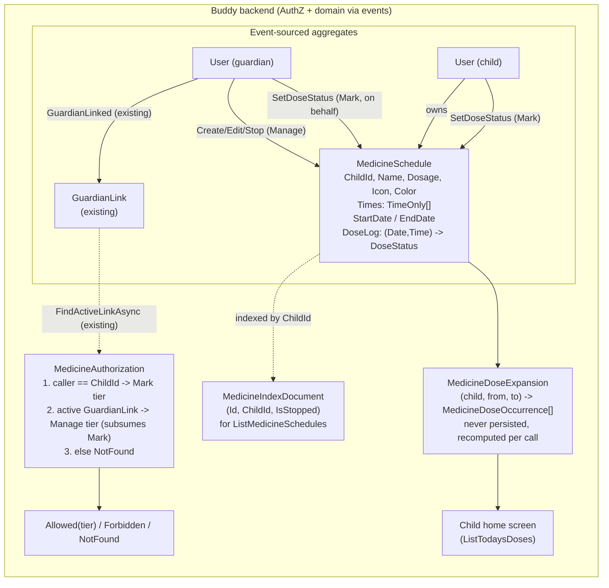

# Medicine Schedules

Status: Implemented

## Context

Buddy already lets a guardian schedule things for a child via `Calendar` /
`CalendarItem` (`Event | Task`, optionally recurring — see
[glossary.md](../glossary.md)). The child-facing home screen
([home.html](../../../src/frontend/buddy/src/app/features/child/home/home.html))
is currently a static "Nothing to show yet" placeholder waiting for real
content. A guardian now wants to give a child a **medicine schedule**: one or
more doses per day, for a name-and-dosage medicine, that the child can see and
tick off as taken.

Two requirements decided before this document was written rule out simply
reusing `CalendarItemKind.Task` as-is:

1. **Multiple doses per day.** A `TaskItemCreated`/`DueDate`
   ([DueDate.cs](../../../src/backend/buddy/Features/Calendars/Types/DueDate.cs))
   carries exactly one `TimeOnly`. A 3×/day medicine would need three
   separate `CalendarItem`s that happen to share a name — nothing ties them
   together as one course, and editing "give this at a different time"
   becomes an N-item edit instead of a one-field edit.
2. **Persisted, per-dose taken/skipped state.** `CalendarOccurrenceExpansion`
   ([CalendarOccurrenceExpansion.cs](../../../src/backend/buddy/Features/Calendars/CalendarOccurrenceExpansion.cs))
   is explicit that occurrences are "never persisted — always recomputed from
   current item/calendar state." There is no concept anywhere in `Calendars`
   of a single occurrence being an addressable thing you can attach a status
   to — occurrences exist only for display (the child's agenda view, the
   iCal feed).

## Question 1: extend `Calendars`, or a new feature?

**Decision: a new feature, `Features/Medicines`, with its own aggregate.**
Not a new `CalendarItemKind`, not a change to `RecurrenceRule` or `DueDate`.

Reasoning:

- Requirement 2 needs occurrences to become identifiable, stateful things.
  Doing that generically for every `CalendarItem` (events and tasks alike)
  would be a much larger, riskier change to an already-shipped feature for a
  capability only medicine schedules need today. Scoping it to a new
  aggregate keeps `Calendars` completely untouched.
- Requirement 1 needs a "list of times per day" concept that doesn't exist on
  `RecurrenceRule` ([RecurrenceRule.cs](../../../src/backend/buddy/Features/Calendars/Types/RecurrenceRule.cs))
  today. Widening `RecurrenceRule` for every event/task in the system, for a
  need specific to medicine dosing, would be a speculative generalization —
  the kind of change that should wait until a second caller actually needs
  it, not be built preemptively here.
- A medicine schedule has domain fields a generic `CalendarItem` has no
  business carrying — `Dosage`, a fixed set of dose times, a course window —
  and a narrower permission model than a calendar (see "Authorization"
  below: no members, no groups, exactly two principals). Forcing it through
  `CalendarItem`'s shape would mean adding fields that are meaningless for
  `Event` and most `Task` uses.
- This mirrors how `Group` was kept separate from `Calendar` rather than
  folding group semantics into `Calendar.Members`
  ([group-owned-calendars-and-permissions.md](group-owned-calendars-and-permissions.md)) —
  a distinct domain concept gets a distinct aggregate, and the two are wired
  together only where they actually need to interact (here: nowhere —
  see "Remaining open questions").

## Domain model

### `MedicineSchedule` (new aggregate, same event-sourced shape as `CalendarItem`)

```
MedicineSchedule(
    MedicineId Id,
    UserId ChildId,
    UserId CreatedBy,
    string Name,
    string Dosage,
    Icon Icon,
    Color Color,
    IReadOnlyList<TimeOnly> Times,
    DateOnly StartDate,
    DateOnly? EndDate,
    ImmutableDictionary<(DateOnly Date, TimeOnly Time), DoseStatus> DoseLog,
    UserId LastModifiedBy,
    bool IsStopped = false)
```

- `Icon` / `Color` are the existing `Calendars` value types
  ([Icon.cs](../../../src/backend/buddy/Features/Calendars/Types/Icon.cs),
  [Color.cs](../../../src/backend/buddy/Features/Calendars/Types/Color.cs)),
  reused as-is for visual consistency between a child's calendar and their
  medicine list — no reason to fork a second icon/color representation.
- `Times` is the piece `RecurrenceRule` doesn't have: every entry recurs
  daily between `StartDate` and `EndDate` (inclusive, open-ended if `null`).
  There is no weekday/interval pattern in v1 — see "Remaining open
  questions."
- `DoseLog` only ever holds entries that deviate from the implicit default.
  A `(Date, Time)` pair with no entry is `DoseStatus.Pending` — the log
  records exceptions (marked taken/skipped), not one row per possible dose
  forever, keeping the stream's size proportional to guardian/child actions
  rather than to elapsed calendar time.

### `DoseStatus`

```
enum DoseStatus { Pending, Taken, Skipped }
```

Both "taken" and "skipped" are first-class and persisted (not just
taken/not-taken) — a guardian reviewing history needs to distinguish "child
didn't take it" from "we deliberately skipped this dose" (e.g. paused for a
side effect), which a single boolean can't express.

### Events

Following the existing `Before`/`After` convention for mutations
(`ItemDetailsUpdated`, `TaskRescheduled`, `RecurrenceUpdated`,
`GuardianKindChanged` — see [CalendarItemEvents.cs](../../../src/backend/buddy/Features/Calendars/Types/CalendarItemEvents.cs),
[GuardianEvents.cs](../../../src/backend/buddy/Features/Guardians/Types/GuardianEvents.cs)):

```
MedicineScheduleCreated(MedicineId, UserId ChildId, UserId CreatedBy, string Name, string Dosage,
    Icon, Color, IReadOnlyList<TimeOnly> Times, DateOnly StartDate, DateOnly? EndDate, DateTimeOffset OccurredAt)

MedicineDetailsUpdated(MedicineId, MedicineDetails Before, MedicineDetails After, UserId ModifiedBy, DateTimeOffset OccurredAt)
    // MedicineDetails = (string Name, string Dosage, Icon, Color) -- mirrors ItemDetails

MedicineScheduleRescheduled(MedicineId, MedicineWindow Before, MedicineWindow After, UserId ModifiedBy, DateTimeOffset OccurredAt)
    // MedicineWindow = (IReadOnlyList<TimeOnly> Times, DateOnly StartDate, DateOnly? EndDate)

MedicineScheduleStopped(MedicineId, UserId ModifiedBy, DateTimeOffset OccurredAt)
    // soft "delete" -- same shape as ItemDeleted

DoseStatusChanged(MedicineId, DateOnly Date, TimeOnly Time, DoseStatus Before, DoseStatus After,
    UserId ModifiedBy, DateTimeOffset OccurredAt)
```

`DoseStatusChanged` doubles as both "mark taken/skipped" and "undo" (set
`After` back to `Pending`) — one event shape, no separate undo event, the
same way `RecurrenceUpdated` covers both "add a recurrence" and "remove one"
via `After: null`.

Splitting details / schedule-window / stop into three events (rather than one
wide `MedicineScheduleUpdated`) mirrors exactly how `CalendarItem` already
splits `ItemDetailsUpdated` from `TaskRescheduled`/`RecurrenceUpdated` from
`ItemDeleted` — editing a name doesn't read as "rescheduled," and vice versa,
in a history/audit view.

### Rehydration

`MedicineSchedule.Rehydrate(events)` folds the stream the same way
`CalendarItem.Rehydrate` does: `MedicineScheduleCreated` seeds the record,
each subsequent event applies a `with` update, `DoseStatusChanged` upserts
`DoseLog[(Date, Time)] = After` (or removes the key when `After ==
DoseStatus.Pending`, keeping the log sparse as described above).

## Dose expansion — `MedicineDoseExpansion`

A new static helper, deliberately parallel to
`CalendarOccurrenceExpansion`/`RecurrenceExpansion`
([CalendarOccurrenceExpansion.cs](../../../src/backend/buddy/Features/Calendars/CalendarOccurrenceExpansion.cs)):
given a `ChildId` and a `[from, to]` date range, for every non-stopped
`MedicineSchedule` owned by that child, for every date in
`[max(StartDate, from), min(EndDate ?? to, to)]`, for every `Time` in
`Times`, emit one:

```
MedicineDoseOccurrence(MedicineId, string Name, string Dosage, string Icon, string Color,
    DateOnly Date, TimeOnly Time, DoseStatus Status)
```

`Status` is looked up from `DoseLog`, defaulting to `Pending` exactly as
described above. Like `CalendarOccurrenceExpansion`, nothing here is
persisted or cached — it's recomputed from current aggregate state on every
call, which is an explicit, already-accepted tradeoff in this codebase (see
"Aggregate loading and performance" in
[group-owned-calendars-and-permissions.md](group-owned-calendars-and-permissions.md#aggregate-loading-and-performance--operational-contract)):
acceptable as a first design because it introduces no new performance tier,
not because the cost is assumed to be free forever.

One deliberate difference from `CalendarOccurrenceExpansion`: **no time zone
resolution.** `Times` are treated as the child's own local wall-clock times,
resolved to instants only implicitly (by the client rendering "today").
`Calendar` carries an explicit `TimeZoneId`
([TimeZoneId.cs](../../../src/backend/buddy/Features/Calendars/Types/TimeZoneId.cs));
`User` carries no such field today, and a `MedicineSchedule` belongs to a
`ChildId`, not a `CalendarId`, so there is no natural place to hang a time
zone off of it without adding one to `User` first. Flagged as an open
question below rather than solved here.

## Read model — listing a child's schedules

Marten streams are addressed by their own aggregate ID; there is no built-in
way to ask "which `MedicineSchedule` streams belong to child X" without a
maintained index — the exact problem `CalendarItemIndexDocument`
([CalendarItemIndexDocument.cs](../../../src/backend/buddy/Features/Calendars/Types/CalendarItemIndexDocument.cs))
already solves for listing a calendar's items:

```
MedicineIndexDocument(Guid Id, Guid ChildId, bool IsStopped)
```

Written once on `MedicineScheduleCreated`, flipped to `IsStopped = true`
alongside `MedicineScheduleStopped` — same maintained-inline-projection
pattern as `CalendarItemIndexDocument`, updated in the same
`SaveChangesAsync` as the event append, never a separate write.

## Authorization

A `MedicineSchedule` has a **much narrower** permission model than
`Calendar`: no members, no group ownership, no per-schedule role grants —
exactly two principals ever apply, and the existing `GuardianLink` machinery
already answers exactly this question with no new document needed (unlike
the calendar-guardian case in
[child-accounts-and-guardian-roles.md](child-accounts-and-guardian-roles.md#this-step-needs-a-new-read-model--it-is-not-walked-exactly-like-group),
which had to introduce `GuardianLinkDocument` — that document already exists
and is queried the same way `CalendarAuthorization` already does via
`guardians.FindActiveLinkAsync(childId, callerId, ...)`
([CalendarAuthorization.cs](../../../src/backend/buddy/Features/Calendars/CalendarAuthorization.cs)).

Two access tiers, not the three `CalendarRole` has:

| Tier | Who | Actions |
|---|---|---|
| **Manage** | An active guardian of `ChildId` only | Create, edit details/schedule, stop a `MedicineSchedule`; also mark/unmark any dose |
| **Mark** | The child (`ChildId` itself) **or** an active guardian | View today's doses; set a dose's status (`Taken`/`Skipped`/back to `Pending`) |

The child is deliberately **not** in the Manage tier — a medicine schedule is
a safety-relevant instruction a guardian gives, not something a child
authors or edits for themselves, unlike a `Calendar` a child owns outright.
This is the same shape of asymmetry the codebase already applies elsewhere:
a guardian's authority over a child's calendar is "intentionally not
configurable per child... a safety/parental-control property"
([child-accounts-and-guardian-roles.md](child-accounts-and-guardian-roles.md#how-this-feeds-calendargroup-permissions)).

```
enum MedicineAccess { Allowed, NotFound, Forbidden }
```

Resolution, mirroring `CalendarAuthorization.ResolveRole`'s shape but with no
`Calendar.Members`/`Group` steps to walk:

1. `callerId == schedule.ChildId` → `Mark` tier only.
2. Else, `guardians.FindActiveLinkAsync(schedule.ChildId, callerId, ...)`
   returns a link → `Manage` tier (which subsumes `Mark`).
3. Else → `NotFound` (same "can't distinguish private from missing"
   collapsing behavior `CalendarAccess.NotFound` already uses).

A Manage-tier action attempted by the child collapses to `Forbidden` (they
can view/mark, so the schedule isn't hidden from them — they just can't
edit it), matching how `CalendarAccess.Forbidden` is used today for "can
see, can't do this."

### Group sharing (added later, additive)

The narrow two-principal model above still describes the child/guardian
axis exactly as built. A second, independent axis was added afterward,
mirroring [group-owned-mealplans.md](group-owned-mealplans.md): a guardian
can share a child's medicine schedules with a group via a new per-child
`MedicineSharing` singleton (`Types/MedicineSharing.cs`, lazily created,
holding only `SharedWithGroupId: GroupId?`) and a matching
`Group.MedicinePermissionPolicy: GroupRole -> MedicineAccessTier`. Unlike
Mealplan's group axis, there is no read-only tier — `MedicinePermissionPolicy`
only ever holds `None`/`Manage`, so group access is all-or-nothing. And
unlike Mealplan's anchor-child resolution (one group ↔ one family), every
group-keyed medicine route still names the child explicitly in its route
(`/medicines/groups/{groupId}/children/{childId}/...`), since a group can
have several children's medicine independently shared with it — `MedicineGroupAccess`
only confirms that the named child is actually shared with that group, it
never resolves "the" child from the group alone.

## Command slices (`Features/Medicines/`, same vertical-slice shape as `Calendars`)

| Slice | Tier | Notes |
|---|---|---|
| `CreateMedicineSchedule` | Manage | `Name`, `Dosage`, `Icon`, `Color`, `Times`, `StartDate`, `EndDate?` |
| `UpdateMedicineDetails` | Manage | Name/Dosage/Icon/Color only — emits `MedicineDetailsUpdated` |
| `RescheduleMedicine` | Manage | Times/StartDate/EndDate — emits `MedicineScheduleRescheduled` |
| `StopMedicineSchedule` | Manage | Soft-delete — emits `MedicineScheduleStopped` |
| `ListMedicineSchedules` | Manage | Guardian's view of one child's schedules, via `MedicineIndexDocument` |
| `ListTodaysDoses` | Mark | The child home screen's data source — `MedicineDoseExpansion` for `[today, today]` (or a small window, e.g. to also show "earlier today, missed") |
| `SetDoseStatus` | Mark | `Taken` / `Skipped` / `Pending` — emits `DoseStatusChanged` |

## Failure and edge-case behavior

| Case | Behavior |
|---|---|
| Guardian's `GuardianLink` revoked after creating a schedule | Immediately drops to `NotFound` for that guardian, same as calendar access today — schedule and its history are untouched; the child keeps their own Mark-tier access regardless. |
| Two guardians mark the same dose at nearly the same time | Both `DoseStatusChanged` events append to the stream (Marten's normal per-stream ordering); the *last* one wins for current status, but neither write is lost — both remain in history. Same benefit event sourcing already gives `CalendarItem`. |
| Child marks a future dose (before its scheduled time) or re-marks a past one | Allowed — no time-based gate in v1. Keeps the model simple and avoids client/server clock-skew edge cases; a mistaken tap is correctable via the same `SetDoseStatus` call (`After: Pending`). |
| `MedicineSchedule` stopped mid-course | `ListTodaysDoses`/expansion stops producing new occurrences from `IsStopped`'s effective date forward; already-recorded `DoseLog` history is untouched and still visible via `ListMedicineSchedules`. |
| `EndDate` in the past | Expansion naturally yields no occurrences past it; the schedule still appears (as inactive/completed) in `ListMedicineSchedules`. |
| Child has no guardian at all | Cannot happen for `MedicineSchedule` creation (Manage tier requires a `GuardianLink`), so every schedule has at least one guardian by construction. |

## Decisions made

| Question | Decision |
|---|---|
| Extend `CalendarItem`/`RecurrenceRule`, or new feature | New feature, `Features/Medicines`, own aggregate — avoids widening a shipped generic primitive for a need only medicine schedules have |
| Multiple doses/day | `Times: IReadOnlyList<TimeOnly>` on the schedule itself, not N separate items |
| Persisted taken state | Yes — `DoseStatus { Pending, Taken, Skipped }`, both non-default states are first-class and distinguished |
| Where dose status lives | On the `MedicineSchedule` stream itself (`DoseLog`), not a separate per-occurrence aggregate — avoids fanning out one stream per dose |
| Who can create/edit/stop a schedule | Guardian (Manage tier) only — not the child, mirroring the existing "guardian authority over a child is not child-configurable" rule |
| Who can mark a dose | Child (self) or guardian (Mark tier) |
| New read model needed for authorization | No — reuses the existing `GuardianLinkDocument`/`FindActiveLinkAsync` already built for calendar access |
| New read model needed for listing schedules | Yes — `MedicineIndexDocument(Id, ChildId, IsStopped)`, same pattern as `CalendarItemIndexDocument` |
| Time zone handling | None in v1 — times are the child's local wall-clock, no `TimeZoneId` involved (flagged as an open question, since `User` has no time zone field to hang one off today) |
| Does a medicine schedule show up in `Calendar`/`ListOccurrences` | No — a fully separate read surface (`ListTodaysDoses`), not merged into `CalendarItemOccurrence` |

## Remaining open questions

- **Time zone for dose times.** `User` has no `TimeZoneId` today (only
  `Calendar` does). A guardian and child in different time zones would have
  the meaning of "8am" go undefined. Deferred until there's a concrete need
  — likely resolved by adding a time zone to `User`, or by treating this as
  purely client-local like a phone's own alarm clock.
- **Non-daily patterns.** v1 only supports "every day between `StartDate`
  and `EndDate`." Every-other-day or specific-weekdays dosing (real patterns
  for some medicines) is out of scope until a concrete need shows up —
  `Times`/`StartDate`/`EndDate` would need a frequency/interval concept
  similar to `RecurrenceRule` at that point.
- **Should a skip require a reason?** `DoseStatus.Skipped` currently carries
  no note/reason field. Left out for v1 simplicity; would be an additive
  field on `DoseStatusChanged` if needed later.
- **Missed-dose escalation.** No notification/reminder mechanism is proposed
  here — a dose sitting at `Pending` well past its time is purely a display
  concern (e.g. the child's UI can highlight it), not a backend event or
  push notification, at least for v1.
- **Cross-linking with `Calendar`.** This document treats `Medicines` as
  fully independent of `Calendars` (no shared aggregate, no combined feed).
  If guardians later want medicine doses to appear alongside calendar events
  in one combined agenda, that's a presentation-layer merge (the frontend
  calling both `ListOccurrences` and `ListTodaysDoses` and interleaving by
  time) rather than a backend data-model change — worth confirming before
  frontend work starts, since it affects whether `ListTodaysDoses` needs to
  return timestamps compatible with `CalendarItemOccurrence`.

## Diagram


