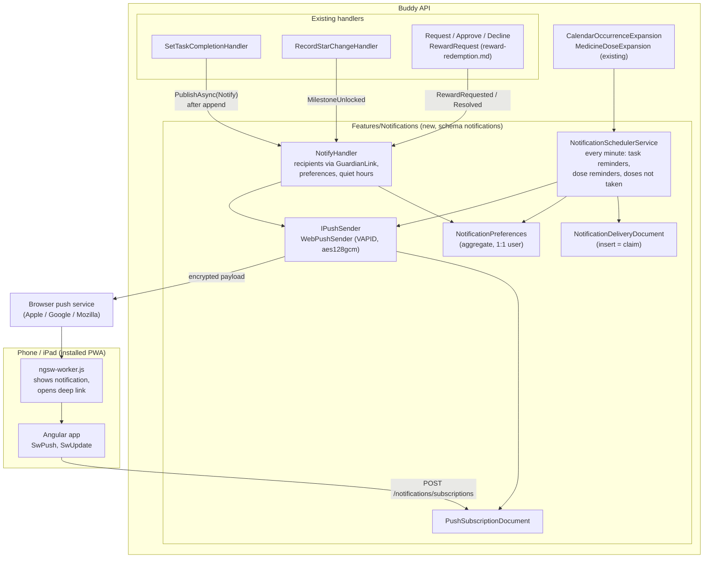

# Mobile App and Push Notifications

Status: Proposed (not yet implemented)

## Context

Guardians use Buddy on their phones (logging a dose, checking pickup on the way out) and children
use it on an iPad or a phone. Since [responsive-layout.md](../../frontend/analysis/responsive-layout.md)
every page fits a phone, but Buddy is still a browser tab: there is no home-screen icon, the
session ends when the tab is closed, and nothing happens unless someone opens the app. Buddy can
show a child their next task, but it can't tell them it is time for that task. A guardian can only
find out that a dose was missed or a reward was requested by opening the app and looking.

What the user wants from a mobile app is mostly that second part, notifications:

- **A child asks for a reward.** The child spends stars on a reward and a guardian has to approve
  it ([reward-redemption.md](reward-redemption.md), being built in parallel). Today the only way a
  guardian notices a pending request is a count on the children overview pill.
- **A child completes their tasks.** The guardian sees it happen without opening the dashboard.
- **A milestone is unlocked.** The child and the guardian both get to celebrate a goal post
  ([configurable-goal-posts.md](configurable-goal-posts.md)).
- **A dose isn't marked taken.** A guardian at work hears about it while it can still be fixed.
- **Reminders to the child.** "Time to pack your bag" at the task's time, and a reminder at dose
  time, which helps most with the "when" that the [README](../../../README.md#why-buddy) names as
  the core problem.

What exists today:

- [ipad-installation.md](../../frontend/analysis/ipad-installation.md) compared a PWA, a Capacitor
  shell and a native rewrite and recommended the installed web app (PWA), with Web Push for
  notifications on iOS 16.4 and later. Nothing from it is built: there is no manifest, no service
  worker and no `@angular/service-worker` in the frontend.
- [responsive-layout.md](../../frontend/analysis/responsive-layout.md#explicitly-out-of-scope)
  deferred "PWA manifest, `viewport-fit=cover`, safe-area insets and install banners" to this work.
- There is no notification infrastructure at all. [gamified-progress.md](gamified-progress.md)
  and [sleep-diary.md](sleep-diary.md) both list it as a missing prerequisite. The only outbound
  channel is email ([IEmailSender.cs](../../../src/backend/buddy/Email/IEmailSender.cs): three
  account emails, English only).
- Three `BackgroundService`s with a `PeriodicTimer` already run inside the API
  ([IdempotencyCleanupService.cs](../../../src/backend/buddy/Common/Idempotency/IdempotencyCleanupService.cs),
  `AiSessionRetentionService`, `UserErasureService`). Wolverine runs in-process only, with no
  durable message storage (`WolverineFx` without `WolverineFx.Marten` in
  [buddy.csproj](../../../src/backend/buddy/buddy.csproj)).
- Buddy is hosted per family ([feature-flags.md](feature-flags.md#context)): one installation, a
  handful of users, one technical family member who runs it.

The user settled two questions before this design: the app is a **PWA first** (Capacitor stays the
documented fallback from `ipad-installation.md`), and v1 has **all five notification kinds** above.

This document answers seven questions: what the mobile app is, how push is delivered, where
subscriptions and preferences live, how event-driven notifications are triggered, how
time-driven reminders are scheduled, who gets what and who controls it, and what goes in a
notification given that doses are health data.

## Question 1: what is "the mobile app"?

**Decision: the existing Angular app, made installable as a PWA: a web app manifest, icons,
`@angular/service-worker` for the app shell and push, standalone display with safe-area insets,
an update prompt, and an install guide. No second codebase and no app store.**

- **Manifest** (`public/manifest.webmanifest`): `name` "Buddy", `display: standalone`,
  `start_url: "/"`, `scope: "/"`, theme and background colours from the light theme, and
  192/512 px icons plus a maskable icon and an `apple-touch-icon` (iOS ignores manifest icons).
  `index.html` gets `viewport-fit=cover` and `apple-mobile-web-app-capable`.
- **Safe areas.** In standalone mode there is no browser chrome, so the sticky header and the
  guardian tab bar from `responsive-layout.md` need `env(safe-area-inset-top/bottom)` padding, or
  they sit under the notch and the home indicator.
- **Service worker** via `ng add @angular/pwa` (`provideServiceWorker('ngsw-worker.js')`,
  registered `registerWhenStable:30000`). `ngsw-config.json` prefetches the app shell and
  lazy-loads assets. It must **not** cache `config/runtime-config.json`, `GET /features` or any API
  call (`dataGroups` left empty): stale data on a medicine page is worse than a loading spinner.
- **Updates.** A cached shell means a deploy no longer reaches an open app on refresh. `SwUpdate`
  checks on start and every 30 minutes; when `VERSION_READY` fires, a small banner ("A new version
  of Buddy is ready -- Reload") calls `activateUpdate()` and reloads. The Caddyfile serves
  `ngsw.json`, `ngsw-worker.js` and `index.html` with `Cache-Control: no-cache`.
- **Offline.** The shell opens offline and shows an "You're offline" banner from
  `navigator.onLine`; nothing is readable or writable offline. Offline reading and queued writes
  (a dose marked on the bus) would need a client-side store and conflict handling with the event
  streams' optimistic concurrency, which is a separate project. Rejected for v1.
- **Install guide.** iOS has no install prompt: the user has to go Share -> Add to Home Screen,
  and Web Push only works after that. A help topic ("Install Buddy on a phone or iPad", en + da,
  in the existing in-app help) with steps per platform, and on Android/desktop Chrome a "Install
  app" item in the profile menu driven by `beforeinstallprompt`. The notification settings page
  (Question 6) detects iOS Safari outside standalone mode and links to the guide instead of
  showing a toggle that can't work.
- **CSP** needs no change: the worker and the manifest are same-origin, and `worker-src` and
  `manifest-src` fall back to `script-src 'self'` and `default-src 'self'` in the
  [frontend Caddyfile](../../../src/frontend/buddy/Caddyfile).

Rejected alternatives, as argued in `ipad-installation.md`:

- **Capacitor** -- real APNs/FCM push and an App Store-like install, but $99/year, a Mac to build,
  TestFlight builds that expire after 90 days, and for Android an FCM project. Every family that
  self-hosts Buddy would need its own Apple and Firebase accounts, because push credentials are
  tied to the app identity. That doesn't fit a per-family installation. It stays the fallback if
  Web Push proves unreliable on iOS; the backend in this design would gain a second
  `IPushSender` implementation, nothing more.
- **A native rewrite** -- a second codebase. Not worth it for a family tool.

## Question 2: how is a push delivered?

**Decision: standard Web Push (RFC 8030) with VAPID (RFC 8292) and encrypted payloads
(RFC 8291), sent by the API through a new `IPushSender` interface, with the installation's VAPID
key pair in configuration.**

```csharp
// Notifications/IPushSender.cs -- same role as Email/IEmailSender.cs
public interface IPushSender
{
    Task<PushResult> SendAsync(PushSubscription subscription, PushPayload payload, CancellationToken cancellationToken);
}

public enum PushResult { Delivered, SubscriptionGone, Failed }
```

- The browser's push service (Apple, Google, Mozilla) is chosen by the browser and given to us as
  the subscription's `endpoint` URL. The API POSTs an encrypted payload to it. Buddy needs no
  account with any of them, which is what makes Web Push work for a self-hosted installation.
- **VAPID keys** go in a `Push` options section (`Push:VapidPublicKey`, `Push:VapidPrivateKey`,
  `Push:Subject` = a `mailto:` for the operator), bound through `AddValidatedOptions` like
  `MailOptions`. The private key is a secret: `deploy/.env` and the Azure secret list, never in
  `appsettings.json`. A `task push:vapid-keys` command generates a pair. The public key is served
  to the frontend in `GET /notifications/vapid-public-key` (anonymous, like `GET /features`), so
  the image doesn't need rebuilding when the key changes.
- **`SubscriptionGone`** (`404`/`410` from the push service) deletes the subscription. Any other
  failure is logged and dropped; there is no retry queue. A notification that arrives an hour late
  ("time for your medicine") is worse than none.
- **Implementation**: a small `WebPushSender` over `HttpClient` using `System.Security.Cryptography`
  (ECDH P-256, HKDF, AES-128-GCM for the `aes128gcm` content coding, ES256 for the VAPID JWT), or
  an existing NuGet package behind the same interface. See the open question; either way, tests
  use a `FakePushSender` that records what was sent, the same way an Alba test checks an email in
  Mailpit today.
- **Effective flag.** A new `Features:Notifications` flag (default `true`), but `GET /features`
  reports it as `false` when no VAPID keys are configured, so an installation that hasn't set keys
  shows no notification UI rather than a broken toggle. Startup does not fail without keys:
  existing installations upgrade without a config change.

Rejected: **email as the channel** (too slow and too noisy for "time for your task", and children
have no email address, see [child-accounts-and-guardian-roles.md](child-accounts-and-guardian-roles.md));
**SMS** (a paid provider per family); **a third-party push service** such as OneSignal (an
external processor of children's data, against the minimisation in
[gdpr-data-protection.md](gdpr-data-protection.md)).

## Question 3: where do subscriptions and preferences live?

**Decision: a new feature, `Features/Notifications/`, with its own Marten schema `notifications`.
Preferences are an event-sourced `NotificationPreferences` aggregate, 1:1 with the user
(`Id.Value == UserId.Value`, like `ChildProgress`). Device subscriptions are plain documents,
deleted outright, not event-sourced.**

```
NotificationPreferences(
    NotificationPreferencesId Id,      // Id.Value == UserId.Value -- 1:1, no index document
    UserId UserId,
    ImmutableDictionary<NotificationKind, bool> Enabled,  // missing key = the kind's default
    int DoseOverdueMinutes,            // guardian: how long after a dose time before "not taken"
    QuietHours? QuietHours,            // (TimeOnly From, TimeOnly To) in the user's TimeZoneId
    UserId LastModifiedBy)             // a guardian, for a child's preferences

PushSubscriptionDocument(
    Guid Id,                           // hash of the endpoint URL: re-subscribing the same device upserts
    Guid UserId,
    string Endpoint,                   // the push service URL
    string P256dh, string Auth,        // the browser's encryption keys
    string DeviceLabel,                // "iPhone (Safari)", from the user agent, for the settings list
    DateTimeOffset CreatedAt,
    DateTimeOffset LastSuccessAt)
```

- **Preferences follow precedent.** They are user-authored settings that guardians change for
  children, the same shape as `User.Language` and `User.TimeZoneId`
  ([child-language-settings.md](child-language-settings.md)), so they get events, a snapshot
  projection and an audit of who changed what. A separate aggregate rather than more fields on
  `User`, because the Users feature shouldn't know about notification kinds, and so the feature
  flag can switch the whole feature off with its store.
- **Subscriptions break the event-sourcing precedent on purpose.** The `P256dh`/`Auth` keys are
  secrets that let anyone holding them push to that device. An event stream keeps every removed
  subscription's keys forever; a document can be deleted. They are also technical device state,
  not domain facts: nobody needs the history of which phone was registered when. The precedent
  for a plain document is `OnboardingProgressDocument`
  ([MartenOnboardingProgressStore.cs](../../../src/backend/buddy/Features/Users/MartenOnboardingProgressStore.cs)).
  `IcalToken`'s hashed-token approach doesn't apply: the keys must be readable to encrypt.
- **Delivery log.** `NotificationDeliveryDocument(Guid Id, Guid RecipientId, NotificationKind Kind,
  DateTimeOffset SentAt)`, where `Id` is a deterministic hash of the notification's *dedup key*
  (Question 5). Inserting it is how the scheduler claims a notification exactly once. Rows older
  than 7 days are deleted by the same `PeriodicTimer` pattern as `IdempotencyCleanupService`. It
  holds ids only; there is no screen for it (operators read logs, see
  [observability.md](../observability.md)).
- **Kinds**:

  | `NotificationKind` | Recipient | Default |
  |---|---|---|
  | `RewardRequested` | each active guardian of the child | on |
  | `RewardRequestResolved` (approved / declined) | the child | on |
  | `TaskCompleted` | each active guardian | on |
  | `MilestoneUnlocked` | the child and each active guardian | on |
  | `DoseNotTaken` | each active guardian | on |
  | `TaskReminder` | the child | on |
  | `DoseReminder` | the child | off (see Question 7) |

## Question 4: how do event-driven notifications get triggered?

**Decision: the handler that appends the event publishes a `Notify` message on Wolverine's
in-process bus (`IMessageBus.PublishAsync`) after its own append succeeds. A `NotifyHandler` in
the Notifications feature resolves the recipients, checks preferences and sends. A failure never
affects the original command.**

```csharp
// Features/Notifications/Notify.cs
public sealed record Notify(NotificationKind Kind, UserId ChildId, NotificationSubject Subject, DateTimeOffset OccurredAt);

// NotificationSubject: RewardRequest(RewardRequestId, string RewardName, string Icon)
//                    | RewardResolved(RewardRequestId, string RewardName, bool Approved)
//                    | TaskCompleted(CalendarItemId, DateOnly OccurrenceDate, string Title)
//                    | Milestone(int Threshold, string Icon)
```

This is the shape [gamified-progress.md](gamified-progress.md#question-2-how-does-progress-learn-that-a-task-was-completed)
already chose for stars: an explicit call after the append, not an async projection, with the
second step's failure a logged, recoverable gap. It differs in one way. `RecordStarChange` uses
`InvokeAsync`, which waits for the result, because the child's dashboard reads the star count
right after the toggle. A notification calls an external push service that can take seconds, and
nothing in the response depends on it, so `PublishAsync` hands it to Wolverine's local queue and
the child's tap returns at once. Local queues aren't durable: a notification published just before
the API restarts is lost. That is acceptable for this kind of message and avoids adding
`WolverineFx.Marten`'s outbox.

Call sites (each a single line after the existing append, plus the `IMessageBus` parameter where
the handler doesn't take one yet):

| Handler | Publishes | When |
|---|---|---|
| `RequestRewardHandler` (reward-redemption.md) | `RewardRequested` | after `RewardRequested` is appended; not on an idempotent repeat |
| `ApproveRewardRequestHandler`, `DeclineRewardRequestHandler` | `RewardRequestResolved` | after the event; not on a repeat |
| `SetTaskCompletionHandler` | `TaskCompleted` | `false -> true` only, task has `AssignedTo`, and the whole task is now done (a plain task, or the last open subtask of a template task) |
| `RecordStarChangeHandler` | `MilestoneUnlocked` | for each `MilestoneUnlocked` it appends |

`SetTaskCompletionHandler` today, trimmed
([SetTaskCompletion.Handler.cs](../../../src/backend/buddy/Features/Calendars/SetTaskCompletion/SetTaskCompletion.Handler.cs)):

```csharp
await items.AppendAsync(command.ItemId, [completionChanged], cancellationToken);

await TryRecordStarChangeAsync(task, command, bus, logger, cancellationToken);

return new Result<CalendarItem>.Success(CalendarItem.Replay([.. itemEvents, completionChanged]));
```

After:

```csharp
await items.AppendAsync(command.ItemId, [completionChanged], cancellationToken);

await TryRecordStarChangeAsync(task, command, bus, logger, cancellationToken);

var updated = CalendarItem.Replay([.. itemEvents, completionChanged]);

if (command.IsCompleted && task.AssignedTo is { } childId && updated.IsWhollyCompleted(command.OccurrenceDate))
{
    await bus.PublishAsync(new Notify(NotificationKind.TaskCompleted, childId,
        new NotificationSubject.TaskCompleted(command.ItemId, command.OccurrenceDate, updated.Title), DateTimeOffset.UtcNow));
}

return new Result<CalendarItem>.Success(updated);
```

Blast radius: four handlers gain one publish each (two of them in the reward-redemption slices,
which can include the line from the start if they land second); `SetTaskCompletionHandler`
already takes `IMessageBus`. No existing event or response changes. A missing `IsWhollyCompleted`
helper on `CalendarItem` (all subtasks of the template for that occurrence in `CompletionLog`) is
new.

**Not notified**: un-completing a task, a star revoked, a request the child cancels (the
guardian's pending count simply drops), and anything a guardian does themself (a guardian marking
a child's task done doesn't notify that guardian; other guardians still hear about it).

## Question 5: how are time-driven reminders scheduled?

**Decision: a `NotificationSchedulerService` (`BackgroundService`, `PeriodicTimer` every minute)
scans, for each child, the tasks and doses falling due in the last few minutes, and claims each
notification by inserting its delivery document. Nothing is scheduled ahead of time.**

Each tick, for every child with at least one guardian or child subscription:

1. **Task reminders.** Expand the child's calendars for today with `CalendarOccurrenceExpansion`
   (the same set the child's day view reads). For each occurrence of a task with
   `AssignedTo == child`, not all-day, not completed, and a due instant in `(now - 5 min, now]`:
   notify the child. Dedup key: `TaskReminder:{itemId}:{date}:{childId}`.
2. **Dose reminders** (if the child's `DoseReminder` is on). `MedicineDoseExpansion` for today;
   each `Pending` dose whose `Time`, in the child's `TimeZoneId`, falls in `(now - 5 min, now]`.
   Dedup key: `DoseReminder:{medicineId}:{date}:{time}`.
3. **Doses not taken.** For each guardian of the child with `DoseNotTaken` on: each dose still
   `Pending` (not `Taken` or `Skipped`) whose time plus that guardian's `DoseOverdueMinutes`
   (default 30) falls in the window. Dedup key: `DoseNotTaken:{medicineId}:{date}:{time}:{guardianId}`.

Why this shape:

- **No stale schedule.** Tasks are moved, deleted and completed; doses are rescheduled and marked.
  A job scheduled in advance (Wolverine's `ScheduleAsync`, which would also need durable storage)
  has to be found and cancelled on every one of those events, across the Calendars and Medicines
  features. A scan reads current state, so a moved task reminds at its new time and a completed
  one doesn't remind at all. Rejected for that reason.
- **Cheap at this scale.** One family has a few children with tens of tasks and doses a day. The
  expansions already run on every dashboard load. If an installation ever served many families,
  the scan would need an index of upcoming due times; that's a later optimisation, not a v1
  concern.
- **Exactly once.** `session.Insert` of the delivery document fails on a duplicate id, so two API
  replicas (Azure can scale out) or two overlapping ticks can't both send. The claim is written
  before sending; a crash between the two loses that one notification rather than sending it twice.
- **Downtime skips, it doesn't catch up.** The 5-minute window means that after an outage only
  reminders from the last 5 minutes go out. A burst of "time for breakfast" at lunchtime after a
  restart would be noise.
- **Time.** The service takes a `TimeProvider`, so integration tests can advance the clock. This
  is the first use of `TimeProvider` in the codebase; the existing services use the system clock
  and `DateTimeOffset.UtcNow`, which can't be tested at a given minute.

## Question 6: who gets what, and who controls it?

**Decision: guardian notifications go to every guardian with an active `GuardianLink` to the
child, resolved at send time. A guardian sets their own preferences and their children's. A child
can turn notifications on for their device but can't change which kinds they get.**

- **Recipients** are resolved when the notification is sent, through the same
  `GuardianLink` lookup `ListChildGuardians` uses. A revoked link stops notifications at once,
  without anything else having to change. Group members who aren't guardians, and babysitters
  (who have no account, see [babysitters.md](babysitters.md)), get nothing.
- **Per-child filtering.** A guardian with two children may want reward requests from one and
  not task completions from the other. v1 keeps preferences per guardian, not per guardian per
  child (simpler, and in one household both children usually get the same treatment). Adding a
  child dimension later is additive: a `ChildOverrides` map on the same aggregate.
- **The child's preferences are the guardian's**, the same rule as language and time zone
  ([child-timezone-settings.md](child-timezone-settings.md)): any active guardian may set them,
  on `manage-children`. A child switching off task reminders would defeat the purpose.
  The child's own settings page only asks the browser for permission and registers the device.
- **Quiet hours** (default 21:00-07:00 in the recipient's `TimeZoneId`, editable) hold back
  `TaskCompleted` and `MilestoneUnlocked`, which are dropped, not delayed. Reminders and
  `DoseNotTaken` are timed by the guardian's own plan, so they ignore quiet hours: a 21:30 evening
  dose reminder is wanted. `RewardRequested` is also dropped during quiet hours; the pending count
  is still on the dashboard in the morning.
- **Collapsing.** Each payload sets a Web Notification `tag`, so a newer notification replaces an
  older one on the device instead of stacking: `tasks-{childId}-{date}` ("Emil has done 4 of 6
  tasks today"), `rewards-{childId}` ("Emil has 2 reward requests"). The body states the current
  total, not the delta, so the replacement is still correct.
- **App badge.** When the app is open, `navigator.setAppBadge(n)` shows the number of pending
  reward requests across the guardian's children on the home-screen icon (iOS 16.4+, Android
  Chrome), cleared when there are none.

### Settings screens

- `/guardian/notifications` (new, linked from the profile menu): "Notifications on this device"
  (permission state, enable/disable, list of the guardian's other registered devices with a
  remove button, "Send a test notification"), then a toggle per guardian kind, the dose-overdue
  delay and quiet hours.
- `manage-children`, per child: a "Notifications" section with the child's kinds and whether the
  child has any registered device ("No device yet -- sign in as Emil on their iPad and turn
  notifications on").
- `/child/notifications` (new, linked from the child header): one large "Turn on notifications"
  button. Browsers only allow the permission prompt from a user gesture, so it can't happen on
  page load.

## Question 7: what goes in a notification?

**Decision: the payload is rendered server-side in the recipient's language (en/da), names the
child and the thing (task title, reward name, goal post) but never a medicine name or dosage, and
opens a deep link on tap.**

- **Health data stays off the lock screen.** Medicines are special-category health data
  ([gdpr-data-protection.md](gdpr-data-protection.md#context)). The payload is encrypted end to
  end (RFC 8291), so the push service only sees ciphertext and timing, but a notification is shown
  on a lock screen that classmates and other parents can read. `DoseNotTaken` says "Emil's 08:00
  dose isn't marked as taken yet"; `DoseReminder` says "Time for your medicine". Tapping opens the
  medicine page, behind sign-in. This is also why `DoseReminder` is off by default: a guardian
  decides whether the child's device should mention medicine at all.
- **Language.** Notifications are the first user-facing text the API renders for children (the
  three account emails go only to guardians). A `NotificationTexts` class holds en and da strings
  per kind, chosen by the recipient's `User.Language`, with a unit test that both languages define
  every kind, mirroring the frontend's `da` typed against `typeof en`. Danish wording gets the
  same native-speaker review the `i18n` skill asks for.
- **Payload** in the format `ngsw-worker.js` understands, so no custom service worker is needed:

  ```json
  {
    "notification": {
      "title": "Emil asked for a reward",
      "body": "🎬 Movie night (20 stars)",
      "icon": "/icons/icon-192.png",
      "badge": "/icons/badge-72.png",
      "tag": "rewards-3f2a...",
      "data": { "onActionClick": { "default": { "operation": "navigateLastFocusedOrOpen", "url": "/guardian/progress?child=3f2a..." } } }
    }
  }
  ```

  Ids in the URL, never names. The target page loads the data itself, so a notification is never
  the only place something is visible.
- **Logging** follows [observability.md](../observability.md#rules-for-new-log-lines): ids,
  kind and result only, never a title, a reward name or the endpoint URL (which identifies the
  device). A new `NotificationsLog` with `LoggerMessage` event ids, like `CalendarsLog`.

## Read models

None beyond the three in Question 3. Recipient lookup reuses the `GuardianLink` store; the
scheduler reuses `CalendarOccurrenceExpansion` and `MedicineDoseExpansion` unchanged.

## Command slices (`Features/Notifications/`, same vertical-slice shape as `Progress`)

| Slice | Tier | Notes |
|---|---|---|
| `GetVapidPublicKey` | Anonymous | The public key, or `404` when push isn't configured |
| `RegisterPushSubscription` | Self | Upserts the caller's device; at most 10 per user (oldest dropped) |
| `UnregisterPushSubscription` | Self | Deletes by subscription id; idempotent |
| `ListMyPushSubscriptions` | Self | Device label, created, last success; no keys |
| `SendTestNotification` | Self | Sends to the caller's devices; rate-limited to 5 a minute |
| `GetMyNotificationPreferences` | Self | Defaults when the stream doesn't exist |
| `UpdateMyNotificationPreferences` | Self (guardian) | Full replace; children get `403` |
| `GetChildNotificationPreferences` | Manage | Active `GuardianLink`, else `404` |
| `UpdateChildNotificationPreferences` | Manage | Full replace; emits `NotificationPreferencesUpdated` |
| `Notify` (message, no route) | -- | Event-driven sends, Question 4 |

### Events

```
NotificationPreferencesStarted(NotificationPreferencesId Id, UserId UserId, DateTimeOffset OccurredAt)
    // lazily, by the first update; reads of a missing stream return the defaults
NotificationPreferencesUpdated(NotificationPreferencesId Id, NotificationPreferences Before,
    NotificationPreferences After, UserId ModifiedBy, DateTimeOffset OccurredAt)
    // full replace, like GoalPostsConfigured
```

## Routes

```
GET    /notifications/vapid-public-key                          GetVapidPublicKey             (anonymous)
POST   /notifications/subscriptions                             RegisterPushSubscription
GET    /notifications/subscriptions                             ListMyPushSubscriptions
DELETE /notifications/subscriptions/{subscriptionId}            UnregisterPushSubscription
POST   /notifications/test                                      SendTestNotification
GET    /notifications/preferences                               GetMyNotificationPreferences
PUT    /notifications/preferences                               UpdateMyNotificationPreferences
GET    /notifications/children/{childId}/preferences            GetChildNotificationPreferences
PUT    /notifications/children/{childId}/preferences            UpdateChildNotificationPreferences
```

`RegisterPushSubscription` takes the browser's `PushSubscription.toJSON()` (`endpoint`,
`keys.p256dh`, `keys.auth`). The validator requires an `https` endpoint and base64url keys of the
right length. The endpoint host is not allow-listed (push services differ by browser and change),
but the API never sends anything to it except the encrypted payload, so it can't be used to read
a response from an internal host.

## Frontend

- `ng add @angular/pwa`, then trim: manifest, icons from the existing logo, `ngsw-config.json`
  with no data groups, `provideServiceWorker` in `app.config.ts` (enabled only in production
  builds, so `ng serve` and the e2e suite are unaffected).
- `core/notifications.service.ts`: `SwPush.requestSubscription({ serverPublicKey })` with the key
  from the API, register/unregister, preferences calls (`postIdempotent` for the register POST).
- `core/app-update.service.ts`: `SwUpdate` banner. `core/install.service.ts`:
  `beforeinstallprompt`, standalone detection (`matchMedia('(display-mode: standalone)')`), iOS
  detection for the install guide.
- Pages: `features/guardian/notifications/` (new route), a section in `manage-children`,
  `features/child/notifications/` (new route), the update and offline banners in the app shell, a
  help topic. All behind `featureGuard('notifications')`.
- i18n: `translations/{en,da}/notifications.ts`, plus keys in `help`, `children` and `child`.
- Screenshots: both new routes in `screenshots/pages.ts`. A headless browser has no push
  permission, so the pages are captured in their "not enabled" state with one seeded device in
  the guardian's list.

## Session persistence in an installed app

The frontend keeps tokens in `sessionStorage`
([auth.service.ts](../../../src/frontend/buddy/src/app/core/auth.service.ts)). In a standalone
iOS app, swiping it away ends the session, so a child would sign in again every morning. That
undermines the app more than any missing feature: push notifications still arrive (they're tied
to the device subscription, not the session), but tapping one lands on the sign-in page.

**Decision: keep tokens where they are, and rely on Keycloak's SSO session cookie for a silent
re-login.** Opening the app redirects to Keycloak, which still has a session (realm "SSO Session
Idle" raised, for example to 14 days, with "Remember me" on), and comes straight back without a
password prompt. Moving the refresh token to `localStorage` was rejected: it puts a long-lived
credential where any script on the origin can read it, which the strict CSP mitigates but doesn't
remove. Whether the Keycloak cookie survives in iOS standalone mode needs checking on a real
device before this is built (open question).

## Testing

- Integration tests per slice (statuses, `403` for a child updating preferences, `404` across
  families), mirroring `ConfigureGoalPostsTests`.
- `NotifyHandler` tests with `FakePushSender`: recipients after a revoked `GuardianLink`,
  preferences off, quiet hours, a guardian acting on their own child, `SubscriptionGone` deleting
  the document.
- Scheduler tests with a fake `TimeProvider`: a task due now reminds once across two ticks, a
  completed or moved task doesn't, a dose `Taken` before the delay doesn't trigger
  `DoseNotTaken`, two scheduler instances send once, a 10-minute gap skips.
- A `WebPushSender` unit test against the RFC 8291 test vector (if hand-written).
- Frontend: service specs with `SwPush` stubbed, component specs for both settings pages and the
  update banner. Playwright: a guardian enables notifications in a Chromium context with
  `permissions: ['notifications']`, then a child requests a reward and the test checks the fake
  sender's record through a test-only endpoint. Real delivery to Apple/Google can't be tested in
  CI; a manual checklist on an iPhone and an Android phone goes in the PR.

## Failure and edge-case behavior

| Case | Behavior |
|---|---|
| No VAPID keys configured | `GET /features` reports `notifications: false`; no UI; scheduler doesn't start |
| Push service returns 404/410 | Subscription document deleted; logged |
| Push service is down or slow | Logged and dropped; no retry; 10 s timeout per send |
| iOS Safari, not installed to home screen | Settings page shows the install guide instead of a toggle |
| Permission denied in the browser | Page explains how to re-enable it in system settings; nothing registered |
| Same device registers twice | Upsert by endpoint hash; one document |
| Same device used by a guardian, then a child (shared iPad) | Registering moves the document to the new user; the previous user stops getting notifications on it |
| User signs out | The frontend unregisters the device first, so a signed-out device gets nothing |
| Guardian's `GuardianLink` revoked | Next notification resolves recipients without them; their preferences for the child give `404` |
| Child or guardian erased | `NotificationsPersonalData` eraser deletes the preferences stream, subscriptions and delivery rows; export includes preferences and device labels (not keys) |
| Task moved or completed before its time | Scan reads current state: reminds at the new time, or not at all |
| Dose marked `Skipped` | Not "not taken": a skipped dose was a decision |
| API down when a reminder was due | Skipped if more than 5 minutes late |
| Two API replicas | Delivery-document insert decides; one send |
| Reward request flood | Capped at 10 pending by reward-redemption.md; notifications collapse on one tag |
| `Notifications` flag off | Feature not mapped; `Notify` publishes are skipped (the handler checks the flag) |
| A new deploy while the app is open | Update banner; the old shell keeps working until reloaded |

## Estimate

| | |
|---|---|
| Complexity | High -- PWA shell and update flow, a new feature with 1 aggregate + 2 document types, 9 routes, Web Push encryption, a scheduler `BackgroundService`, 4 handler call sites, 2 new pages + 1 settings section, server-side en/da texts, and device testing that CI can't do |
| Single developer | 12-17 days (PWA shell 2-3, push + subscriptions 3-4, event notifications 2, scheduler 2-3, settings UI 2-3, device testing and docs 1-2) |
| AI agent | 8-12 hours, plus about 1 day of human time: VAPID setup, testing on a real iPhone and Android phone, the Keycloak session check and Danish review |

## Decisions made

| Question | Decision |
|---|---|
| What the mobile app is | The existing Angular app as an installable PWA (user decision); Capacitor is the fallback |
| Delivery | Web Push with VAPID, behind `IPushSender`; no third-party service, no per-family store accounts |
| Missing VAPID keys | Effective flag off, no startup failure |
| Preferences | Event-sourced `NotificationPreferences`, 1:1 with the user, new `notifications` schema |
| Device subscriptions | Plain documents, deleted outright, because they hold push secrets |
| Event-driven sends | `PublishAsync` of a `Notify` message after the append; failures logged, never affect the command |
| Reminders and overdue doses | A per-minute scan of current state with an insert-to-claim delivery log; no ahead-of-time scheduling |
| v1 kinds | Reward requested/resolved, task completed, milestone, dose not taken, task and dose reminders (user decision) |
| Who gets guardian notifications | Every active guardian of the child, resolved at send time |
| Who sets a child's preferences | Guardians, like language and time zone |
| Health data | No medicine name or dosage in a payload; dose reminders off by default |
| Language | Server-side en/da texts by the recipient's language |
| Offline | App shell only; no offline data or queued writes |
| Session in standalone mode | Keycloak SSO cookie for silent re-login; tokens stay in `sessionStorage` |

## Remaining open questions

- **Hand-written Web Push or a package?** Lean: hand-written (~200 lines over
  `System.Security.Cryptography`, tested against the RFC 8291 vector), because the .NET Web Push
  packages have had long gaps between releases and this is a small, stable spec. A package behind
  `IPushSender` is a fine alternative if one is actively maintained when this is built.
- **Does the Keycloak session cookie survive in iOS standalone mode?** Needs a device test. If it
  doesn't, the fallback is a refresh token in `localStorage` only when running standalone, with
  the trade-off written up then.
- **Per-child preferences for a guardian** (reward requests from one child, not the other). Lean:
  not in v1; additive later.
- **Should the child get a "well done" push when a guardian approves a reward, or only see it in
  the app?** Lean: push, on by default (it's in the kinds table); a guardian can turn it off.
- **A daily summary for guardians** ("Emil did 5 of 6 tasks, 1 dose not marked") instead of
  per-event pushes. Lean: not in v1; the `tag` collapsing keeps per-event pushes quiet enough.
  It would be one more scheduler pass and kind.
- **Reminder lead time** (5 or 15 minutes before a task instead of at its time). Lean: at the
  time in v1; a per-child `ReminderLeadMinutes` is an additive preference.

## Diagram


