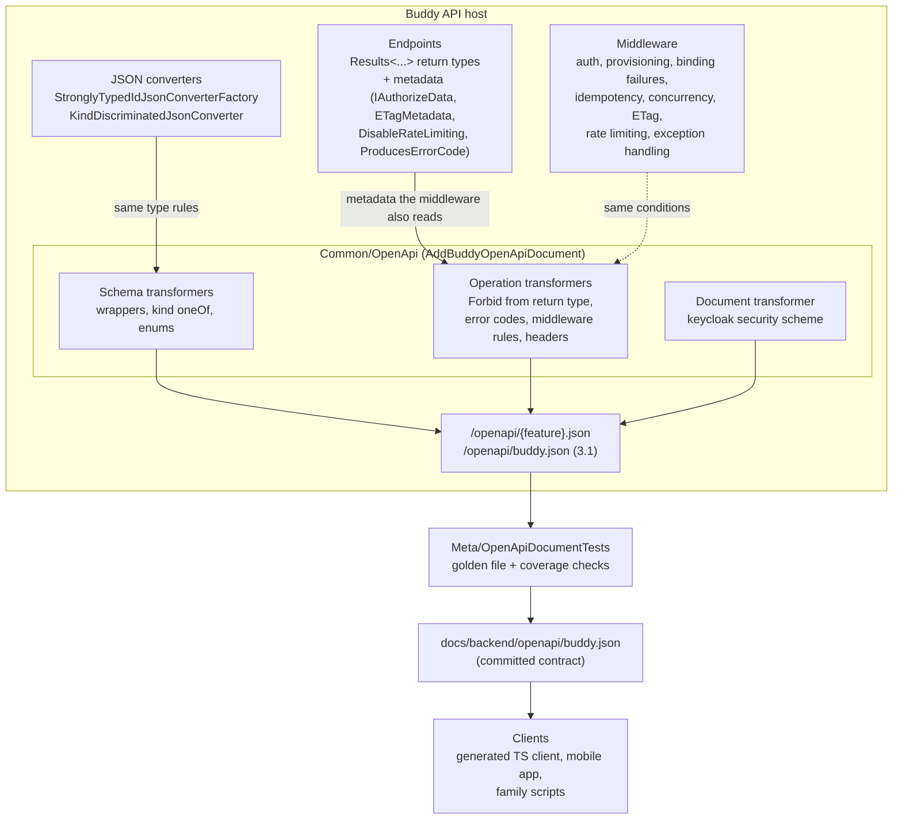

# Client-ready OpenAPI documents

Status: Proposed (not yet implemented)

## Context

Buddy's API is described by 14 OpenAPI documents, generated at runtime by
`Microsoft.AspNetCore.OpenApi`: one per feature (`/openapi/<feature>.json`, registered in each
`Add<Feature>Feature`, for example
[BabysittersFeature.cs:33](../../../src/backend/buddy/Features/Babysitters/BabysittersFeature.cs))
plus `v1` for `/health` and `/version`
([Program.cs:86](../../../src/backend/buddy/Program.cs)). They are mapped in Development only, and
nothing reads them: the Angular frontend's types in `src/frontend/buddy/src/app/core/*.service.ts`
are written by hand.

The goal is a contract that any client can integrate against: a third-party or mobile client (see
the "Mobile app" item in [TODO.md](../../../TODO.md)), a generated TypeScript client for the
frontend, or a family's own scripts against its instance. A check of the generated documents on
2026-10-09 (170 operations) found that they don't describe the API well enough for that:

| Area | What the documents say today |
| --- | --- |
| Error statuses | Only `400`, `404` and `409`, and only where an endpoint's `Results<...>` declares them. `403` appears nowhere, although 111 endpoints can return it. |
| Middleware responses | `401`, `403 user_not_provisioned`, `409 concurrency_conflict`, the `Idempotency-Key` errors, `304`, `429`, `500` and `503` are missing everywhere. |
| Schemas | 20 component schemas are empty (`{}`): all 14 single-value wrappers (`UserId`, `GroupId`, `Color`, `Language`, `TimeZoneId`, ...) and 6 `kind`-discriminated DTOs (`ItemScheduleRequest`, `ItemScheduleResponse`, `ItemTimingRequest`, `OccurrenceTiming`, `PickupAssigneeDto`, `WorkDayStatus`). `TaskSourceResponse` is missing entirely, because it is only reachable through an empty schema. |
| Enums | 21 enums (`GroupRole`, `MealSlot`, `DoseStatus`, ...) are a bare `{"type": "integer"}` with no values. |
| Success responses | Both iCal feeds list no `200`. |
| Auth and headers | No security scheme; nothing about `Idempotency-Key`, `ETag`/`If-None-Match` or `Retry-After`. |
| Version | The documents are OpenAPI `3.2.0`, which most client generators don't read yet. |
| Availability | Development only, and never committed, so a change to the contract is invisible in a diff. |

What's already good: every operation has an `operationId` (from `.WithName(...)`), request and
response bodies are typed DTOs, and every validation failure, middleware rejection and server error
already shares one body, [`ErrorEnvelope`](../../../src/backend/buddy/Common/ErrorEnvelope.cs). The
behavior is documented by hand in [http-status-codes.md](../http-status-codes.md); this design makes
the machine-readable documents say the same thing.

Nothing here changes how the API behaves, with one exception: the body of one `409` (Decision 4).

This document answers seven questions: where the OpenAPI customization lives, which OpenAPI
version to emit, how the schemas get fixed, how endpoint-level errors are documented, how the
cross-cutting middleware responses are documented, how the documents are published, and how they
are kept from drifting.

## Decision: one `Common/OpenApi` registration that every document goes through

**Decision: a new `Common/OpenApi/OpenApiFeature.cs` with `AddBuddyOpenApiDocument(name, include)`,
which registers a document with the shared schema, operation and document transformers. The 13
feature registrations and `Program.cs` call it instead of `AddOpenApi` directly.**

Same shape as the other cross-cutting concerns under `Common/` (`Common/Http/ETagMiddleware.cs`,
`Common/RateLimiting/RateLimitingFeature.cs`): implemented once, applied everywhere. Transformers
are registered per document in `Microsoft.AspNetCore.OpenApi`, so without a shared helper each of
the 14 call sites would have to repeat the same five registrations.

Before ([BabysittersFeature.cs:33](../../../src/backend/buddy/Features/Babysitters/BabysittersFeature.cs)):

```csharp
services.AddOpenApi(OpenApiDocumentName, options =>
{
    options.ShouldInclude = api => api.GroupName == OpenApiDocumentName;
});
```

After:

```csharp
services.AddBuddyOpenApiDocument(OpenApiDocumentName);
```

Blast radius: 13 `Add<Feature>Feature` methods and `Program.cs`, one line each. No endpoint changes
for this decision.

Rejected: **an endpoint convention per route group** (`group.WithOpenApiResponses()`, next to
`.WithETag()`), which would add `ProducesResponseTypeMetadata` with `Finally(...)`. It reaches
ApiExplorer as well, but it needs a line on each of the 18 route groups, and a group without it is
silently under-documented. A document transformer sees every operation in every document.

Rejected: **Swashbuckle or NSwag** in place of `Microsoft.AspNetCore.OpenApi`. Both are third-party
generators that would duplicate what the framework already does. Everything this design needs is
available through the built-in transformer API.

## Decision: emit OpenAPI 3.1

**Decision: `options.OpenApiVersion = OpenApiSpecVersion.OpenApi3_1` in `AddBuddyOpenApiDocument`.**

.NET 11 defaults to `3.2.0`. The common client generators (openapi-typescript, openapi-generator,
NSwag, Kiota) read 3.0 and 3.1; 3.2 support is partial or missing. Buddy uses nothing that needs
3.2. 3.1 still has JSON Schema 2020-12, so the generator's nullable unions
(`"type": ["null", "string"]`) stay as they are. Moving to 3.2 later is a one-line change.

Rejected: **3.0.** It would turn every nullable member into the older `nullable: true` form for no
benefit.

## Decision: schemas describe what goes over the wire

Three schema transformers, each driven by the same rule the serializer uses, so they can't
disagree with it.

### Single-value wrappers

**Decision: a type that
[`StronglyTypedIdJsonConverterFactory`](../../../src/backend/buddy/Serialization/StronglyTypedIdJsonConverterFactory.cs)
converts gets the schema of its `Value` type.** `UserId` becomes `{"type": "string", "format":
"uuid"}`, and `Color` becomes `{"type": "string"}`. The factory's private `GetValueProperty` becomes
an `internal static bool TryGetValueType(Type, out Type)` that both the factory and the transformer
call. The component keeps its name (`UserId`), so a generated client still gets a named alias.

### `kind`-discriminated DTOs

**Decision: a type whose `[JsonConverter]` derives from
[`KindDiscriminatedJsonConverter<TBase>`](../../../src/backend/buddy/Serialization/KindDiscriminatedJsonConverter.cs)
gets `oneOf` its case types, with a `discriminator` on `kind` and each case schema carrying
`kind` as an integer `const`.** The converter's `Cases` map (ordinal -> case type) is already the
single source of truth; it becomes readable from the transformer (`internal`, through a small
non-generic interface). All 7 such converters are covered at once, including
`TaskSourceResponse`, which then appears in the document.

```json
"PickupAssigneeDto": {
  "oneOf": [
    { "$ref": "#/components/schemas/PickupAssigneeDtoGuardian" },
    { "$ref": "#/components/schemas/PickupAssigneeDtoBabysitter" }
  ],
  "discriminator": { "propertyName": "kind", "mapping": { "0": "...", "1": "..." } }
}
```

Rejected: **switching the DTOs to `[JsonPolymorphic]`**, which the generator understands natively.
The converter's comment explains why it exists: with an abstract base, a body missing `kind` makes
System.Text.Json throw `NotSupportedException`, which surfaces as a `500` instead of a `400`.

Converters used only for events (`RecurrenceJsonConverter`, `ItemScheduleJsonConverter`,
`PickupAssigneeJsonConverter`, ...) never appear in an HTTP body and need nothing.

### Enums

**Decision: enums stay integers on the wire. The schema transformer adds `enum` with the numeric
values and `x-enum-varnames` with the member names**, plus a description listing `0 = Owner`, and so
on:

```json
"GroupRole": {
  "type": "integer",
  "enum": [0, 1, 2],
  "x-enum-varnames": ["Owner", "Admin", "Member"]
}
```

`x-enum-varnames` is the de-facto extension that openapi-generator, NSwag and openapi-typescript use
to name the members. The frontend already relies on the ordinals
([groups.service.ts:11](../../../src/frontend/buddy/src/app/core/groups.service.ts)), so this is a
documentation change only.

Rejected for this design: **a global `JsonStringEnumConverter`.** String enums are easier to read,
but switching would change every request and response that has an enum, all 21 enums, across the
backend, the frontend's types and the e2e specs. That is a breaking API change, so it gets its own
decision (see [Remaining open questions](#remaining-open-questions)). Dictionary keys of an enum type
already serialize as member names; their schemas get `propertyNames` with the names.

## Decision: endpoint-level errors are read from the handler's return type

### `403`

**Decision: an operation transformer reads the handler's declared return type and adds a bodiless
`403` when the `Results<...>` union contains `ForbidHttpResult`.** For minimal APIs the handler's
`MethodInfo` is in the endpoint metadata, so the transformer unwraps `Task<Results<...>>` and checks
its type arguments. `ForbidHttpResult` doesn't implement `IEndpointMetadataProvider`, which is why
the 111 endpoints that return it are undocumented today.

Rejected: **`.Produces(403)` on each endpoint** (111 lines, kept in sync by hand), and **a Buddy
`Forbidden` result type** that implements `IEndpointMetadataProvider` (the same 111 endpoints
change, for no behavior change).

### Responses the framework can't infer

**Decision: three explicit annotations where the result type carries no metadata.**

- Both iCal feeds
  ([GetIcalFeed.Endpoint.cs:15](../../../src/backend/buddy/Features/Calendars/GetIcalFeed/GetIcalFeed.Endpoint.cs),
  [GetMealPlanIcalFeed.Endpoint.cs:15](../../../src/backend/buddy/Features/Mealplans/GetMealPlanIcalFeed/GetMealPlanIcalFeed.Endpoint.cs))
  return `ContentHttpResult`: add `.Produces<string>(200, "text/calendar")`.
- The two invite-accept endpoints return `email_not_verified` through `JsonHttpResult<ErrorEnvelope>`
  ([EmailNotVerified.cs](../../../src/backend/buddy/Features/Users/EmailNotVerified.cs)): add
  `.Produces<ErrorEnvelope>(403)`. The `403` from `ForbidHttpResult` on the same endpoints has no
  body, so the merged response's body is described as optional.

### Error codes

**Decision: each error response lists the `ErrorEnvelope.code` values it can carry, in its
description and in an `x-error-codes` array.** Clients branch on `code` (`resend_cooldown`,
`ai_data_sharing_not_acknowledged`, ...), so the status code alone isn't enough.

- Responses added by the cross-cutting rules (next decision) know their codes.
- `400` from `BadRequest<ErrorEnvelope>` is always `validation_error`.
- The 9 endpoints that return an endpoint-specific `409` or `403` code (including `CreateChild`, below) declare it with new
  metadata: `.ProducesErrorCode(409, ResendCooldown.ErrorCode)`, the same pattern as
  `.AllowUnprovisionedUser()`. Each error-code constant already exists (`ResendCooldown.ErrorCode`,
  `EmailNotVerifiedExtensions.ErrorCode`, ...).

`ErrorEnvelope.code` stays `{"type": "string"}`, with every known code in its description. It is not
an `enum`, because a generated client rejects an enum value it doesn't know, so adding a code would
break existing clients.

### `CreateChild`'s `409`

**Decision: `POST /users/me/children` answers its username conflict with an `ErrorEnvelope`
(`username_unavailable`) instead of a bare JSON string.**
[CreateChild.Endpoint.cs:35](../../../src/backend/buddy/Features/Guardians/CreateChild/CreateChild.Endpoint.cs)
is the only error in the API whose body isn't an `ErrorEnvelope`.

```csharp
// before
CreateChildOutcome.UsernameUnavailable => TypedResults.Conflict("That username is already in use."),
// after
CreateChildOutcome.UsernameUnavailable => TypedResults.Conflict(new ErrorEnvelope(
    UsernameUnavailableCode, "That username is already in use.", new Dictionary<string, string[]>(), httpContext.TraceIdentifier)),
```

Blast radius: one endpoint and its integration test. The frontend checks only the status
([children-step.ts:64](../../../src/frontend/buddy/src/app/features/guardian/onboarding/children-step/children-step.ts),
[manage-children.ts:111](../../../src/frontend/buddy/src/app/features/guardian/admin/manage-children/manage-children.ts)),
so it doesn't change.

## Decision: middleware responses are added by rule, from the same metadata the middleware reads

**Decision: an operation transformer adds each cross-cutting response from the same endpoint
metadata that decides whether the middleware acts.** The transformer and the middleware can then
only disagree if one of them changes its condition, and the meta test (last decision) checks the
conditions.

| Response | Codes | Added when | Source |
| --- | --- | --- | --- |
| `401` | -- (`WWW-Authenticate` header) | the endpoint has `IAuthorizeData` and no `IAllowAnonymous` | `UseAuthorization` |
| `403` | `user_not_provisioned` | as `401`, and no `AllowUnprovisionedUserMetadata` | [ProvisionedUserMiddleware](../../../src/backend/buddy/Features/Users/ProvisionedUserMiddleware.cs) |
| `400` | `validation_error` | the operation has a request body, or a route/query parameter that can fail to bind | [RequestBindingFailureMiddleware](../../../src/backend/buddy/Common/Validation/RequestBindingFailureMiddleware.cs) |
| `400` | `invalid_idempotency_key` | `POST` | [IdempotencyKeyMiddleware](../../../src/backend/buddy/Common/Idempotency/IdempotencyKeyMiddleware.cs) |
| `409` | `idempotency_key_reused`, `idempotency_key_in_progress`, `idempotency_response_unavailable` | `POST` | same |
| `409` | `concurrency_conflict` | any method other than `GET` | [ConcurrencyConflictMiddleware](../../../src/backend/buddy/Common/Concurrency/ConcurrencyConflictMiddleware.cs) |
| `304` | -- (no body) | `GET` with `ETagMetadata` | [ETagMiddleware](../../../src/backend/buddy/Common/Http/ETagMiddleware.cs) |
| `429` | `rate_limited` (`Retry-After` header) | no `DisableRateLimitingAttribute` | [RateLimitingFeature](../../../src/backend/buddy/Common/RateLimiting/RateLimitingFeature.cs) |
| `500` | `internal_error` | always | [ExceptionHandlingFeature](../../../src/backend/buddy/Common/Errors/ExceptionHandlingFeature.cs) |
| `503` | `dependency_unavailable` (`Retry-After` header) | always | same |

When a response for the status already exists (a `409 resend_cooldown` declared by the endpoint
and the generic `409 concurrency_conflict`), the transformer merges them: one response, the union
of the codes, and the `ErrorEnvelope` schema.

`409 concurrency_conflict` on every non-`GET` overstates it slightly: a command that appends
nothing can't lose the race. The description says "may", which is accurate, and it is safer than
missing the case. Working out which handlers append would mean inspecting Wolverine handlers, which
isn't worth it.

## Decision: security scheme and protocol headers in the document

**Decision: a document transformer declares one `openIdConnect` security scheme, `keycloak`, whose
`openIdConnectUrl` is `{KeycloakOptions.Authority}/.well-known/openid-configuration`.** Operations
under the `401` rule above get `security: [{ "keycloak": [] }]`, and anonymous ones get none. The
Authority comes from configuration
([KeycloakOptions.cs](../../../src/backend/buddy/Features/Users/KeycloakOptions.cs)), so each
family's instance publishes its own Keycloak, and a client discovers the authorize and token
endpoints from it.

**Headers documented:**

- `Idempotency-Key`: optional request header on every authenticated `POST`, string, 1-200
  characters, with the replay semantics from
  [http-status-codes.md](../http-status-codes.md#idempotency-key-post).
- `If-None-Match`: optional request header, and `ETag` and `Cache-Control` response headers on
  `200`, for `GET`s with `ETagMetadata`.
- `Retry-After` on `429` and `503`.

## Decision: one combined document, committed to the repo, served by every instance

**Decision: a 15th document, `buddy`, that includes every operation, is the published contract.**
The per-feature documents stay for browsing, but a client generator wants one input. The existing
`v1` document stays as is, because the e2e setup and the `run-buddy` skill use
`/openapi/v1.json` as a readiness probe.

**Decision: the combined document is committed as `docs/backend/openapi/buddy.json`**, written by a
test against the Alba host, the same way the event golden files pin event shapes
([EventShapeTestSupport.cs](../../../src/backend/buddy.IntegrationTests/EventShapeTests/EventShapeTestSupport.cs)).
`Meta/OpenApiDocumentTests` fetches `/openapi/buddy.json` and compares it with the committed file.
The comparison ignores two values that depend on the host: `servers` and the Keycloak URL, which is
replaced by a fixed placeholder. On a mismatch it fails with the differing paths. With
`BUDDY_UPDATE_OPENAPI=1` it rewrites the file instead, wrapped as `task docs:openapi` like
`task docs:screenshots`. Every API contract change then shows up as a reviewable diff of that file.

Rejected: **build-time generation** with `Microsoft.Extensions.ApiDescription.Server`. It starts the
app's host during `dotnet build`, which in Buddy validates options on start (`ValidatedOptions`),
registers 13 Marten stores and runs `RunJasperFxCommands`. Getting that to start without Postgres or
Keycloak config is fragile, and the Alba host already starts the real app with both.

**Decision: `MapOpenApi()` runs in every environment, not only Development**, anonymous, under the
default per-IP rate limit. The source code is public (MIT, linked from the profile menu), so the
document reveals nothing new. A family's technical member, or an app pointed at their instance, can
read the contract of exactly the version deployed there. This is the main remaining open question
below.

## Decision: meta tests keep the documents honest

Same approach as `Meta/ETagCoverageTests` and `Meta/RateLimitingCoverageTests`: they enumerate
the real endpoints or document and fail with a list.

`Meta/OpenApiDocumentTests`:

- **Golden file**: `buddy.json` matches the committed copy (above).
- **No empty schemas**: no component schema is `{}`, so a new converter can't silently produce an
  untyped schema.
- **Enums have values**: every integer schema backed by a .NET enum has `enum` and
  `x-enum-varnames`.
- **Every endpoint's `403` is documented**: every endpoint whose handler can return
  `ForbidHttpResult` or `JsonHttpResult<ErrorEnvelope>` documents `403`.
- **Every error response has a body or is listed**: each `4xx` and `5xx` response has the
  `ErrorEnvelope` schema, unless it is on a short explicit list of bodiless responses (`401`, `403`
  from `Forbid`, `404`, `304`).
- **Every operation is in `buddy`**: the per-feature documents together contain exactly the
  operations of the combined one, so a route group without `.WithGroupName` is caught.

## Testing

- Unit-level tests for each transformer against a small hand-built `OpenApiOperation` or schema,
  next to the existing `Common` tests in `buddy.IntegrationTests/Common/`.
- `Meta/OpenApiDocumentTests` as above, against the shared `BuddyApiFixture` (Development
  environment, so `/openapi/*.json` is already mapped there today).
- `CreateChild`'s existing `409` test asserts the `username_unavailable` envelope.
- A smoke check that the committed `buddy.json` is consumable: run `npx openapi-typescript` over it
  in CI and fail if it errors. It needs no Docker and catches 3.1 or discriminator mistakes that a
  JSON comparison can't.

## Failure and edge-case behavior

| Case | Behavior |
| --- | --- |
| A new endpoint with a new `Forbid` path | Documented automatically (return-type rule); the golden file diff shows it. |
| A new middleware that answers with a new status | Not documented until a rule is added; the "every error response has a body" test doesn't catch a status that was never documented. Handled by review, like `http-status-codes.md` today. |
| A new single-value wrapper or `kind`-discriminated DTO | Covered by the converter-driven transformers; "no empty schemas" fails if it isn't. |
| A new enum | Covered automatically; "enums have values" fails if not. |
| A new error code | Description and `x-error-codes` update through the constant; the golden file diff shows it. Existing generated clients keep working because `code` is not an `enum`. |
| Same status from endpoint and middleware | Merged into one response with the union of codes. |
| Anonymous endpoint (iCal feeds, invite previews, shared sleep diary, `/version`) | No `security`, no `401`/`403 user_not_provisioned`; still `429`, `500`, `503`. |
| Contract change without regenerating `buddy.json` | `OpenApiDocumentTests` fails in `task test:backend` and CI. |

## Decisions made

| Question | Decision |
| --- | --- |
| Where the customization lives | `Common/OpenApi`, one `AddBuddyOpenApiDocument` used by all 14 registrations |
| OpenAPI version | 3.1 (3.2 isn't read by most generators yet) |
| Wrapper and `kind` schemas | Derived from the converters' own rules, so schema and serializer can't disagree |
| Enums | Stay integers; documented with `enum` + `x-enum-varnames` |
| `403` documentation | Read from the handler's `Results<...>` return type, not annotated per endpoint |
| Error codes | Per response, in the description and `x-error-codes`; `code` itself stays an open string |
| `CreateChild` `409` body | Becomes an `ErrorEnvelope` (`username_unavailable`), the one behavior change |
| Middleware responses | Added by rule from the same metadata each middleware reads |
| Auth | One `openIdConnect` scheme from the configured Keycloak Authority |
| Published contract | A combined `buddy` document, committed as `docs/backend/openapi/buddy.json` and pinned by a golden-file test |

## Remaining open questions

- **Serve the documents in production?** Lean: yes, as decided above, because the code is public
  and a per-family instance should describe itself. The alternative is Development only plus the
  committed `buddy.json`, which describes `master` rather than the deployed version.
- **String enums.** Lean: not now. Switching to `JsonStringEnumConverter` makes the API
  self-describing without `x-enum-varnames`, but it is a breaking change across all 21 enums and
  the frontend. Worth its own design doc if a third-party client appears.
- **The per-endpoint tables in `http-status-codes.md`.** They already miss 19 routes and list one
  that doesn't exist (`PATCH /calendars/{calendarId}/members/{memberId}`). Lean: once `buddy.json`
  is committed, replace the tables with a pointer to it and keep the doc for the rules (what each
  status means, decision checklist, idempotency, ETags). The alternative is to fix the tables and
  keep them in sync by hand.
- **Generate the frontend's types from `buddy.json`.** Lean: a separate frontend plan in
  `docs/frontend/analysis/`, after this ships. It would replace the hand-written interfaces in
  `core/*.service.ts` and is the strongest proof that the contract is complete, but it touches
  every service.
- **A UI for the document** (Scalar or Swagger UI). Lean: no. Any OpenAPI viewer can open the
  served JSON, and a UI adds a frontend dependency to the API.

## Diagram


