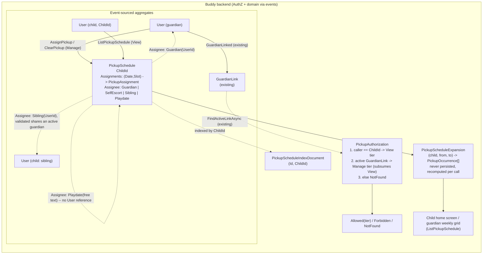

# Pickup and Drop-off Schedules

Status: Proposed

## Context

A guardian wants to plan, for the week ahead, who takes a child to school or
an activity (drop-off) and who collects them afterward (pickup) — the same
"plan it once, everyone can see it" need [meal plans](mealplans.md) already
solve for dinner. Four things were asked for specifically:

1. A weekly planning view, filled in by guardians, similar to the meal plan's
   assign-the-week grid.
2. An explicit "goes by themself" option — the child needs no escort for that
   slot.
3. An explicit "a sibling does it" option — an older/younger sibling escorts
   instead of a guardian.
4. An explicit "playdate" option for pickup — the child is collected by
   another family (a friend's parent) rather than a guardian, sibling, or
   themself.

Nothing resembling this exists today. `Calendar`/`CalendarItem`
([glossary.md](../glossary.md)) has no concept of "who is responsible for
this occurrence" beyond `createdBy`/`lastModifiedBy` — there is no notion of
assigning a *principal* (a specific guardian, the child, a sibling, or a
third party) to a scheduled slot. Neither does anything else in the
codebase; a grep for "pickup"/"dropoff"/"escort" returns nothing.

## Question 1: extend `Calendars`, or a new feature?

**Decision: a new feature, `Features/Pickups`, with its own aggregate.** Not
a new `CalendarItemKind`.

Reasoning — the same shape of argument
[medicine-schedules.md](medicine-schedules.md#question-1-extend-calendars-or-a-new-feature)
and [mealplans.md](mealplans.md#question-1-extend-calendars-or-a-new-feature)
already made:

- The core new concept — "who is responsible for this slot" — has no
  equivalent on `CalendarItem` today, and the shape of that responsibility
  varies by kind (a specific guardian's `UserId`, no data at all for
  self-escort, a sibling's `UserId`, or a playdate host's free-text details).
  Carrying that as a meaningless field on every `Event`/`Task` would leak a
  pickup-specific concept into a generic scheduling primitive used for
  unrelated purposes.
- The permission model (see "Authorization" below) is the same narrow
  guardian/child shape `MedicineSchedule` and `MealPlan` already have, not
  `Calendar`'s three-tier `CalendarRole`
  ([group-owned-calendars-and-permissions.md](group-owned-calendars-and-permissions.md)).
- This keeps `Calendars` completely untouched, exactly as `Medicines` and
  `Mealplans` did.

## Question 2: per-child, or family-wide like `MealPlan`?

**Decision: per child — one `PickupSchedule` stream per `ChildId`, the same
scope `MedicineSchedule` uses, not `MealPlan`'s family-wide singleton.**

`MealPlan` went family-wide because a shared dinner is genuinely one fact for
the whole household ([mealplans.md, Question 3](mealplans.md#question-3-sharing-a-mealmealplan-across-siblings)).
A pickup schedule is not that: siblings routinely attend different
schools/activities at different times, and even for the same school run, who
does *Alice's* Tuesday pickup and who does *Bob's* are independent decisions
a guardian makes separately — there is no single fact "the family's Tuesday
pickup" the way there is a single fact "the family's Tuesday dinner." The
`Sibling` assignee (see below) already captures the one genuinely cross-child
case — "Alice picks up Bob" — as a pointer from Bob's schedule to Alice's
`UserId`, without needing the schedule itself to be family-wide.

A guardian planning multiple children's weeks at once is a frontend
concern: the same pattern `ListMyChildren`-driven dashboards already use
today — call `ListPickupSchedule` once per child and render the results
side by side — not a reason to merge the schedules into one backend
aggregate.

## Question 3: modeling "who" — a union, not an enum

**Decision: `PickupAssignee` is a closed union of four cases, mirroring
`CalendarOwner`'s union-of-records shape
([CalendarOwner.cs](../../../src/backend/buddy/Features/Calendars/Types/CalendarOwner.cs)),
not a plain enum with a separate nullable "target" field.**

A flat `enum AssigneeKind { Guardian, SelfEscort, Sibling, Playdate }` plus
loose optional fields (`GuardianId?`, `SiblingChildId?`, `PlaydateHostName?`)
would let a `Guardian`-kind assignment carry a stray `PlaydateHostName`, or a
`SelfEscort` carry a `SiblingChildId` — combinations that are meaningless and
would need defensive validation everywhere they're read. A union makes the
illegal states unrepresentable: each case only has the fields it actually
needs.

```
public union PickupAssignee(
    PickupAssignee.Guardian,
    PickupAssignee.SelfEscort,
    PickupAssignee.Sibling,
    PickupAssignee.Playdate)
{
    public sealed record Guardian(UserId GuardianId);
    public sealed record SelfEscort;
    public sealed record Sibling(UserId SiblingChildId);
    public sealed record Playdate(string HostName, string? Location, string? ContactInfo);
}
```

- **`Guardian`** — a specific guardian of the child handles this slot
  themself. Validated at write time (see "Command slices") to actually be an
  active guardian of `ChildId`, via the existing
  `IGuardianLinkEventStore.FindActiveLinkAsync`
  ([IGuardianLinkEventStore.cs](../../../src/backend/buddy/Features/Guardians/IGuardianLinkEventStore.cs)) —
  the same check `MedicineAuthorization`/`MealplanAuthorization` already run
  for the *caller*, reused here to validate the *target*.
- **`SelfEscort`** — the child goes by themself. Carries no data; its
  presence as an explicit assignment (rather than the slot simply being
  unassigned) is the point — it lets a guardian record "I've deliberately
  decided this needs no escort" as distinct from "I haven't planned this
  slot yet" (see "Failure and edge-case behavior").
- **`Sibling`** — another of the child's own siblings escorts them.
  `SiblingChildId` is validated at write time to actually share an active
  guardian with `ChildId` — a small local check against
  `IGuardianLinkEventStore` (list `ChildId`'s guardians, list
  `SiblingChildId`'s guardians, require overlap), deliberately **not** a
  dependency on `Mealplans`' `MealFamilyResolution`
  ([MealFamilyResolution.cs](../../../src/backend/buddy/Features/Mealplans/MealFamilyResolution.cs)):
  that type lives in, and is scoped to, the `Mealplans` feature, and pulling
  it into `Pickups` would cross a vertical-slice boundary for one query this
  feature can answer directly against `Guardians` primitives it already
  needs for its own authorization. If a third feature needs the same
  "siblings of X" check, that's the point to extract a shared helper into
  `Features/Guardians` — not before.
- **`Playdate`** — the child is collected by someone outside the family and
  the app's user model entirely (a friend's parent). `HostName` is required
  free text (there is no `User`/`GuardianLink` to point at — the host isn't
  a Buddy account), `Location`/`ContactInfo` are optional free text. This is
  intentionally as unstructured as `MealRating.Comment` — inventing a
  "guest contact" sub-aggregate for a field nothing else needs would be
  speculative generalization ahead of an actual second use case.

Nothing in the schema restricts `Playdate` (or any other case) to the
`PickUp` slot specifically — see "Failure and edge-case behavior" for why
that's a UI default rather than a domain rule.

## Domain model

### `PickupSchedule` (new aggregate, one stream per child)

```
PickupSchedule(
    PickupScheduleId Id,
    UserId ChildId,
    ImmutableDictionary<(DateOnly Date, PickupSlot Slot), PickupAssignment> Assignments)

PickupAssignment(PickupAssignee Assignee, TimeOnly? Time, UserId AssignedBy, string? Notes)

enum PickupSlot { DropOff, PickUp }
```

- `Assignments` only ever holds slots a guardian has actually filled in —
  the same sparse-dictionary contract `MealPlan.Assignments` and
  `MedicineSchedule.DoseLog` already use. An unassigned `(Date, Slot)` simply
  has no key; there is no default assignee.
- `PickupSlot` is a fixed two-value enum, deliberately mirroring `MealSlot`'s
  fixed-slot shape ([MealSlot.cs](../../../src/backend/buddy/Features/Mealplans/Types/MealSlot.cs))
  rather than an open list of named times like `MedicineSchedule.Times` —
  the common case this covers is the twice-daily school/daycare run.
  Activities needing more than two slots a day are a real gap; see
  "Remaining open questions."
- `Time` is optional — a guardian can record "pickup at 15:15 today, early
  dismissal" for precision, but it isn't required to make an assignment
  meaningful (the slot enum already conveys "morning" vs. "afternoon" on
  its own).

### `PickupAssignee` — see Question 3 above.

### Events

Following the existing `Before`/`After` convention for mutations
([MealPlan events](mealplans.md#mealplan-events),
[medicine-schedules.md](medicine-schedules.md#events)):

```
PickupScheduleCreated(PickupScheduleId, UserId ChildId, DateTimeOffset OccurredAt)
    // Lazily appended by the first AssignPickup call for a child with no stream yet,
    // exactly as MealPlanCreated is -- not provisioned as part of CreateChild.

PickupAssigned(PickupScheduleId, DateOnly Date, PickupSlot Slot, PickupAssignee Assignee,
    TimeOnly? Time, UserId AssignedBy, string? Notes, PickupAssignment? Before, DateTimeOffset OccurredAt)

PickupCleared(PickupScheduleId, DateOnly Date, PickupSlot Slot, PickupAssignment Before,
    UserId ModifiedBy, DateTimeOffset OccurredAt)
```

`PickupAssigned` always overwrites (`Before`/`After`, no separate "reassign"
event) — same rule `MealAssignedToSlot` uses: no confirmation step
server-side, "are you sure you want to change today's pickup" is a client UX
concern.

### Rehydration

`PickupSchedule.Rehydrate(events)` folds the stream the same way
`MealPlan.Rehydrate` does: `PickupScheduleCreated` seeds the record,
`PickupAssigned`/`PickupCleared` upsert/remove `Assignments[(Date, Slot)]`,
keeping the dictionary sparse.

## Read model

Marten streams are addressed by their own aggregate ID, so listing "does
child X have a `PickupSchedule`, and what's its ID" needs the same
maintained index every other per-child feature uses
([MedicineIndexDocument.cs](../../../src/backend/buddy/Features/Medicines/Types/MedicineIndexDocument.cs),
[MealPlanIndexDocument.cs](../../../src/backend/buddy/Features/Mealplans/Types/MealPlanIndexDocument.cs)):

```
PickupScheduleIndexDocument(Guid Id, Guid ChildId)
```

One row per child, written once on `PickupScheduleCreated`, in the same
`SaveChangesAsync` as the event append — never a separate write or async
projection, matching the maintained-inline-projection pattern used
everywhere else.

## Expansion — reading a date range

A new static helper, `PickupScheduleExpansion`, deliberately parallel to
`MealPlanExpansion`/`MedicineDoseExpansion`: given a `ChildId` and
`[from, to]`, for every date in range and both `PickupSlot` values, look up
`Assignments[(Date, Slot)]` and — for `Guardian`/`Sibling` cases — join in
the referenced `User`'s display name (via the existing `Users` feature
lookup), producing:

```
PickupOccurrence(DateOnly Date, PickupSlot Slot, PickupAssignee? Assignee, TimeOnly? Time, string? Notes)
```

`Assignee` is `null` for a date/slot with no assignment yet — there is no
default to fall back to (unlike `DoseStatus.Pending`, "unplanned" is a
distinct, displayable state a guardian's UI should surface as "not yet
planned," not silently treated as any particular arrangement). Nothing here
is persisted or cached; it's recomputed from current aggregate state on
every call, the same explicit, already-accepted tradeoff described in
[group-owned-calendars-and-permissions.md](group-owned-calendars-and-permissions.md#aggregate-loading-and-performance--operational-contract).

Same stance as both precedents on time zones: no resolution performed here.
`Time` (where present) is treated as the child's own local wall-clock value,
exactly like `MedicineSchedule.Times` — see
[medicine-schedules.md](medicine-schedules.md#remaining-open-questions).

## Authorization

Same narrower two-tier shape `MedicineSchedule` and `MealPlan` both use — no
members, no group ownership, exactly two principals — reusing the existing
`GuardianLink` machinery
([CalendarAuthorization.cs](../../../src/backend/buddy/Features/Calendars/CalendarAuthorization.cs)-style)
with no new authorization document needed:

| Tier | Who | Actions |
|---|---|---|
| **Manage** | An active guardian of `ChildId` only | Assign/clear a slot for any date, with any `PickupAssignee`; view the schedule |
| **View** | The child (`ChildId` itself) only | View the schedule — who's picking them up and when |

Unlike `MedicineSchedule`'s Mark tier, the child has no write action here at
all — nothing here is something a child self-reports (there's no equivalent
of "I took my dose"), so there's no third action to gate; `View` is
read-only by construction, not by a collapsed write check. A guardian
attempting to assign a slot for a child they aren't an active guardian of
gets `NotFound`, matching the calendar/medicine precedent for "can't
distinguish private from missing."

```
enum PickupAccess { Allowed, NotFound, Forbidden }
```

Resolution, mirroring `MedicineAuthorization.ResolveTier`'s shape:

1. `callerId == ChildId` → `View` tier (read only).
2. Else, `guardians.FindActiveLinkAsync(ChildId, callerId, ...)` returns a
   link → `Manage` tier (read + write).
3. Else → `NotFound`.

A `Manage`-tier action attempted by the child collapses to `Forbidden` — they
can see the schedule, they just can't change it, matching how
`MedicineAccess.Forbidden`/`MealplanAccess.Forbidden` are already used for
"can see, can't do this."

## Command slices (`Features/Pickups/`, same vertical-slice shape as `Medicines`)

| Slice | Tier | Notes |
|---|---|---|
| `AssignPickup` | Manage | `Date`, `Slot`, `Assignee` (one of the four `PickupAssignee` cases), `Time?`, `Notes?`. Creates the stream lazily if the child has none yet (same lazy-creation contract `AssignMealToSlot` has). Validates the assignee: `Guardian.GuardianId` must be an active guardian of `ChildId`; `Sibling.SiblingChildId` must share an active guardian with `ChildId`; `SelfEscort`/`Playdate` need no relationship check. Emits `PickupAssigned` |
| `ClearPickup` | Manage | `Date`, `Slot` — idempotent no-op if the slot has no assignment (`Success`, no event), same rule `ClearMealSlot` uses. Emits `PickupCleared` |
| `ListPickupSchedule` | Manage or View | `[from, to]` date range → `PickupScheduleExpansion.ExpandAsync`, the read surface for both the guardian's weekly planning grid and the child's own "who's picking me up" view |

No slice needs to enumerate "who can this child's schedule name as an
assignee" — the guardian and sibling pickers reuse the existing
`ListMyChildren`/`ListMyGuardians` endpoints already built for the
`Guardians` feature; `Pickups` adds no new lookup for that.

## Routes

```
POST   /pickups/children/{childId}/assignments        AssignPickup
DELETE /pickups/children/{childId}/assignments         ClearPickup   (Date, Slot as query params)
GET    /pickups/children/{childId}/schedule            ListPickupSchedule
```

Mirrors `/medicines/children/{childId}/...`
([MedicinesFeature.cs](../../../src/backend/buddy/Features/Medicines/MedicinesFeature.cs))
and `/mealplans/children/{childId}/plan`
([group-owned-mealplans.md](group-owned-mealplans.md#routes))'s shape.

## Failure and edge-case behavior

| Case | Behavior |
|---|---|
| Slot has no assignment yet | `PickupOccurrence.Assignee` is `null` — distinct from `SelfEscort`, which is an explicit, deliberate choice. The frontend should render these differently ("not planned" vs. "goes alone") |
| Guardian assigns a `Playdate` to `DropOff` | Allowed — nothing in the domain restricts any `PickupAssignee` case to a particular slot. `PickUp`-for-playdates is the expected common case (collected from school by a friend's parent), but "dropped off directly at a playdate instead of home" is a real, if rarer, use of `DropOff`; special-casing it away would add a rule nobody asked for |
| `Guardian` assignee's `GuardianId` is later revoked (`GuardianRevoked`) | The existing assignment is left as-is — event-sourced history isn't rewritten — but the revoked guardian can no longer manage the schedule at all (drops to `NotFound`), and a guardian re-editing that slot will see the stale name/relationship when resolving display data, same as any other stale reference in this codebase |
| `Sibling` assignee's `SiblingChildId` stops sharing an active guardian with `ChildId` (e.g. a `GuardianLink` is revoked) | Existing assignments referencing them are untouched (history isn't rewritten); a *new* assignment naming that child as `Sibling` would fail validation from that point on |
| Clearing a slot that has no assignment | Idempotent no-op (`Success`, no event appended), same as `ClearMealSlot` |
| Two guardians assign the same slot at nearly the same time | Both `PickupAssigned` events append to the stream in order; the last one wins for current state, neither write is lost from history — the same benefit event sourcing already gives `MealPlan`/`MedicineSchedule` |
| Guardian's own `GuardianLink` to the child is revoked | Immediately drops to `NotFound` for that guardian, same as `Calendar`/`Medicines`/`Mealplans` today; the child's own `View`-tier access is unaffected |
| Child has no guardian at all | Cannot happen for `PickupSchedule` creation (`Manage` tier requires a `GuardianLink`), so every schedule has at least one guardian by construction |

## Decisions made

| Question | Decision |
|---|---|
| Extend `CalendarItem`, or new feature | New feature, `Features/Pickups` — mirrors the `Medicines`/`Mealplans` precedent |
| Scope: per-child or family-wide | Per child, like `MedicineSchedule` — pickup arrangements vary independently per child even within one family; the `Sibling` assignee covers the one genuinely cross-child case without needing a family-wide aggregate |
| How "who" is modeled | A closed `PickupAssignee` union (`Guardian`, `SelfEscort`, `Sibling`, `Playdate`), mirroring `CalendarOwner`'s union-of-records shape — makes invalid field combinations unrepresentable |
| Slot model | Fixed two-value `PickupSlot { DropOff, PickUp }`, mirroring `MealSlot`'s fixed-slot approach — covers the twice-daily school run; more slots per day is a v2 gap (see open questions) |
| Recurrence | None — every assignment is explicit, per date, same v1 stance `MealPlan` takes; no auto-repeating weekly template |
| Validating a `Sibling` assignee | A small local check against `IGuardianLinkEventStore` inside `Pickups`, not a dependency on `Mealplans.MealFamilyResolution` — keeps the vertical slice boundary intact |
| Who can write the schedule | Guardian (`Manage` tier) only, never the child |
| Who can view it | The child (`View` tier, read-only) and any active guardian (`Manage`, which subsumes read) |
| Does a child have any write action | No — unlike `MedicineSchedule`'s Mark tier, there's nothing here for the child to self-report |
| New read models needed | `PickupScheduleIndexDocument(Id, ChildId)` — same maintained-inline-projection pattern used everywhere else |
| Does a pickup schedule show up in `Calendar`/`ListOccurrences` | No — a fully separate read surface (`ListPickupSchedule`), matching the `Medicines`/`Mealplans` precedent |
| Group sharing (e.g. with a babysitter-pool group) | Not built now — not part of what was asked. If needed later, `MedicineSharing`'s per-child singleton pattern ([medicine-schedules.md](medicine-schedules.md#group-sharing-added-later-additive)) is the template to follow, the same way it was added to `Medicines` after the fact |

## Remaining open questions

- **More than two slots a day.** `PickupSlot` covers the common school-run
  case. A child with an after-school activity (dropped off there, then
  picked up from there, then possibly a separate playdate pickup) needs more
  than `DropOff`/`PickUp` per date. Deferred until there's a concrete need,
  consistent with this codebase's avoid-speculative-generalization stance —
  same reasoning `mealplans.md` uses for not building recurrence
  prematurely. If needed, the likely shape is replacing the fixed enum with
  a small ordered list of named slots per day, or widening the dictionary
  key to `(Date, int SlotIndex)` with a per-slot label.
- **Recurring weekly templates.** "Dad always does Monday pickup" currently
  means re-assigning Monday manually every week, the same open item
  [mealplans.md](mealplans.md#remaining-open-questions) flags for "Tacos
  every Tuesday." A natural v2 if guardians find manual weekly re-entry
  tedious.
- **Should the assigned sibling, guardian, or playdate host be notified?**
  Out of scope for v1, matching this codebase's general no-notifications
  stance elsewhere ([medicine-schedules.md](medicine-schedules.md#remaining-open-questions)).
- **Should `Playdate` ever point at a real account** (e.g. another
  guardian who's a member of a shared group, rather than free text)? Left as
  free text for v1 since a playdate host frequently isn't a Buddy user at
  all; if a large share of playdates turn out to be with other Buddy
  families, a `PlaydateAssignee` case that optionally carries a `UserId`
  alongside the free-text fields would be a natural additive change — not
  worth the extra complexity until that's observed.
- **A minimum age/eligibility gate on `SelfEscort`.** Nothing here checks
  whether a child is "old enough" for self-escort — it's presented as a
  guardian's judgment call, the same way this codebase avoids configurable
  policy for other guardian-authority decisions
  ([child-accounts-and-guardian-roles.md](child-accounts-and-guardian-roles.md#how-this-feeds-calendargroup-permissions)).
  Revisit only if a concrete request for such a gate comes in.
- **Time zone for "today's" schedule.** Same open item as
  [medicine-schedules.md](medicine-schedules.md#remaining-open-questions) —
  `User` has no `TimeZoneId`, so dates/times are the child's own local
  wall-clock, resolved client-side.
- **Cross-linking with `Calendar`.** Same stance as `Medicines`/`Mealplans`:
  fully independent for v1, frontend calls both `ListOccurrences` and
  `ListPickupSchedule` and interleaves by date.

## Diagram


