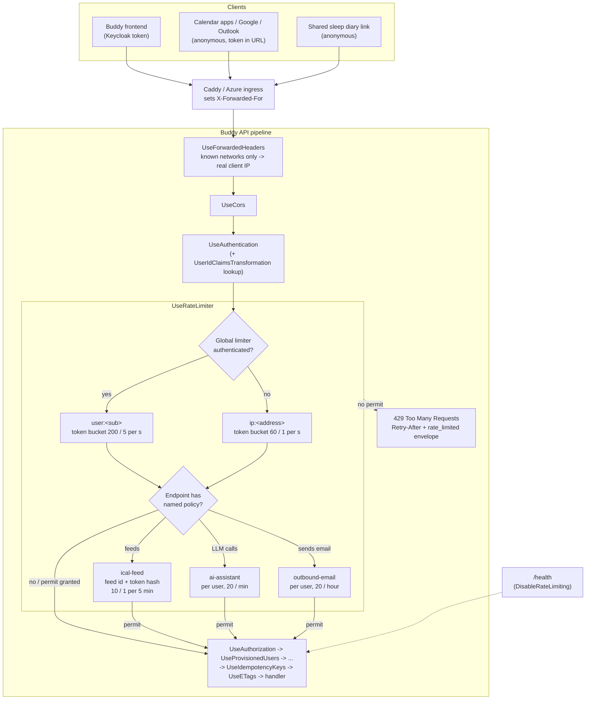

# Rate Limiting

Status: Implemented. `RateLimitingFeature` + `RateLimitingOptions` (`Common/RateLimiting/`): a global limiter on every endpoint (per Keycloak subject, else per client IP) plus the `ical-feed`, `ai-assistant` and `outbound-email` policies on 9 endpoints, `429 rate_limited` with `Retry-After`; `UseForwardedHeaders` from `ForwardedHeaders:KnownNetworks` (`Common/Http/ForwardedHeadersSetup.cs`), set in both deployments; `RateLimitingTests` on a separate low-limit host and `Meta/RateLimitingCoverageTests`. No frontend change.

## Context

The API has no request rate limit. Every request that gets past authentication runs its handler,
however often it arrives. The only throttle today is
[`ResendCooldown`](../../../src/backend/buddy/Common/RateLimiting/ResendCooldown.cs), a per-target
state check ("an email went to this address less than a minute ago") that answers `409
resend_cooldown`. It limits one kind of action per target. It doesn't limit callers.

Two changes made this matter:

- **Calendar apps now poll on their own schedule.** The calendar and meal plan iCal feeds
  ([`GetIcalFeed`](../../../src/backend/buddy/Features/Calendars/GetIcalFeed/GetIcalFeed.Endpoint.cs),
  [`GetMealPlanIcalFeed`](../../../src/backend/buddy/Features/Mealplans/GetMealPlanIcalFeed/GetMealPlanIcalFeed.Endpoint.cs))
  are anonymous and gated only by the token in the URL. Every request rehydrates the calendar,
  expands every occurrence from 90 days back to 365 days ahead, and renders the `.ics`
  ([`GetIcalFeedHandler`](../../../src/backend/buddy/Features/Calendars/GetIcalFeed/GetIcalFeed.Handler.cs)).
  [conditional-get-etags.md](conditional-get-etags.md) made each poll cheaper to *transfer*, but the
  body is still rendered before it is hashed. A misbehaving client, or a feed URL pasted somewhere
  public, can request it as fast as it likes.
- **The API is public on two hosts.** Caddy forwards everything on `API_DOMAIN`
  ([`deploy/Caddyfile`](../../../deploy/Caddyfile)), and the Azure Container App has external
  ingress ([`deploy/azure/deploy.sh`](../../../deploy/azure/deploy.sh)). Nothing in front of the API
  limits request rates.

Earlier incidents show what a burst does here. One dashboard fanning out one request per child
exhausted the Postgres pools (`53300: too many clients`), which is why
[`map-with-concurrency.ts`](../../../src/frontend/buddy/src/app/core/map-with-concurrency.ts) exists.
That fix lives in our own frontend. It does nothing about a client we don't control.

**Scope: every endpoint the API exposes**, not just the feeds. There are about 150 endpoints. Four
are anonymous: the two iCal feeds, `GetSharedSleepDiary` (`/sleep-diary/shared/{token}`) and
`GetVersion` (`/version`). The rest require a Keycloak token. Buckets for authenticated callers are
**per user**. Keycloak's own login endpoints are out of scope: they are a separate service with
their own brute-force detection.

This document answers six questions: which mechanism to use, how callers are partitioned, which
endpoints get tighter limits, how the API learns the real client IP, where the limiter sits in the
pipeline, and what a throttled client receives.

## Decision: ASP.NET Core's built-in rate limiter, in memory, per replica

**Decision: `Microsoft.AspNetCore.RateLimiting` (`AddRateLimiter` / `UseRateLimiter`), configured
once in `Common/RateLimiting/`.** It ships with the shared framework, so no package is added. It
uses `System.Threading.RateLimiting`'s token-bucket and fixed-window limiters, partitioned by a key
we compute per request.

It follows the same principle as
[`ETagMiddleware`](../../../src/backend/buddy/Common/Http/ETagMiddleware.cs) and
[`IdempotencyKeyMiddleware`](../../../src/backend/buddy/Common/Idempotency/IdempotencyKeyMiddleware.cs):
cross-cutting HTTP behavior is implemented once in `Common/`, and handlers don't change.

**Counters are held in memory, per API instance.** The Oracle VM runs one API container. Azure
scales the API from 1 to 3 replicas (`--min-replicas 1 --max-replicas 3`, `deploy.sh:378`), so on
Azure a caller can get up to 3× the configured rate when its requests land on different replicas.
That's acceptable for the job this does. It protects the database from floods and runaway clients.
It isn't a billing quota, so it doesn't need to be exact.

Rejected:

- **A shared counter in Postgres** (a row per partition, or an advisory-lock window). It would be
  exact across replicas, but every request would pay for a database write. That puts load on the
  resource the limiter is there to protect.
- **Redis.** It is the usual store for a distributed limiter, but it would be a new piece of
  infrastructure in both deployments and in the devcontainer, all to fix a 3× inaccuracy.
- **Limiting at the proxy** (Caddy's `rate_limit`, Azure Front Door or API Management WAF rules).
  Caddy needs a custom build with a third-party module. Azure's options exist only on the Azure
  path, cost money, and can't see who the user is. Both deployments would also need separate
  configuration.
- **Extending `ResendCooldown`.** It is a state rule about a target, decided in the handler after a
  store read. A rate limit is about the caller and must reject the request *before* any store read.
  `ResendCooldown` stays as it is. The two answer different questions and return different
  statuses: `409` means "this conflicts with what already happened", `429` means "you are asking too
  often".

## Decision: one global limiter on every endpoint, partitioned by caller

**Decision: a `GlobalLimiter` applies to every request. Authenticated requests are partitioned by
Keycloak subject, and anonymous requests by client IP.** Every endpoint is therefore covered
without being touched, including endpoints added later. Only exemptions are explicit.

| Partition | Key | Limiter | Proposed default |
|---|---|---|---|
| Authenticated caller | `user:<sub>`, the JWT subject, as read by `ClaimsPrincipalExtensions.GetKeycloakSubject` ([`Claims.cs`](../../../src/backend/buddy/Features/Users/Claims.cs)) | Token bucket | 200 burst, refills 5/s (300/min sustained) |
| Anonymous caller | `ip:<address>`, the client IP after forwarded headers (see below); IPv6 by its `/64`, since one connection is normally handed a whole `/64` and could otherwise rotate addresses | Token bucket | 60 burst, refills 1/s |

- **The Keycloak subject is used rather than the Buddy `UserId`.** The subject is present for every
  valid token, including an unprovisioned caller's, who doesn't have a `buddy:user_id` claim yet.
  It also doesn't depend on a store lookup.
- **A token bucket fits how the frontend behaves.** It allows a burst and then a steady rate.
  Opening a dashboard sends a burst (one request per child per widget, at most four at a time).
  Then the app goes quiet. A family with 20 children and six widgets is about 120 requests, inside
  the 200 burst. A fixed window would reject the same burst if it straddled a window boundary.
- **Authenticated callers aren't partitioned by IP.** A family, a school or a mobile carrier's NAT
  puts many users behind one address. They would throttle each other while one heavy user on their
  own IP wouldn't be limited at all.
- **A request with a missing, expired or invalid token is anonymous.** `UseAuthentication` doesn't
  reject it; it just doesn't authenticate it. It therefore falls into the IP partition, so sending
  garbage tokens can't create fresh per-user buckets.

**Exempt: `/health` only**, via `.DisableRateLimiting()`. The container probes on both platforms
hit it constantly, and throttling it would make a healthy replica look dead. `/version` stays
covered by the anonymous partition, since the frontend calls it once per load.

Rejected: **opt in per route group, as `.WithETag()` does.** ETags are opt-in because buffering a
body can break a streaming endpoint. Rate limiting has no such failure mode, and an endpoint that
someone forgot to opt in would be unprotected. Default-on is the safer direction. The meta test
(see Testing) does the policing in reverse: it asserts the exemption list instead of the opt-in
list.

## Decision: tighter policies stacked on the endpoints that cost the most

**Decision: three named policies, attached with `.RequireRateLimiting("<policy>")`.** When an
endpoint has a named policy, ASP.NET Core applies the global limiter *and* the endpoint's policy,
so a request needs a permit from both.

### `ical-feed`: per feed, keyed by feed id and token hash

| Endpoint | Partition key |
|---|---|
| `GetCalendarIcalFeed` (`/calendars/{calendarId}/ical/{token}`) | `ical:calendar:<calendarId>:<sha256(token)>` |
| `GetMealPlanIcalFeed` (`/mealplans/{mealPlanId}/ical/{token}`) | `ical:mealplan:<mealPlanId>:<sha256(token)>` |

Token bucket, 10 burst, refills 1 every 5 minutes (12/hour sustained).

- **Not by IP.** Google Calendar and Outlook on the web fetch subscribed feeds from their own server
  pools, not from the user's device. One Google egress address carries the polls of every family
  subscribed through Google. If those families shared an IP bucket, a few busy calendars would
  throttle every other family's sync.
- **By feed id *and* token hash, not by feed id alone.** If the bucket were keyed only by
  `calendarId`, which isn't secret, anyone could drain a family's bucket with wrong tokens, and that
  family's real subscription would stop syncing. With the token in the key, only someone who holds
  the link can use up its bucket. The token is hashed with SHA-256, as `IcalToken.Hash` already does
  ([`IcalToken.cs`](../../../src/backend/buddy/Features/Calendars/Types/IcalToken.cs)), so raw
  tokens never sit in limiter memory.
- **What the numbers allow.** The feeds advertise `REFRESH-INTERVAL: PT1H`
  ([`IcalSubscription.cs`](../../../src/backend/buddy/Common/Ical/IcalSubscription.cs)). Five
  household devices subscribed to one link, each polling hourly, use 5 of the 12 tokens an hour.
  The burst of 10 covers a user pressing "refresh" a few times.
- **Wrong-token guessing** gets a fresh bucket for every guess. That's fine: tokens are 32 random
  bytes (`TokenSizeInBytes = 32`), so guessing is not a realistic attack. What remains is load, and
  the global anonymous IP bucket (60 burst, 1/s) caps that per source.

### `ai-assistant`: per user, on the endpoints that call an LLM

`StartAiSession`, `SendAiSessionMessage` and `TestProviderConnection`. Partition `ai:<sub>`, fixed
window of 20 requests per minute.

Each request makes an outbound call to the family's configured provider on *their* API key
(`Features/Mealplans/AiAssistant/Providers`). A runaway client would spend the family's money and
could get their key throttled by the provider. A chat turn takes several seconds, so 20 a minute
is never reached by a person typing. `ApplyAiSessionDraft` and `DiscardAiSession` don't call the
provider and stay on the global limit only.

### `outbound-email`: per user, on the endpoints that send email

`InviteGuardian`, `InviteToGroup`, `ResendCurrentUserEmailVerification` and `UpdateCurrentEmail`.
Partition `email:<sub>`, fixed window of 20 per hour.

`ResendCooldown` stops repeat sends to *one* address. It doesn't stop one account from inviting a
new address on every request, which would turn Buddy's SMTP relay (Brevo) into a spam source and
put its sender reputation at risk. 20 an hour is far above what onboarding a family needs.
`GetCurrentUser` also sends a verification email, but only once, on first provisioning, so it's not
in this policy.

Rejected: **a stricter global limit instead of named policies.** Lowering the global bucket enough
to protect the LLM and SMTP endpoints would throttle normal dashboard loads.

## Decision: the real client IP comes from forwarded headers, from known proxies only

Both deployments put a reverse proxy in front of the API. Neither Program.cs nor any middleware
calls `UseForwardedHeaders`, so today `HttpContext.Connection.RemoteIpAddress` is **always the
proxy's address**. Without a fix, the anonymous partition would be one bucket shared by the whole
internet.

**Decision: `UseForwardedHeaders` first in the pipeline, with `X-Forwarded-For` and
`X-Forwarded-Proto` trusted only from configured networks (`ForwardedHeaders:KnownNetworks`).**

- Caddy's `reverse_proxy` sets `X-Forwarded-For` by default. On the Oracle VM,
  [`docker-compose.prod.yml`](../../../deploy/docker-compose.prod.yml) trusts the three private
  ranges (`10.0.0.0/8`, `172.16.0.0/12`, `192.168.0.0/16`) rather than pinning the bridge network's
  subnet. Pinning would force the existing `buddy_network` to be recreated on the next deploy, and
  it isn't needed: the API publishes no port, so only containers on that network can reach it at
  all.
- Azure Container Apps ingress (Envoy) also sets `X-Forwarded-For`. Without a custom VNet its source
  range isn't fixed, so [`deploy.sh`](../../../deploy/azure/deploy.sh) trusts the same private
  ranges plus the shared range `100.64.0.0/10`. This is a deliberate exception: the ingress is the
  only way into the app (it has no public IP of its own), so a spoofed header can only come through
  Envoy, which appends the real address as the last hop. Confirm after the first deploy that the
  rejection logs and request logs show real client addresses (see Remaining open questions).
- Locally, `ForwardedHeaders:KnownNetworks` is empty in
  [`appsettings.json`](../../../src/backend/buddy/appsettings.json); loopback is trusted by default.
- `ForwardLimit = 1`: only the hop the trusted proxy added is used. A client-supplied
  `X-Forwarded-For` further left in the list is ignored, so it can't pick its own bucket.

Rejected: **trusting `X-Forwarded-For` from any source** (`KnownNetworks.Clear()` /
`KnownProxies.Clear()`, a common tutorial shortcut). Any client could then rotate a fake address on
every request and get a fresh anonymous bucket each time.

A side benefit: once this is in, logs and `TraceIdentifier`-correlated errors show real client
addresses for the first time.

## Decision: the limiter runs after authentication, before anything that reads a store

```
UseForwardedHeaders     (new)  real client IP
UseHttpsRedirection            (non-Development)
UseCors
UseAuthentication              validates the JWT -> user:<sub> partition is available
UseRateLimiter          (new)  rejects with 429 here
UseAuthorization
UseProvisionedUsers            store read
UseConcurrencyConflicts
UseRequestBindingFailures
UseIdempotencyKeys             store read/write
UseETags
```

- **After `UseAuthentication`**, because the per-user partition needs the validated subject.
- **Before `UseProvisionedUsers` and `UseIdempotencyKeys`**, which both touch Postgres, so a
  throttled request never reaches them or a handler. It also never reserves an `Idempotency-Key`,
  so the client can retry with the same key once the window allows.
- **After `UseCors`**, so a `429` sent to the browser carries CORS headers and the frontend can read
  it, instead of seeing an opaque network error.
- **Endpoint policies need routing to have run.** `WebApplication` adds `UseRouting` at the start of
  the pipeline when it isn't called explicitly. That's the case in
  [`Program.cs`](../../../src/backend/buddy/Program.cs), so endpoint metadata is available to
  `UseRateLimiter` wherever it sits.

**One cost runs before the limiter:**
[`UserIdClaimsTransformation`](../../../src/backend/buddy/Features/Users/UserIdClaimsTransformation.cs)
is an `IClaimsTransformation`, so it runs inside `UseAuthentication` and resolves `buddy:user_id`
through `IUserEventStore`, even for a request that is about to be throttled. It's one indexed
lookup, against the handler work (and pool pressure) the limiter saves. Moving the limiter before
authentication would mean partitioning on an *unvalidated* token, which anyone could forge. See
Remaining open questions for caching the lookup.

Before/after in `Program.cs` (one service registration, two middleware lines, one exemption):

```csharp
// before (Program.cs:117-132)
app.UseCors("Frontend");
app.UseAuthentication();
app.UseAuthorization();
// ...
app.MapHealthChecks("/health");

// after
app.UseForwardedHeaders();
// ...
app.UseCors("Frontend");
app.UseAuthentication();
// After authentication (partitions by validated subject), before the first store read.
app.UseRateLimiter();
app.UseAuthorization();
// ...
app.MapHealthChecks("/health").DisableRateLimiting();
```

The named policies add one `.RequireRateLimiting(...)` line to each of 9 endpoints (2 feeds, 3 AI,
4 email). No handler, command, or `Results<...>` signature changes.

## Decision: `429` with `Retry-After` and the `rate_limited` envelope

**Decision: a rejected request gets `429 Too Many Requests`, a `Retry-After` header in whole
seconds when the limiter knows it, and the standard
[`ErrorEnvelope`](../../../src/backend/buddy/Common/ErrorEnvelope.cs) with code `rate_limited`.**
This is what [http-status-codes.md](../http-status-codes.md#429-too-many-requests) already
prescribes ("include `Retry-After` when known"). The section's "not currently used" line gets
replaced.

- It is rendered once, in `RateLimiterOptions.OnRejected`, using the same envelope shape and
  `TraceIdentifier` correlation as `ConcurrencyConflictMiddleware`'s `409 concurrency_conflict`.
- The iCal feeds get the same `429`. Calendar apps don't read the body, but Apple Calendar and
  Outlook back off on `429` + `Retry-After`. Google polls on its own schedule regardless.
- `ResendCooldown`'s `409 resend_cooldown` is unchanged (see the first decision for why these
  differ).

**Frontend: no change in v1.** The defaults are sized so that normal use never reaches them. A `429`
reaching the app today is handled like any other failed request: the calling component shows its
existing error state. The auth interceptor only intercepts `401`
([`auth.interceptor.ts`](../../../src/frontend/buddy/src/app/core/auth.interceptor.ts)), so a `429`
never logs the user out. A dedicated message is listed under open questions.

## Decision: limits come from configuration; tests run a separate host with tight limits

**Decision: every number lives in a `RateLimitingOptions` class bound to `RateLimiting:*`,
validated on startup (`AddValidatedOptions(...).Validate(IsValid)`), with the defaults above in code.** Production can
re-tune without a code change, the same way `PostgresDataSource` lets the connection string
override its pool size.

```json
"RateLimiting": {
  "Authenticated": { "TokenLimit": 200, "TokensPerPeriod": 5, "ReplenishmentPeriod": "00:00:01" },
  "Anonymous":     { "TokenLimit": 60,  "TokensPerPeriod": 1, "ReplenishmentPeriod": "00:00:01" },
  "IcalFeed":      { "TokenLimit": 10,  "TokensPerPeriod": 1, "ReplenishmentPeriod": "00:05:00" },
  "AiAssistant":   { "PermitLimit": 20, "Window": "00:01:00" },
  "OutboundEmail": { "PermitLimit": 20, "Window": "01:00:00" }
}
```

**The shared integration-test host must not be throttled by accident.**
[`BuddyApiFixture`](../../../src/backend/buddy.IntegrationTests/Fixtures/BuddyApiFixture.cs) runs
the whole suite against one Alba host. Under `TestServer`, `RemoteIpAddress` is `null`, so every
anonymous test request lands in one partition. The seeded users (alice, bob, carol) are also shared
across test classes. With production defaults, an unrelated test could fail with a `429`.

- The fixture's configuration overrides raise every limit to a value the suite can't reach.
- `RateLimitingTests` builds its **own** `AlbaHost` with low limits (bursts of 1-3, one-hour
  refill) through `fixture.CreateHostAsync(overrides)`, which layers extra configuration on top of
  the shared host's. It therefore reuses the fixture's Postgres, Keycloak and Mailpit containers.
- Every rate-limit test uses fresh partitions: a new user, a new calendar and token, and for the IP
  tests a distinct `RemoteIpAddress` set through Alba's `HttpContext` setup.

The Playwright e2e suite and `task docs:screenshots` run against the dev API, in parallel, as
several users from one localhost IP. Per-user partitions keep them apart. `appsettings.Development.json`
(git-ignored) can raise the anonymous limit if the screenshot seeding ever hits it.

Rejected: **an `Enabled: false` switch for tests.** It would make the suite test a pipeline that
production doesn't run, and a misordered `UseRateLimiter` would never be caught.

## Sample code

The global limiter and the feed policy, from
[`RateLimitingFeature.cs`](../../../src/backend/buddy/Common/RateLimiting/RateLimitingFeature.cs).
The limits come from `IOptions<RateLimitingOptions>`, wired in through
`AddOptions<RateLimiterOptions>().Configure<IOptions<RateLimitingOptions>>(...)` so they're read
once rather than per request:

```csharp
options.GlobalLimiter = PartitionedRateLimiter.Create<HttpContext, string>(context =>
    // A missing, expired or invalid token never authenticates, so it lands in the IP
    // partition and can't mint fresh per-user buckets.
    IsAuthenticated(context)
        ? RateLimitPartition.GetTokenBucketLimiter(UserKey(context), _ => limits.Authenticated.ToOptions())
        : RateLimitPartition.GetTokenBucketLimiter(IpKey(context), _ => limits.Anonymous.ToOptions()));

options.AddPolicy(IcalFeedPolicy, context =>
    RateLimitPartition.GetTokenBucketLimiter(IcalFeedKey(context), _ => limits.IcalFeed.ToOptions()));

// ...

private static string IcalFeedKey(HttpContext context)
{
    var feed = context.GetRouteValue("calendarId") is { } calendarId
        ? $"calendar:{calendarId}"
        : $"mealplan:{context.GetRouteValue("mealPlanId")}";
    var token = context.GetRouteValue("token") as string ?? string.Empty;

    return $"ical:{feed}:{Convert.ToHexString(SHA256.HashData(Encoding.UTF8.GetBytes(token)))}";
}
```

The per-user policies partition by subject, and fall back to the IP for an anonymous request. The
limiter runs before authorization, so such a request reaches the policy and gets its `401`
afterwards. [`RateLimitingOptions`](../../../src/backend/buddy/Common/RateLimiting/RateLimitingOptions.cs)
holds `TokenBucketLimits` / `FixedWindowLimits` classes whose `ToOptions()` builds the
`System.Threading.RateLimiting` options with `QueueLimit = 0`: a request over the limit is rejected
at once, never queued.

Attaching a policy is a one-line addition to the endpoint. Using
[`GetIcalFeed.Endpoint.cs`](../../../src/backend/buddy/Features/Calendars/GetIcalFeed/GetIcalFeed.Endpoint.cs)
as the example:

```csharp
// before
.AllowAnonymous()
.WithName("GetCalendarIcalFeed");

// after
.AllowAnonymous()
.RequireRateLimiting(RateLimitingFeature.IcalFeedPolicy)
.WithName("GetCalendarIcalFeed");
```

## Testing

- **[`Common/RateLimiting/RateLimitingTests.cs`](../../../src/backend/buddy.IntegrationTests/Common/RateLimiting/RateLimitingTests.cs)**
  runs on its own low-limit host (see above). Every test uses a fresh user, feed id or client IP
  (a unique `2001:db8::/32` address set on `HttpContext.Connection`):
  - a user over the burst gets `429`, a positive `Retry-After` and the `rate_limited` envelope with
    a request id;
  - a second user from the same IP is unaffected while the first one is throttled;
  - an anonymous IP over its burst gets `429`, and another IP doesn't;
  - IPv6 addresses in the same `/64` share one bucket;
  - requests with an invalid bearer token drain the IP's bucket;
  - `/health` never returns `429`;
  - a throttled `POST /groups` with an `Idempotency-Key` doesn't reserve the key: the same key then
    creates the group on the unthrottled shared host (proves the pipeline order);
  - a `429` carries `Access-Control-Allow-Origin` for an allowed origin;
  - for both feed routes: a link over its burst gets `429`, while another token for the same feed id
    still reaches the handler (`404`), so wrong tokens can't drain a real link's bucket;
  - a real calendar feed link serves `200` until its own burst runs out;
  - `StartAiSession` and `InviteToGroup` get `429` on the second request, after only one of the
    user's global tokens was spent;
  - `X-Forwarded-For` from a trusted network picks the partition, and from an untrusted address it
    is ignored (a new spoofed address per request still drains the sender's bucket);
  - a zero limit fails the host at startup.
- **[`Meta/RateLimitingCoverageTests.cs`](../../../src/backend/buddy.IntegrationTests/Meta/RateLimitingCoverageTests.cs)**,
  mirroring `Meta/ETagCoverageTests.cs`:
  - every endpoint with `DisableRateLimitingAttribute` metadata is on an explicit exemption list
    (today: `/health`), and the list has no stale entries;
  - every `AllowAnonymous` endpoint either has a named policy or is on a list of endpoints that rely
    on the global anonymous bucket alone (`GetSharedSleepDiary`, `GetVersion`). A new anonymous
    endpoint has to make that choice explicitly.

## Failure and edge-case behavior

| Case | Behavior |
|---|---|
| Dashboard burst for a large family | Within the 200-token burst. `mapWithConcurrency` already caps concurrency at 4 |
| Many families subscribed via Google Calendar (shared Google IPs) | Feeds are limited per link, not per IP. The global anonymous IP bucket still applies (see open questions) |
| Feed URL leaked and hammered | That link gets `429` after 10 rapid fetches. Other links to the same calendar are unaffected. The guardian can revoke the token |
| Wrong-token flood against a known `calendarId` | Each guess has its own feed bucket. The global IP bucket caps the flood. The real link's bucket is untouched |
| Expired access token | Anonymous for the limiter (IP bucket), then `401` from authorization as today. The frontend refreshes and retries |
| Unprovisioned caller | Partitioned by subject like everyone else. `403 user_not_provisioned` comes after the limiter |
| Throttled `POST` with `Idempotency-Key` | `429` before `IdempotencyKeyMiddleware`; the key is not reserved, and a retry later succeeds |
| Request served by another Azure replica | Separate counters; effective limit up to 3× |
| API restart / deploy | Counters reset. Acceptable for flood protection |
| Forwarded headers misconfigured (unknown proxy range) | Every anonymous request shares the proxy's bucket and gets throttled together. Authenticated users are unaffected. Visible immediately as `429`s on `/version` |
| Same user on several devices | One bucket per user across devices. 200 burst covers it |
| Limiter memory | One small limiter per active partition; idle partitions are released by `PartitionedRateLimiter` |
| Request rejected by a named policy | Also costs **two** tokens from the caller's global bucket: `RateLimitingMiddleware` tries a non-waiting acquire on both limiters, then a waiting one, before rejecting. Harmless at the default sizes |

## Decisions made

| Question | Decision |
|---|---|
| Mechanism | ASP.NET Core's built-in rate limiter, in memory per replica; no package, no new infrastructure |
| Which endpoints? | All of them, through a global limiter. `/health` is the only exemption |
| Partition for authenticated callers | Keycloak subject (per user), not IP: NAT would merge users |
| Partition for anonymous callers | Client IP, after `UseForwardedHeaders` from known proxy networks only |
| iCal feeds | Extra `ical-feed` policy keyed by feed id + token hash, not IP: Google polls from shared IPs |
| Costly endpoints | `ai-assistant` (3 endpoints, 20/min) and `outbound-email` (4 endpoints, 20/hour) per user |
| Pipeline position | After `UseCors` and `UseAuthentication`, before authorization and any store read |
| Response | `429`, `Retry-After`, `rate_limited` `ErrorEnvelope` |
| `ResendCooldown` | Unchanged: a per-target state rule (`409`), not a caller rate |
| Configuration | `RateLimiting:*` options with code defaults, validated on startup |
| Tests | A separate low-limit Alba host; the shared fixture raises its limits; a meta test polices exemptions |
| Frontend | No change in v1 |

## Remaining open questions

- **Are the defaults right?** The numbers above are reasoned estimates, not measurements. Every
  rejection is logged at `Information` with the caller kind (authenticated / anonymous) and the
  endpoint's method and route pattern, never the subject, the address or a token. Re-tune from
  production logs after a couple of weeks. That only changes configuration.
- **Verify the forwarded client address on Azure.** The Container Apps deployment trusts the private
  and shared ranges instead of a confirmed ingress subnet (see the forwarded-headers decision).
  After the first deploy, check that request logs show real client addresses rather than
  `10.x`/`100.x` ingress addresses. If they don't, anonymous callers share one bucket.
- **Google's shared egress and the anonymous IP bucket.** At 1 request/s per IP, one Google address
  can carry about 3,600 feed polls an hour before it trips. That's well beyond Buddy's size today.
  Lean: leave it, watch the rejection logs, and if Google addresses show up, exempt
  `ical-feed`-policy endpoints from the global anonymous bucket. The per-link bucket already bounds
  each feed.
- **Cache the claims-transformation lookup?** `UserIdClaimsTransformation` reads the user store on
  every authenticated request, before the limiter. Lean: out of scope here. A short in-memory cache
  keyed by subject would remove the lookup for all requests, throttled or not, and deserves its own
  change.
- **A dedicated frontend message for `429`.** Lean: not in v1. If rejection logs show real users
  hitting limits, add a `rate_limited` key to the i18n dictionaries (en + da) and show it from the
  existing error handling, instead of the generic error.

## Diagram


