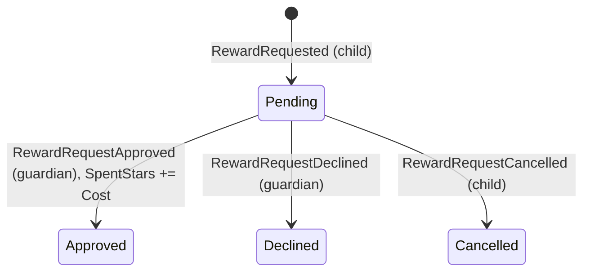
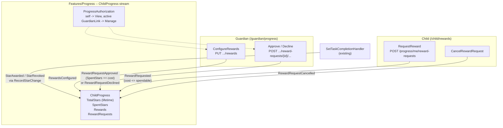

# Reward Redemption for Progress

Status: Implemented. Five events on the `ChildProgress` stream (`RewardsConfigured`,
`RewardRequested`, `RewardRequestApproved`, `RewardRequestDeclined`, `RewardRequestCancelled`), the
`ConfigureRewards`, `RequestReward`, `CancelRewardRequest`, `ApproveRewardRequest` and
`DeclineRewardRequest` slices (`RewardRequestOutcome` for the 409s), `ProgressSummary` extended with
the balance, catalog and requests, the child page `/child/rewards`, a `ManageRewards` card on
`/guardian/progress` (preselected by `?child=`), and a "Rewards waiting: N" link on the guardian
dashboard's children list. Extends [gamified-progress.md](gamified-progress.md) (its Phase 3).

## Context

[gamified-progress.md](gamified-progress.md) gave each child a non-resetting star count, and
[configurable-goal-posts.md](configurable-goal-posts.md) let a guardian shape the goal posts the
child moves through. Both docs left "Phase 3", real-world reward redemption, open: the stars
accumulate, but they can't be turned into anything. For the app's audience (children with ADHD),
a concrete, near-term reward the child picks themself ("15 minutes extra screen time", "choose
Friday's dinner") is the part of a token economy that actually motivates. The stars are only the
currency.

Today `ChildProgress` ([ChildProgress.cs](../../../src/backend/buddy/Features/Progress/Types/ChildProgress.cs))
tracks `TotalStars`, `AwardedOccurrences`, `UnlockedMilestones` and `GoalPosts`. Nothing is spent
from it, and `TotalStars` only moves with task completions (`StarAwarded` / `StarRevoked`).

The user settled the three product questions before this design:

1. **A separate spendable balance.** Lifetime `TotalStars` keeps driving the goal posts and never
   drops because of a redemption. The child spends from `TotalStars - SpentStars`.
2. **The child asks and a guardian approves.** The child requests a reward they can afford, and
   the request stays pending until a guardian approves it (only then are the stars spent) or
   declines it.
3. **A per-child catalog.** A guardian defines each child's rewards (name, icon, cost) on
   `/guardian/progress`, next to the goal posts.

This document answers five questions: where the catalog and requests live, how the balance works,
how a request moves between states, who can do what, and what the screens look like.

## Question 1: a new aggregate, or the `ChildProgress` stream?

**Decision: the catalog and the requests live on the existing `ChildProgress` stream, as new
events, the same way `GoalPostsConfigured` does.**

- `configurable-goal-posts.md` Question 1 already made this call for per-child, guardian-authored
  progress configuration: "config lives on the aggregate it describes", and a genuine 1:1 with the
  child needs no second store or lookup. The reward catalog is the same kind of thing.
- The balance check ("can the child afford this?") needs `TotalStars`, `SpentStars` and the
  pending requests in one consistent read. On one stream, the existing optimistic concurrency
  (`ObserveStream` + `AppendTracked` in
  [MartenProgressEventStore.cs](../../../src/backend/buddy/Features/Progress/MartenProgressEventStore.cs),
  surfaced as `409` by `ConcurrencyConflictMiddleware`) covers a request racing a star revocation
  or two guardians approving at once. Split across two aggregates, that check would need a
  cross-stream invariant this codebase has no mechanism for.
- Zero migration: existing streams just have no reward events, and `Advance` folds empty
  collections.

A separate `RewardCatalog` aggregate (1:1 with the child) was considered and rejected for the
reason above. A request-per-stream `RewardRequest` aggregate was also rejected: each request is
tiny, it is only ever read together with the child's balance, and a per-request stream would need
an index document to answer "this child's pending requests".

## Question 2: the catalog, the balance and the aggregate shape

**Decision: a full-replace catalog of `Reward(RewardId Id, string Name, string Icon, int Cost)`,
plus a `SpentStars` counter and a request list on `ChildProgress`. The spendable balance is
derived, never stored.**

```
ChildProgress(
    ProgressId Id,
    UserId ChildId,
    int TotalStars,                       // unchanged: lifetime, drives goal posts
    ImmutableHashSet<OccurrenceKey> AwardedOccurrences,
    ImmutableHashSet<int> UnlockedMilestones,
    ImmutableArray<GoalPost> GoalPosts,
    ImmutableArray<Reward> Rewards,       // new: the guardian's catalog, in display order
    int SpentStars,                       // new: sum of approved requests' costs
    ImmutableArray<RewardRequest> RewardRequests)   // new: oldest first

Reward(RewardId Id, string Name, string Icon, int Cost)

RewardRequest(
    RewardRequestId Id,
    RewardId RewardId,
    string Name, string Icon, int Cost,   // copied from the catalog when requested
    RewardRequestStatus Status,           // Pending | Approved | Declined | Cancelled
    DateTimeOffset RequestedAt,
    DateTimeOffset? ResolvedAt,
    UserId? ResolvedBy)
```

- **Derived, not stored:** `ReservedStars` = the sum of `Cost` over `Pending` requests, and
  `SpendableStars = max(0, TotalStars - SpentStars - ReservedStars)`. A pending request reserves
  its cost. Otherwise a child with 10 stars could ask for three 10-star rewards and a guardian
  approving all three would overspend.
- **The request copies name, icon and cost.** A guardian can rename, reprice or remove a reward
  while a request is pending. The child asked for what they saw, so approval spends the copied
  cost and history keeps showing what was actually redeemed. This is the same snapshot-on-write
  idea as `MealPlanEntriesImported` keeping the parsed text instead of pointing back at the input.
- **Full replace for the catalog**, mirroring `GoalPostsConfigured` and the existing
  edit-then-save goal-post form. The request carries each row's `id` (omitted for a new row); the
  handler assigns a new `RewardId` to rows without one and rejects an `id` that isn't in the
  current catalog (`400`, keyed on `Rewards[i].Id`). Rows keep their ids across saves, so a
  pending request's `RewardId` keeps pointing at the same reward after an edit.
- **The balance can only go below the reservation through a revoked star.** `StarRevoked` after a
  spend is still allowed (`gamified-progress.md`'s toggle semantics are unchanged). The derived
  balance clamps at zero for display, and the next request or approval sees the real numbers.
- `RewardId` and `RewardRequestId` follow the existing strongly-typed id convention
  (`StronglyTypedIdJsonConverterFactory` is already on the Progress store).

## Question 3: the request lifecycle

**Decision: four states, `Pending -> Approved | Declined | Cancelled`, each change an event.
Approving spends the copied cost. Resolving an already resolved request is a `409`, except that
repeating the same resolution is an idempotent success.**



- **Request (child):** the reward must exist in the current catalog, and `Cost <= SpendableStars`.
  Otherwise the response is `409 insufficient_stars`. At most 10 pending requests per child; an
  11th is `409 too_many_pending_requests`, so a child repeatedly tapping can't flood the guardian.
- **Approve (guardian):** re-checks `Cost <= TotalStars - SpentStars`, because stars revoked since
  the request may have eaten into the reservation. If it fails, the response is
  `409 insufficient_stars` and the guardian can decline instead. There is no silent negative
  balance.
- **Decline (guardian)** and **cancel (child, own pending request only)** release the reservation.
- **Repeats:** approving an `Approved` request, declining a `Declined` one or cancelling a
  `Cancelled` one returns `200` with no new event (same rationale as `ConfigureGoalPostsHandler`'s
  already-there check). Any other transition out of a resolved state is
  `409 reward_request_resolved`.
- The 409s use a feature-specific outcome type (`RewardRequestOutcome`), not new `Result<T>` cases,
  as [Result.cs](../../../src/backend/buddy/Common/Result.cs) asks for outcomes "only one or two
  features ever produce" (`DeleteChildOutcome` is the precedent). Each endpoint declares its codes
  with `.ProducesErrorCode`.

### Events

```
RewardsConfigured(ProgressId Id, ImmutableArray<Reward> Rewards, UserId ConfiguredBy, DateTimeOffset OccurredAt)
    // full replace, like GoalPostsConfigured; creates the stream with ProgressStarted if needed
RewardRequested(ProgressId Id, RewardRequestId RequestId, RewardId RewardId,
    string Name, string Icon, int Cost, DateTimeOffset OccurredAt)
RewardRequestApproved(ProgressId Id, RewardRequestId RequestId, UserId ApprovedBy, DateTimeOffset OccurredAt)
RewardRequestDeclined(ProgressId Id, RewardRequestId RequestId, UserId DeclinedBy, DateTimeOffset OccurredAt)
RewardRequestCancelled(ProgressId Id, RewardRequestId RequestId, DateTimeOffset OccurredAt)
```

`ChildProgress.Advance` gets one arm per event, and `ChildProgressSnapshotProjection` one `Apply`
per event, the same shape as the existing five. Each event gets a golden file in
`EventShapeTests`.

## Question 4: who can do what

**Decision: the existing `ProgressAuthorization` tiers, plus a "self only" check for the child's
own actions.**

| Action | Who | Otherwise |
|---|---|---|
| Configure the catalog | `Manage` (active `GuardianLink`) | child: `403`, stranger: `404` |
| Request a reward, cancel own request | the child themself (`/progress/me/...`) | n/a, the route is the caller's own stream |
| Approve / decline | `Manage` | child: `403`, stranger: `404` |
| Read catalog, balance, requests | `View` (self or guardian), via the existing summary | `404` |

- The child-side routes hang off `/progress/me`, like `GET /progress/me`, so no `childId` is
  accepted from the child at all.
- A guardian requesting on a child's behalf is out of scope: the point is that the child chooses.
  A guardian who wants to hand out a reward directly can just do it; stars don't need to be
  involved.

## Question 5: read model and screens

**Decision: extend `ProgressSummary` (the response of all four existing progress endpoints) with
`SpendableStars`, `SpentStars`, `Rewards` and `RewardRequests`, and add a child rewards page plus
two sections on `/guardian/progress`.**

```
ProgressSummary(
    ... existing fields ...,
    int SpendableStars,
    int SpentStars,
    IReadOnlyList<RewardResponse> Rewards,             // RewardResponse(Guid Id, Name, Icon, Cost)
    IReadOnlyList<RewardRequestResponse> RewardRequests) // pending first, then the 20 most
                                                         // recently resolved, newest first
```

One summary keeps the badge, the child page and the guardian page on one request each, and every
write slice already returns the summary (as `ConfigureGoalPosts` does), so a screen redraws from
the response with no extra fetch. Capping resolved history at 20 keeps the payload bounded; the
data export (`ProgressPersonalDataExporter`) uses the full aggregate, not the summary, so it still
includes every request.

### Frontend

- `ProgressService` gains `configureRewards`, `requestReward` (`postIdempotent`), `cancelRewardRequest`,
  `approveRewardRequest` and `declineRewardRequest`.
- **Child:** a new `/child/rewards` page (`features/child/rewards/`): the spendable balance, the
  catalog as large tappable cards (disabled with "x more stars to go" when unaffordable), pending
  requests with a cancel button, and recent outcomes. The progress badge on `/child` gets a
  "Rewards" link to it. Behind `featureGuard('progress')`, like the badge.
- **Guardian:** `/guardian/progress` gets a `ManageRewards` section (an edit-then-save list like
  `ManageProgressGoals`, for the same selected child) and a `RewardRequests` section with
  approve/decline buttons for pending requests and the recent history.
- **Dashboard hint:** the progress pill on the guardian's children overview shows the number of
  pending requests ("2 reward requests"), linking to `/guardian/progress`. There is no
  notification infrastructure (`gamified-progress.md`, open questions), so this is how a guardian
  notices a request.
- i18n: new keys in the existing `progress.ts` and child dictionaries, en and da.

## Routes

```
PUT  /progress/children/{childId}/rewards                               ConfigureRewards        (Manage)
POST /progress/me/reward-requests                                       RequestReward           (self)
POST /progress/me/reward-requests/{requestId}/cancel                    CancelRewardRequest     (self)
POST /progress/children/{childId}/reward-requests/{requestId}/approve   ApproveRewardRequest    (Manage)
POST /progress/children/{childId}/reward-requests/{requestId}/decline   DeclineRewardRequest    (Manage)
```

All return `200 ProgressSummary`. `RequestReward` takes `{ rewardId }` and is idempotent through
the existing `Idempotency-Key` handling.

## Testing

Alba integration tests next to the existing progress tests (`ConfigureGoalPostsTests` and
friends), one class per slice, covering every status the endpoint can return. A snapshot test
asserting that the inline snapshot and a replay of the stream agree after a request is approved.
Frontend: a service spec with exact URLs and bodies, component specs for the child page and both
guardian sections, and one Playwright journey: a guardian adds a reward, the child completes
enough tasks, requests it, the guardian approves it, and the child sees the lower balance.

## Failure and edge-case behavior

| Case | Behavior |
|---|---|
| Child requests a reward costing more than the spendable balance | `409 insufficient_stars`, no event |
| Child has 10 pending requests | `409 too_many_pending_requests` |
| Requested `rewardId` isn't in the catalog (removed meanwhile) | `404` |
| Guardian edits or removes a reward with a pending request | Allowed; the request keeps its copied name, icon and cost |
| Star revoked after a request, so the balance no longer covers it | Approve is `409 insufficient_stars`; decline still works |
| Approve twice, decline twice, cancel twice | `200`, idempotent, no new event |
| Approve a declined/cancelled request (or vice versa) | `409 reward_request_resolved` |
| Child cancels someone else's request | Impossible: `/progress/me` only reaches the caller's own stream; unknown id is `404` |
| Two guardians resolve the same request at once | One wins; the other gets the existing concurrency `409` and a reload shows the outcome |
| Catalog save with an unknown `id` | `400` keyed on `Rewards[i].Id` |
| Catalog rules | At most 30 rewards; name 1-100 chars; icon 1-32 chars; cost 1-10000; a `null` row is `400` |
| Guardian's `GuardianLink` is revoked | Immediately `404` on every guardian route, as for goal posts |
| Child is erased | The whole progress stream is deleted by `ProgressPersonalDataEraser`; unchanged |

## Estimate

| | |
|---|---|
| Complexity | Medium -- 5 new events on an existing aggregate, 5 routes, a new outcome type, 1 new child page, 2 guardian sections and a dashboard hint |
| Single developer | 4-6 days |
| AI agent | 3-5 hours, plus about 1 hour of human review |

## Decisions made

| Question | Decision |
|---|---|
| Spending model | Separate spendable balance; lifetime `TotalStars` never drops on a redemption (user decision) |
| Flow | Child requests, guardian approves or declines (user decision) |
| Catalog scope | Per child, managed on `/guardian/progress` (user decision) |
| Where it lives | Same `ChildProgress` stream, five new events; one stream keeps the balance check consistent |
| Catalog writes | Full replace with stable `RewardId`s, like `GoalPostsConfigured` |
| Pending requests | Reserve their cost, so approving several can't overspend |
| Request contents | Name, icon and cost copied at request time |
| Approval with too few stars | `409 insufficient_stars`, never a negative balance |
| Repeated resolutions | Same resolution is idempotent `200`; a different one is `409 reward_request_resolved` |
| Read model | Extend `ProgressSummary`; resolved history capped at 20 |
| Guardian awareness | Pending count on the children overview pill; no notifications |
| Guardian saves before the catalog loaded | Impossible: the editor only renders once the child's progress has loaded, so a failed load can't save an empty list over the real one |
| Repeatable rewards | Yes, no per-reward limit; a "once only" flag would be additive (user decision) |
| Old snapshots | `ChildProgress` reads missing `Rewards`/`RewardRequests` as empty, so snapshots stored before this feature load unchanged (`RewardHistoryTests`) |
| Export | Lists every request (`AllRewardRequests`), not the summary's capped history |

## Remaining open questions

- **Should the child see a reward's cost go up after requesting?** Not an issue under this design,
  since the copied cost is what's spent. Noted in case a "price follows the catalog" rule is ever
  wanted.
- **Manual star adjustment by a guardian** (from `gamified-progress.md`'s Phase 3 list) is not in
  this scope. It would be a separate `StarsAdjusted` event on the same stream.
- **Doses** still earn nothing; unchanged from `gamified-progress.md`.

## Diagram


