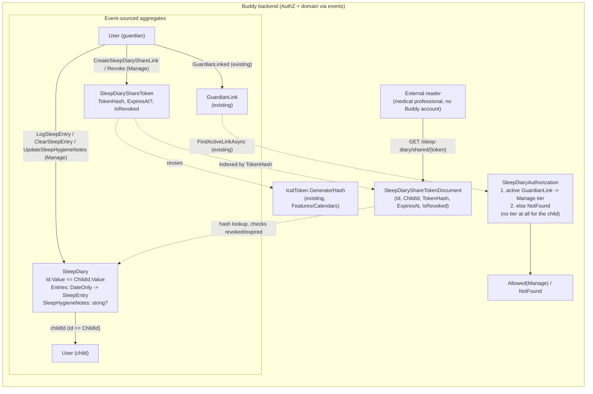

# Sleep Diary

Status: Implemented. `Features/SleepDiaries` ships the `SleepDiary` and
`SleepDiaryShareToken` aggregates (schema `sleepdiaries`, inline snapshots), the seven slices
below plus `ListSleepDiaryShareLinks`, the guardian page `/guardian/sleep-diary` (day-entry form,
14-night history, hygiene notes, share links) and the public, printable share view
`/shared/sleep-diary/:token`. See [the flow doc](../sleep-diary/flow.md) and "Implementation
notes" near the end for where the code differs from this design.

## Context

A guardian wants to log a child's sleep, night after night, in enough detail
that the record is useful for two different readers: themself (spotting
patterns week to week) and a medical professional evaluating a sleep
difficulty. This mirrors a real clinical tool — the attached Danish
"Søvnregistrering" (sleep registration) form is a 14-day paper diary a
sleep clinic hands out, with one row per day and these columns:

- weekend (yes/no)
- "gøre klar" — what time getting-ready-for-bed starts
- "sengeritual" — the bedtime ritual, given as a time range (e.g. `19.30-20.10`)
- "lægge sig til at sove" — when the child is put down / lies down to sleep
- "falder i søvn" — when the child actually falls asleep
- "opvågninger" — every wake-up during the night, each with a time and a
  duration
- "vågner morgen" — final morning wake time
- "træt" — whether the child seemed tired that day
- "lur om dagen" — daytime naps, same shape as night wake-ups (time +
  duration), possibly several
- "tid sovet" — total time slept
- "bemærkninger" — free-text remarks
- a single free-text footnote box for "sleep hygiene measures/routines/
  rituals" that applies to the diary as a whole, not one specific day

Nothing like this exists in Buddy today. `Calendar`/`CalendarItem`
([glossary.md](../glossary.md)) has no notion of a private, per-day
observational log — it schedules things going forward, it doesn't record
what already happened. The closest existing precedents are
[medicine-schedules.md](medicine-schedules.md) (a guardian-facing health
record about a child, event-sourced, with a sparse per-date log) and
[gamified-progress.md](gamified-progress.md)'s `ChildProgress` (a true 1:1
per-child aggregate). Nothing resembling "share a record with someone
outside the app" exists except `Calendar`'s `IcalToken`
([IcalToken.cs](../../../src/backend/buddy/Features/Calendars/Types/IcalToken.cs)) —
a hashed, revocable token that lets an external party read one calendar's
feed with no Buddy login. That mechanism, not anything new, is the natural
template for "share with a medical professional" below.

This document answers five questions: does this need a new feature, how is
one day's entry modeled, how are the repeatable night-wake-up/nap rows
modeled, who besides the logging guardian can see this, and how does sharing
with someone outside the app actually work.

## Question 1: extend `Calendars`/`Medicines`, or a new feature?

**Decision: a new feature, `Features/SleepDiary`, with its own aggregate.**

Same shape of argument as every prior feature doc
([medicine-schedules.md](medicine-schedules.md#question-1-extend-calendars-or-a-new-feature),
[pickup-schedules.md](pickup-schedules.md#question-1-extend-calendars-or-a-new-feature)):

- A sleep entry has a dozen clinically-specific fields (routine start,
  ritual window, multiple timestamped wake-ups, tiredness, naps, total
  sleep) that mean nothing on a generic `CalendarItem` and would pollute it
  for every other event/task.
- Unlike `MedicineSchedule`, this isn't a *schedule* at all — there's no
  future occurrence to expand, no recurrence, no "due" state. It's a plain
  observational log, one entry per past (or today's) date. That's a
  meaningfully simpler shape than every other per-child feature so far, not
  a variant of one of them.
- The permission model (see "Authorization") is even narrower than
  `MedicineSchedule`'s two-tier split — effectively guardian-only — which
  doesn't fit `Calendar`'s three-tier `CalendarRole`
  ([group-owned-calendars-and-permissions.md](group-owned-calendars-and-permissions.md)).

This keeps `Calendars` untouched, as every prior per-child feature already
does.

## Question 2: aggregate shape and identity

**Decision: one `SleepDiary` stream per child, with `SleepDiaryId.Value ==
ChildId.Value` — no index document.**

A child has exactly one sleep diary, ever — a genuine 1:1 relationship, not
"however many a guardian creates" the way a child can have several
`MedicineSchedule`s or `Meal`s. That is exactly the shape
[gamified-progress.md](gamified-progress.md#why-progressidvalue--childidvalue-with-no-index-document)
already solved for `ChildProgress` by reusing the child's own `UserId` as
the stream id: "find this child's diary" costs zero lookups instead of an
indexed read.

This is worth calling out explicitly because the codebase has gone the
other way before: [mealplans.md](mealplans.md#read-models) considered and
rejected a deterministic id for `MealPlanIndexDocument`, on the grounds that
"every other id in this codebase is a random `Guid.CreateVersion7()`... and
a one-off deterministic-id special case would be a surprising
inconsistency." That reasoning doesn't transfer here, for the same reason
it didn't block `ChildProgress`: `MealPlan` needed an index anyway, because
resolving *which* child's stream to read requires walking family sharing
first ([mealplans.md, Question 3](mealplans.md#question-3-sharing-a-mealmealplan-across-siblings)) —
the deterministic id would have saved nothing. `SleepDiary`, like
`ChildProgress`, has no family-sharing axis and no "which one" ambiguity to
resolve, so the simplification actually pays for itself here.

```
SleepDiary(
    SleepDiaryId Id,              // Id.Value == ChildId.Value
    UserId ChildId,
    ImmutableDictionary<DateOnly, SleepEntry> Entries,
    string? SleepHygieneNotes,
    UserId LastModifiedBy)
```

`SleepHygieneNotes` is the one field on the paper form that isn't per-day —
the "*SØVNHYGIEJNISKE TILTAG/RUTINER/RITUALER" footnote box applies to the
whole diary, so it lives on the aggregate itself, not inside `SleepEntry`.

`weekend` from the paper form is **not stored** — it's `Date.DayOfWeek`,
computed at read time, the same "derived, not persisted" call this codebase
already makes for `DoseStatus.Pending` and `PickupSlot`'s implicit
"unplanned" state.

## Question 3: modeling one day's entry, and the repeatable wake-up/nap rows

**Decision: a single flat `SleepEntry` record, every field optional except
who logged it, with `NightWakeUps`/`Naps` as plain lists of one shared
`SleepInterval` shape.**

```
SleepEntry(
    TimeOnly? RoutineStartTime,     // "gøre klar" -- getting ready for bed
    TimeOnly? RitualStartTime,      // "sengeritual" start
    TimeOnly? RitualEndTime,        // "sengeritual" end
    TimeOnly? BedTime,              // "lægge sig til at sove" -- put down / lies down
    TimeOnly? FellAsleepTime,       // "falder i søvn"
    IReadOnlyList<SleepInterval> NightWakeUps,   // "opvågninger" -- 0 or more
    TimeOnly? MorningWakeTime,      // "vågner morgen"
    bool IsTired,                   // "træt" -- defaults to false
    IReadOnlyList<SleepInterval> Naps,           // "lur om dagen" -- 0 or more
    TimeSpan? TotalSleepDuration,   // "tid sovet"
    string? Remarks,                // "bemærkninger"
    UserId LoggedBy)

SleepInterval(TimeOnly StartTime, TimeSpan Duration)
```

A few decisions bundled into that shape:

- **Every field but `LoggedBy`/`IsTired` is optional.** The paper form is
  filled in live, overnight, by a tired parent — a guardian logging "woke at
  03:30 for about 30 min" the next morning may not remember the exact
  bedtime-ritual window, and shouldn't be blocked from saving what they *do*
  remember. This also means a day can start as a partial entry and be filled
  in further later — see "Failure and edge-case behavior."
- **`IsTired` is a plain `bool`, defaulting `false`, not `bool?`.** The
  frontend presents it as a toggle, and a toggle interaction always produces
  an explicit `false → true` or `true → false` transition — there's no
  "guardian left it blank" state to preserve the way there is for the
  optional time fields above, since `SleepEntryLogged` already carries
  `Before`/`After` for the whole entry and records exactly when a guardian
  did (or didn't) flip it. An untouched day simply reads as "not marked
  tired," the same default a checkbox UI already implies.
- **`NightWakeUps`/`Naps` are plain lists of one concrete record shape, not
  a discriminated union.** [pickup-schedules.md, Question
  3](pickup-schedules.md#question-3-modeling-who-a-flat-kind-discriminator-not-a-union)
  already hit a real failure mode here — a closed union embedded in a
  persisted event failed to round-trip through `System.Text.Json` when
  Marten replayed it. That risk doesn't apply to `SleepInterval`: there's
  only one case (a start time plus a duration), so it's an ordinary record
  in a list, not a union, and serializes the same way `MedicineSchedule.Times`
  (`IReadOnlyList<TimeOnly>`) already does today.
- **`TotalSleepDuration` is a guardian-entered field, not computed from the
  other timestamps.** The example row's own values don't add up to a clean
  arithmetic total (`ca` — "approximately" — appears next to several
  durations), because parents estimate overnight sleep rather than time it
  precisely. Computing it from `FellAsleepTime`/`MorningWakeTime`/
  `NightWakeUps` would produce a falsely precise number that can
  legitimately disagree with what the guardian actually observed. The
  frontend can still *suggest* a computed value as a starting point — that's
  a client-side convenience, not a backend rule — but the stored value is
  whatever the guardian confirms.

## Question 4: who can see and log entries

**Decision: guardian-only. No `View` tier for the child, unlike
`PickupSchedule`/`MedicineSchedule`.**

```
enum SleepDiaryAccessTier { None, Manage }
enum SleepDiaryAccess { Allowed, NotFound, Forbidden }
```

| Tier | Who | Actions |
|---|---|---|
| **Manage** | An active guardian of `ChildId` only | Log/update/clear a day's entry, edit the diary's sleep-hygiene notes, view the diary, create/revoke a share link |

Mirrors `MedicineAuthorization`'s exact shape
([MedicineAuthorization.cs](../../../src/backend/buddy/Features/Medicines/MedicineAuthorization.cs)):
a private `ResolveTier` folds the relationship check, and handlers call a
public `CheckManage(childId, callerId, guardians, ct)` that resolves the
tier and converts a denial straight into a `Result`
(`SleepDiaryAccessExtensions.ToDeniedResult<T>()`, same as
`MedicineAccessExtensions`). The only difference from `MedicineAuthorization`
is that `ResolveTier` here has one fewer branch, since there's no
caller-is-the-child case to check:

1. `guardians.FindActiveLinkAsync(ChildId, callerId, ...)` returns a link →
   `Manage`.
2. Else → `None` → `NotFound`.

Two things make this narrower than every precedent so far:

- **The child gets no tier at all**, not even read-only. Every other
  per-child feature gives the child at least a `View`/`Rate`/`Mark` tier
  because the data is either about something the child does themself (a
  dose, a meal opinion, a pickup they're waiting on) or something they'd
  want to see. A sleep diary is a guardian's clinical observation of the
  child, often written for an audience (a doctor) other than the child, and
  frequently about a child too young to read or contextualize it
  (bedtime-ritual timing, a note like "cried for 20 minutes before
  settling"). There's no self-report action for a child to take here, unlike
  `MedicineSchedule`'s Mark tier or `Mealplans`' Rate tier. Giving the child
  read access later is a straightforward additive change if a real need
  shows up (see open questions) — it just isn't the default the way it is
  for pickups.
- **There's only one tier**, not two. Nothing here is split into "who can
  write" vs. "who can read" the way `Manage`/`View` or `Manage`/`Rate` are
  elsewhere, because the only principal with any access at all is the
  guardian.

A caller who isn't an active guardian of `ChildId` — including the child
themself — gets `NotFound`, matching the "can't distinguish private from
missing" convention used everywhere else in this codebase.

## Question 5: sharing with a medical professional

**Decision: reuse `Calendar`'s `IcalToken` shape — a hashed, revocable,
guardian-issued token that grants a read-only, no-login view — rather than
inventing a new sharing primitive.** Unlike `IcalToken`, add an explicit
optional expiry.

```
SleepDiaryShareToken(
    SleepDiaryShareTokenId Id,
    UserId ChildId,
    string TokenHash,             // SHA-256, same as IcalToken.Hash -- never store the plaintext
    UserId CreatedBy,
    DateTimeOffset CreatedAt,
    DateTimeOffset? ExpiresAt,
    bool IsRevoked)
```

- Generation/hashing reuses `IcalToken.Generate()`/`IcalToken.Hash()`
  verbatim (or a thin rename if this needs to live outside `Calendars`) —
  same random-token-plus-SHA-256-hash shape already proven for exactly this
  "let a stranger read one thing with a link, no account" problem.
- **Expiry is the one deliberate difference from `IcalToken`.** An `.ics`
  feed subscription is meant to stay live indefinitely
  ([IcalToken.cs](../../../src/backend/buddy/Features/Calendars/Types/IcalToken.cs)'s
  own comment: "no expiry... meant to stay valid indefinitely until the
  owner explicitly revokes it"). A sleep diary handed to a clinician is
  usually for one specific consultation; an indefinitely-live link to a
  child's sleep/health record sitting in an old email is a larger exposure
  than a stale calendar subscription. `ExpiresAt` is optional so a guardian
  can still choose "no expiry" if they want, but the UI should default to
  suggesting one (e.g. 30 days).
- The shared view itself is a new unauthenticated read endpoint (token in
  the URL/query string, hashed and looked up the same way
  `GetIcalFeed.Handler` resolves `IcalToken`), rendering the diary in a
  layout that mirrors the paper form this document opened with — a
  printable/PDF-style table, not the guardian's normal in-app UI. Producing
  an actual PDF (rather than a printable web page) is a frontend/rendering
  choice, not a backend data-model question, and isn't resolved here — see
  open questions.
- This is deliberately **not** built as "share with a `Group`," unlike
  [group-owned-mealplans.md](group-owned-mealplans.md) or
  [medicine-schedules.md, Group sharing](medicine-schedules.md#group-sharing-added-later-additive).
  A doctor is not a household member and has no reason to ever hold a Buddy
  account; the group-sharing pattern solves "another guardian/relative in
  this app," not "a professional outside it."

### Events

```
SleepDiaryStarted(SleepDiaryId, UserId ChildId, DateTimeOffset OccurredAt)
    // Lazily appended by the first LogSleepEntry call for a child with no stream yet,
    // exactly as MealPlanCreated/PickupScheduleCreated are -- not provisioned at child creation.

SleepEntryLogged(SleepDiaryId, DateOnly Date, SleepEntry? Before, SleepEntry After,
    UserId LoggedBy, DateTimeOffset OccurredAt)

SleepEntryCleared(SleepDiaryId, DateOnly Date, SleepEntry Before, UserId ModifiedBy,
    DateTimeOffset OccurredAt)

SleepHygieneNotesUpdated(SleepDiaryId, string? Before, string? After, UserId ModifiedBy,
    DateTimeOffset OccurredAt)

SleepDiaryShareTokenCreated(SleepDiaryShareTokenId, UserId ChildId, string TokenHash,
    UserId CreatedBy, DateTimeOffset? ExpiresAt, DateTimeOffset OccurredAt)

SleepDiaryShareTokenRevoked(SleepDiaryShareTokenId, UserId ModifiedBy, DateTimeOffset OccurredAt)
```

`SleepEntryLogged` always overwrites the whole day (carrying only the new
entry, no per-field patching) — same no-confirmation-server-side rule
`MealAssignedToSlot`/`PickupAssigned` already use; re-editing an
already-logged day is expected (a guardian fills in more detail the next
morning) rather than an exceptional case needing its own event.

### Rehydration

`SleepDiary.Rehydrate(events)` folds the same way `MedicineSchedule`/
`MealPlan` do: `SleepDiaryStarted` seeds the record, `SleepEntryLogged`/
`SleepEntryCleared` upsert/remove `Entries[Date]`, keeping the dictionary
sparse (a date nobody has logged simply has no key), and
`SleepHygieneNotesUpdated` applies a plain `with` update.
`SleepDiaryShareToken` is a second, small aggregate with its own
`Rehydrate`, structured like `IcalToken`'s existing shape rather than nested
inside `SleepDiary` — a diary can have zero or more live tokens, and a
token's lifecycle (created, revoked, expired) has nothing to do with any
specific day's entry.

## Read models

Because `SleepDiaryId.Value == ChildId.Value`, "find this child's diary"
needs no index document — same zero-lookup property `ChildProgress` already
has. A `SleepDiaryShareToken`, however, is looked up by *token hash* at
share-view time, not by `ChildId`, so it needs one:

```
SleepDiaryShareTokenDocument(Guid Id, Guid ChildId, string TokenHash, DateTimeOffset? ExpiresAt, bool IsRevoked)
```

Written once on `SleepDiaryShareTokenCreated`, flipped on
`SleepDiaryShareTokenRevoked`, in the same `SaveChangesAsync` as the event
append — the same maintained-inline-projection pattern used everywhere else
(`MedicineIndexDocument`, `PickupScheduleIndexDocument`). This mirrors how
`IcalToken` is presumably resolved today (by hash, for `GetIcalFeed`) rather
than needing anything new invented for the lookup shape itself.

Listing a date range of entries needs no expansion helper the way
`MedicineDoseExpansion`/`PickupScheduleExpansion` do — there's no generative
schedule to expand occurrences from. `ListSleepDiaryEntries(childId, from,
to)` just rehydrates the one `SleepDiary` stream and filters
`Entries.Where(e => e.Key >= from && e.Key <= to)`, returning only the dates
actually logged, sparse, the same "absent means not yet recorded" read
convention `MealPlanExpansion` and `PickupScheduleExpansion` already use.

## Command slices (`Features/SleepDiary/`, same vertical-slice shape as `Medicines`)

| Slice | Tier | Notes |
|---|---|---|
| `LogSleepEntry` | Manage | Upserts one date's full `SleepEntry`. Creates the stream lazily if the child has none yet. Emits `SleepEntryLogged` |
| `ClearSleepEntry` | Manage | Removes a date's entry entirely (correcting a mistaken log) — idempotent no-op if nothing is logged for that date. Emits `SleepEntryCleared` |
| `UpdateSleepHygieneNotes` | Manage | The diary-level free-text field. Emits `SleepHygieneNotesUpdated` |
| `ListSleepDiaryEntries` | Manage | `[from, to]` date range → the guardian's own review view |
| `CreateSleepDiaryShareLink` | Manage | Optional `ExpiresAt`. Returns the plaintext token once (never retrievable again, same convention as any other one-time secret in this codebase); emits `SleepDiaryShareTokenCreated` |
| `RevokeSleepDiaryShareLink` | Manage | Emits `SleepDiaryShareTokenRevoked` |
| `ListSleepDiaryShareLinks` | Manage | Lists still-live share links (not revoked, not expired) so a guardian can find one to revoke — the plaintext token is only ever shown once, at creation |
| `GetSharedSleepDiary` | *(unauthenticated, token-gated)* | Resolves `SleepDiaryShareTokenDocument` by hash, checks `!IsRevoked && (ExpiresAt is null || ExpiresAt > now)`, then reads the same data `ListSleepDiaryEntries` would, rendered for an external reader |

## Routes

```
PUT    /sleep-diary/children/{childId}/entries/{date}      LogSleepEntry
DELETE /sleep-diary/children/{childId}/entries/{date}      ClearSleepEntry
PUT    /sleep-diary/children/{childId}/hygiene-notes        UpdateSleepHygieneNotes
GET    /sleep-diary/children/{childId}/entries              ListSleepDiaryEntries   (from, to as query params)
POST   /sleep-diary/children/{childId}/share-links           CreateSleepDiaryShareLink
GET    /sleep-diary/children/{childId}/share-links           ListSleepDiaryShareLinks
DELETE /sleep-diary/children/{childId}/share-links/{id}      RevokeSleepDiaryShareLink
GET    /sleep-diary/shared/{token}                            GetSharedSleepDiary   (no auth)
```

`LogSleepEntry`/`ClearSleepEntry` address one date directly in the path
(an upsert on one addressable resource, not a collection append) — same
shape `AssignPickup`/`ClearPickup`
([pickup-schedules.md, Routes](pickup-schedules.md#routes)) already use for
date-keyed slots.

## Frontend

Built in the shape this section proposed: `core/sleep-diary.service.ts`, a guardian page
`features/guardian/sleep-diary/` with one subfolder per capability (`sleep-entry-form/`,
`sleep-history/`, `hygiene-notes/`, `share-links/`), and strings in
`core/i18n/translations/{en,da}/sleep-diary.ts`. Times bind as `"HH:mm"` like `MedicineSchedule`'s
dose times. The share view is the app's first page for a reader with no account,
`features/shared-sleep-diary/` at `/shared/sleep-diary/:token`, outside `authGuard`: a printable
table with the paper form's columns and a Print button. The share link's URL is the frontend page,
not the API route.

## Failure and edge-case behavior

| Case | Behavior |
|---|---|
| Guardian logs only some fields for a day (e.g. just bedtime and morning wake-up) | Allowed — every field but `LoggedBy` is optional; the rest render as blank in review, matching the paper form's own blank cells |
| Guardian re-logs a day that already has an entry | Full overwrite (`Before`/`After` on `SleepEntryLogged`) — a guardian adding detail the next morning is the expected common case, not an exceptional "conflict" |
| Guardian logs a date more than 14 days in the past, or a date in the future | Allowed — no time-based gate, matching `MedicineSchedule`'s "child marks a future/past dose" stance; a diary is explicitly meant to be filled in retroactively (the paper form is written up the next morning) |
| `TotalSleepDuration` doesn't match what the other fields would compute to | Allowed — see Question 3; the guardian's number is authoritative, not a derived value the server would reject a mismatch on |
| Clearing a date with no entry | Idempotent no-op (`Success`, no event), same rule `ClearMealSlot`/`ClearPickup` use |
| Guardian's `GuardianLink` is revoked | Immediately drops to `NotFound`, same as every other per-child feature; existing entries and any live share tokens are untouched |
| Two guardians log the same date at nearly the same time | Both `SleepEntryLogged` events append in order; the last one wins for current state, neither write is lost from history — same event-sourcing benefit as everywhere else |
| A share link is used after being revoked or past `ExpiresAt` | `GetSharedSleepDiary` returns not-found — same "can't distinguish private from missing" collapse used for authenticated access elsewhere |
| A share link is created, then new entries are logged afterward | The shared view always reflects current data on each request (not a snapshot taken at share-creation time) — a guardian filling in more nights before the appointment doesn't need to regenerate the link |
| Child has no guardian at all | Cannot happen for `SleepDiary` creation (`Manage` tier requires a `GuardianLink`), so a diary is never created without a guardian |

## Decisions made

| Question | Decision |
|---|---|
| Extend `Calendars`/`Medicines`, or new feature | New feature, `Features/SleepDiary` — the field set and the "no schedule/no recurrence" shape don't fit either existing feature |
| Aggregate identity | `SleepDiaryId.Value == ChildId.Value`, no index document — a genuine 1:1 like `ChildProgress`, unlike the many-per-child `MedicineSchedule`/`Meal` case |
| One entry per day, how modeled | A single flat `SleepEntry` record, every field optional except `LoggedBy` |
| `IsTired` type | Plain `bool`, defaulting `false` — it's a UI toggle, and every flip already produces an explicit event, so there's no "unset" state worth preserving |
| Repeated night-wake-ups/naps | Plain `IReadOnlyList<SleepInterval>` (start time + duration), not a discriminated union — no multi-case union risk like `PickupAssignment` hit |
| `TotalSleepDuration` | Guardian-entered, not computed from other timestamps — matches how the paper form is actually filled in (estimates, not arithmetic) |
| Sleep-hygiene notes | One free-text field on the `SleepDiary` aggregate itself, not per-entry — matches the paper form's single footnote box for the whole period |
| Who can log/view | Guardian (`Manage` tier) only — no tier for the child at all, unlike every prior per-child feature |
| Sharing with someone outside the app | A hashed, revocable token reusing `IcalToken`'s generation/hashing, with an added optional `ExpiresAt` (unlike `IcalToken`, which is deliberately indefinite) |
| Does a sleep diary show up in `Calendar`/`ListOccurrences` | No — a fully separate read surface, matching every prior per-child feature's stance |
| Recurrence / auto-generated future entries | None — every entry is explicit, for a specific past-or-today date; there is no "occurrence" concept here at all |
| v1 scope | Everything, share links and the public view included (settled with the product owner at implementation time) |
| Where `IcalToken`'s generate/hash helper lives | Duplicated as `SleepDiaryShareSecret` in `Features/SleepDiaries/Types/SleepDiaryShareToken.cs`, keeping the slice free of a dependency on `Calendars` |
| `TotalSleepDuration` in the UI (this doc vs. the visual specification's "read-only pill") | This doc wins: an editable field the form prefills with a suggestion (fell asleep, or else lies down, to morning wake, minus the wake-ups) until the guardian types their own; "Use suggestion" switches back |
| Bedtime-ritual input | A new shared `app-time-range` control (two `app-time-select`s joined by an arrow) |
| Shared view: PDF or printable page | A printable HTML page laid out like the paper form, with a Print button; no generated PDF |
| Shared view date range | The reader pages by 14 days; without `from`/`to` the server shows the last 14 days ending today. At most 92 days per request, same limit as `ListSleepDiaryEntries` |

## Remaining open questions

- **Should the child ever get read access?** Left out of v1 (see Question
  4). An older child/teen may reasonably want to see their own sleep
  history; if that's requested, it's an additive `View` tier the same shape
  `PickupSchedule` already has, not a redesign.
- **Actual PDF export, formatted like the attached clinical form.** This
  document specifies the data and a shareable read-only *view*; whether that
  view is an HTML page styled for printing or a generated PDF file is a
  frontend/rendering decision deferred here. If a clinic specifically wants
  the exact 14-day grid layout from the attached form, that's a rendering
  template, not a data-model change.
- **Reminders to fill in today's diary.** No notification infrastructure
  exists anywhere in this codebase today (`notification|reminder|push`
  returns nothing — same gap [gamified-progress.md](gamified-progress.md#remaining-open-questions)
  already flags). Out of scope for v1.
- **A fixed diary "period" (e.g. the paper form's explicit 14-day course), vs.
  an open-ended running log.** This design treats `SleepDiary` as one
  unbounded log per child, with the guardian/clinician choosing whatever
  date range they want when reviewing or sharing — no explicit "start a new
  14-day round" concept. If clinics specifically want diary rounds as
  distinct, nameable things (e.g. to compare "before" vs. "after" an
  intervention), that would need a lightweight grouping concept added later,
  not modeled here.
- **Time zone.** Same open item as every prior per-child feature
  ([medicine-schedules.md](medicine-schedules.md#remaining-open-questions)) —
  `User` has no `TimeZoneId`, so all times are the child's own local
  wall-clock, resolved client-side.
- **Where `IcalToken`'s generate/hash helper should live** if reused as-is —
  either promoted out of `Features/Calendars` into a small shared utility,
  or duplicated verbatim into `Features/SleepDiary` the way vertical slices
  in this codebase generally prefer local duplication over a new
  cross-feature dependency. Worth deciding at implementation time, not here.

## Implementation notes

Where the code differs from the text above:

- The folder and namespace are `Features/SleepDiaries` (plural like `Medicines`/`Pickups`), so the
  `SleepDiary` type doesn't share its name with its namespace.
- `SleepDiaryAccess` has only `Allowed` and `NotFound`: with one tier there is no case that would
  be `Forbidden`.
- `SleepDiary` has no `LastModifiedBy`; each entry carries `LoggedBy` and every event its author.
- Following [eliminate-nulls.md](eliminate-nulls.md), `SleepHygieneNotes` and `Remarks` are
  non-null strings where `""` means none, so `SleepHygieneNotesUpdated.Before/After` are `string`.
- `SleepEntryLogged` has no separate `LoggedBy`; it is `After.LoggedBy`. Saving content identical to
  the stored night (by either guardian) appends nothing, which keeps the `PUT` idempotent.
- `ListSleepDiaryShareLinks` (`GET /sleep-diary/children/{childId}/share-links`) was added: the
  token is shown once, so revoking needs a list of live links (not revoked, not expired).
- Durations travel over HTTP as whole minutes (`durationMinutes`, `totalSleepMinutes`); the domain
  and the persisted events keep `TimeSpan`.
- `ListSleepDiaryEntries` returns the diary-wide notes alongside the entries, and reads the inline
  snapshot. The shared view also returns the child's name and the link's expiry.
- Validation bounds: at most 20 wake-ups and 20 naps, each 1-720 minutes; total 0-1440 minutes;
  remarks 2000 characters, hygiene notes 4000; a share link's `expiresAt` must be in the future and
  at most 365 days away.

## Diagram


