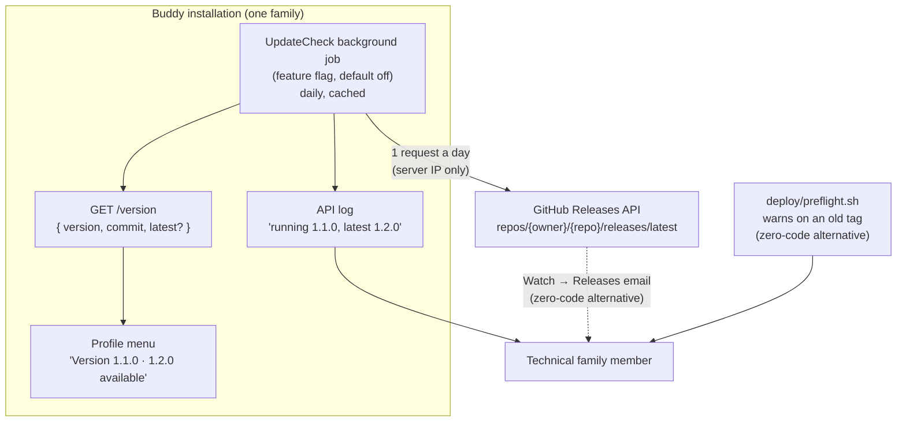

# Update Check

Status: Implemented (Question 1 only: the zero-code route). [`deploy/release-check.sh`](../../../deploy/release-check.sh) runs from `deploy/preflight.sh` (`task deploy`) and `deploy/azure/deploy.sh` and warns, without failing, when the deployed commit is missing the newest `vX.Y.Z` release tag. The deploy guides' "Staying up to date" sections document GitHub's Watch → Releases notifications. There is no in-app or server-side check; Questions 2-4 describe it in case it is wanted later.

## Context

The idea: a Buddy installation compares its own version with the latest release in the repository
it was built from, the same repository the "Source code" link in the profile menu points to, and
says so when it is behind.

Buddy is hosted per family. A technical family member deploys and operates each instance
([feature-flags.md](feature-flags.md#context) and [gdpr-data-protection.md](gdpr-data-protection.md)
make the same assumption). Today that person finds out about a new release only by watching the
repository themselves. Releases come often: nine tags (`v0.1.0` to `v1.2.0`) between 5 and 9
October 2026.

What already exists:

- **The running version.** It comes from git tags through MinVer ([docs/versioning.md](../../versioning.md)).
  [`deploy/version.sh`](../../../deploy/version.sh) computes it for Docker builds. The API reports it
  at the anonymous `GET /version`
  ([`VersionEndpoint.cs`](../../../src/backend/buddy/Common/Versioning/VersionEndpoint.cs),
  [`BuildVersion.cs`](../../../src/backend/buddy/Common/Versioning/BuildVersion.cs)). The frontend
  reads `version` from `runtime-config.json` and shows "Version 1.2.0" at the bottom of the profile
  menu ([`profile-menu.html`](../../../src/frontend/buddy/src/app/features/guardian/shell/profile-menu/profile-menu.html)).
- **The source repository.** `repositoryUrl` in
  [`runtime-config.service.ts`](../../../src/frontend/buddy/src/app/core/runtime-config.service.ts)
  defaults to `https://github.com/kimipsen/buddy`, and a fork overrides it with the `REPOSITORY_URL`
  build arg ([`Dockerfile`](../../../src/frontend/buddy/Dockerfile),
  [`docker-compose.prod.yml`](../../../deploy/docker-compose.prod.yml)). **Only the frontend knows
  it.** The API has no repository setting.
- **Published releases.** The default repository is public and has a GitHub Release for every tag
  (`v1.2.0` is "Latest"), so `GET https://api.github.com/repos/kimipsen/buddy/releases/latest` returns
  the answer.
- **Outbound calls.** The API already calls third parties: Keycloak's admin API and, when configured,
  the AI providers ([`MealplansFeature.cs`](../../../src/backend/buddy/Features/Mealplans/MealplansFeature.cs)).
  The browser doesn't: the frontend's CSP limits `connect-src` to `'self'`, the API and Keycloak
  ([`src/frontend/buddy/Caddyfile`](../../../src/frontend/buddy/Caddyfile)).

This document weighs the pros and cons of the idea and answers four questions: whether to build it at
all, where the check runs, who sees the result, and how versions are compared.

## Pros and cons

### Pros

- **The operator hears about releases without watching the repository.** Security fixes (dependency
  bumps, Keycloak config fixes such as `06a3b2a`) reach families who would otherwise run an old build
  for months.
- **Most of the plumbing exists.** The running version, the repository URL and a release feed are all
  in place. The check is a comparison of two strings plus a link.
- **It follows forks.** Because it reads `repositoryUrl`, a family running their own fork is compared
  with their fork's releases, not with upstream releases they may have chosen not to take.
- **It helps support.** "Which version are you on, and is it the latest?" is answered on the screen.
- **It's cheap to build.** One cached HTTP call and one line of UI. See [Estimate](#estimate).

### Cons

- **It's a new outbound call to a third party, from every installation.** GitHub learns the IP
  address of each installation (or, if the browser makes the call, of every guardian's device) and
  when it was used. That is a new data flow for [PRIVACY.md](../../../PRIVACY.md) and for each
  family's own privacy notice, in an app whose privacy story is "your data stays on your instance".
- **The people who see it mostly can't act on it.** Most guardians aren't the operator. A banner
  saying "Buddy 1.3.0 is available" tells a parent something they can't fix, and with releases coming
  several times a week it would be up most of the time. The project already prefers operator-facing
  logs and docs over in-app oversight screens ([gdpr-data-protection.md](gdpr-data-protection.md)).
- **Upgrading isn't one click.** An upgrade means checking out the tag and running `task deploy` (or
  `deploy/azure/deploy.sh`), and events don't roll back
  ([deploy/README.md, rollback warning](../../../deploy/README.md)). A notice that encourages
  upgrading without the release notes and that caveat could do harm.
- **`repositoryUrl` isn't a reliable release feed.** It's a free-text link. It can point to GitLab,
  Bitbucket or a self-hosted Gitea, to a private repository, or to a fork with no Releases (GitHub
  copies tags into a fork, but not Releases). Each host needs its own API, and parsing the URL is
  brittle.
- **Version comparison has awkward cases.** `deploy/version.sh` gives untagged builds versions such as
  `1.2.1-alpha.0.3`. In SemVer that sorts *below* `1.2.1` but above `1.2.0`, which is right, but a
  fork's own tags (`1.2.0-family.1`) or the bare-build `0.0.0-dev` need rules of their own. A wrong
  answer ("you're behind" on a build that is ahead) erodes trust in the notice.
- **It can fail in ways that need handling.** Unauthenticated GitHub API calls are limited to 60 an
  hour per IP. Installations behind a firewall or offline can't reach GitHub at all. Every failure
  must degrade to "say nothing", and must never slow down or break page load.
- **Tests must not reach the internet.** Integration and e2e tests need a stub release feed and a way
  to turn the check off, and the doc screenshots must not show a banner that depends on the real
  latest release.
- **The browser option breaks the CSP.** A browser-side call needs `api.github.com` in `connect-src`,
  loosening a policy the project is working to enforce.

### Weighing it

The benefit (an operator learns about a release sooner) is real but small, and cheaper alternatives
exist (see Question 1). The costs are mostly not code. They are a new third-party data flow and a UI
that speaks to the wrong audience. Both can be designed away: run the check on the server, show it
only to the operator, and make it opt-in. With those limits it's a reasonable small feature. Without
them it's a net negative.

## Question 1: build it, or use what exists?

**Decision (proposed): start with the zero-code options. Build the in-app check only as an opt-in,
server-side feature if the operator still wants it.**

Alternatives that need no code, or almost none:

- **GitHub's own notifications.** "Watch → Custom → Releases" on the repository (or the fork) emails
  the operator on every release, with the release notes. This costs a paragraph in
  [deploy/README.md](../../../deploy/README.md).
- **A deploy-time warning.** [`deploy/preflight.sh`](../../../deploy/preflight.sh) already runs before
  `task deploy`. It could `git fetch --tags` and warn (without failing) when the commit being deployed
  is older than the newest `vX.Y.Z` tag. That reaches the operator at the moment they can act, and
  sends nothing from the running instance.
- **A log line.** The API already tags its telemetry with the build version (`serviceVersion` in
  [`ObservabilityFeature.cs`](../../../src/backend/buddy/Common/Observability/ObservabilityFeature.cs)).
  A daily log warning "running 1.1.0,
  latest is 1.2.0" lands in the logs the operator already reads
  ([observability.md](../observability.md)).

These were considered against the in-app check. The first two cover the main benefit, the operator
learning about releases, with no new data flow from the instance.

## Question 2: where does the check run?

**Decision (proposed): in the API, as a background job that caches the result and is off by
default.**

- **API (chosen).** One call per installation a day, not one per device. GitHub sees the server's IP,
  not the family's devices. The CSP stays as it is. The result can be served from `GET /version` as
  an extra `latest` field (`{ "version": "1.2.0", "commit": "...", "latest": "1.3.0" }`) and logged.
  It needs a new setting for the repository (for example `UpdateCheck:Repository`, defaulting to
  `kimipsen/buddy`), because today only the frontend knows `repositoryUrl`. That duplicates the
  frontend setting, so the deploy scripts should feed both from one `REPOSITORY_URL` variable.
- **Browser, considered and rejected,** because it sends every guardian's IP address to GitHub, needs
  `api.github.com` in the CSP, and hits the 60-an-hour limit per household IP sooner.
- **Deploy script only, kept as the first step** (Question 1), but it doesn't tell an operator who
  hasn't deployed for months.

The switch would be a feature flag in the existing `Features:*` options
([feature-flags.md](feature-flags.md)), default off, so no installation starts calling GitHub after
an upgrade without the operator choosing it.

## Question 3: who sees the result?

**Decision (proposed): the operator, through logs. Optionally a quiet line in the profile menu, next
to the existing version text. No banner.**

- The log warning is the primary channel, in line with the per-family hosting model.
- If shown in the app, it belongs where the version already is: "Version 1.2.0 · 1.3.0 available",
  linking to the release page in the repository, not a banner on every page. Buddy has no operator
  role in Keycloak, so every guardian would see it. That argues for keeping it low-key.
- Children never see it.
- Release notes are not rendered in the app. Showing remote Markdown means sanitising content fetched
  from a third party; a link to the release page avoids that.

## Question 4: how are versions compared?

**Decision (proposed): SemVer 2.0 precedence on the running version against the latest *non-prerelease*
GitHub Release. Say nothing when either side can't be parsed or the running version is `0.0.0-dev`.**

| Running | Latest release | Shown |
|---|---|---|
| `1.2.0` | `1.2.0` | nothing |
| `1.1.0` | `1.2.0` | "1.2.0 available" |
| `1.2.1-alpha.0.3` (untagged build after 1.2.0) | `1.2.0` | nothing (ahead) |
| `1.3.0-rc.1` | `1.2.0` | nothing (ahead) |
| `0.0.0-dev` (bare `docker build`) | any | nothing |
| any | fetch failed, rate limited or no Releases | nothing, plus a debug log line |

The rule "say nothing when unsure" matters more than coverage: a false "you're behind" is worse than a
missed one.

## Estimate

| | |
|---|---|
| Complexity | Low -- one cached background fetch, one setting, one feature flag, an extra field on `GET /version`, one profile-menu line; no aggregate or events |
| Single developer | 1-2 days for the server-side check (plus half a day for the preflight warning and the README paragraph) |
| AI agent | 1-2 hours, plus about 30 minutes of human review |

The zero-code options in Question 1 are under an hour together.

## Decisions made

| Question | Decision |
|---|---|
| Build it at all? | No in-app check for now. Operators watch GitHub releases, and both deploy paths run `release-check.sh` (decided 2026-10-10) |
| Where does the deploy-time check get its data? | `git fetch --tags` from the default remote, falling back to local tags; no GitHub API, so it works for any git host and for forks |
| What counts as "behind"? | The newest non-prerelease `vX.Y.Z` tag isn't an ancestor of `HEAD`. An ancestry check rather than a version comparison, so a fork's own commits on top of a release are never "behind" |
| Does it block a deploy? | No, warn only; a deliberate rollback deploys an old tag on purpose |

If the in-app check is ever built, Questions 2-4 hold the proposed design: in the API, daily and
cached, behind a feature flag that is off by default; shown to the operator through logs and at most
a quiet line next to the version; SemVer against the latest non-prerelease Release, silent when unsure.

## Remaining open questions

- **Is the zero-code route enough?** Chosen for now. Revisit the in-app check only if operators
  still miss releases.
- **GitHub only, or other hosts too?** Lean: GitHub only, silent for any other `repositoryUrl`.
  GitLab and Gitea support would be additive, one client per host.
- **Should the profile menu show it at all?** Lean: yes but quiet, since every guardian sees it. An
  operator role in Keycloak would let it be operator-only, but that's a bigger change than this
  feature deserves.
- **Should it flag security releases differently?** It would need a convention in the release notes
  (a `security` label). Lean: not in v1.

## Diagram

