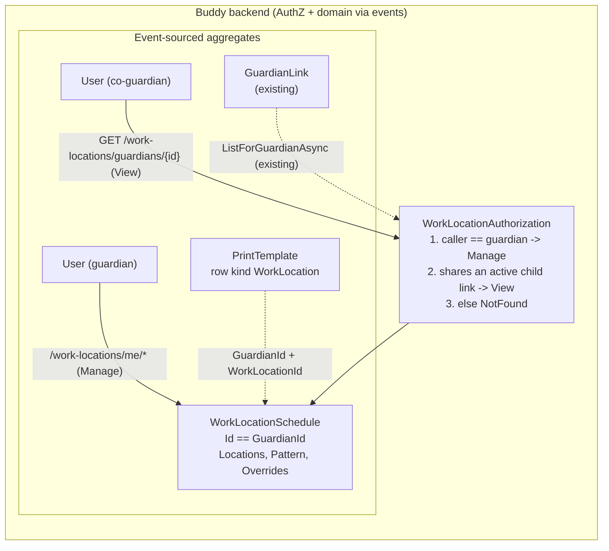

# Guardian Work Locations

Status: Proposed (not yet implemented)

## Context

The paper week plan this feature was designed from has one row per guardian
location, marked with a ✕ on the days it applies: "Far på Stil" (Dad at the
office in Stil), "Mor i Randers" (Mum working in Randers). Guardians want those
rows filled in from Buddy when they print the week plan
([week-plan-print-templates.md](week-plan-print-templates.md)), instead of
writing them in by hand.

Where a guardian works on a given day is a **state**, not an event. Every day
has at most one answer (a named place, or nothing), and it mostly follows a
repeating weekly rhythm with occasional exceptions. That rhythm is often an
**alternating** one: "Stil on Tuesdays and Thursdays in week A, only Thursday
in week B".

Requirements settled with the user before this document was written:

1. **Whole days only.** One location per guardian per day; no half days.
2. **Alternating patterns.** A pattern can repeat over more than one week.
3. **Customizable locations.** Each guardian defines their own places, each
   with a name, an icon and a color. Nothing is fixed to the sample sheet.
4. **Not visible to children.** No child dashboard, agenda or API access. The
   main consumer is the printable week plan.
5. **Not shown in calendars.** Work locations don't appear in calendar views
   or in iCal feeds.

Nothing like this exists in Buddy today. The closest existing precedents are
`PickupSchedule` ([pickup-schedules.md](pickup-schedules.md)), a sparse map
of per-date values with lazy stream creation, and `ChildProgress`
([gamified-progress.md](gamified-progress.md)), a 1:1 aggregate whose id is the
owning user's id.

This document answers six questions: whether this belongs in `Calendars`, the
aggregate's shape and identity, how locations are modelled, how alternating
patterns work, how one-off exceptions work, and who can see the data.

## Question 1: calendar items, or a new feature?

**Decision: a new feature, `Features/WorkLocations`, with its own aggregate.**
It is not a new `CalendarItemKind`, a calendar flag, or a print-template
`TitleFilter` convention.

- **Calendar recurrence can't express it.** `RecurrenceRule` is
  `Frequency + IntervalCount + Until`
  ([RecurrenceRule.cs](../../../src/backend/buddy/Features/Calendars/Types/RecurrenceRule.cs)):
  no by-weekday list and no exception dates. "Tuesdays and Thursdays" needs
  two items. "Every Tuesday except the week we're on holiday" can't be said at
  all. Widening `RecurrenceRule` for every event and task in the system, for a
  need specific to one feature, is the speculative generalization
  [medicine-schedules.md, Question 1](medicine-schedules.md#question-1-extend-calendars-or-a-new-feature)
  already rejected for the same reason.
- **A calendar can't enforce one answer per day.** Two overlapping
  "location" items on the same date are perfectly valid calendar data. The
  print sheet would have to pick one, and a typo in a title silently breaks a
  `TitleFilter` match.
- **The audience is different.** Calendars are shared with members and
  groups, readable by children, and published as iCal. The user ruled all of
  that out for work locations (requirements 4 and 5), and keeping the data out
  of `Calendars` makes those rules hold without adding exclusions to every
  calendar read path.

This is the same call `Medicines`, `Mealplans` and `Pickups` each made: a
distinct domain concept gets a distinct aggregate, and `Calendars` stays
untouched.

## Question 2: aggregate shape and identity

**Decision: one `WorkLocationSchedule` stream per guardian, whose id equals
the guardian's `UserId`, created lazily by the first write.**

```
WorkLocationSchedule(
    WorkLocationScheduleId Id,                                  // == GuardianId.Value, see below
    UserId GuardianId,
    ImmutableList<WorkLocation> Locations,                      // includes archived ones, see Question 3
    WorkPattern Pattern,                                        // see Question 4
    ImmutableDictionary<DateOnly, WorkDayOverride> Overrides)   // sparse, see Question 5
```

- **Deterministic id, no index document.** A guardian has exactly one
  schedule, a genuine 1:1 relationship. `ProgressId.ForChild` takes the same
  approach
  ([ProgressId.cs](../../../src/backend/buddy/Features/Progress/Types/ProgressId.cs)):
  `WorkLocationScheduleId.ForGuardian(UserId)` returns `new(guardianId.Value)`,
  so "this guardian's schedule" is a direct stream lookup. `PickupSchedule`
  needs `PickupScheduleIndexDocument` because its id is random. That
  precedent is deliberately not followed here.
- **Lazy creation.** `WorkLocationScheduleStarted` is appended together with
  the first real write, like `PickupScheduleCreated`
  ([PickupEvents.cs](../../../src/backend/buddy/Features/Pickups/Types/PickupEvents.cs)).
  Nothing is provisioned when a guardian account is created. A guardian who
  never opens the feature has no stream, and reads return an empty schedule.
- **Dates are wall-clock dates, with no time zone.** A `DateOnly` is "the
  guardian's Tuesday", the same stance `PickupScheduleExpansion` takes
  ([PickupScheduleExpansion.cs](../../../src/backend/buddy/Features/Pickups/PickupScheduleExpansion.cs)).
  Whole days (requirement 1) carry no times, so DST and time zones never
  come into it.

## Question 3: customizable locations

**Decision: each guardian keeps their own list of locations (name, icon,
color). Removing one archives it rather than deleting it.**

```
WorkLocation(
    WorkLocationId Id,       // Guid, assigned by AddWorkLocation
    string Name,             // "Stil", "Randers", "Hjemme"
    Icon Icon,               // reuses Calendars' Icon
    Color Color,             // reuses Calendars' Color
    bool IsArchived)
```

- **Icon and color reuse the calendar value types**
  ([Icon.cs](../../../src/backend/buddy/Features/Calendars/Types/Icon.cs),
  [Color.cs](../../../src/backend/buddy/Features/Calendars/Types/Color.cs)),
  the same one-way dependency `Medicines` and `Mealplans` already take on
  `Calendars`. The frontend reuses the existing `color-swatch-picker` and
  icon input.
- **Locations are per guardian, not per family.** Two guardians rarely share
  a workplace. A shared list would also need a family owner, which Buddy
  doesn't have outside `Group`. If two guardians do both go to "Kontoret",
  each defines it, which costs nothing.
- **Archive, don't delete.** Past and future overrides, and print templates,
  refer to a location by id. Archiving keeps the id resolvable, so the name,
  icon and color still render, while removing it from the pickers. This is
  the `TaskTemplateArchived` precedent
  ([ArchiveTaskTemplate.Handler.cs](../../../src/backend/buddy/Features/TaskLibrary/ArchiveTaskTemplate/ArchiveTaskTemplate.Handler.cs)).
  - Considered and rejected: hard delete with cascading removal from overrides
    (rewrites what a past day said), and refusing to delete while referenced
    (forces the guardian to clean up overrides by hand first).
- **Archiving a location the pattern uses** removes it from the pattern in
  the same append. The handler emits `WorkPatternReplaced` (the pattern without
  that location's days) and then `WorkLocationArchived`, atomically. History
  shows exactly what changed, and no pattern ever points at an archived
  location. Overrides that point at it are left alone; they still print the
  archived location's name.

## Question 4: alternating weekly patterns

**Decision: a pattern is a cycle of 1–4 weeks, anchored to a specific Monday,
stored as a flat list of `(week, weekday, location)` entries.**

```
WorkPattern(
    int CycleWeeks,                       // 1 = every week, 2 = A/B alternation, up to 4
    DateOnly AnchorMonday,                // the Monday that starts cycle week 0
    IReadOnlyList<WorkPatternDay> Days)   // days not listed have no location

WorkPatternDay(int Week, DayOfWeek Day, WorkLocationId LocationId)   // Week is 0-based, < CycleWeeks
```

The cycle week for a date `d` is the number of whole weeks from
`AnchorMonday` to the Monday on or before `d`, floored modulo `CycleWeeks`.
"Floored" means dates before the anchor still land in the right week. A
schedule with no stream, or with an empty `Days` list, resolves to "no
location" every day.

- **Anchor date, not ISO week parity.** Danish arrangements are often phrased
  as "lige/ulige uger" (even/odd weeks), but ISO parity breaks every few
  years. 2026 has a week 53, so week 53 (odd) is followed by week 1 (odd) and
  an "odd weeks" rule repeats a week. An anchor counts real weeks and never
  drifts. The editor can still offer "starts in an even/odd week" as a
  shortcut that picks the anchor. See open questions if a strict parity mode
  turns out to be needed.
- **1–4 weeks, not just 2.** The user's case is A/B alternation. Allowing up
  to four costs nothing in the model (it's the same `int`) and covers
  three-week shift rotations. It is capped, so the editor grid stays small.
- **A flat list, not a nested dictionary.** It serializes predictably inside
  a persisted event, for the same reason
  [pickup-schedules.md, Question 3](pickup-schedules.md#question-3-modeling-who--a-flat-kind-discriminator-not-a-union)
  and the print template's `GuardianColors` avoid structurally clever JSON.
- **Replaced wholesale.** The editor edits the whole grid. One
  `WorkPatternReplaced` event per save keeps edits atomic, the same reasoning
  as `PrintTemplateRowsReplaced`.
- **No effective-from date in v1.** Changing the pattern changes how every
  date expands, past ones included. Printing looks forward, so that's
  acceptable for now; see open questions.

## Question 5: one-off exceptions

**Decision: a sparse per-date override map, where an override either names a
location or says "no location that day". Overrides always beat the pattern.**

```
WorkDayOverride(WorkLocationId? LocationId)   // null = not at any location (day off, holiday, sick)
```

The resolution order for a date is **override → pattern → nothing**.

- **"No override" is not the same as "override to nothing".** No override
  means "follow the pattern". An override with a null `LocationId` means
  "the pattern says Stil, but I'm off". This is what makes holidays
  expressible, which calendar recurrence can't do (Question 1).
- **Set and clear by date range.** A holiday spans many days, so
  `SetWorkLocationOverrides` and `ClearWorkLocationOverrides` take
  `[from, to]` (at most 31 days) and append one event per date that
  actually changes, in a single append. Each per-date event carries
  `Before`/`After`, so the fold and the history stay as simple as
  `PickupAssigned`/`PickupCleared`. Dates whose value wouldn't change emit
  nothing.
- **Always overwrite**, with no confirmation step, the same rule as
  `PickupAssigned` and `MealAssignedToSlot`.

## Question 6: who can see and change this

**Decision: Manage = the guardian themself. View = co-guardians (anyone who
holds an active `GuardianLink` to at least one of the same children). Children
and everyone else get `NotFound`.**

| Tier | Who | Actions |
|---|---|---|
| **Manage** | The guardian whose schedule it is | Everything |
| **View** | A co-guardian: the caller and the subject both have an active link to at least one common child | Read locations, pattern and resolved days |
| — | Everyone else, including every child account | `NotFound` |

- **Co-guardian check.** Both guardians' links come from
  `IGuardianLinkEventStore.ListForGuardianAsync`
  ([IGuardianLinkEventStore.cs](../../../src/backend/buddy/Features/Guardians/IGuardianLinkEventStore.cs)),
  and the check intersects the child ids. It's the same relationship
  `ListChildGuardians` already exposes, and the same rule the print template
  uses for `GuardianColor.GuardianId`, so it lives in one
  `WorkLocationAuthorization.CheckView` helper.
- **Children are excluded by construction and by test.** A child account
  holds no guardian links, so it can never pass the intersection. An explicit
  integration test makes sure a child calling the read endpoints for their
  own guardian gets `NotFound` (requirement 4).
- **Write routes are `/me` routes.** Manage is only ever the caller, so the
  write endpoints take no guardian id at all, like
  `PATCH /users/me/language`
  ([UpdateLanguage.Endpoint.cs](../../../src/backend/buddy/Features/Users/UpdateLanguage/UpdateLanguage.Endpoint.cs)).
  That rules out a whole class of "can I write someone else's schedule" bugs.
- **No group sharing in v1.** A group member who isn't a co-guardian (a
  grandparent in the family group, say) can't see work locations. See open
  questions.
- **A revoked link takes effect immediately.** View is computed from current
  links on every request, so when a `GuardianLink` is revoked the other
  guardian's next read returns `NotFound`.

## Events

```
WorkLocationScheduleStarted(WorkLocationScheduleId Id, UserId GuardianId, DateTimeOffset OccurredAt)
    // appended lazily with the first write, never on its own

WorkLocationAdded(WorkLocationScheduleId Id, WorkLocationId LocationId,
    string Name, Icon Icon, Color Color, DateTimeOffset OccurredAt)

WorkLocationDetailsChanged(WorkLocationScheduleId Id, WorkLocationId LocationId,
    WorkLocationDetails Before, WorkLocationDetails After, DateTimeOffset OccurredAt)
    // WorkLocationDetails(string Name, Icon Icon, Color Color) -- one event for all three, like UpdateItemDetails

WorkLocationArchived(WorkLocationScheduleId Id, WorkLocationId LocationId, DateTimeOffset OccurredAt)

WorkPatternReplaced(WorkLocationScheduleId Id, WorkPattern Before, WorkPattern After, DateTimeOffset OccurredAt)

WorkLocationOverridden(WorkLocationScheduleId Id, DateOnly Date,
    WorkDayOverride? Before, WorkDayOverride After, DateTimeOffset OccurredAt)

WorkLocationOverrideCleared(WorkLocationScheduleId Id, DateOnly Date,
    WorkDayOverride Before, DateTimeOffset OccurredAt)
```

- No `ModifiedBy` field. The only possible writer is the stream's own
  guardian (Question 6), so it would always equal `GuardianId`.
- The initial `Pattern` is `WorkPattern(1, <Monday of the creation week>, [])`,
  so `WorkPatternReplaced.Before` is never null.
- All events get golden-file coverage in
  `buddy.IntegrationTests/EventShapeTests`.

### Rehydration

`WorkLocationSchedule.Rehydrate(events)` / `Fold` follows
`PickupSchedule.Fold`:

- `WorkLocationScheduleStarted` seeds an empty schedule.
- `WorkLocationAdded` appends to `Locations`.
- `WorkLocationDetailsChanged` and `WorkLocationArchived` replace the
  matching entry.
- `WorkPatternReplaced` sets `Pattern = After`.
- `WorkLocationOverridden` and `WorkLocationOverrideCleared` set or remove
  one key in `Overrides`.

An inline `WorkLocationScheduleSnapshotProjection` writes the snapshot to the
shared `snapshots` schema, like every other aggregate
([event-stream-snapshots.md](event-stream-snapshots.md)).

## Read models

There are no index documents, because the deterministic id (Question 2) makes
every lookup a direct stream read.

`WorkLocationExpansion.ExpandAsync(guardianId, from, to)` is a pure,
recomputed-on-every-call helper with the same contract as
`PickupScheduleExpansion`. For each date it returns:

```
WorkDay(DateOnly Date, WorkLocationSummary? Location, WorkDaySource Source)
    // WorkDaySource { Pattern, Override, None }
    // WorkLocationSummary(WorkLocationId Id, string Name, Icon Icon, Color Color, bool IsArchived)
```

Each day carries the location's details inline, so the print sheet needs
exactly one call per guardian.

## Command slices (`Features/WorkLocations/`, same vertical-slice shape as `Pickups`)

| Slice | Tier | Notes |
|---|---|---|
| `AddWorkLocation` | Manage | Name, icon, color. Starts the stream if needed. Emits `WorkLocationAdded` |
| `UpdateWorkLocation` | Manage | Name, icon, color. No-op when unchanged. Archived locations can't be edited (`NotFound`) |
| `ArchiveWorkLocation` | Manage | Emits `WorkPatternReplaced` first if the pattern uses it, then `WorkLocationArchived`. Idempotent on an already-archived location |
| `ReplaceWorkPattern` | Manage | Whole pattern. No-op when equal |
| `SetWorkLocationOverrides` | Manage | `from`, `to`, `locationId` or null. One `WorkLocationOverridden` per date that changes |
| `ClearWorkLocationOverrides` | Manage | `from`, `to`. One `WorkLocationOverrideCleared` per date that had an override; idempotent |
| `GetWorkLocationSchedule` | View | Locations (archived included, flagged) and pattern. Used by the editor and the print template editor |
| `ListWorkDays` | View | Resolved `WorkDay`s for `[from, to]` |

### Validation limits

These rules are added to [validation-rules.md](validation-rules.md):

| Field | Rule |
|---|---|
| `Name` | required, trimmed, 1–40 characters; unique among the guardian's active locations, case-insensitive |
| `Icon` | required (`NotEmpty`, like `UpdateCalendarIconValidator`) |
| `Color` | required |
| Active locations | at most 12 per guardian |
| `CycleWeeks` | 1–4 |
| `AnchorMonday` | must be a Monday |
| `Days[].Week` | 0 ≤ `Week` < `CycleWeeks`; at most one entry per (`Week`, `Day`) |
| `Days[].LocationId` | an active location of this guardian |
| Override `LocationId` | an active location of this guardian, or null |
| Override and list ranges | `from ≤ to`, at most 31 days, using the shared `ValidDateRange` rule (the same cap as `ListPickupSchedule`) |

## Routes

```
POST   /work-locations/me/locations                     AddWorkLocation
PATCH  /work-locations/me/locations/{locationId}        UpdateWorkLocation
DELETE /work-locations/me/locations/{locationId}        ArchiveWorkLocation
PUT    /work-locations/me/pattern                       ReplaceWorkPattern
PUT    /work-locations/me/overrides                     SetWorkLocationOverrides   (body: from, to, locationId?)
DELETE /work-locations/me/overrides                     ClearWorkLocationOverrides (from, to as query params)
GET    /work-locations/guardians/{guardianId}           GetWorkLocationSchedule
GET    /work-locations/guardians/{guardianId}/days      ListWorkDays               (from, to as query params)
```

The read routes take a guardian id so that one route serves both the
guardian (Manage) and a co-guardian (View). Status codes follow
[http-status-codes.md](../http-status-codes.md): `NotFound` outside the
caller's tier (it can't tell "not a co-guardian" from "no such user"), and
`BadRequest` with an `ErrorEnvelope` for validation failures.

## Print template integration

[week-plan-print-templates.md](week-plan-print-templates.md) gets a new row
kind, `PrintRowKind.WorkLocation`, with two new optional fields on
`PrintTemplateRow`:

| Kind | Required | Optional | Renders as |
|---|---|---|---|
| `WorkLocation` | `GuardianId` | `WorkLocationId` | With `WorkLocationId`: a ✕ on each day resolved to that location ("Mor i Randers"). Without it: the day's location icon and name, in the guardian's template color |

The template's write-time checks extend naturally. `GuardianId` must be the
caller or a co-guardian (the existing `GuardianColor` rule), and
`WorkLocationId` must be an active location in that guardian's schedule.

## Frontend

- **Service:** `core/work-locations.service.ts`, following
  `pickups.service.ts`.
- **Screen:** `/guardian/work-locations`, under
  `features/guardian/work-locations/`, with a nav entry in the guardian
  shell. There is no dashboard card and no child route (requirement 4).
  - **Locations:** a list built on `repeatable-row`, with name, icon and
    `color-swatch-picker`, plus an archive action.
  - **Pattern:** a `segmented-control` for the cycle length (1–4 weeks), a
    "this week is week A / B …" anchor picker, and a cycle-weeks × 7 grid of
    location selects.
  - **Exceptions:** a month view. Tap a day to pick a location, "off", or
    "follow pattern"; drag across days to set a holiday range. Each day shows
    whether it comes from the pattern or an override.
- **i18n:** `core/i18n/translations/{en,da}/work-locations.ts` ("Work
  locations" / "Arbejdssteder").

## Testing

Alba integration tests mirror the Pickups test folder. In addition to the
usual per-status cases:

- cycle-week resolution for dates before the anchor, across a year boundary,
  and across ISO week 53 (2026-12-28 to 2027-01-03);
- override beats pattern; an override to null beats pattern; clearing reverts
  to the pattern;
- archiving a location the pattern uses removes it from the pattern in the
  same append, while overrides still resolve with `IsArchived = true`;
- a co-guardian gets View; a guardian sharing no child, a child of the
  guardian, and an anonymous caller all get `NotFound`; a revoked link drops
  to `NotFound` on the next read;
- a range override emits events only for dates that change.

Plus `EventShapeTests` golden files and a `SnapshotTests` entry.

## Failure and edge-case behavior

| Case | Behavior |
|---|---|
| Guardian has never used the feature | No stream; reads return no locations and `None` for every day |
| Pattern references a location that gets archived | Removed from the pattern in the same append as `WorkLocationArchived` |
| Override references an archived location | Kept; resolves with `IsArchived = true` and still prints |
| Print template references an archived location | Still prints its marks; the template editor flags the row |
| Pattern is changed | Applies to every date, past ones included (no effective-from in v1) |
| Override to the value it already has | No-op, no event |
| Clear a range with no overrides | Idempotent no-op (`Success`, no event) |
| Two locations with the same name | Rejected among active ones; an archived name can be reused |
| Co-guardian's `GuardianLink` is revoked | Their next read is `NotFound`; print rows for that guardian show "not available" |
| Guardian deletes their account | The stream becomes unreachable, like user-owned calendars; co-guardians' print rows show "not available" |
| Week 53 years | No effect; cycle weeks count from the anchor, not ISO parity |

## Decisions made

| Question | Decision |
|---|---|
| Calendar items or new feature | New feature `Features/WorkLocations`, because calendar recurrence has no weekday lists or exceptions |
| Identity | One stream per guardian, id equal to the guardian's `UserId`, created lazily |
| Granularity | Whole days, one location per day |
| Locations | Per guardian, customizable name + icon + color; archived, never deleted |
| Recurrence | 1–4 week cycle from an anchor Monday, not ISO parity |
| Exceptions | Sparse per-date overrides; a null location means "off"; override → pattern → nothing |
| Who sees it | The guardian (Manage) and co-guardians (View); never children |
| Calendar or iCal exposure | None |
| Main consumer | The `WorkLocation` row kind in week plan print templates |

## Remaining open questions

- **Strict ISO parity mode.** If someone's arrangement is genuinely written
  as "even ISO weeks" (common in custody agreements), the anchor model drifts
  from it after a week-53 year. The lean is no: anchors are what people
  actually mean for work rotations. Adding a `CycleMode { Anchor, IsoParity }`
  later is additive.
- **Pattern effective-from dates.** If guardians start relying on the screen
  as a record of where they were, a pattern change shouldn't rewrite the past.
  Versioned patterns (`WorkPatternReplaced` with an `EffectiveFrom`) are
  additive. The lean is to wait until someone asks.
- **Group visibility.** Group members who aren't co-guardians can't see work
  locations. If a shared family group wants them on a group-owned print
  template, a View tier for group members is additive.
- **Restoring archived locations.** There is no unarchive in v1; the guardian
  re-adds the location under the same name. A `RestoreWorkLocation` slice is
  additive.

## Diagram


