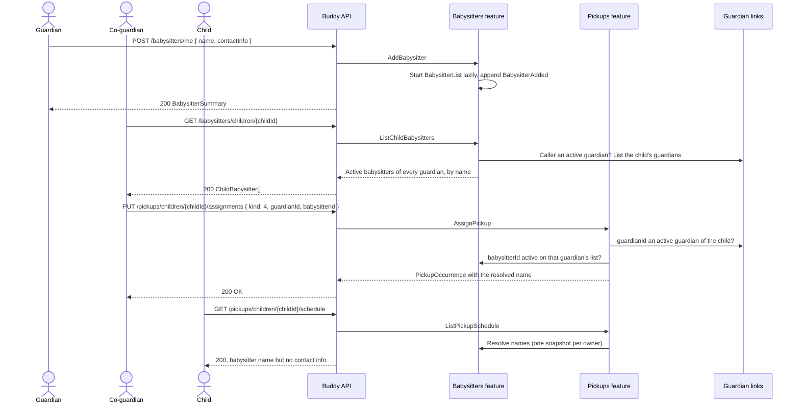

# Babysitters Flow

The babysitters feature keeps one list of saved babysitters and nannies per guardian. Any
active guardian of a child can pick from the lists of all that child's active guardians when
planning a pickup or drop-off, through the `Babysitter` assignee (`kind` 4) of the
[pickups feature](../pickups/flow.md).

## Endpoints

| Method | Route | Behavior |
| --- | --- | --- |
| `GET` | `/babysitters/me` | The caller's own list in the order added, archived babysitters included and flagged. |
| `POST` | `/babysitters/me` | Adds a babysitter (name required, contact info optional). Starts the stream on first use. |
| `PATCH` | `/babysitters/me/{babysitterId}` | Replaces name and contact info. No event when unchanged. |
| `DELETE` | `/babysitters/me/{babysitterId}` | Archives the babysitter. Idempotent `204`. |
| `GET` | `/babysitters/children/{childId}` | Active babysitters of every active guardian of the child, sorted by name, each with its owning `guardianId`. |

Validation: name 1–80 characters, unique (case-insensitive) among the guardian's active
babysitters; contact info at most 200 characters; at most 20 active babysitters per guardian.

## Core lifecycle

`BabysitterList` is an event-sourced aggregate with one stream per guardian, whose id equals
the guardian's `UserId` (no index document). The stream holds:

- `BabysitterListStarted`, appended together with the first `BabysitterAdded`;
- `BabysitterAdded`, `BabysitterDetailsChanged` (before and after name and contact info), and
  `BabysitterArchived`.

Archiving keeps the entry, so pickup slots that point at it keep their name. An archived
babysitter can't be edited or newly assigned. An inline snapshot in the shared `snapshots`
schema serves every read.

## Authorization model

- **Manage** (`/me` routes): the caller themself. A child account gets `403`.
- **Pick** (`/children/{childId}`): an active guardian of the child, the same rule as writing
  that child's pickups. Anyone else, the child included, gets `404`.
- Pickups show the babysitter's name to the child, never the contact info.

See [Babysitters](../analysis/babysitters.md) for the design decisions.
