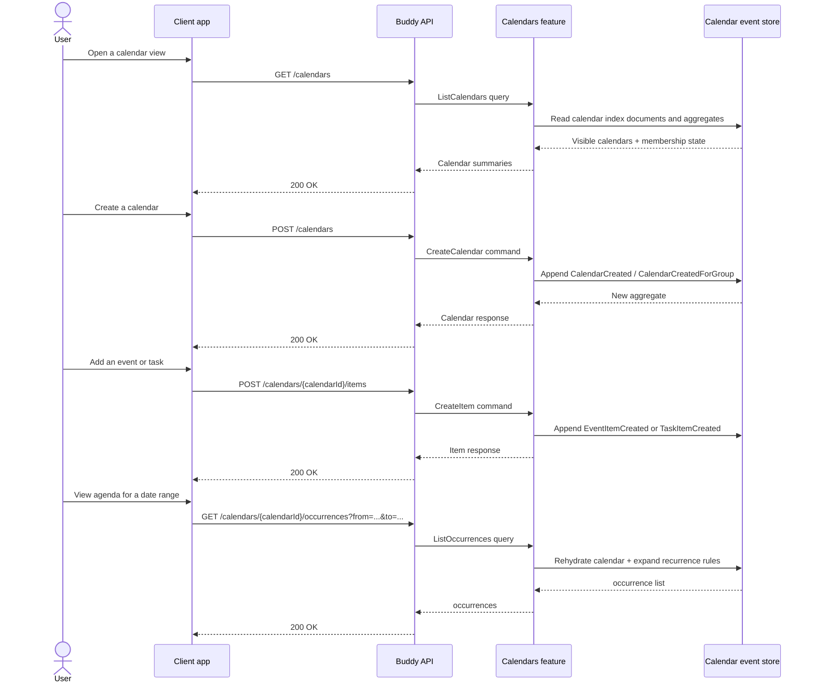

# Calendars Flow

The calendars feature manages the shared scheduling model used by Buddy. A user creates a calendar, adds events and tasks, lists occurrences for a date range, and can share or revoke access when a calendar belongs to a group.

## Endpoints

| Method | Route | Behavior |
| --- | --- | --- |
| `POST` | `/calendars` | Creates a calendar for the current user or for an owned group. |
| `GET` | `/calendars` | Lists calendars visible to the current user. |
| `GET` | `/calendars/{calendarId}` | Loads one calendar aggregate and its member state. |
| `DELETE` | `/calendars/{calendarId}` | Deletes the calendar if the caller is authorized. |
| `PATCH` | `/calendars/{calendarId}/members/{memberId}` | Grants or revokes a member role on the calendar. |
| `DELETE` | `/calendars/{calendarId}/members/{memberId}` | Removes a member from the calendar. |
| `POST` | `/calendars/{calendarId}/items` | Creates an event or task item. |
| `GET` | `/calendars/{calendarId}/items` | Lists items in a calendar. |
| `GET` | `/calendars/{calendarId}/occurrences` | Recomputes occurrences for a date range from the current recurrence state. |
| `PATCH` | `/calendars/{calendarId}/items/{itemId}/details` | Updates an item's name, description, or visual metadata. |
| `PATCH` | `/calendars/{calendarId}/items/{itemId}/schedule` | Reschedules an item or changes time/date placement. |
| `PATCH` | `/calendars/{calendarId}/items/{itemId}/recurrence` | Updates recurrence settings. |
| `DELETE` | `/calendars/{calendarId}/items/{itemId}` | Soft-deletes an item. |
| `POST` | `/calendars/{calendarId}/ical-tokens` | Creates an iCal feed token. |
| `GET` | `/calendars/{calendarId}/ical-tokens` | Lists active iCal token metadata. |
| `DELETE` | `/calendars/{calendarId}/ical-tokens/{tokenId}` | Revokes an iCal token. |
| `GET` | `/calendars/{calendarId}/ical/{token}` | Streams the iCal feed for the calendar. |

## Core lifecycle

The aggregate is event-sourced and uses a sparse stream of calendar mutations. The create flow appends a `CalendarCreated` or `CalendarCreatedForGroup` event, then later event and task endpoints append item-creation events such as `EventItemCreated` or `TaskItemCreated`.

The read model for listing belongs to the calendar index: the API loads calendar membership and permissions to decide whether the current principal can view or mutate the calendar. When a caller asks for occurrences, the system rehydrates the relevant aggregate and expands the calendar graph into a date-window view rather than persisting every computed occurrence.

## Authorization model

Calendar access is resolved against the calendar's member list and, where relevant, group-owned calendar policies. In practice, this means the caller must be authorized for the specific calendar before they can create items, update recurrence, or delete calendar content. The feature keeps the permission decision central to the aggregate rather than each endpoint reimplementing the policy.

## Key event types

- `CalendarCreated`
- `CalendarCreatedForGroup`
- `CalendarDeleted`
- `MemberRoleGranted`
- `MemberRoleRevoked`
- `EventItemCreated`
- `TaskItemCreated`
- `ItemDetailsUpdated`
- `EventRescheduled`
- `TaskRescheduled`
- `RecurrenceUpdated`
- `ItemDeleted`
- `IcalTokenIssued`
- `IcalTokenRevoked`

The day-to-day workflow is mostly: create the calendar, create or edit items, expand occurrences for display, and optionally publish an iCal feed for external consumers.
