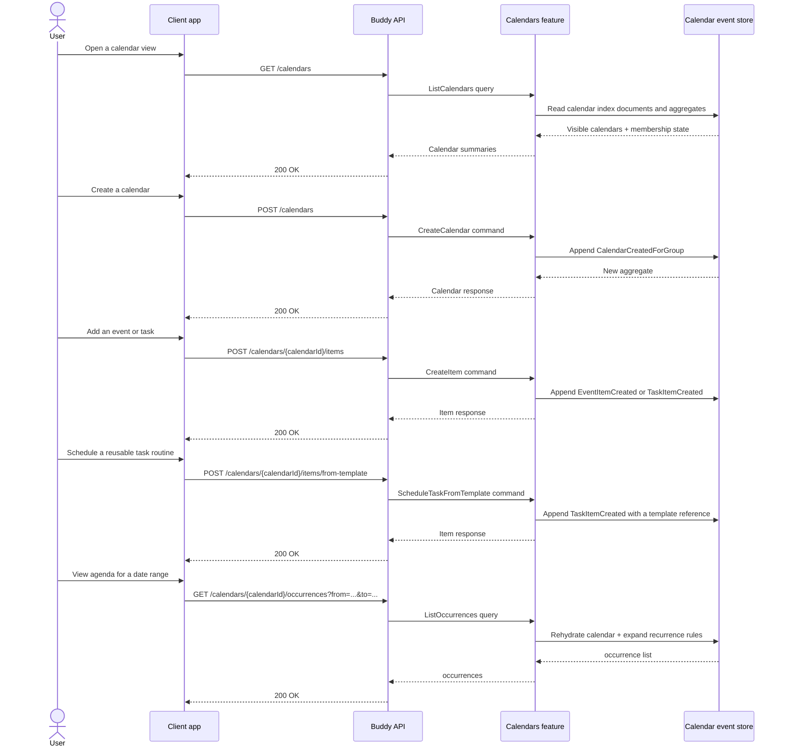

# Calendars Flow

The calendars feature manages the shared scheduling model used by Buddy. A user creates a calendar, adds events and tasks, lists occurrences for a date range, and can share or revoke access when a calendar belongs to a group.

```mermaid
sequenceDiagram
    actor User
    participant App as Client app
    participant API as Buddy API
    participant Calendars as Calendars feature
    participant Store as Calendar event store

    User->>App: Open a calendar view
    App->>API: GET /calendars
    API->>Calendars: ListCalendars query
    Calendars->>Store: Read calendar index documents and aggregates
    Store-->>Calendars: Visible calendars + membership state
    Calendars-->>API: Calendar summaries
    API-->>App: 200 OK

    User->>App: Create a calendar
    App->>API: POST /calendars
    API->>Calendars: CreateCalendar command
    Calendars->>Store: Append CalendarCreatedForGroup
    Store-->>Calendars: New aggregate
    Calendars-->>API: Calendar response
    API-->>App: 200 OK

    User->>App: Add an event or task
    App->>API: POST /calendars/{calendarId}/items
    API->>Calendars: CreateItem command
    Calendars->>Store: Append EventItemCreated or TaskItemCreated
    Calendars-->>API: Item response
    API-->>App: 200 OK

    User->>App: Schedule a reusable task routine
    App->>API: POST /calendars/{calendarId}/items/from-template
    API->>Calendars: ScheduleTaskFromTemplate command
    Calendars->>Store: Append TaskItemCreated with a template reference
    Calendars-->>API: Item response
    API-->>App: 200 OK

    User->>App: View agenda for a date range
    App->>API: GET /calendars/{calendarId}/occurrences?from=...&to=...
    API->>Calendars: ListOccurrences query
    Calendars->>Store: Rehydrate calendar + expand recurrence rules
    Store-->>Calendars: occurrence list
    Calendars-->>API: occurrences
    API-->>App: 200 OK
```

## Endpoints

| Method | Route | Behavior |
| --- | --- | --- |
| `POST` | `/calendars` | Creates a calendar for the current user or for an owned group. |
| `GET` | `/calendars` | Lists calendars visible to the current user. |
| `GET` | `/calendars/{calendarId}` | Loads one calendar aggregate and its member state. |
| `DELETE` | `/calendars/{calendarId}` | Deletes the calendar if the caller is authorized. |
| `PUT` | `/calendars/{calendarId}/members/{memberId}` | Grants or revokes a member role on the calendar. |
| `DELETE` | `/calendars/{calendarId}/members/{memberId}` | Removes a member from the calendar. |
| `GET` | `/calendars/{calendarId}/assignable-members` | Lists members who can be assigned a task on the calendar. |
| `PATCH` | `/calendars/{calendarId}/icon` | Updates the calendar's icon. |
| `PUT` | `/calendars/{calendarId}/group/{groupId}` | Moves a calendar to another group. |
| `POST` | `/calendars/{calendarId}/items` | Creates an event or task item. |
| `POST` | `/calendars/{calendarId}/items/from-template` | Schedules a non-empty, active task template owned by the assignee at a specific time. |
| `GET` | `/calendars/{calendarId}/items` | Lists items in a calendar. |
| `GET` | `/calendars/{calendarId}/occurrences` | Recomputes occurrences for a date range; template tasks produce one timed occurrence per current subtask. |
| `PATCH` | `/calendars/{calendarId}/items/{itemId}/details` | Updates an item's name, description, or visual metadata. |
| `PATCH` | `/calendars/{calendarId}/items/{itemId}/schedule` | Reschedules an item or changes time/date placement. |
| `PATCH` | `/calendars/{calendarId}/items/{itemId}/recurrence` | Updates recurrence settings. |
| `PATCH` | `/calendars/{calendarId}/items/{itemId}/completion` | Marks a plain task occurrence complete or incomplete. A template-scheduled task is rejected (400): it is completed one subtask at a time. Rejects marking a future occurrence complete. |
| `PATCH` | `/calendars/{calendarId}/items/{itemId}/subtasks/{subtaskId}/completion` | Marks one subtask of a template-scheduled task occurrence complete or incomplete; each subtask is tracked independently. A plain task is rejected (400); an unknown subtask is 404. Rejects marking a future occurrence complete. |
| `DELETE` | `/calendars/{calendarId}/items/{itemId}` | Soft-deletes an item. |
| `POST` | `/calendars/{calendarId}/ical-tokens` | Creates an iCal feed token. |
| `GET` | `/calendars/{calendarId}/ical-tokens` | Lists active iCal token metadata. |
| `DELETE` | `/calendars/{calendarId}/ical-tokens/{tokenId}` | Revokes an iCal token. |
| `GET` | `/calendars/{calendarId}/ical/{token}` | Streams the iCal feed for the calendar. |

## Core lifecycle

The aggregate is event-sourced and uses a sparse stream of calendar mutations. The create flow appends a `CalendarCreatedForGroup` event (carrying the calendar's icon, `📅` by default), then later event and task endpoints append item-creation events: `EventItemCreated`, `TaskItemCreated`, or `TemplateTaskItemCreated` for a task scheduled from a template.

An item's schedule is a union (`ItemSchedule`): an event has a `Period`; a task has a `DueDate`, an optional assignee and a source (entered by hand, or from a template). On the wire, `POST .../items` and `PATCH .../schedule` take a `schedule` object discriminated by numeric `kind` (`0` = event: `startsAt`, `endsAt`, `isAllDay`; `1` = task: `dueDate`, `isAllDay`, plus `assignedTo` on create). A reschedule must match the item's own kind. An event schedule (create or reschedule) and a task reschedule reject fields they don't have, such as `assignedTo` on an event.

A task scheduled from the Task Library stores a template reference rather than
a copy of its subtasks. Occurrence and iCal reads load the template's current
ordered subtasks and expand each one into a consecutive timed occurrence. An
archived template cannot be scheduled again, but existing scheduled items keep
expanding; edits to the template also affect those existing items.

The read model for listing belongs to the calendar index: the API loads calendar membership and permissions to decide whether the current principal can view or mutate the calendar. When a caller asks for occurrences, the system rehydrates the relevant aggregate and expands the calendar graph into a date-window view rather than persisting every computed occurrence.

An occurrence's `Timing` is `{ kind: 0, startsAt, endsAt }` for an event and for each subtask of a template-scheduled task, or `{ kind: 1, dueAt }` for a plain task; `SortAt` is the start or due instant, which is what lists sort and date occurrences by. A task-item occurrence expanded from a template carries a `Routine` (`SubtaskId`, `ParentTitle`, `ParentIcon`), so a client can group same-item, same-day subtask occurrences into one visual "task run" without a second lookup. The frontend does exactly this (`task-run.ts`), and keys each run by an `occurrenceKey`/`dateKeyOf` pair that includes the occurrence date, so completing one day's instance of a recurring task only toggles that day.

## Authorization model

Calendar access is resolved against the calendar's member list and, where relevant, group-owned calendar policies. In practice, this means the caller must be authorized for the specific calendar before they can create items, update recurrence, or delete calendar content. The feature keeps the permission decision central to the aggregate rather than each endpoint reimplementing the policy.

## Key event types

- `CalendarCreatedForGroup`
- `CalendarDeleted`
- `MemberRoleGranted`
- `MemberRoleRevoked`
- `CalendarIconChanged`
- `CalendarTransferredToGroup`
- `EventItemCreated`
- `TaskItemCreated`
- `TemplateTaskItemCreated`
- `TaskCompletionChanged`
- `ItemDetailsUpdated`
- `EventRescheduled`
- `TaskRescheduled`
- `RecurrenceUpdated`
- `ItemDeleted`
- `IcalTokenIssued`
- `IcalTokenRevoked`

The day-to-day workflow is mostly: create the calendar, create or edit items, expand occurrences for display, and optionally publish an iCal feed for external consumers.
