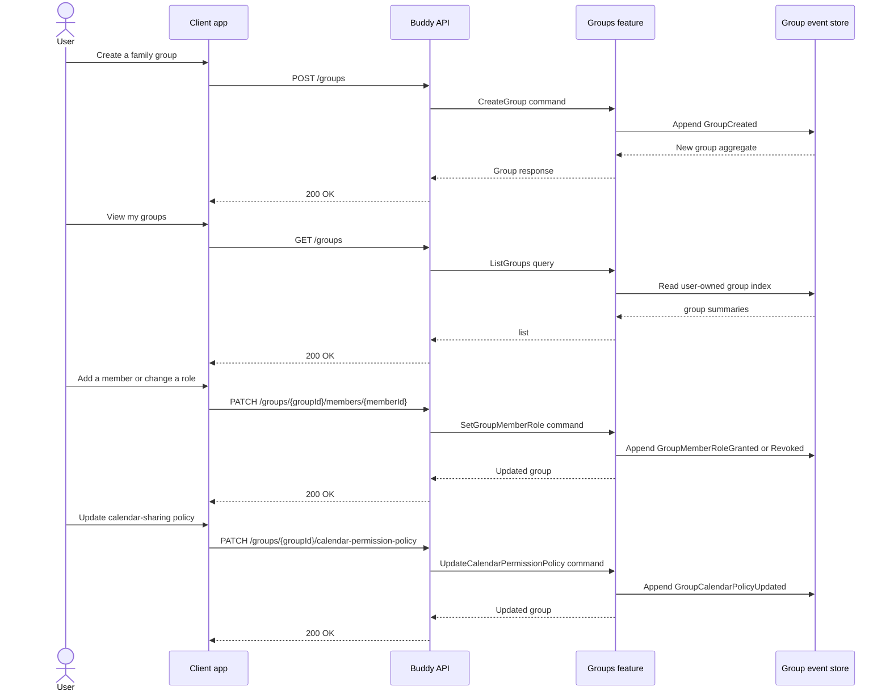

# Groups Flow

The groups feature manages family or household collections that can own calendars and share permissions across a set of users. It is the coordination layer between users, calendar ownership, and shared calendar policy.

## Endpoints

| Method | Route | Behavior |
| --- | --- | --- |
| `POST` | `/groups` | Creates a group for the authenticated user. |
| `GET` | `/groups` | Lists groups visible to the current user. |
| `GET` | `/groups/{groupId}` | Loads one group and its current membership state. |
| `PATCH` | `/groups/{groupId}/members/{memberId}` | Sets a member role such as owner, admin, or member. |
| `DELETE` | `/groups/{groupId}/members/{memberId}` | Removes a user from the group. |
| `PATCH` | `/groups/{groupId}/calendar-permission-policy` | Updates how group roles map to calendar permissions. |
| `DELETE` | `/groups/{groupId}` | Deletes the group when the caller is authorized. |

## Core lifecycle

The group aggregate is a small event-sourced model: it records the creation of the group, membership-role transitions, permission-policy updates, and deletion. Once created, the group becomes the owner boundary for any calendar that is created for the group rather than for an individual user.

This matters because the feature does not directly own schedules or items; instead, it defines the authority model that then governs who can create and manage shared calendars. The calendar feature checks group policy when a calendar is created or when members are granted access.

## Event types

- `GroupCreated`
- `GroupMemberRoleGranted`
- `GroupMemberRoleRevoked`
- `GroupCalendarPolicyUpdated`
- `GroupDeleted`

## Authorization model

Group membership is not just a list of names. The group aggregate carries role transitions, and those roles are later translated into permission decisions for calendars and shared scheduling data. In other words, the group feature is the policy source for shared ownership, while the calendars feature is responsible for enforcing those rules on specific calendar resources.
