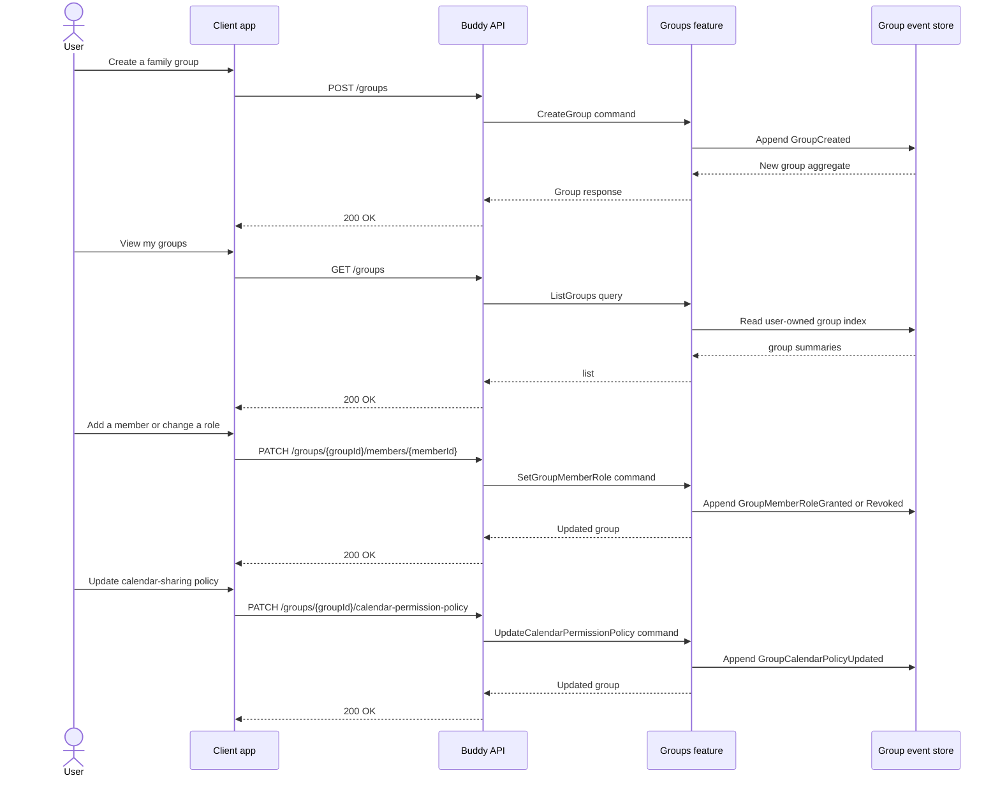
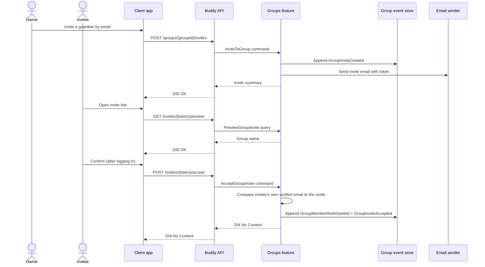

# Groups Flow

The groups feature manages family or household collections that can own calendars and share permissions across a set of users. It is the coordination layer between users, calendar ownership, and shared calendar policy.

## Endpoints

| Method | Route | Behavior |
| --- | --- | --- |
| `POST` | `/groups` | Creates a group for the authenticated user. |
| `GET` | `/groups` | Lists groups visible to the current user. |
| `GET` | `/groups/{groupId}` | Loads one group and its current membership state. |
| `PATCH` | `/groups/{groupId}/members/{memberId}` | Sets a member role such as owner, admin, or member. |
| `DELETE` | `/groups/{groupId}/members/{memberId}` | Removes a user from the group. |
| `PATCH` | `/groups/{groupId}/calendar-permission-policy` | Updates how group roles map to calendar permissions. |
| `DELETE` | `/groups/{groupId}` | Deletes the group when the caller is authorized. |
| `POST` | `/groups/{groupId}/invites` | Owner/admin invites a guardian by email; sends a token via email. |
| `GET` | `/groups/{groupId}/invites` | Lists pending invites for the group (owner/admin only). |
| `DELETE` | `/groups/{groupId}/invites/{inviteId}` | Revokes a pending invite. |
| `GET` | `/invites/{token}/preview` | Unauthenticated: returns the group name for an invite link, so the app can show "You've been invited to X" before login. |
| `POST` | `/invites/{token}/accept` | Authenticated: accepts an invite if the caller's own verified email matches the invited address. |

## Core lifecycle

The group aggregate is a small event-sourced model: it records the creation of the group, membership-role transitions, permission-policy updates, and deletion. Once created, the group becomes the owner boundary for any calendar that is created for the group rather than for an individual user.

This matters because the feature does not directly own schedules or items; instead, it defines the authority model that then governs who can create and manage shared calendars. The calendar feature checks group policy when a calendar is created or when members are granted access.

## Event types

- `GroupCreated`
- `GroupMemberRoleGranted`
- `GroupMemberRoleRevoked`
- `GroupCalendarPolicyUpdated`
- `GroupDeleted`
- `GroupInviteCreated`
- `GroupInviteAccepted`
- `GroupInviteRevoked`

## Authorization model

Group membership is not just a list of names. The group aggregate carries role transitions, and those roles are later translated into permission decisions for calendars and shared scheduling data. In other words, the group feature is the policy source for shared ownership, while the calendars feature is responsible for enforcing those rules on specific calendar resources.

## Inviting a guardian by email

Groups can only be joined by invite -- there is no directory of guardians to browse and no way to add someone by a raw user id (see [child-accounts-and-guardian-roles.md](../analysis/child-accounts-and-guardian-roles.md) for why this codebase deliberately has no "look up a user by email" capability). `InviteToGroup` never resolves the invited email to a `UserId`: it records the email on `GroupInviteCreated` and emails a bearer token, the same shape as `EmailVerificationToken`. `AcceptGroupInvite` is the only place an invite is ever matched to a real account, and it does so by comparing the *authenticated caller's own* verified email against the invite -- a self-scoped check, not a lookup of someone else. This means an invite to an email with no account, or a typo, has no immediate feedback at invite time; it simply sits pending until it expires (7 days).

Both `InviteToGroup` and `AcceptGroupInvite` also append a `GroupInvitationSent`/`GroupMembershipJoined` event to the *acting user's own* stream in the Users store, purely so the invite shows up in that person's own event history (see [Users' UserEvents.cs](../../../src/backend/buddy/Features/Users/Types/UserEvents.cs)). This is a separate, non-transactional write from the Group-stream append -- an accepted trade-off, not a saga, the same way email sending after an event append already is elsewhere in this codebase. It intentionally does not notify the *other* party (e.g. the owner isn't notified when their invite is accepted) -- that would require writing to a stream this handler doesn't own.
