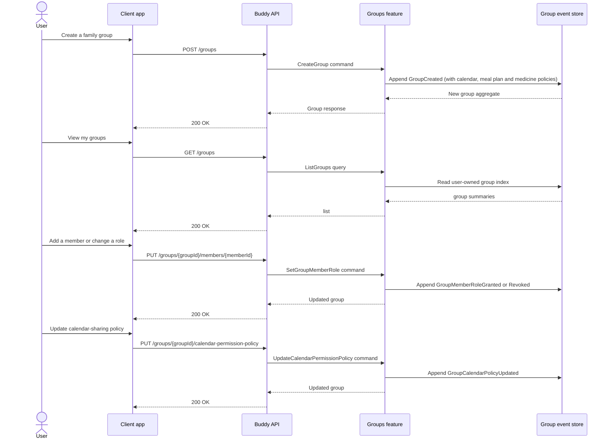
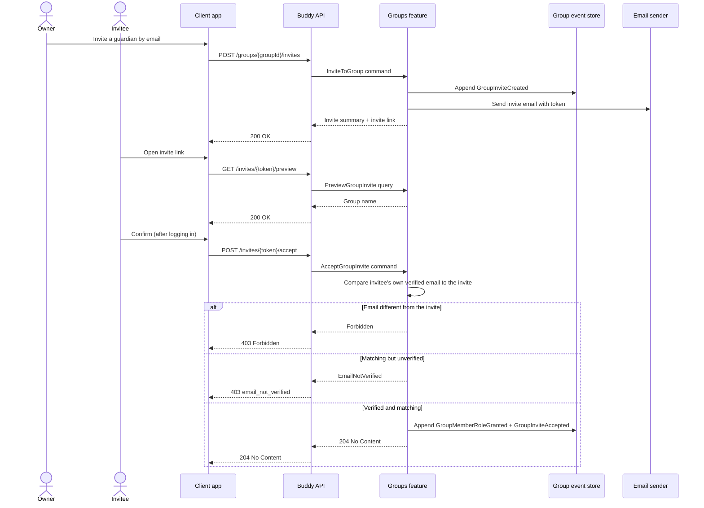

# Groups Flow

The groups feature manages family or household collections that can own calendars and share permissions across a set of users. It is the coordination layer between users, calendar ownership, and shared calendar policy.

```mermaid
sequenceDiagram
    actor User
    participant App as Client app
    participant API as Buddy API
    participant Groups as Groups feature
    participant Store as Group event store

    User->>App: Create a family group
    App->>API: POST /groups
    API->>Groups: CreateGroup command
    Groups->>Store: Append GroupCreated (with calendar, meal plan and medicine policies)
    Store-->>Groups: New group aggregate
    Groups-->>API: Group response
    API-->>App: 200 OK

    User->>App: View my groups
    App->>API: GET /groups
    API->>Groups: ListGroups query
    Groups->>Store: Read user-owned group index
    Store-->>Groups: group summaries
    Groups-->>API: list
    API-->>App: 200 OK

    User->>App: Add a member or change a role
    App->>API: PUT /groups/{groupId}/members/{memberId}
    API->>Groups: SetGroupMemberRole command
    Groups->>Store: Append GroupMemberRoleGranted or Revoked
    Groups-->>API: Updated group
    API-->>App: 200 OK

    User->>App: Update calendar-sharing policy
    App->>API: PUT /groups/{groupId}/calendar-permission-policy
    API->>Groups: UpdateCalendarPermissionPolicy command
    Groups->>Store: Append GroupCalendarPolicyUpdated
    Groups-->>API: Updated group
    API-->>App: 200 OK
```

```mermaid
sequenceDiagram
    actor Owner
    actor Invitee
    participant App as Client app
    participant API as Buddy API
    participant Groups as Groups feature
    participant Store as Group event store
    participant Mail as Email sender

    Owner->>App: Invite a guardian by email
    App->>API: POST /groups/{groupId}/invites
    API->>Groups: InviteToGroup command
    Groups->>Store: Append GroupInviteCreated
    Groups->>Mail: Send invite email with token
    Groups-->>API: Invite summary + invite link
    API-->>App: 200 OK

    Invitee->>App: Open invite link
    App->>API: GET /invites/{token}/preview
    API->>Groups: PreviewGroupInvite query
    Groups-->>API: Group name
    API-->>App: 200 OK

    Invitee->>App: Confirm (after logging in)
    App->>API: POST /invites/{token}/accept
    API->>Groups: AcceptGroupInvite command
    Groups->>Groups: Compare invitee's own verified email to the invite
    alt Email different from the invite
        Groups-->>API: Forbidden
        API-->>App: 403 Forbidden
    else Matching but unverified
        Groups-->>API: EmailNotVerified
        API-->>App: 403 email_not_verified
    else Verified and matching
        Groups->>Store: Append GroupMemberRoleGranted + GroupInviteAccepted
        Groups-->>API: 204 No Content
        API-->>App: 204 No Content
    end
```

## Endpoints

| Method | Route | Behavior |
| --- | --- | --- |
| `POST` | `/groups` | Creates a group for the authenticated user. |
| `GET` | `/groups` | Lists groups visible to the current user. |
| `GET` | `/groups/{groupId}` | Loads one group and its current membership state, with each member's given/family name and whether they are a child (resolved from the User and GuardianLink streams). |
| `PUT` | `/groups/{groupId}/members/{memberId}` | Sets a member role such as owner, admin, or member. |
| `DELETE` | `/groups/{groupId}/members/{memberId}` | Removes a user from the group. |
| `PUT` | `/groups/{groupId}/calendar-permission-policy` | Updates how group roles map to calendar permissions. |
| `PUT` | `/groups/{groupId}/mealplan-permission-policy` | Updates how group roles map to meal-plan access tiers. |
| `PUT` | `/groups/{groupId}/medicine-permission-policy` | Updates how group roles map to medicine access tiers. |
| `PUT` | `/groups/{groupId}/children/{childId}` | An active guardian of `childId` adds them directly as a Member -- no invite/accept step (see below). |
| `DELETE` | `/groups/{groupId}` | Deletes the group when the caller is authorized. |
| `POST` | `/groups/{groupId}/invites` | Owner/admin invites a guardian by email; sends a token via email. The response also carries `inviteUrl`, the same link the email holds, so the inviter can share it themself (SMS, chat); it is only available here, since the invite stores just the token's hash. Re-inviting the same email within a minute returns `409 resend_cooldown`; a later re-invite issues a new link and the old one stops working. |
| `GET` | `/groups/{groupId}/invites` | Lists pending invites for the group (owner/admin only). |
| `DELETE` | `/groups/{groupId}/invites/{inviteId}` | Revokes a pending invite. |
| `GET` | `/invites/{token}/preview` | Unauthenticated: returns the group name for an invite link, so the app can show "You've been invited to X" before login. |
| `POST` | `/invites/{token}/accept` | Authenticated: accepts an invite only if the caller has verified their email address and it matches the invited address; otherwise `403 Forbidden` (`403 email_not_verified` when only verification is missing). |

## Core lifecycle

The group aggregate is a small event-sourced model: it records the creation of the group, membership-role transitions, permission-policy updates, and deletion. Once created, the group becomes the owner boundary for any calendar that is created for the group rather than for an individual user.

This matters because the feature does not directly own schedules or items; instead, it defines the authority model that then governs who can create and manage shared calendars. The calendar feature checks group policy when a calendar is created or when members are granted access.

## Event types

- `GroupCreated`
- `GroupMemberRoleGranted`
- `GroupMemberRoleRevoked`
- `GroupCalendarPolicyUpdated`
- `GroupMealplanPolicyUpdated`
- `GroupMedicinePolicyUpdated`
- `GroupDeleted`
- `GroupInviteCreated`
- `GroupInviteAccepted`
- `GroupInviteRevoked`

## Authorization model

Group membership is not just a list of names. The group aggregate carries role transitions, and those roles are later translated into permission decisions for calendars and shared scheduling data. In other words, the group feature is the policy source for shared ownership, while the calendars feature is responsible for enforcing those rules on specific calendar resources.

## Inviting a guardian by email

Groups can only be joined by invite -- there is no directory of guardians to browse and no way to add someone by a raw user id (see [child-accounts-and-guardian-roles.md](../analysis/child-accounts-and-guardian-roles.md) for why this codebase deliberately has no "look up a user by email" capability). `InviteToGroup` never resolves the invited email to a `UserId`: it records the email on `GroupInviteCreated` and emails a bearer token, the same shape as `EmailVerificationToken`. `AcceptGroupInvite` is the only place an invite is ever matched to a real account, and it does so by comparing the *authenticated caller's own* verified email against the invite -- a self-scoped check, not a lookup of someone else. This means an invite to an email with no account, or a typo, has no immediate feedback at invite time; it simply sits pending until it expires (7 days).

**The invitee must verify their email address before accepting.** `AcceptGroupInvite` returns `403` with the `email_not_verified` error code when the caller's email matches the invited address but is unverified (a different address is a plain `403`): an unverified address could have been typed in by someone other than its real owner, so it can't be trusted to claim an invite sent to that address. The invite stays pending, so the invitee can verify their email (`POST /users/me/email/verify`, see [users/flow.md](../users/flow.md)) and then accept the same link, as long as it hasn't expired. Children added through `AddChildToGroup` (below) don't go through invite acceptance, so this rule doesn't apply to them.

**Children are the one deliberate exception.** `AddChildToGroup` (`PUT /groups/{groupId}/children/{childId}`) adds a child directly, skipping the invite/accept step entirely, provided the caller both manages the group (Owner/Admin) *and* has an active `GuardianLink` to that exact child -- the same two-sided-consent shape `ShareMealPlanWithGroup` already uses. This isn't an account-enumeration risk the way a raw `SetGroupMemberRole` on an arbitrary adult would be: a guardian already has full authority over their own child (the same authority `CreateChild` exercises), so there is nothing to "look up." The child is always granted `GroupRole.Member`, never Owner/Admin.

The invite's full lifecycle -- sent, accepted, revoked -- lives entirely on the Group stream via `GroupInviteCreated`/`GroupInviteAccepted`/`GroupInviteRevoked`; it is not duplicated onto either party's User stream. The personal "recent events" feed in the frontend only ever reads a user's own User stream, so a group invite doesn't currently appear there -- surfacing it would mean a group-scoped history view reading the Group stream instead, which doesn't exist yet.
