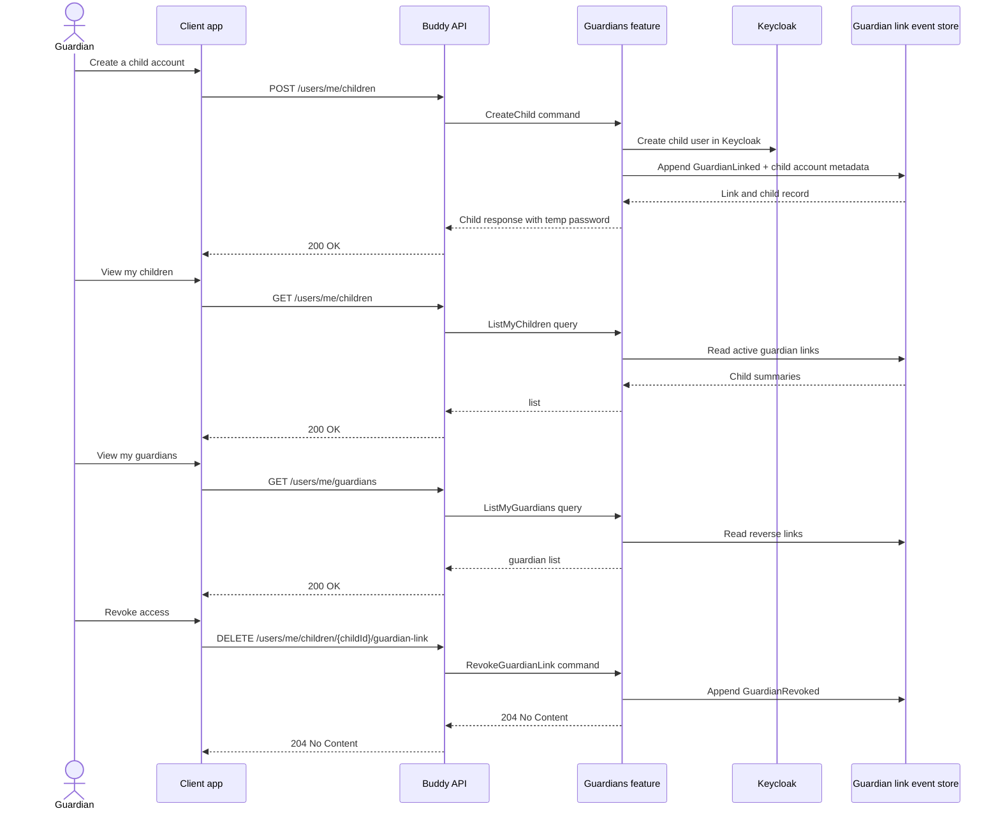

# Guardians Flow

The guardians feature handles child-account provisioning, guardian links, and the resulting authority relationship between a guardian and a child. It is the main feature behind child-specific user management and access control.

## Endpoints

| Method | Route | Behavior |
| --- | --- | --- |
| `POST` | `/users/me/children` | Creates an account for a child and establishes the guardian relationship. |
| `GET` | `/users/me/children` | Lists the current guardian's child accounts. |
| `GET` | `/users/me/children/{childId}/guardians` | Lists the active guardians linked to a specific child. |
| `DELETE` | `/users/me/children/{childId}/guardian-link` | Revokes the guardian-child relationship. |
| `PATCH` | `/users/me/children/{childId}/language` | An active guardian updates the child's language. |
| `PATCH` | `/users/me/children/{childId}/timezone` | An active guardian updates the child's time zone. |
| `GET` | `/users/me/guardians` | Lists guardians linked to the current authenticated user. |
| `GET` | `/users/me/siblings` | Lists the caller's siblings, resolved via shared guardians. |
| `POST` | `/users/me/children/{childId}/guardian-invites` | An active guardian invites another adult, by email, to co-manage this child. |
| `GET` | `/users/me/children/{childId}/guardian-invites` | Lists this child's pending guardian invites. |
| `DELETE` | `/users/me/children/{childId}/guardian-invites/{inviteId}` | Revokes a pending guardian invite. |
| `GET` | `/guardian-invites/{token}/preview` | Unauthenticated preview of who a guardian-invite link is for. |
| `POST` | `/guardian-invites/{token}/accept` | Authenticated; accepts an invite and creates a new `GuardianLink`. |

## Core lifecycle

The create-child flow is intentionally more than a normal profile creation. The backend creates the child in Keycloak, records the guardian link in the domain event store, and returns a one-time temporary credential that is shown to the guardian out-of-band. That credential is not persisted and is not retrievable later.

This feature is key because it defines who can act on behalf of a child in other features such as medicines, calendars, and scheduling. The access checks are not free-form; they resolve from the guardian-link data model and the child identity model rather than from a role system on the schedule itself.

## Key domain points

- `GuardianLink` is the relationship record between a guardian and a child.
- A child may have multiple guardian links, but the active relationship is the thing used by authorization.
- Guardian access is intentionally narrower than full administrative access; it is scoped to the guardian-child relationship and the permissions granted by that relation.
- The feature also supports read-model queries that allow the API to answer "what children do I manage?" and "who manages me?" without rehydrating the full user graph each time.

## Inviting a co-guardian

`CreateChild` only ever produces the *first* `GuardianLink` for a new child. To bring in a second adult (a co-parent, grandparent, etc.) for a child that already exists, any active guardian can invite one by email via `InviteGuardian`, mirroring the Groups feature's invite/accept/revoke triad: a token is emailed (never the raw token stored, only its hash), the invite lives on its own dedicated event stream (there's no pre-existing aggregate to attach it to, unlike a `Group`), and `AcceptGuardianInvite` requires the accepting caller's own verified email to match the invite before it appends a new `GuardianLinked` event. The inviter chooses the `GuardianKind` (Parent/Guardian) up front; it carries straight through to the resulting link and, as elsewhere in this feature, never gates access.

Because "family" for shared meal plans (and any future guardian-derived calendar access) is resolved transitively from the live `GuardianLink` graph, accepting an invite immediately widens the new guardian's own other children into this child's shared family too — a direct consequence of the existing authority model, not a separate feature to build.

## Related behavior

The guardians feature is the source of authority used by the medicines feature, especially for child schedule creation and dose authorization. If a guardian link is revoked, the API must stop allowing the former guardian to modify or view the child-related schedule state.
