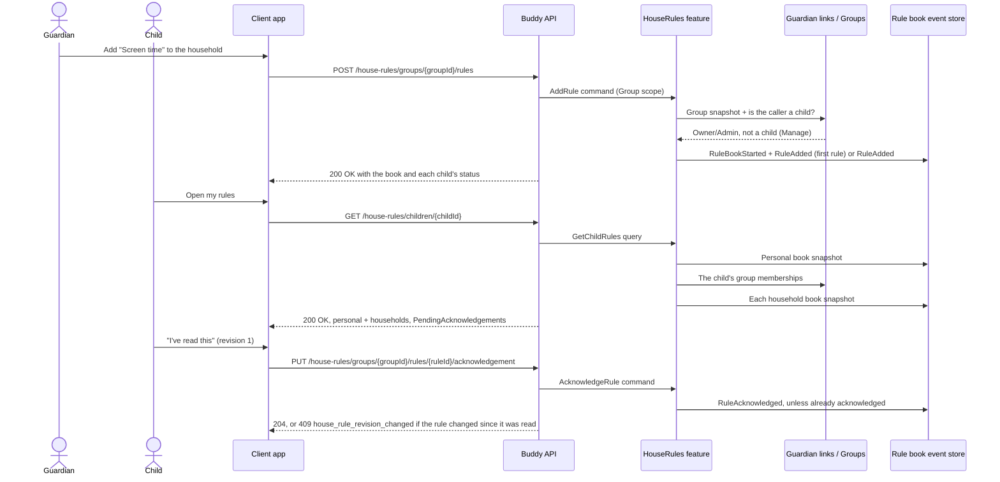

# House Rules Flow

House rules are a family's written agreements ("Screen time", "Dinner", "Bedtime"), kept as short
rules with a markdown body. Children read them and tap "I've read this" for each new version.
Design: [house-rules.md](../analysis/house-rules.md).

One aggregate in the `houserules` schema:

- `RuleBook`: one stream per scope, either a child's personal rules or a household group's rules.
  `RuleBookId.Value` equals the scope's id (`ChildId.Value` or `GroupId.Value`), so there is no
  index document. A flat `ScopeKind` (`Child` | `Group`) is stored on the book, and a load whose
  kind doesn't match the route's kind counts as missing. The stream is created lazily by the first
  `AddRule`. A book holds an ordered list of at most 50 `Rule`s and an
  `(RuleId, child UserId) -> acknowledged revision` map.

The backend stores the markdown as plain text and never parses it. The frontend renders an
allow-listed subset through Angular templates (`shared/markdown-view`), never through `innerHTML`.

## Access

| Scope | Tier | Who |
| --- | --- | --- |
| Child book | Manage | An active guardian of the child |
| Child book | Acknowledge | The child |
| Group book | Manage | A group Owner/Admin who is not a child |
| Group book | Acknowledge | A child who is a group member |
| Group book | View | Any other group member |

Anyone else gets `404`. A caller who can see the book but tries to write gets `403`.

## Endpoints

Every book-scoped route exists twice, once under `children/{childId}` and once under
`groups/{groupId}`. The group routes' operation ids end in `ForGroup` (`AddRuleForGroup`).

| Method | Route | Tier | Behavior |
| --- | --- | --- | --- |
| `POST` | `.../rules` | Manage | Adds a rule at the end. `{ title, body }`: title 1-100 characters, body 0-4000. The 51st rule is `400`. Returns the book. |
| `PUT` | `.../rules/{ruleId}` | Manage | Edits a rule. `{ title, body, requireReacknowledgement = true }`. Identical content appends nothing. `false` keeps the children's acknowledgements (a small fix). Returns the book. |
| `DELETE` | `.../rules/{ruleId}` | Manage | Removes a rule and its acknowledgements. Idempotent: `204` for a rule that's already gone. |
| `PUT` | `.../rules/order` | Manage | `{ newOrder }`: exactly the book's current rule ids, each once, or `400`. The same order appends nothing. Returns the book. |
| `GET` | `.../rules` | any | The book: `access` (the caller's tier), `children` and each rule with every child's status. A child sees only their own status. A scope with no rules is an empty list. |
| `PUT` | `.../rules/{ruleId}/acknowledgement` | Acknowledge, or Manage on behalf | `{ revision, childId? }`. See below. `204`. |
| `GET` | `/house-rules/children/{childId}` | the child, or an active guardian | Everything the child is asked to keep: the personal section (labelled with the child's given name), one section per household group the child is a member of (labelled with the group name, ordered by name), and `pendingAcknowledgements`. A guardian sees households whose group they don't belong to, read-only. |

`...` is `/house-rules/children/{childId}` or `/house-rules/groups/{groupId}`.

## Acknowledging

A rule has a `revision` (`+1` on every content edit) and an `acknowledgementRevision` (the last
revision that asked children to read it again). A child is up to date when their acknowledged
revision is at least the rule's `acknowledgementRevision`.

| Request | Result |
| --- | --- |
| `revision` greater than the rule's current revision | `400` |
| `revision` below `acknowledgementRevision` (a normal edit happened since the child read it) | `409 house_rule_revision_changed`. The client reloads and shows the new text first. |
| The child already acknowledged this revision or a later one | `204`, nothing appended |
| Otherwise | `RuleAcknowledged` is appended, `204` |

Who records it:

- The child acknowledges for themself. `childId` is left out, or names the child.
- A guardian with Manage may acknowledge for a child who can't read yet. `childId` is required (`400`
  without it). The child must be in the book's scope, and the caller must be an active guardian of
  that child, so a household admin can't tick for another family's child (`403`).
  `RuleAcknowledged.RecordedBy` names the guardian.
- An adult `View` member can't acknowledge (`403`).

## Events

`RuleBookStarted` (`ScopeKind`, `ScopeId`), `RuleAdded`, `RuleEdited` (`Before`/`After` content,
`Revision`, `RequiresReacknowledgement`), `RuleRemoved` (`Before`), `RulesReordered`
(`Before`/`After` ids), `RuleAcknowledged` (`ChildId`, `Revision`, `RecordedBy`). Golden files:
`buddy.IntegrationTests/EventShapeTests/GoldenFiles/HouseRules/`.

## Personal data

- **Child erased.** Their personal book stream is deleted. Their acknowledgements in household
  books stay, keyed by a `UserId` that is a pseudonym once the user is erased. They are no longer a
  member, so they drop out of every status list.
- **Guardian erased.** The rules they wrote stay with the child or household. `AddedBy`/`EditedBy`
  are pseudonyms, as `CreatedBy` is on calendar items.
- **Group erased.** When an erasure leaves a group with nobody in it, `GroupsPersonalDataEraser`
  deletes the group. The house-rules eraser runs after it and deletes the book of every group that
  no longer exists. A group deleted through `DeleteGroup` keeps its unreachable book until that
  sweep next runs.
- **Export** (`houseRules` section): the personal books of the guardian's children and the book of
  every group they belong to, with acknowledgement status for their children.

## Feature flag

`Features:HouseRules` (default on). Off unmaps the `/house-rules` group. The data, the snapshot
projection and GDPR coverage stay.
