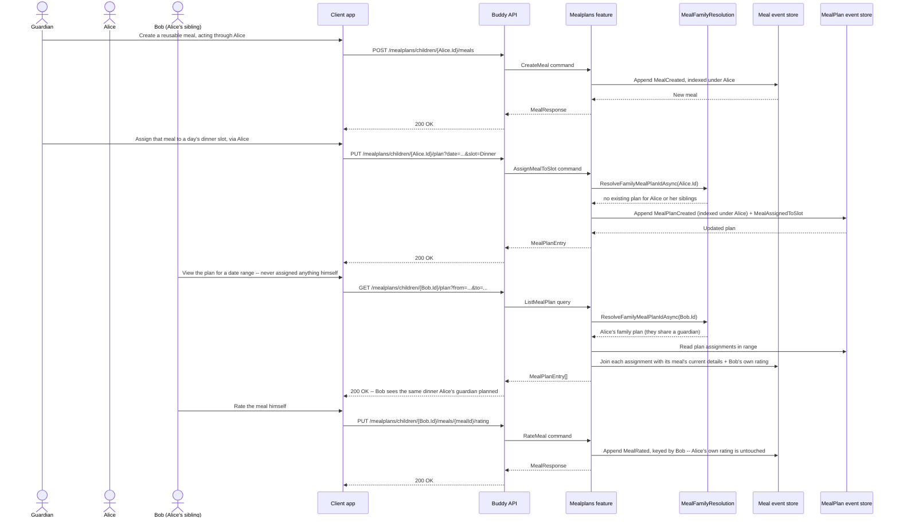

# Mealplans Flow

The mealplans feature lets a guardian build a reusable library of meals and
assign them to dated slots (breakfast/lunch/dinner/snack) on a plan. Both the
meal library and the plan are shared across every sibling in a family — a
guardian creates "Tacos" and plans Tuesday's dinner once, and it shows up for
every child who shares a guardian with the child the request was made
through, with no need to repeat the setup per child. Each child rates meals
independently; only guardians can write meals or the plan itself.

## Endpoints

| Method | Route | Behavior |
| --- | --- | --- |
| `POST` | `/mealplans/children/{childId}/meals` | Creates a reusable meal, indexed under `childId`, visible to their whole family. |
| `GET` | `/mealplans/children/{childId}/meals` | Lists `childId`'s family's meal library, including archived meals, with every sibling's rating. |
| `PATCH` | `/mealplans/children/{childId}/meals/{mealId}/details` | Updates a meal's name, description, icon, or color. |
| `DELETE` | `/mealplans/children/{childId}/meals/{mealId}` | Archives a meal (soft delete; blocks new assignments). |
| `PUT` | `/mealplans/children/{childId}/meals/{mealId}/rating` | `childId` rates a meal (1-5 stars, optional comment) — their own opinion only. |
| `PUT` | `/mealplans/children/{childId}/plan?date=...&slot=...` | Assigns (or reassigns) a meal to a date/slot on the family's shared plan. |
| `DELETE` | `/mealplans/children/{childId}/plan?date=...&slot=...` | Clears a planned slot on the family's shared plan (idempotent). |
| `GET` | `/mealplans/children/{childId}/plan?from=...&to=...` | Lists the family's plan entries in a date range, joined with each meal's current details and `childId`'s own rating. |
| `GET` | `/mealplans/children/{childId}/ai/providers` | Lists the family's configured AI provider entries (provider, last 4 of the key, added date) and the active provider, never the key itself. |
| `PUT` | `/mealplans/children/{childId}/ai/providers/{provider}/key` | Adds or replaces the family's API key for `provider` (BYOK). The first key added for a family becomes the active provider automatically. |
| `DELETE` | `/mealplans/children/{childId}/ai/providers/{provider}/key` | Removes the family's key for `provider` (idempotent). If `provider` was active, the family is left with no active provider. |
| `PUT` | `/mealplans/children/{childId}/ai/active-provider/{provider}` | Switches the family's active provider to one that already has a key configured. |
| `POST` | `/mealplans/children/{childId}/ai/providers/{provider}/test-connection` | Sends a minimal request through `provider` to confirm a key works, either the family's already-stored key or one supplied in the request body before it's ever saved. |
| `GET` | `/mealplans/children/{childId}/ai/sessions/current` | Returns the family's current AI assistant session (transcript + draft), if one exists. |
| `POST` | `/mealplans/children/{childId}/ai/sessions` | Starts a new AI assistant session for a date range/slot selection, discarding whatever session was previously current for the family. |
| `POST` | `/mealplans/children/{childId}/ai/sessions/current/messages` | Sends a guardian chat message to the current session and runs the provider's tool-calling loop to update the draft. |
| `POST` | `/mealplans/children/{childId}/ai/sessions/current/apply` | Commits the current session's draft assignments to the real family plan and marks the session applied. |
| `POST` | `/mealplans/children/{childId}/ai/sessions/current/discard` | Discards the current session without touching the real plan (idempotent). |

## Core lifecycle

`Meal` and `MealPlan` are separate event-sourced aggregates, each with its own
stream, and neither carries a `ChildId` — see
[docs/backend/analysis/mealplans.md](../analysis/mealplans.md#question-3-sharing-a-mealmealplan-across-siblings).
A `Meal`'s stream starts with `MealCreated` and accumulates
`MealDetailsUpdated`, `MealArchived`, and `MealRated` events as it's edited,
retired, and rated (independently, per child) over time. A `MealPlan` is a
singleton stream per *family*, holding a sparse dictionary of
`(Date, Slot) -> assignment`; it starts lazily with `MealPlanCreated` on the
first `AssignMealToSlot` call for a family with no plan yet, then accumulates
`MealAssignedToSlot`/`MealSlotCleared` events per slot. No slot is ever
required to be filled, which is what makes "usually just dinner" work with no
special-casing.

Each `Meal`/`MealPlan` is still indexed under the single `ChildId` a guardian
happened to be acting through when it was created — sharing with siblings
isn't written at creation time. `MealFamilyResolution` widens every read (and
every membership check on a write) to the whole family by walking the
existing `GuardianLink` graph fresh on each call, so a newly added sibling
sees the shared library/plan immediately, with no backfill step.

For display, `ListMealPlan` does not persist a generated view — it reads the
family's current assignments for the requested range and joins each one with
its referenced meal's current name/icon/color and the *viewing* child's own
rating, recomputed on every call, the same as `ListTodaysDoses` does for
medicine schedules.

`AiProviderCredential` is a separate family-wide singleton stream, resolved
the same way as `MealPlan` (one credential set shared by every guardian in
the family, indexed under whichever child a guardian happened to be acting
through when the first key was added). It's provisioned lazily on the first
`SetProviderApiKey` call with `AiCredentialsInitialized`, then accumulates
`ProviderApiKeySet`/`ProviderApiKeyRemoved`/`ActiveProviderChanged` events.
Provider API keys (BYOK — bring your own key, for Anthropic, OpenAI, or
Gemini) are encrypted at rest via the ASP.NET Core Data Protection API before
being stored; only the encrypted ciphertext and the key's last 4 characters
are persisted, and every read-facing response returns the masked
`AiProviderSettings` shape rather than the credential itself. `TestProviderConnection`
sends a one-word "OK" round trip through the resolved provider client to confirm a
key works, either the family's already-stored key or a not-yet-saved one from the
request body, and never surfaces the provider's raw error body — only a short,
best-effort message extracted from it.

`MealplanAiSession` is a separate stream per session (not a family-wide singleton
like `MealPlan`/`AiProviderCredential`): starting a new session always creates a
fresh stream, and `AiSessionResolution` treats the family's "current" session as
whichever session was started most recently across every sibling, discarding
(`AiSessionDiscarded`) whatever was previously current if it was still
`Drafting`. A session starts with `AiSessionStarted` (the requested date range,
slots, must-include meals, and free-text notes) and accumulates
`AiUserMessageSent`, `AiToolInvocationRecorded`, `AiDraftAssignmentSet`/
`AiDraftAssignmentCleared`, and `AiAssistantMessageRecorded` events as the
guardian chats with the assistant, ending in exactly one of `AiSessionApplied` or
`AiSessionDiscarded`. `SendAiSessionMessage` runs a bounded tool-calling loop
(`SendAiSessionMessageHandler.MaxToolLoopIterations`, currently 20) against the
family's active provider: the model's only way to affect state is
`propose_assignment`/`clear_draft_assignment` (each validated against the
session's requested range/slots and the family's actual meal library before
touching the draft), plus a read-only `get_calendar_conflicts` tool that looks up
the caller's visible calendar occurrences — the one place Mealplans reads from
Calendars, never the reverse (see
[docs/backend/analysis/mealplans.md](../analysis/mealplans.md)). `ApplyAiSessionDraft`
commits the session's draft by replaying each entry through the same
`AssignMealToSlot` write path a manual assignment uses, so authorization and
domain rules apply identically whether a slot was filled by a guardian or the AI
assistant. `DiscardAiSession` is idempotent — discarding an already-applied or
already-discarded session is a no-op that just returns the current view.

## Authorization model

Access is scoped to the guardian-child relationship for the specific
`childId` in the URL, the same narrow two-principal shape medicine schedules
use — no calendar-style membership or roles. The two tiers are asymmetric: a
guardian can create/edit/archive meals and write the plan, but can never rate
a meal; the child can view everything and rate a meal, but can never write a
meal or the plan, even for themselves. This check is unaffected by sibling
sharing — it answers "is the caller allowed to act as `childId`," not "whose
meal is this."

Every AI provider-management and AI session endpoint requires the same guardian
"manage" access as writing the plan — there is no child-facing view of provider
credentials or AI sessions.

## Calendar integration

A mealplan entry does not appear in `Calendar`/`ListOccurrences` — the same
decision already made for medicine doses. `ListMealPlan` is a fully separate
read surface; a combined agenda view is a frontend concern that interleaves
`ListOccurrences` and `ListMealPlan` results by date, not a backend
data-model change. See
[docs/backend/analysis/mealplans.md](../analysis/mealplans.md) for the full
design rationale.
