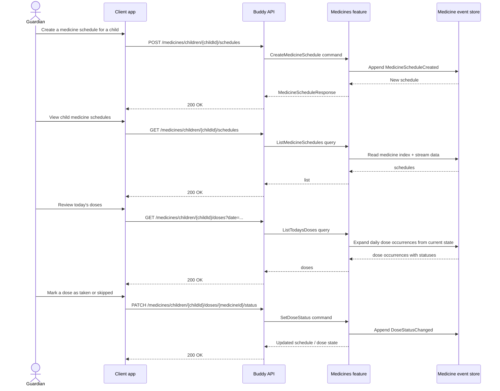

# Medicines Flow

The medicines feature tracks child medication schedules and dose status. It is designed around a daily schedule with multiple times per day, and records the child's actual taken/skipped state for each scheduled dose.

## Endpoints

| Method | Route | Behavior |
| --- | --- | --- |
| `POST` | `/medicines/children/{childId}/schedules` | Creates a medicine schedule for the child. |
| `GET` | `/medicines/children/{childId}/schedules` | Lists active or stopped schedules for the child. |
| `PATCH` | `/medicines/children/{childId}/schedules/{medicineId}/details` | Updates medicine details such as name, dosage, icon, or color. |
| `PATCH` | `/medicines/children/{childId}/schedules/{medicineId}/schedule` | Reschedules the windows or time list for a medicine. |
| `DELETE` | `/medicines/children/{childId}/schedules/{medicineId}` | Stops a medicine schedule. |
| `GET` | `/medicines/children/{childId}/doses` | Lists dose occurrences for a date or date window. |
| `PATCH` | `/medicines/children/{childId}/doses/{medicineId}/status` | Marks a dose as `Taken`, `Skipped`, or `Pending`. |

## Core lifecycle

A medicine schedule is an event-sourced aggregate with its own stream. The timeline starts with `MedicineScheduleCreated`, then uses events such as `MedicineDetailsUpdated`, `MedicineScheduleRescheduled`, `MedicineScheduleStopped`, and `DoseStatusChanged` to track changes. Unlike a generic calendar item, the medicine model deliberately carries domain state that is specific to dosing workflows.

For listing and display, the backend does not persist a generated occurrence list forever. Instead, it recomputes dose occurrences from the aggregate and the dose log for the requested date range. This keeps the schedule state authoritative while allowing the user-facing dose listing to reflect the current schedule and statuses.

## Authorization model

Medicine access is tightly scoped to the guardian-child relationship. The API expects the caller to be authorized as a guardian or child in the relevant relationship before they can create or modify schedules. This is distinct from the more general calendar membership model and prevents medicine schedule data from being treated as a generic shared calendar item.

## Status model

Each dose can resolve to a status of:

- `Pending`
- `Taken`
- `Skipped`

The underlying event log stores only changes from the default. A dose that is effectively pending is implied by absence from the sparse dose log, while any explicit deviation is captured in `DoseStatusChanged` events.
