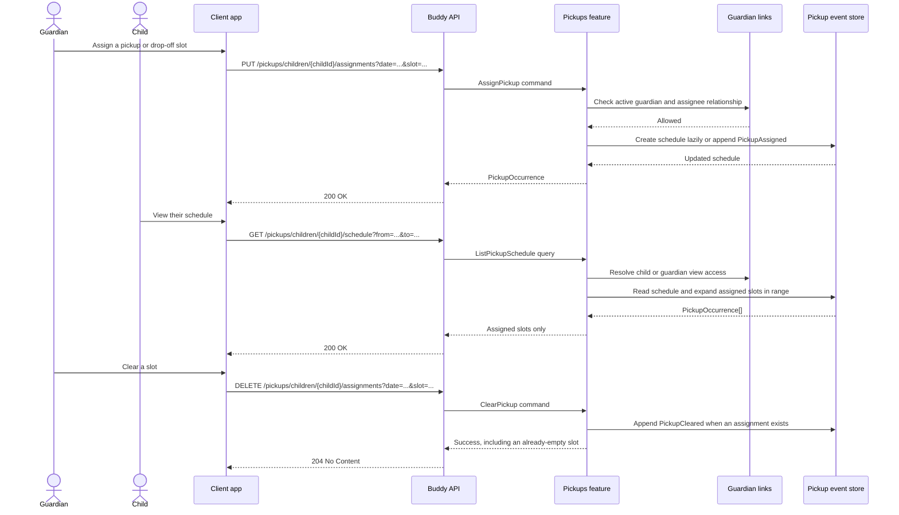

# Pickups Flow

The pickups feature stores a per-child plan for two dated slots: `DropOff` and
`PickUp`. A guardian can assign a guardian, the child themself, a sibling, or a
playdate host to either slot. An absent assignment means “not planned”; an
explicit `SelfEscort` assignment means the guardian deliberately decided that
the child needs no escort.

## Endpoints

| Method | Route | Behavior |
| --- | --- | --- |
| `PUT` | `/pickups/children/{childId}/assignments?date=...&slot=...` | Assigns or replaces one `DropOff` or `PickUp` slot and returns the resulting occurrence. |
| `DELETE` | `/pickups/children/{childId}/assignments?date=...&slot=...` | Clears one slot. Repeating the operation is an idempotent success with `204 No Content`. |
| `GET` | `/pickups/children/{childId}/schedule?from=...&to=...` | Returns assigned occurrences in an inclusive date range of at most 31 days, sorted by date and slot. |

The list response is sparse: it contains no placeholder for an unassigned
slot. Clients construct their week or day grid and treat a missing
`(date, slot)` pair as not planned.

## Assignee model

`AssignPickup` accepts a `Kind` plus fields used by that kind:

| Kind | Required data | Validation |
| --- | --- | --- |
| `Guardian` | `GuardianId` | Must identify an active guardian of the child. |
| `SelfEscort` | None | Records that the child goes without an escort. |
| `Sibling` | `SiblingChildId` | Must be a different child who shares at least one active guardian with the scheduled child. |
| `Playdate` | `PlaydateHostName` | Host name is required; location and contact information are optional free text. |

Every assignment can also carry an optional local wall-clock `Time` and
`Notes`. The backend validates fields that belong to the selected kind and
ignores no relationship checks: changing the discriminator changes which
relationship must be proven.

## Core lifecycle

`PickupSchedule` is an event-sourced aggregate with one stream per child. It is
created lazily on the first assignment rather than when the child account is
provisioned. The stream contains:

- `PickupScheduleCreated`, which establishes the schedule and child.
- `PickupAssigned`, which inserts or replaces `(Date, Slot)` and records its
  before/after assignment for audit.
- `PickupCleared`, which removes an existing key and records who cleared it.

The current aggregate stores assignments in a sparse dictionary. Assigning the
same effective content again is a no-op; replacing an assignment uses another
`PickupAssigned` event rather than a separate reassignment event. Clearing a
missing slot also succeeds without appending an event.

Marten streams are addressed by `PickupScheduleId`, so an inline
`PickupScheduleIndexDocument` maps each child to their schedule. Reads resolve
that index, rehydrate the stream, and expand only assignments inside the
requested date range. Occurrences are recomputed from current aggregate state
and are not persisted as a separate timeline.

## Authorization model

Pickup access has two tiers:

- An active guardian of `childId` can view, assign, replace, and clear slots.
- The child identified by `childId` can view their own schedule but cannot
  assign or clear slots.

An authenticated caller with no active relationship to the child receives
`404 Not Found`, preserving the privacy of the schedule. A child attempting a
write receives `403 Forbidden`. Invalid assignment fields or an invalid date
range receive `400 Bad Request`; successful assignment and listing return
`200 OK`, and successful clearing returns `204 No Content`.

See [Pickup and drop-off schedules](../analysis/pickup-schedules.md) for the
design decisions behind the per-child aggregate, flat assignee discriminator,
relationship checks, and deferred recurrence/time-zone questions.
