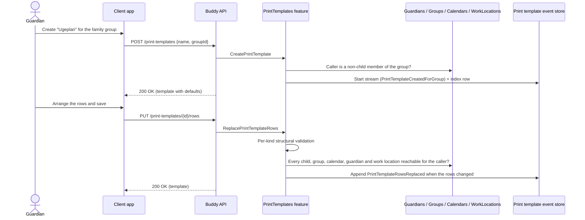

# Print Templates Flow

A print template is the saved layout of a printable week plan: paper size (A4
or A3, always landscape), the default start weekday, and an ordered list of
rows, each with a kind (meal, pickup, work location, calendar marker,
calendar events, task checklist, blank) and what it reads from. The design is in
[week-plan-print-templates.md](../analysis/week-plan-print-templates.md).

A template stores references, never data. At print time the frontend fetches
every row through that feature's own endpoint, which authorizes whoever is
printing; a row they can't read degrades to "not available".

## Endpoints

| Method | Route | Behavior |
| --- | --- | --- |
| `POST` | `/print-templates` | Creates a template owned by the caller, or by `groupId` when given. |
| `GET` | `/print-templates` | Lists the caller's own and their groups' templates, ordered by name. |
| `GET` | `/print-templates/{templateId}` | The full template. |
| `PATCH` | `/print-templates/{templateId}/name` | Renames it (also updates the list index). |
| `PATCH` | `/print-templates/{templateId}/layout` | `paperSize` (`0` A4, `1` A3), `defaultStartWeekday` (`0` Sunday … `6` Saturday), `showWeekNumber`. |
| `PUT` | `/print-templates/{templateId}/rows` | Replaces the whole ordered row list (1–12 rows). |
| `PUT` | `/print-templates/{templateId}/colors` | Replaces the guardian name colors. |
| `PUT` | `/print-templates/{templateId}/babysitter-colors` | Replaces the babysitter name colors (`guardianId` + `babysitterId` per entry). |
| `DELETE` | `/print-templates/{templateId}` | Deletes it; it then reads as missing everywhere. |

Row kinds travel as `PrintRowKind` names: `Meal`, `Pickup`, `WorkLocation`,
`CalendarMarker`, `CalendarEvents`, `TaskChecklist`, `Blank`. A row only sets the fields its kind uses; see the table in the
design doc's Question 3.

## Authorization model

- One tier, **Manage**: the owner of a personal template, or any non-child
  member of the owning group. Everyone else gets `404`.
- Children can't create templates (`403`) and see none.
- Write-time reference checks run as the caller and only catch mistakes; they
  grant nothing.
