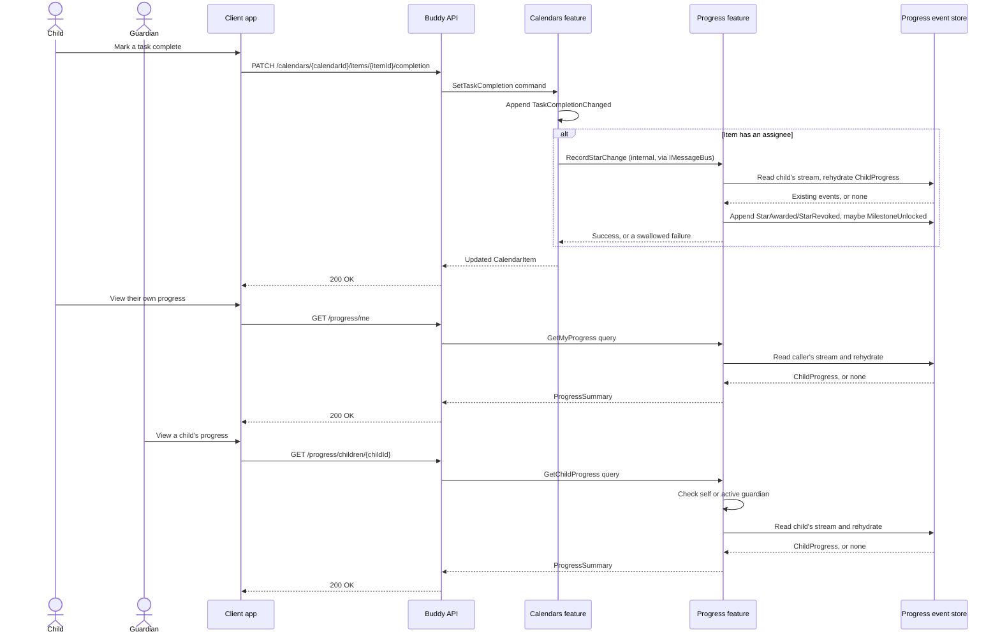

# Progress Flow

The progress feature tracks a per-child star count and unlocked milestones,
earned as a side effect of completing tasks in the `Calendars` feature.
Unlike every other domain in this codebase, Progress has no write endpoint of
its own: the only way a `ChildProgress` aggregate changes is an internal call
from `SetTaskCompletionHandler`, made after that handler's own event has
already been appended.

## Endpoints

| Method | Route | Behavior |
| --- | --- | --- |
| `GET` | `/progress/me` | Returns the caller's own star count and unlocked milestones. Self-only: it always resolves the child from the caller's own claims. |
| `GET` | `/progress/children/{childId}` | Returns one named child's star count and unlocked milestones. Read-only guardian-facing view; see "Authorization model" below. |

There is no `POST`/`PATCH` write endpoint in this feature. A star is never
awarded or revoked by a client calling Progress directly — see "Core
lifecycle."

## Core lifecycle

`RecordStarChange` is not an HTTP endpoint. It is an internal command,
invoked via `IMessageBus.InvokeAsync` from `SetTaskCompletionHandler` in the
`Calendars` feature, after `TaskCompletionChanged` has already been appended
to the calendar item's own stream, and only when the item has an assignee
(`item.AssignedTo`). The call is wrapped in a `try/catch` that deliberately
swallows a failure: the task completion itself has already succeeded and is
not rolled back, so a failed star update just leaves the child's count stale
until the next successful, idempotent completion change catches it up. This
mirrors the two-write, not-a-transaction shape the `GuardianLink` decision
already established for cross-feature calls elsewhere in this codebase.

`ChildProgress` is an event-sourced aggregate with one stream per child, keyed
by `ProgressId.Value == ChildId.Value`. Unlike most aggregates in this
codebase, no index document maps a domain ID to a child — the relationship is
already 1:1, so the child's own `UserId` is reused directly as the stream ID.
The stream is created lazily on the first star, not when the child account is
provisioned. It contains:

- `ProgressStarted`, appended once, establishing the aggregate and its child.
- `StarAwarded`, appended on a `false→true` completion transition, keyed by
  `(ItemId, OccurrenceDate, SubtaskId)`.
- `StarRevoked`, appended on a `true→false` transition for the same key,
  mirroring `TaskCompletionChanged`'s own `Before`/`After` toggle semantics
  rather than a separate "undo" event.
- `MilestoneUnlocked`, appended when `TotalStars` newly reaches a threshold
  in the fixed list `[5, 10, 25, 50, 100]`, checked at write time.

`AwardedOccurrences` is a sparse set keyed by item, occurrence date, and
optional subtask, so a plain task and each independently-completable subtask
of a template-scheduled task earn and revoke their own star. Re-awarding an
already-awarded key, or re-revoking a key that isn't currently awarded, is a
no-op: `RecordStarChangeHandler` compares `command.IsCompleted` against
whether the occurrence is already in `AwardedOccurrences` before appending
anything, the same before/after guard `SetTaskCompletionHandler` already
applies to `TaskCompletionChanged`.

## Authorization model

Both read endpoints require an authenticated caller. Access is a single tier,
unlike the Mark/Manage split some other domains use:

- The child identified by `childId` (or, for `/progress/me`, the caller
  themself) can always view their own progress.
- An active guardian of that child can also view it.

There is no guardian write action on a child's progress — no redemption, no
manual adjustment — so "self or an active guardian" is the entire check for
now. A caller with neither relationship receives `404 Not Found`, collapsing
"no such child" and "not your child" the same way other domains in this
codebase already do. A child or guardian with no progress stream yet
(nothing completed) receives `200 OK` with zero stars and no milestones,
never `404 Not Found` — an empty progress history is not an error.

## Key event types

- `ProgressStarted` — starts a child's stream on their first completion.
- `StarAwarded` — one star for one `(ItemId, OccurrenceDate, SubtaskId)`.
- `StarRevoked` — removes the star for that same key.
- `MilestoneUnlocked` — records a fixed threshold newly crossed.

See [Gamified progress for children's tasks](../analysis/gamified-progress.md)
for the design rationale behind the dedicated aggregate, the explicit
synchronous call instead of a projection, the 1:1 stream-ID shortcut, and
what is deliberately out of scope for v1 (dose gamification, reward
redemption, sibling comparisons, and guardian write controls).
