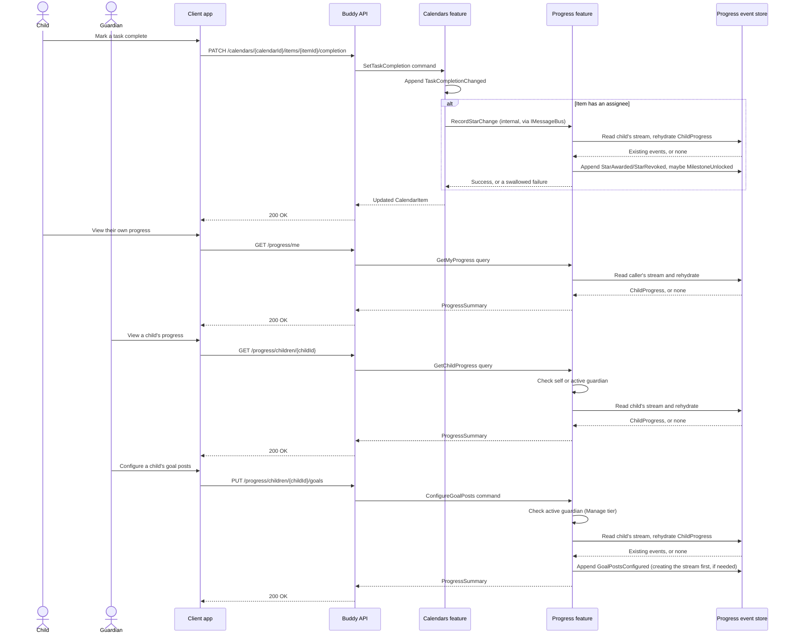

# Progress Flow

The progress feature tracks a per-child star count and unlocked milestones,
earned as a side effect of completing tasks in the `Calendars` feature. A
guardian can also configure the ordered list of goal posts (threshold, icon,
optional label) a child progresses through — the one guardian *write* action
in this feature — see
[Configurable goal posts for progress](../analysis/configurable-goal-posts.md).
The only way a `ChildProgress` aggregate changes from stars is an internal
call from `SetTaskCompletionHandler`, made after that handler's own event has
already been appended; goal posts change directly, via the endpoint below.

## Endpoints

| Method | Route | Behavior |
| --- | --- | --- |
| `GET` | `/progress/me` | Returns the caller's own star count, unlocked milestones, and resolved goal-post info. Self-only: it always resolves the child from the caller's own claims. |
| `GET` | `/progress/children/{childId}` | Returns one named child's star count, unlocked milestones, and resolved goal-post info. Read-only guardian-facing view; see "Authorization model" below. |
| `PUT` | `/progress/children/{childId}/goals` | Guardian-only. Replaces the child's full ordered list of goal posts (`Threshold`, `Icon`, optional `Label`). Full-replace, not a partial update; see "Authorization model" below. |

`RecordStarChange` (see "Core lifecycle") is still an internal command, not
an HTTP endpoint — a star is never awarded or revoked by a client calling
Progress directly.

## Core lifecycle

`RecordStarChange` is not an HTTP endpoint. It is an internal command,
invoked via `IMessageBus.InvokeAsync` from `SetTaskCompletionHandler` in the
`Calendars` feature, after `TaskCompletionChanged` has already been appended
to the calendar item's own stream, and only when the item has an assignee
(`item.AssignedTo`). The call is wrapped in a `try/catch` that deliberately
swallows a failure: the task completion itself has already succeeded and is
not rolled back, so a failed star update just leaves the child's count stale
until the next successful, idempotent completion change catches it up. This
mirrors the two-write, not-a-transaction shape the `GuardianLink` decision
already established for cross-feature calls elsewhere in this codebase.

`ChildProgress` is an event-sourced aggregate with one stream per child, keyed
by `ProgressId.Value == ChildId.Value`. Unlike most aggregates in this
codebase, no index document maps a domain ID to a child — the relationship is
already 1:1, so the child's own `UserId` is reused directly as the stream ID.
The stream is created lazily on the first star (or the first goal-post
configuration, if that happens before any star does), not when the child
account is provisioned. It contains:

- `ProgressStarted`, appended once, establishing the aggregate and its child.
- `StarAwarded`, appended on a `false→true` completion transition, keyed by
  `(ItemId, OccurrenceDate, SubtaskId)`.
- `StarRevoked`, appended on a `true→false` transition for the same key,
  mirroring `TaskCompletionChanged`'s own `Before`/`After` toggle semantics
  rather than a separate "undo" event.
- `MilestoneUnlocked`, appended when `TotalStars` newly reaches a threshold
  resolved by `GoalPostResolver` — the child's own configured goal posts if
  any exist, extrapolated indefinitely past the last one, or else the
  original fixed `[5, 10, 25, 50, 100]` scale — checked at write time.
- `GoalPostsConfigured`, appended by the guardian-only `ConfigureGoalPosts`
  command, carrying the complete replacement list of goal posts (full
  replace, not a partial update — see
  [configurable-goal-posts.md](../analysis/configurable-goal-posts.md)).

`AwardedOccurrences` is a sparse set keyed by item, occurrence date, and
optional subtask, so a plain task and each independently-completable subtask
of a template-scheduled task earn and revoke their own star. Re-awarding an
already-awarded key, or re-revoking a key that isn't currently awarded, is a
no-op: `RecordStarChangeHandler` compares `command.IsCompleted` against
whether the occurrence is already in `AwardedOccurrences` before appending
anything, the same before/after guard `SetTaskCompletionHandler` already
applies to `TaskCompletionChanged`.

## Authorization model

All three endpoints require an authenticated caller. `ProgressAuthorization`
resolves a two-tier access level, mirroring `MedicineAuthorization`'s
Mark/Manage split:

- **View** — the child identified by `childId` (or, for `/progress/me`, the
  caller themself) can always view their own progress; an active guardian of
  that child can also view it.
- **Manage** — only an active guardian can configure goal posts. A child
  attempting to call `ConfigureGoalPosts` on themself has View but not
  Manage, so the endpoint returns `403 Forbidden` rather than `404`.

A caller with no relationship to the child at all (neither View nor Manage)
receives `404 Not Found`, collapsing "no such child" and "not your child"
the same way other domains in this codebase already do. A child or guardian
with no progress stream yet (nothing completed, no goal posts configured)
receives `200 OK` with zero stars and no milestones, never `404 Not Found`
— an empty progress history is not an error.

## Key event types

- `ProgressStarted` — starts a child's stream on their first completion or
  first goal-post configuration.
- `StarAwarded` — one star for one `(ItemId, OccurrenceDate, SubtaskId)`.
- `StarRevoked` — removes the star for that same key.
- `MilestoneUnlocked` — records a goal-post threshold newly crossed.
- `GoalPostsConfigured` — guardian-authored, full-replace list of goal
  posts (`Threshold`, `Icon`, optional `Label`).

See [Gamified progress for children's tasks](../analysis/gamified-progress.md)
for the design rationale behind the dedicated aggregate, the explicit
synchronous call instead of a projection, and the 1:1 stream-ID shortcut, and
[Configurable goal posts for progress](../analysis/configurable-goal-posts.md)
for the guardian-write goal-post design covered above. Dose gamification,
reward redemption, and sibling comparisons remain out of scope.
