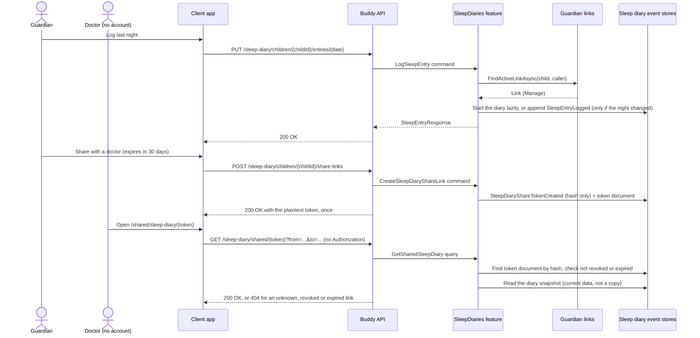

# Sleep Diary Flow

The sleep diary is a guardian's night-by-night record of a child's sleep, with the same fields as a
sleep clinic's paper registration form, plus a revocable link that lets a doctor read it without a
Buddy account. Design: [sleep-diary.md](../analysis/sleep-diary.md).

Two aggregates in the `sleepdiaries` schema:

- `SleepDiary`: one stream per child, with `SleepDiaryId.Value == ChildId.Value` (no index
  document, same as `ChildProgress`). It is created lazily by the first logged night or hygiene
  note. `Entries` is a sparse `DateOnly -> SleepEntry` map; `SleepHygieneNotes` is diary-wide.
- `SleepDiaryShareToken`: one stream per share link (UUIDv7 id). Only the SHA-256 hash of the
  token is stored. `SleepDiaryShareTokenDocument` indexes it by hash (for the anonymous read) and by
  child (for the guardian's list), and is flipped to revoked in the same transaction as the event.

Only an active guardian of the child has access. Everyone else, including the child, gets `404`.

## Endpoints

| Method | Route | Behavior |
| --- | --- | --- |
| `PUT` | `/sleep-diary/children/{childId}/entries/{date}` | Logs one night. Always overwrites the whole day; every field is optional. Saving identical content appends nothing. |
| `DELETE` | `/sleep-diary/children/{childId}/entries/{date}` | Clears one night. Idempotent: `204` when nothing was logged. |
| `PUT` | `/sleep-diary/children/{childId}/hygiene-notes` | Sets the diary-wide sleep hygiene notes (`""` clears them). |
| `GET` | `/sleep-diary/children/{childId}/entries?from=...&to=...` | The hygiene notes plus the nights logged in an inclusive range of at most 92 days, sorted by date. Sparse: a night not logged is absent. |
| `POST` | `/sleep-diary/children/{childId}/share-links` | Creates a share link with an optional `expiresAt` (future, at most 365 days away). Returns the plaintext token once. |
| `GET` | `/sleep-diary/children/{childId}/share-links` | The live links (not revoked, not expired), newest first. Never the tokens. |
| `DELETE` | `/sleep-diary/children/{childId}/share-links/{shareLinkId}` | Revokes a link. Idempotent. A link of another child is `404`. |
| `GET` | `/sleep-diary/shared/{token}?from=...&to=...` | Anonymous. The child's name, the range, the link's expiry, the hygiene notes and the logged nights. Without `from`/`to`, the last 14 days ending today. |

## Entry shape

| Field | Type | Notes |
| --- | --- | --- |
| `routineStartTime`, `ritualStartTime`, `ritualEndTime`, `bedTime`, `fellAsleepTime`, `morningWakeTime` | `TimeOnly?` | Wall-clock times; no ordering is enforced (a night crosses midnight). |
| `nightWakeUps`, `naps` | `{ startTime, durationMinutes }[]` | At most 20 each; a duration is 1-720 minutes. Stored as `TimeSpan`. |
| `isTired` | `bool` | Defaults to `false`. |
| `totalSleepMinutes` | `int?` | 0-1440. Entered by the guardian (the app suggests one); never checked against the times. |
| `remarks` | `string` | At most 2000 characters; `""` for none. |
| `isWeekend`, `loggedBy`, `date` | response only | `isWeekend` is derived from the date, never stored. |

## Events

`SleepDiaryStarted`, `SleepEntryLogged` (`Before`/`After`), `SleepEntryCleared` (`Before`),
`SleepHygieneNotesUpdated` (`Before`/`After`), `SleepDiaryShareTokenCreated` (hash, optional
`ExpiresAt`), `SleepDiaryShareTokenRevoked`. Golden files:
`buddy.IntegrationTests/EventShapeTests/GoldenFiles/SleepDiaries/`.
