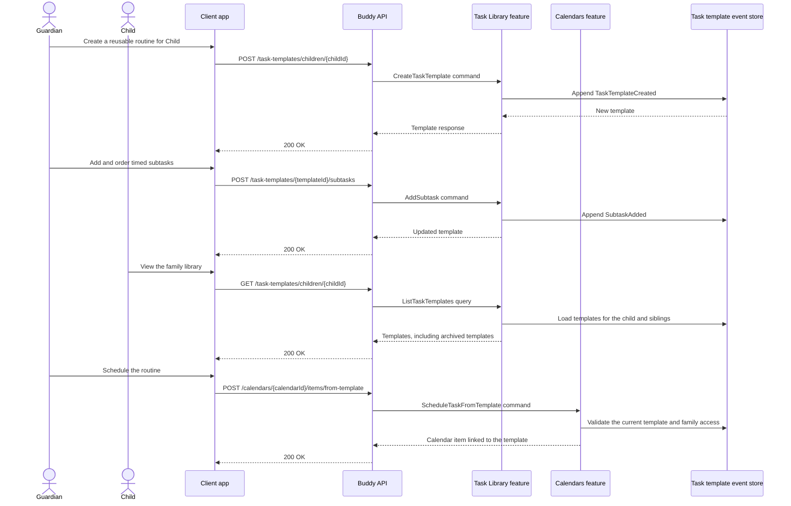

# Task Library Flow

The task library lets a guardian define reusable routines as ordered task
templates with timed subtasks. Templates are shared across siblings who have an
active guardian in common. A child can view the family library, while only an
active guardian can create or change it.

## Endpoints

| Method | Route | Behavior |
| --- | --- | --- |
| `POST` | `/task-templates/children/{childId}` | Creates a template in the child's family library. |
| `GET` | `/task-templates/children/{childId}` | Lists the family's templates by name, including archived templates and their subtasks. |
| `PATCH` | `/task-templates/{templateId}` | Updates a template's name, icon, and color. |
| `DELETE` | `/task-templates/{templateId}` | Archives a template and blocks new scheduling. |
| `POST` | `/task-templates/{templateId}/subtasks` | Adds a timed subtask, optionally at a requested position. |
| `PATCH` | `/task-templates/{templateId}/subtasks/{subtaskId}` | Updates a subtask's title, optional icon, and duration. |
| `DELETE` | `/task-templates/{templateId}/subtasks/{subtaskId}` | Removes a subtask. |
| `PUT` | `/task-templates/{templateId}/subtasks/order` | Reorders subtasks; the new order must contain each current subtask ID exactly once. |
| `POST` | `/calendars/{calendarId}/items/from-template` | Schedules a non-empty, active family template as a specific-time calendar task. |

Template and subtask names must be non-empty and at most 200 characters.
Subtask durations must be positive. Each template response includes the ordered
subtasks, their total duration, archive state, and creator/modifier IDs; there
is no separate endpoint for loading one template.

## Core lifecycle

`TaskTemplate` is event-sourced. Its stream begins with
`TaskTemplateCreated`, then records detail updates, subtask additions, updates,
removals and reordering. `TaskTemplateArchived` is a soft delete. Archived
templates remain visible in library listings and cannot be edited or scheduled
again.

A template is indexed under the child through whom it was created, but family
visibility is resolved on every request from active guardian links. Siblings
with at least one active guardian in common therefore see the same library
without duplicate index records or a persisted household aggregate.

Scheduling stores the template ID on the calendar item rather than copying the
subtasks. Occurrence listing and iCal generation load the current template and
produce one consecutive timed occurrence per subtask, starting at the scheduled
time. Later subtask edits therefore affect existing scheduled routines.
Archiving a template only prevents new schedules; already scheduled routines
continue to expand.

## Authorization model

The child named by `childId` and their active guardians can view the family
library. Only an active guardian can create, update, archive, reorder, add, or
remove template content. Scheduling also requires contributor access to the
target calendar, and the selected template must belong to the family resolved
from the assignee, or from the caller when the task is unassigned.

## Key event types

- `TaskTemplateCreated`
- `TaskTemplateDetailsUpdated`
- `SubtaskAdded`
- `SubtaskUpdated`
- `SubtaskRemoved`
- `SubtasksReordered`
- `TaskTemplateArchived`
