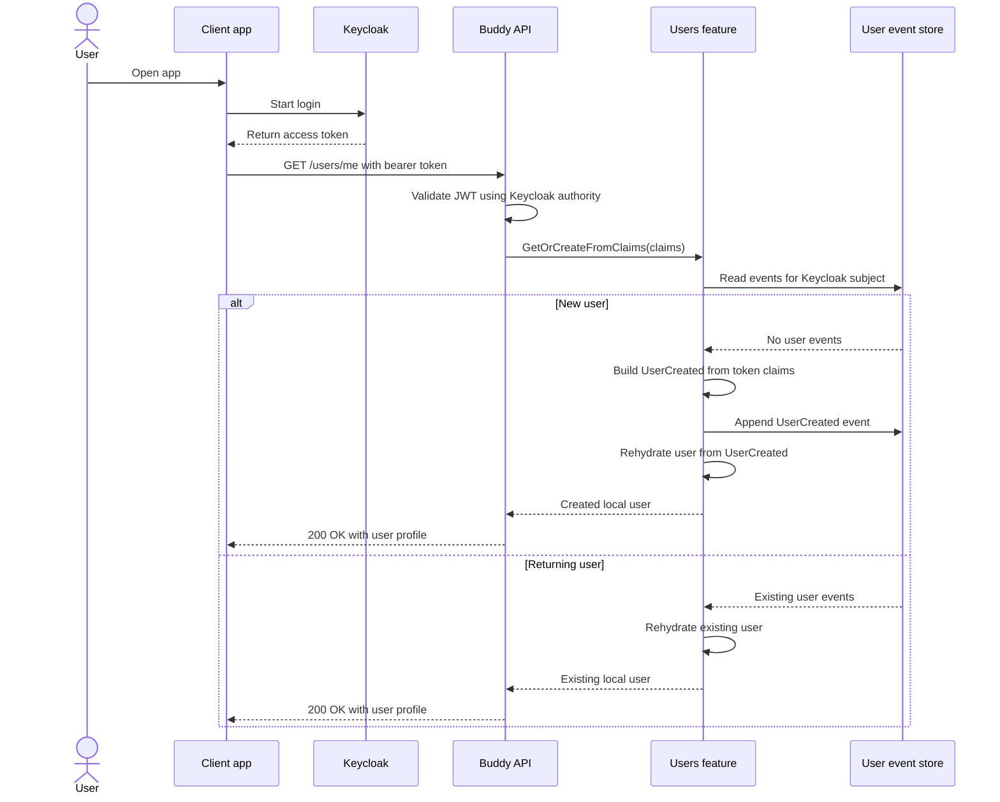

# Users Flow

The users feature authenticates requests with Keycloak and creates a local user from the authenticated claims the first time that Keycloak subject reaches the backend.

```mermaid
sequenceDiagram
    actor User
    participant App as Client app
    participant Keycloak
    participant API as Buddy API
    participant Users as Users feature
    participant Store as User event store

    User->>App: Open app
    App->>Keycloak: Start login
    Keycloak-->>App: Return access token
    App->>API: GET /users/me with bearer token
    API->>API: Validate JWT using Keycloak authority
    API->>Users: GetOrCreateFromClaims(claims)
    Users->>Store: Read events for Keycloak subject

    alt New user
        Store-->>Users: No user events
        Users->>Users: Build UserCreated from token claims
        Users->>Store: Append UserCreated event
        Users->>Users: Rehydrate user from UserCreated
        Users-->>API: Created local user
        API-->>App: 200 OK with user profile
    else Returning user
        Store-->>Users: Existing user events
        Users->>Users: Rehydrate existing user
        Users-->>API: Existing local user
        API-->>App: 200 OK with user profile
    end
```
