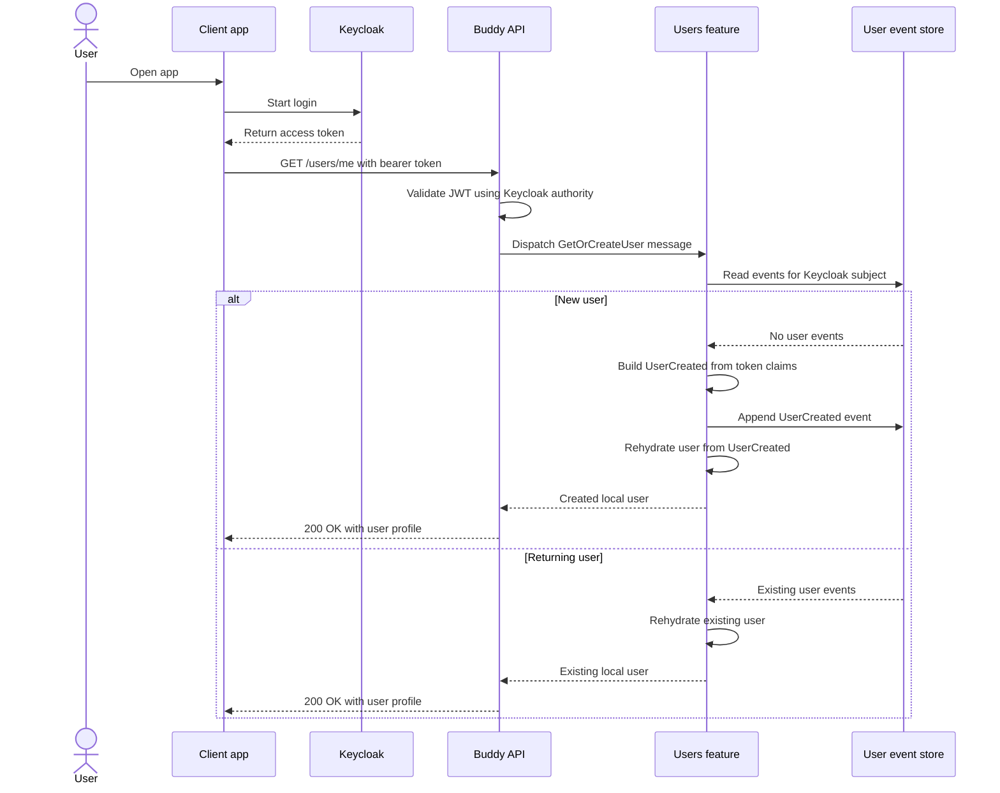

# Users Flow

The users feature authenticates requests with Keycloak and uses the authenticated Keycloak subject as the stable identity for a local, event-sourced user. The first request for a subject creates a local user from the token claims. Later requests rehydrate that user from its event stream.

## Endpoints

All users endpoints require a bearer token issued by the configured Keycloak authority and are included in the `users` OpenAPI document.

| Method | Route | Behavior |
| --- | --- | --- |
| `GET` | `/users/me` | Gets or creates the local user for the authenticated Keycloak subject. Returns `404 Not Found` when the user has been deleted. |
| `GET` | `/users/me/events` | Returns a page of the persisted event history for the authenticated subject, oldest first. Accepts optional `cursor` and `pageSize` (default 50, max 200) query parameters; an unknown subject has an empty event history. |
| `DELETE` | `/users/me` | Appends `UserDeleted` for an existing, active user. Repeating the request is a no-op and returns `204 No Content`. |

The API passes work to Wolverine handlers rather than accessing the event store directly from the endpoint. The handlers are responsible for looking up the user stream, creating or rehydrating the aggregate, and appending deletion events.

## User Events

The user stream currently supports these event types:

- `UserCreated`
- `UserDeleted`
- `NameUpdated`
- `EmailUpdated`
- `EmailVerified`

The user profile is built from `UserCreated`; `UserDeleted` marks the rehydrated user as deleted. The other event types are registered for persistence and are returned by the event-history endpoint.

### Event-history pagination

The event-history endpoint paginates by the event's stream version rather than an offset, so pages stay stable even as new events are appended. The response includes a `nextCursor`, an opaque token wrapping the version of the last returned event; pass it back as the `cursor` query parameter to fetch the next page. `nextCursor` is `null` once the last page has been returned.
