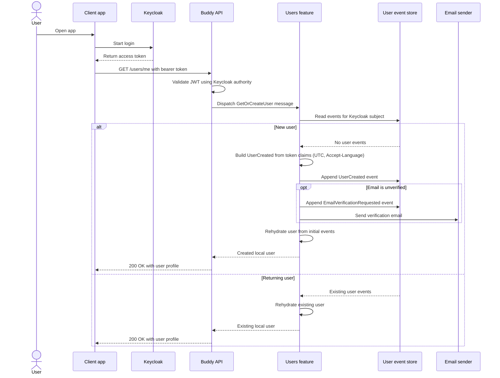

# Users Flow

The users feature authenticates requests with Keycloak and uses the authenticated Keycloak subject as the stable identity for a local, event-sourced user. The first request for a subject creates a local user from the token claims. Later requests rehydrate that user from its event stream.

```mermaid
sequenceDiagram
    actor User
    participant App as Client app
    participant Keycloak
    participant API as Buddy API
    participant Users as Users feature
    participant Store as User event store
    participant Email as Email sender

    User->>App: Open app
    App->>Keycloak: Start login
    Keycloak-->>App: Return access token
    App->>API: GET /users/me with bearer token
    API->>API: Validate JWT using Keycloak authority
    API->>Users: Dispatch GetOrCreateUser message
    Users->>Store: Read events for Keycloak subject

    alt New user
        Store-->>Users: No user events
        Users->>Users: Build UserCreated from token claims (UTC, Accept-Language)
        Users->>Store: Append UserCreated event
        opt Email is unverified
            Users->>Store: Append EmailVerificationRequested event
            Users->>Email: Send verification email
        end
        Users->>Users: Rehydrate user from initial events
        Users-->>API: Created local user
        API-->>App: 200 OK with user profile
    else Returning user
        Store-->>Users: Existing user events
        Users->>Users: Rehydrate existing user
        Users-->>API: Existing local user
        API-->>App: 200 OK with user profile
    end
```

## Endpoints

All users endpoints require a bearer token issued by the configured Keycloak authority and are included in the `users` OpenAPI document.

| Method | Route | Behavior |
| --- | --- | --- |
| `GET` | `/users/me` | Gets or creates the local user for the authenticated Keycloak subject. Returns `404 Not Found` when the user has been deleted. |
| `GET` | `/users/me/events` | Returns a page of the persisted event history for the authenticated subject, oldest first. Accepts optional `cursor` and `pageSize` (default 50, max 200) query parameters; an unknown subject has an empty event history. |
| `PATCH` | `/users/me/name` | Updates the authenticated user's given and family name. Returns the updated profile, or `404 Not Found` when no local user exists. |
| `PATCH` | `/users/me/email` | Changes the authenticated user's email and starts email verification; submitting the current email is a no-op. Returns the updated profile, or `404 Not Found` when no local user exists. |
| `PATCH` | `/users/me/timezone` | Sets the authenticated user's preferred IANA time zone, used to format timestamps for them. Returns the updated profile, `404 Not Found` when no local user exists, or `400 Bad Request` for an unrecognized time zone identifier. |
| `PATCH` | `/users/me/language` | Sets the authenticated user's preferred display language. Returns the updated profile, `404 Not Found` when no local user exists, or `400 Bad Request` for an unsupported language code. |
| `POST` | `/users/me/email/verify/resend` | Sends another verification email for an unverified address. Returns `204 No Content` for a sent email or an already verified address, `404 Not Found` when no local user exists, or `409 Conflict` during the resend cooldown. |
| `POST` | `/users/me/email/verify` | Verifies the email using the submitted token. Returns the updated profile, `404 Not Found`, or `400 Bad Request` for an invalid or expired token. |
| `GET` | `/users/me/deletion-preview` | What `DELETE /users/me` would also take with it: children with no other guardian (`childrenErased`), owned groups that pass to another member (`groupsHandedOver`, with the new owner), and owned groups nobody else is in (`groupsDeleted`). Changes nothing. |
| `DELETE` | `/users/me` | Locks the user out (`UserDeleted` plus the `KeycloakIdentity`'s `Deleted` flag, in one transaction), then erases them across Buddy and cascades: children with no other guardian are erased too, owned groups pass to the longest-standing admin, the Keycloak account is deleted, the user stream is masked and `UserErased` appended ([gdpr-data-protection.md](../analysis/gdpr-data-protection.md)). From then on the token gets `403 user_not_provisioned` everywhere (a repeated `DELETE` included) and `GET /users/me` answers `404`. Returns `204 No Content`, or `403` for a child account. |

The API passes work to Wolverine handlers rather than accessing the event store directly from the endpoint. The handlers are responsible for looking up the user stream, creating or rehydrating the aggregate, and appending deletion events.

## User Events

The user stream currently supports these event types:

- `UserCreated`
- `UserDeleted`
- `UserErased`
- `NameUpdated`
- `EmailUpdated`
- `EmailVerificationRequested`
- `EmailVerified`
- `TimeZoneUpdated`
- `LanguageUpdated`

The user profile is built from `UserCreated`; `UserDeleted` marks the rehydrated user as deleted. Changing an email appends `EmailUpdated` and starts a new verification request; submitting the existing email leaves the stream unchanged. Verification requests store only a hash of the token in the event stream; the plaintext token is sent through the configured email sender. The user's `EmailVerification` is `None` or `Pending` (token hash, requested-at, expires-at); `EmailVerificationRequested` sets it, and `EmailVerified` and `EmailUpdated` clear it. `UserCreated` carries the user's starting `TimeZoneId` and `Language`: on first sign-in, `GetOrCreateUserHandler` uses UTC and resolves the browser's `Accept-Language` header against the supported language set (English, Danish, defaulting to English); a child created by a guardian starts on that guardian's time zone and language. `TimeZoneUpdated` and `LanguageUpdated` record later changes. `UserName` is the `preferred_username` claim, or the Keycloak subject when the token has none. All event types are registered for persistence and are returned by the event-history endpoint.

### Event-history pagination

The event-history endpoint paginates by the event's stream version rather than an offset, so pages stay stable even as new events are appended. The response includes a `nextCursor`, an opaque token wrapping the version of the last returned event; pass it back as the `cursor` query parameter to fetch the next page. `nextCursor` is `null` once the last page has been returned.
