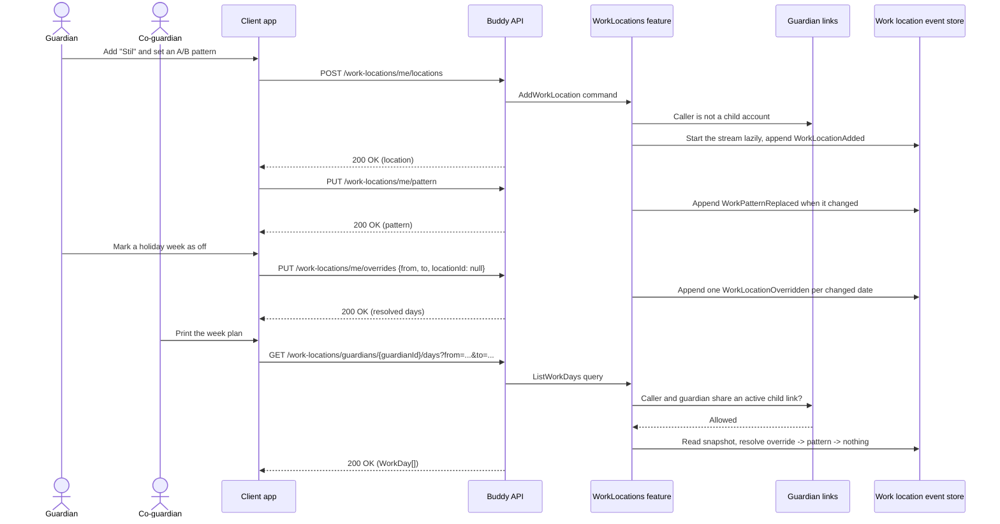

# Work Locations Flow

The work locations feature records where a guardian works on each day, so the
printable week plan can fill rows like "Far på Stil" and "Mor i Randers". Each
guardian keeps their own customizable locations (name, icon, color), a
repeating weekly pattern of 1–4 weeks, and per-date overrides. The design is in
[work-locations.md](../analysis/work-locations.md).

Work locations are never visible to children and never appear in calendars or
iCal feeds.

## Endpoints

| Method | Route | Behavior |
| --- | --- | --- |
| `POST` | `/work-locations/me/locations` | Adds a location (name, icon, color). Names are unique among active locations, case-insensitive; at most 12 active. |
| `PATCH` | `/work-locations/me/locations/{locationId}` | Changes name, icon and color together. Unchanged details append nothing. |
| `DELETE` | `/work-locations/me/locations/{locationId}` | Archives the location and removes it from the pattern in the same append. Overrides that use it keep resolving with `isArchived: true`. |
| `PUT` | `/work-locations/me/pattern` | Replaces the whole pattern: `cycleWeeks` (1–4), `anchorMonday`, and `days` of `{week, day, locationId}`. Stored sorted by week and weekday. |
| `PUT` | `/work-locations/me/overrides` | Sets `[from, to]` to one location, or to "off" with `locationId: null`. Returns the resolved days. |
| `DELETE` | `/work-locations/me/overrides?from=...&to=...` | Clears overrides in the range so those days follow the pattern again. Idempotent. |
| `GET` | `/work-locations/guardians/{guardianId}` | Locations (archived included) and the pattern. No stream yet reads as an empty one-week pattern. |
| `GET` | `/work-locations/guardians/{guardianId}/days?from=...&to=...` | One `WorkDay` per date with the location inlined and its `source` (`0` none, `1` pattern, `2` override). |

Ranges are inclusive and limited to `to - from` ≤ 31 days.

## Authorization model

- **Manage** is always the caller: every write route is a `/me` route. Child
  accounts get `403`.
- **View** is the guardian themself or a co-guardian, meaning anyone with an
  active `GuardianLink` to at least one of the same children. It is computed
  on every request, so revoking a link removes access immediately.
- Everyone else, children included, gets `404`.
