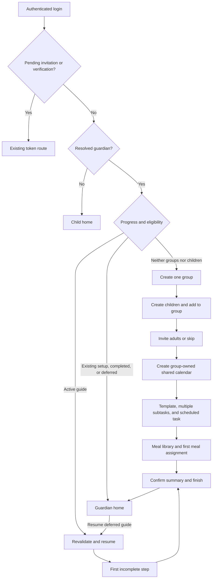

# Guardian onboarding -- implementation plan
Status: Proposed (not yet implemented)

## Goal

When a guardian logs in with no groups and no linked children, show a guided
setup flow rather than an empty dashboard. Guide them through creating one
group, adding one or more children, optionally inviting other parents or
guardians, creating a shared calendar, scheduling a simple task with multiple
subtasks, and setting up a meal plan. This document is a plan for later
implementation, not a description of shipped behavior.

## Context and precedents

The existing domain services already support the setup actions:

- [GroupsService](../../../src/frontend/buddy/src/app/core/groups.service.ts)
  creates groups, adds children, manages invitations, and exposes sharing policies.
- [GuardiansService](../../../src/frontend/buddy/src/app/core/guardians.service.ts)
  lists linked children, creates child accounts, and invites additional guardians.
- [CalendarsService](../../../src/frontend/buddy/src/app/core/calendars.service.ts)
  creates group-owned calendars and schedules tasks from templates.
- [Task library](task-library.md) documents per-child templates with ordered,
  timed subtasks and their scheduling onto a calendar.
- [MealplansService](../../../src/frontend/buddy/src/app/core/mealplans.service.ts)
  creates meals, assigns meal-plan slots, and shares a family's plan with a group.

The [role redirect guard](../../../src/frontend/buddy/src/app/core/role.guard.ts)
currently completes login, provisions the user, honors pending invitation and
email-verification links, then redirects by role.
[AccountService](../../../src/frontend/buddy/src/app/core/account.service.ts)
derives a child role from active guardian links; having no linked children does
not by itself distinguish a guardian from a child account.

## Scope decision

**Decision: build a guardian-only, step-by-step workflow over the existing
domain APIs, with a small user-scoped progress capability.**

The guide creates real resources using the same validation and authorization
as administration screens. It is not a demo, a tooltip tour, or a second family
domain model. Existing users with either groups or children do not enter the
guide automatically. Child accounts never enter it.

A single transactional "create family" endpoint is considered and rejected:
child provisioning involves Keycloak, invitations involve email, and the
existing writes cannot be treated as one rollback-safe transaction.

## Entry and resume rules

**Decision: automatic first entry requires a resolved guardian role, zero
groups, and zero linked children; an already-started guide resumes separately.**

Evaluate `GroupsService.listMyGroups()` and
`GuardiansService.listMyChildren()` only after authentication and successful
user provisioning. Both reads must succeed. An error is not an empty result.

| Account state | Destination |
|---|---|
| Unauthenticated | Existing login flow |
| Pending group invite, guardian invite, or email verification | Existing token route first |
| Resolved child role | Existing child home |
| Guardian, no progress record, both lists empty | Onboarding |
| Guardian, no progress record, either list non-empty | Existing guardian home |
| Guardian, active guide with accessible saved resources | Resume first incomplete step |
| Guardian, completed or explicitly deferred guide | Guardian home, with a resume entry for a deferred guide |
| Provisioning, role, eligibility, or progress lookup fails | Retryable error; do not create resources or infer eligibility |

Add a proposed `/guardian/onboarding` route. Check entry at the guardian home
boundary as well as the post-login redirect so direct visits to `/guardian`
do not bypass onboarding. Do not redirect all guardian routes: invitation
handling, administration, and ordinary navigation must remain available.

Creating the first group makes the original eligibility predicate false.
Therefore, checking only "no groups and no children" on every visit is
considered and rejected: it would abandon the guide after its first step.

## Guided steps

**Decision: use one focused form per step, with Back, Continue, and a deliberate
finish-later action. Only invitations are optional within the full journey.**

Show a compact progress indicator and preserve entered values when moving
back. Do not preload real sample resources or silently send invitations.
Success means persisted domain data, not just a visited screen.

| Step | Form and action | Completion condition |
|---|---|---|
| 1. Group | Enter a group name and call `createGroup`. Keep this group selected for the rest of setup. | One group created and its ID saved |
| 2. Children | Enter the existing child-account fields (given name, family name, username), call `createChild`, then `addChildToGroup`. Offer "Add another child". | At least one child created and added to the group; every child included in setup has completed membership |
| 3. Other adults (optional) | Enter email and Parent/Guardian kind, select children, and explicitly send guardian invitations for those children plus a group invitation. Offer Skip and invite-another. | Chosen invitations sent, or explicit skip; acceptance is not required |
| 4. Calendar | Enter a name, icon, and time zone; call `createCalendar` with the setup group ID. Display the group's sharing policy before confirming. | Group-owned calendar created and readable by the intended child members |
| 5. Task and subtasks | Select one setup child; create a task template with a title, icon, color, and at least two ordered subtasks with positive whole-minute durations. Choose a date and start time, then schedule it on the setup calendar for that child. | Template and all subtasks saved, and the template scheduled once |
| 6. Meal plan | Create at least one meal, select a date and slot, and assign it using the first setup child's family scope. Offer additional assignments for the week. | At least one saved meal assignment |
| 7. Summary | Show the group, children, pending invitations, calendar, scheduled task, and meal assignments. Finish opens the guardian dashboard. | Required steps confirmed against current data and progress marked completed |

### Sharing and permissions

**Decision: calendar sharing means group ownership and its existing permission
policy, not issuing a public link or adding separate per-child calendar grants.**

Children must be added to the group before scheduling a task for them. Read the
group's actual calendar policy rather than assume enum ordinals or defaults.
Use a Viewer-equivalent child-member permission and appropriate adult access;
make any policy change explicit. Invited adults gain access only after accepting
the relevant invitation. External iCal subscriptions are outside this phase.

**Decision: distinguish group membership from child guardianship in the
invitation step.**

`inviteToGroup` does not create a `GuardianLink`, and `inviteGuardian` does not
add group membership. Track each requested invitation separately, showing
partial success without resending successful invitations. Default additional
adult group access to Member; making them Admin requires an explicit choice.
Do not wait for recipients to accept before allowing setup to continue.

**Decision: initialize one family meal plan, not one independent plan per child.**

The existing mealplan service documents the shared family scope. Use a selected
setup child to resolve that scope. Offer an explicit choice to share the plan
with the setup group through `shareWithGroup`; do not silently expose meals or
grant group Manage access. No separate "create mealplan" API is necessary.

## Progress and partial failures

**Decision: persist non-secret progress per authenticated user on the backend;
keep unsaved form drafts and child temporary passwords out of that record.**

Proposed progress fields: schema version, Active/Deferred/Completed status,
current step, group ID, child IDs with membership status, requested invitation
IDs/statuses, calendar ID, task-template ID, saved subtask IDs, scheduled-item
ID, and saved meal IDs/assignment coordinates. Save progress after each
successful domain action, not just at the end of a step. Revalidate access and
resource existence before resuming; saved IDs are not authorization grants.

This requires a small new capability; it does not exist in the inspected
services. Proposed API: `GET /users/me/onboarding` for current progress and
`PUT /users/me/onboarding` for version-checked progress updates. Derive the
user ID from authentication, validate referenced resources server-side, and
return the existing concurrency-conflict response for stale writes.
Choose its storage within the existing Users conventions before implementation;
do not introduce an event-sourced onboarding aggregate merely to track a UI step.

Browser-only progress is considered and rejected as the sole record: it cannot
reliably resume across devices or after browser storage is cleared. Local draft
storage, if added later, must be user-scoped and must exclude secrets.

Continue using the existing `postIdempotent` helper for create-style POSTs.
It retries a transient failure with the same key within a call, but is not a
cross-reload operation journal. If a domain write succeeds but saving progress
fails, keep the returned resource ID in memory and retry the progress write.
After an interrupted reload, reconcile existing resources and ask the guardian
to select the intended one where needed; do not automatically repeat a create
request or guess from matching names.

| Failure or edge case | Behavior |
|---|---|
| Child creation succeeds but group membership fails | Keep the child ID and retry membership only |
| Child credentials returned | Show the one-time username/password result using the existing child-account pattern; never put the password in progress, logs, URLs, or browser storage |
| Reload after child creation | Resume with the existing child; do not recreate the account to retrieve its password; direct to the supported credential recovery flow |
| One of several invitations fails | Keep successful sends and retry only the failed requested invitation |
| Some subtasks save but a later one fails | Resume the saved template and missing subtasks, not a new template |
| Scheduling fails | Keep the completed template and retry scheduling only |
| Resource disappears or access is revoked | Block dependent steps and offer deliberate repair or exit; never silently create replacements |
| Another tab changes progress or adds a resource | Refetch and reconcile on conflict; do not overwrite newer progress |
| User finishes later | Mark Deferred, keep existing resources, expose Resume setup on the guardian home |
| Completed user later loses all groups/children | Do not automatically restart a completed guide |
| User signs out or switches accounts | Clear in-memory guide state and all credentials |

## Frontend plan

1. Add a proposed `core/onboarding.service.ts` for eligibility, progress API
   access, reconciliation, and account-scoped state. Keep domain writes in
   the existing services, not a parallel set of onboarding HTTP clients.
2. Extend the existing role redirect guard without changing pending-token
   priority. Add a guardian-home entry check, and register the onboarding
   route in the existing guardian route configuration.
3. Add `features/guardian/onboarding/` with a standalone, signal-based page
   and focused step components. Reuse existing shared form controls and domain
   validation. Extract small reusable form pieces only where required; do not
   embed complete administration pages inside the guide.
4. Reuse the task-template editor behavior documented in [Task library](task-library.md).
   Use non-recurring, specific-time scheduling by default; at least two
   subtasks make the guide's first task a visible routine on the calendar.
5. Add typed English and Danish `onboarding` translations for steps, field
   labels, actions, validation, errors, skip states, and completion summary.
   Preserve existing language, time-zone, and light/dark/system conventions.
6. Provide keyboard-accessible controls, associated field errors, focus on the
   new step heading, and a live status for save failures. Do not make color the
   only progress signal. Fit the step forms on mobile without horizontal overflow.
7. Use the shared fixed-circle color picker from [TODO](../../../TODO.md)
   once available; it is not a blocker for the routing/progress work and this
   feature must not invent another color-picker variant.

## Implementation order

1. Confirm the remaining decisions and progress storage; specify the new API
   with backend authorization, validation, and concurrency tests.
2. Implement progress, eligibility, and redirect tests before building forms.
3. Implement group and child steps, including membership retry and credentials.
4. Add optional invitations, group-owned calendar setup, task/subtasks and
   scheduling, then meal assignments and optional plan sharing.
5. Add resume/defer, resource reconciliation, and completion summary.
6. Run scoped tests, full repository gates, and the real-browser journeys;
   update documentation screenshots before marking the feature implemented.

## Testing and verification

- Frontend unit specs: eligibility truth table (both lists empty, groups only,
  children only, both present, child role), failed lookups, provisioning errors,
  pending-token priority, direct guardian-home entry, and completed/deferred states.
- Service and step specs: exact existing domain-service calls, one or multiple
  children, explicit invitation skip, separate guardian/group invitations,
  permission checks, multiple ordered subtasks, one schedule operation, meal
  assignment, optional sharing, back navigation, and all partial-failure rows above.
- Backend integration tests for the new progress capability: authenticated
  user isolation, invalid references, stale versions, and supported transitions.
  Existing domain APIs remain the authorization authority.
- Playwright: a fresh guardian completes every step with two children and
  optional invitations; verify saved memberships, calendar visibility, routine
  subtasks, and meal assignments through the actual app/API.
- Playwright: skip invitations, defer after group creation, reload and log in
  again, resume without duplicate resources, then complete. Cover an existing
  guardian, a child, and an incoming invitation that must take precedence.
- Run relevant Angular specs and typecheck, translation parity, backend tests
  for progress, then `task test` and the applicable real-service e2e suite.
- Register the new route and fresh-user journey in the screenshot manifest
  and demo data; run `task docs:screenshots` and check desktop/mobile rendering.

## Explicitly out of scope

- Migrating existing families, merging groups, or automatically onboarding
  users who already have groups or children.
- AI meal planning, a full week's mandatory meals, medicines, pickups, print
  templates, recurring routines, or child-specific onboarding.
- Public sharing links, automatic invitation acceptance, and automatic Admin
  privileges for invited adults.
- Rolling back real resources when leaving the guide or deleting partially
  configured children/groups automatically.

## Decisions made

| Question | Decision |
|---|---|
| Automatic audience | Guardians with neither groups nor linked children |
| Scope | One group, at least one child, optional adult invitations, shared calendar, multi-subtask scheduled task, meal plan |
| Resume | User-scoped persisted progress; eligibility alone is insufficient |
| Invitation semantics | Separate group membership and child guardianship; acceptance does not block |
| Calendar sharing | Existing group ownership and permission policy |
| Tasks | One per-child template with at least two timed subtasks, scheduled once |
| Meals | Existing family scope; at least one assignment, optional explicit group sharing |
| Leaving early | Defer and resume; keep created resources |

## Remaining open questions

- **Progress storage.** Confirm a user-scoped record following existing Users
  persistence conventions versus adding progress to the User event stream.
  Lean: the smallest version-checked record, without a new domain aggregate.
- **Exit behavior.** Confirm the proposed finish-later option and resume entry
  versus requiring every non-invitation step before entering the dashboard.
  Lean: allow defer to avoid trapping a guardian during interrupted setup.
- **Adult permissions and meal sharing defaults.** Confirm Member as the
  default invited-adult group role and opt-in meal-plan sharing. Review the
  existing policy's effect on children before settling any onboarding default.
- **Lost one-time child credentials.** Verify and document the supported
  recovery/reset path before implementation; if none exists, define that
  follow-up rather than pretending a saved password can be retrieved.

## Diagram

